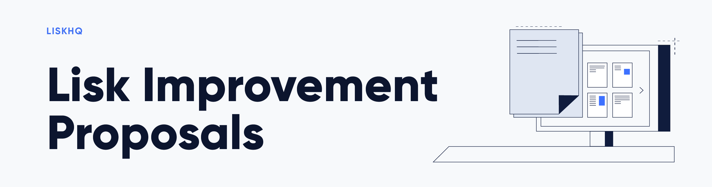

Welcome to the LIPS repository where community members can propose changes to the Lisk protocol and its software implementation.

## Contributing

Before contributing please read carefully the following [guidelines](proposals/lip-0001.md).

If you have any questions on how to proceed with a new or existing proposal, please contact the LIPs editor at [lips@lisk.com](mailto:lips@lisk.com).

## Proposals

| Number                        | Title                                                                                          | Author                                                 | Type            | Status        |
|-------------------------------|------------------------------------------------------------------------------------------------|--------------------------------------------------------|-----------------|---------------|
| [0001](proposals/lip-0001.md) | LIP purpose and guidelines                                                                     | Lisk Foundation                                        | Process         | Active        |
| [0002](proposals/lip-0002.md) | Change to byte based block size limit                                                          | Iker Alustiza, Nazar Hussain                           | Standards Track | Active        |
| [0003](proposals/lip-0003.md) | Uniform ordering of delegates list                                                             | Iker Alustiza                                          | Standards Track | Active        |
| [0004](proposals/lip-0004.md) | Introduce robust peer selection and banning mechanism                                          | Jan Hackfeld                                           | Standards Track | Active        |
| [0005](proposals/lip-0005.md) | Introduce new flexible, resilient and modular architecture for Lisk Core                       | Nazar Hussain                                          | Informational   | Obsolete      |
| [0006](proposals/lip-0006.md) | Improve transaction processing efficiency                                                      | Usman Khan                                             | Informational   | Obsolete      |
| [0007](proposals/lip-0007.md) | Use a consistent and informative versioning scheme                                             | Maciej Baj                                             | Informational   | Active        |
| [0008](proposals/lip-0008.md) | Remove pre-hashing for block and transaction signatures                                        | Andreas Kendziorra                                     | Standards Track | Active        |
| [0009](proposals/lip-0009.md) | Mitigate transaction replay on different chains                                                | Manu Nelamane Siddalingegowda, Iker Alustiza           | Standards Track | Active        |
| [0010](proposals/lip-0010.md) | Use SHA3-256 hash of block header as blockID                                                   | Andreas Kendziorra                                     | Standards Track | Withdrawn     |
| [0011](proposals/lip-0011.md) | Implement extensible data persistence model                                                    | Nazar Hussain                                          | Informational   | Obsolete      |
| [0012](proposals/lip-0012.md) | Remove redundant properties from transaction objects                                           | Andreas Kendziorra                                     | Standards Track | Withdrawn     |
| [0013](proposals/lip-0013.md) | Replace static fee system by dynamic fee system                                                | Iker Alustiza                                          | Standards Track | Active        |
| [0014](proposals/lip-0014.md) | Introduce BFT consensus protocol                                                               | Jan Hackfeld                                           | Standards Track | Active        |
| [0015](proposals/lip-0015.md) | Enable transaction invalidation by using nonces instead of timestamps                          | Andreas Kendziorra                                     | Standards Track | Active        |
| [0016](proposals/lip-0016.md) | Implement fee estimation algorithm for dynamic fee system                                      | Iker Alustiza                                          | Standards Track | Active        |
| [0017](proposals/lip-0017.md) | Make multisignature accounts more flexible, prevent spamming, and prevent signature mutability | Andreas Kendziorra                                     | Standards Track | Active        |
| [0018](proposals/lip-0018.md) | Use base32 encoding of long hash of public key plus checksum for address                       | Andreas Kendziorra                                     | Standards Track | Active        |
| [0019](proposals/lip-0019.md) | Use full SHA-256 hash of transaction header as transactionID                                   | Andreas Kendziorra                                     | Standards Track | Active        |
| [0020](proposals/lip-0020.md) | Use full SHA-256 hash of block header as blockID                                               | Andreas Kendziorra                                     | Standards Track | Active        |
| [0021](proposals/lip-0021.md) | Change to one vote per account                                                                 | Jan Hackfeld                                           | Standards Track | Withdrawn     |
| [0022](proposals/lip-0022.md) | Use Randao-based scheme to include standby delegates and reorder delegate list                 | Iker Alustiza                                          | Standards Track | Active        |
| [0023](proposals/lip-0023.md) | Introduce vote locking periods and new vote weight definition                                  | Maxime Gagnebin                                        | Standards Track | Active        |
| [0024](proposals/lip-0024.md) | Punish BFT violations                                                                          | Maxime Gagnebin                                        | Standards Track | Active        |
| [0025](proposals/lip-0025.md) | Introduce minimum balance requirement for accounts                                             | Iker Alustiza                                          | Standards Track | Active        |
| [0026](proposals/lip-0026.md) | Establish block validity by applying transactions sequentially                                 | Maxime Gagnebin                                        | Standards Track | Active        |
| [0027](proposals/lip-0027.md) | A generic serialization method                                                                 | Maxime Gagnebin, Andreas Kendziorra                    | Informational   | Active        |
| [0028](proposals/lip-0028.md) | Define schema and use generic serialization for transactions                                   | Iker Alustiza                                          | Standards Track | Active        |
| [0029](proposals/lip-0029.md) | Define schema and use generic serialization for blocks                                         | Alessandro Ricottone                                   | Informational   | Active        |
| [0030](proposals/lip-0030.md) | Define schema and use generic serialization for account state                                  | Alessandro Ricottone                                   | Standards Track | Active        |
| [0031](proposals/lip-0031.md) | Introduce Merkle trees and inclusion proofs                                                    | Alessandro Ricottone                                   | Informational   | Active        |
| [0032](proposals/lip-0032.md) | Replace payload hash with Merkle tree root in block header                                     | Alessandro Ricottone                                   | Standards Track | Active        |
| [0033](proposals/lip-0033.md) | Introduce numbering scheme for transaction types                                               | Nazar Hussain, Iker Alustiza                           | Informational   | Withdrawn     |
| [0034](proposals/lip-0034.md) | Define new block schema and processing for genesis block                                       | Jan Hackfeld, Nazar Hussain                            | Standards Track | Active        |
| [0035](proposals/lip-0035.md) | Define decentralized snapshot and hardfork process                                             | Jan Hackfeld, Nazar Hussain                            | Standards Track | Active        |
| [0036](proposals/lip-0036.md) | Introduce transaction properties moduleID and assetID                                          | Shusetsu Toda                                          | Standards Track | Active        |
| [0037](proposals/lip-0037.md) | Use message tags and network identifiers for signatures                                        | Andreas Kendziorra                                     | Standards Track | Draft         |
| [0038](proposals/lip-0038.md) | Introduce BLS signatures                                                                       | Andreas Kendziorra                                     | Informational   | Draft         |
| [0039](proposals/lip-0039.md) | Introduce sparse Merkle trees                                                                  | Alessandro Ricottone                                   | Informational   | Draft         |
| [0040](proposals/lip-0040.md) | Define state model and state root                                                              | Alessandro Ricottone                                   | Informational   | Draft         |
| [0041](proposals/lip-0041.md) | Introduce Auth module                                                                          | Alessandro Ricottone, Ishan Tiwari                     | Standards Track | Draft         |
| [0042](proposals/lip-0042.md) | Define state transitions of Reward module                                                      | Iker Alustiza, Mehmet Egemen Albayrak                  | Standards Track | Draft         |
| [0043](proposals/lip-0043.md) | Introduce chain registration mechanism                                                         | Iker Alustiza                                          | Standards Track | Draft         |
| [0044](proposals/lip-0044.md) | Introduce Validators module                                                                    | Alessandro Ricottone, Andreas Kendziorra, Rishi Mittal | Standards Track | Draft         |
| [0045](proposals/lip-0045.md) | Introduce Interoperability module                                                              | Alessandro Ricottone, Mitsuaki Uchimoto                | Standards Track | Draft         |
| [0046](proposals/lip-0046.md) | Define state and state transitions of Random module                                            | Iker Alustiza, Ishan Tiwari                            | Standards Track | Draft         |
| [0047](proposals/lip-0047.md) | Introduce PoA module                                                                           | Iker Alustiza, Ishan Tiwari                            | Standards Track | Draft         |
| [0048](proposals/lip-0048.md) | Introduce Fee module                                                                           | Maxime Gagnebin, Mitsuaki Uchimoto                     | Standards Track | Draft         |
| [0049](proposals/lip-0049.md) | Introduce cross-chain messages                                                                 | Maxime Gagnebin                                        | Standards Track | Draft         |
| [0050](proposals/lip-0050.md) | Introduce Legacy module                                                                        | Maxime Gagnebin                                        | Standards Track | Draft         |
| [0051](proposals/lip-0051.md) | Define state and state transitions of Token module                                             | Maxime Gagnebin                                        | Standards Track | Draft         |
| [0052](proposals/lip-0052.md) | Introduce NFT module                                                                           | Maxime Gagnebin                                        | Standards Track | Draft         |
