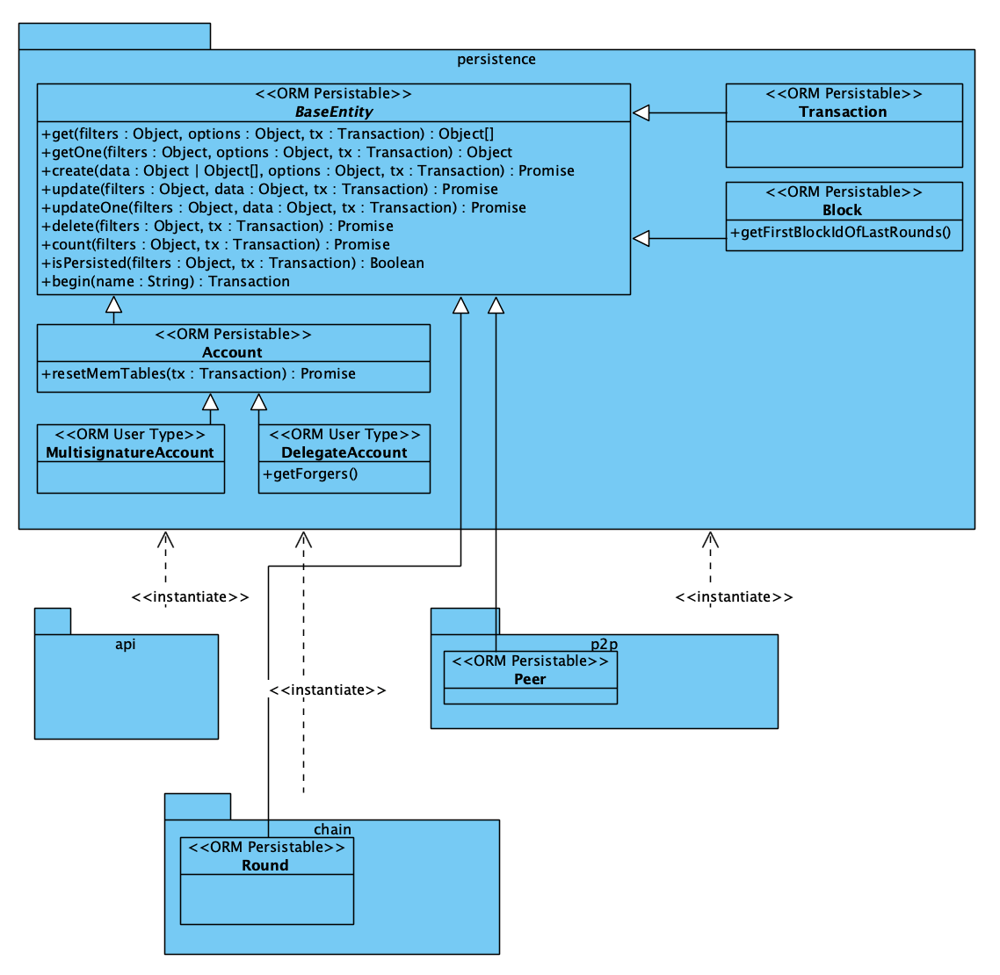

```
 LIP: 0011
 Title: Implement extensible data persistence model
 Author: Nazar Hussain <nazar@lightcurve.io>
 Discussions-To: https://research.lisk.io/t/implement-extensible-data-persistence-model/22
 Status: Draft
 Type: Informational
 Module: Database
 Created: 2018-11-01
 Updated: 2019-03-15
```

## Abstract

This LIP proposes to use Extended Data Mapper pattern for the database component outlined by the LIP “Introduce new flexible, resilient and modular architecture for Lisk Core”. The proposed model will help to extend and maintain the persistence layer of Lisk Core by being generic, easy to understand and organized.

## Copyright

This LIP is licensed under the [Creative Commons Zero 1.0 Universal](https://creativecommons.org/publicdomain/zero/1.0/).

## Motivation

In the current Lisk Core implementation, the logic responsible for the data persistence is inconsistently distributed among different parts of codes. The distribution of code in such a way results with defining redundant interfaces for similar functionalities, which in turn makes it more difficult to maintain and extend the code in the long-term. Moreover, there is no defined or standard pattern used among all such interfaces, which makes it unmanageable to determine which interfaces should be used by which modules.


The above diagram shows the details of persistence logic distribution in the current Lisk Core implementation and demonstrates the mentioned difficulties in choosing the correct interface due to their redundancy. For example, in a scenario where we need to **get accounts from the database**, we have the following interfaces available:

1. logic.account.getAll
2. modules.accounts.shared.getAccounts
3. modules.accounts.getAccounts
4. db.accounts.list

The following example shows that we do not have a separation of concerns, nor an easy way to extend those interfaces. Moreover, the interfaces are currently tightly coupled with the database solution used by Lisk Core - PostgreSQL RDBMS. The requirement of LIP **Introduce new flexible, resilient and modular architecture for Lisk Core** is to share interfaces among all modules to get data from the persistence layer. This leads to a confusing situation where it is not clear which namespace should be shared among modules.

The proposed design pattern addresses those concerns by creating a well defined abstract layer for the persistence logic and fulfils the requirements of LIP **Introduce new flexible, resilient and modular architecture for Lisk Core**.

## Rationale

To make the Lisk Core persistence layer code base organized, accessible and extensible, a new design pattern needs to be introduced. The design pattern must meet the following requirements:

1. Maps the code entities across the system to database equivalents e.g. Transaction, Block, Account.
2. Provides an easy way to extend an entity to create a new specialized entity (e.g. a Delegate is just an Account entity with additional conditions).
3. Supports mapping entity attributes across multiple database tables (e.g. a single transfer transaction is represented by one transaction entity, but its attributes are mapped amongst two database tables, `transfer` and `trs`, in the current implementation).
4. To secure the data access layer, the pattern should allow restricting the access permissions to interfaces, allowing to expose read-only entities for external modules.
5. Isolates the implementation of entities, so that module specific entities should not be accessible by other modules. It eliminates the risk of changing the persistence layer logic that the module is relying upon by teams working on the other modules (e.g. considering two independent Lisk Core modules, `chain` and `p2p`, the `round` entity should be available and used only within the `chain` module and the `p2p` module should not have access to it).

#### Choosing the design pattern

There are three design patterns used in the software industry worthwhile to consider while choosing the design pattern, which would satisfy the persistence layer needs of this LIP:

**[Active Record](https://www.martinfowler.com/eaaCatalog/activeRecord.html)**
It's good to use in small to medium scale projects, but in our use case where we have millions of data objects, initializing object per row costs a lot of memory and performance overhead. Also, the Active Record pattern does not satisfy the requirement of mapping entity attributes across multiple database tables, therefore cannot be used.

**[Data Mapper](https://martinfowler.com/eaaCatalog/dataMapper.html)**
Relies on native JSON objects for better performance and it has bi-directional serialization support from JSON to a database. The Data Mapper pattern does support mapping entity attributes across multiple database tables but as the pattern restricts to have only CRUD interfaces on every entity, it doesn't leave a room for flexibility for the future SDK developers to extend their custom database entities with non-CRUD operations.

**[Repository](https://martinfowler.com/eaaCatalog/repository.html)**
This pattern is flexible to be implemented in different ways. Since it doesn't force any standard or guideline, cannot be used to introduce consistency across interfaces and behaviours.

To support standard CRUD operations as well as flexible interfaces, the Data Mapper pattern needs to be mixed with the Repository pattern. This will provide a way of extending the database layer with any type of operation. We name it the "Extended Data Mapper" pattern.

## Specification

The below diagram illustrates the architecture of the Extended Data Mapper pattern.



The diagram recognizes the following persistable entities within Lisk Core: "Transaction", "Block", "Voters", "Account", "MultisignatureAccount", "DelegateAccount", "Peer", "Round". The proposed design pattern follows object-oriented design principles making it easy to extend or override functionalities. Modules can extend a base entity to create their own entities, which will follow the Extended Data Mapper pattern. All of the entities extend "BaseEntity", which implements standard CRUD operations, but the pattern provides the flexibility of having customized logic for any, not CRUD-only, data operation. We can distinguish two type of entities, persistable entities `<<ORM Persistable>>` which can read and write data, and read only entites `<<ORM User Types>>`.

The persistence layer is initiated by modules giving access to all basic domain entities registered within Lisk Core, e.g. Block, Transaction, Account. Access to custom entities in any modules is isolated only to that particular module which protects from unauthorized modifications. Deriving from the Data Mapper pattern, the solution supports mapping entity attributes across multiple database tables.

### Read Operations

#### FieldSet

Each entity has multiple data attributes so called fields. To simplify the implementation of fetching data we propose to not have granular fields selection available. Selectable fields will be grouped under "FieldSet" key, e.g. an entity Account can have two fieldsets, `SIMPLE` and `EXTENDED`, to get confirmed fields only and all fields respectively.

The pattern itself will not impose "FieldSets". It's up to the implementation of an individual entity to provide this feature or not, but no entity will provide granular fields selection.

#### Filters

Using filters provides an easy and powerful way to fetch data from the persistence layer. It's possible to register different filter types when defining entities. Based on the particular filter type, an entity registers few filter names available to be used as JSON objects. Each filter suffix an additional key to the field name, e.g. If you register `address` as a binary filter, an entity will register `address`, `address_eql`, `address_ne` filters and you can pass those filters as JSON object to fetch data. A filter without any suffix to the field name refers by default to `_eql` - equals.

Following is the list of available suffixes based on filter types:

* BOOLEAN (\_eql , \_ne)
* TEXT (\_eql, \_ne, \_in, \_like)
* NUMBER (\_eql, \_ne, \_gt, \_gte, \_lt, \_lte, \_in)
* BINARY (\_eql, \_ne)

If filters are provided as JSON objects, they will always be joined with an `AND` combinator. For instance, specifying filters as `{name: 'Alpha', description_like: 'Bravo'}` results in fetching all results which have a name equal to `Alpha` and description matching `Bravo`. Specifying filters as an array of objects, e.g. `[{name: 'Alpha'}, {description_like: 'Bravo'}]`, will result in joining objects with `OR` combinator, i.e. fetching data which name equal to `Alpha` or description like `Bravo`.

You can register a `CUSTOM` filter, by defining your own key and a function which will return a custom condition.

### Other CRUD Operations

We defined the rules only for the read operations above. The remaining of the CRUD operations have no specific rules to restrict. It's up to the implementation of an entity, to implement the logic to persist the objects.

### Future Possibilities

* By having a clear separation of concerns we can focus on performance improvements on the persistence layer entities individually.
* By having code abstractions and interfaces, we can write and/or replace the storage engine, e.g. to use another database system or database library.
* By having a centralised persistence layer for accessing data within modules, we can introduce data access authorization, e.g. prevent certain modules from being able to read/write data outside of their responsibility.

## Backward Compatibility

This implementation of this proposal is backwards compatible. The changes only impact the internal persistence logic and aren't causing any changes to the Lisk Core protocol, nor public interfaces.

## Reference Implementation

A reference implementation can be found at: https://github.com/LiskHQ/lisk/tree/v1.5.0/storage
