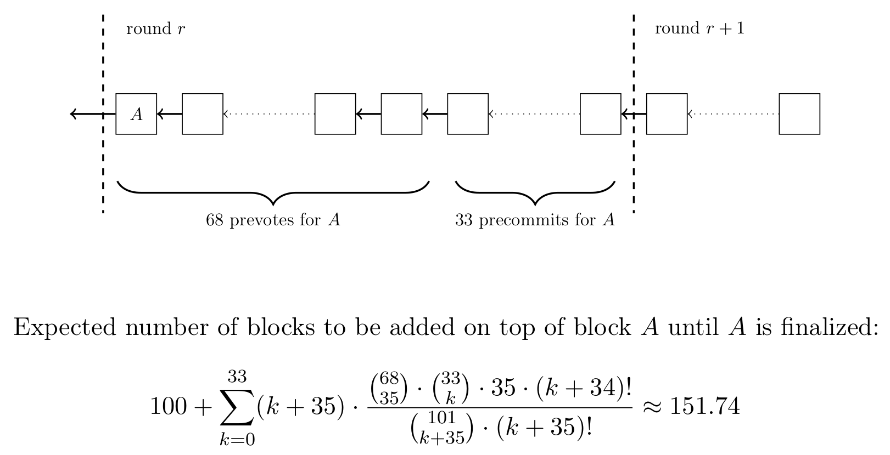

```
LIP: 0014
Title: Introduce BFT consensus protocol
Author: Jan Hackfeld <jan.hackfeld@lightcurve.io>
Discussions-To: https://research.lisk.io/t/introduce-bft-consensus-protocol
Status: Active
Type: Standards Track
Created: 2019-03-28
Updated: 2021-05-04
Requires: 0004
```

## Abstract

This LIP proposes to change the consensus algorithm used in Lisk by introducing a mechanism allowing delegates to vote on the correct block at every height and implementing a new fork choice rule. The proposed consensus protocol thereby achieves Byzantine fault tolerance (BFT) and provides block finality guarantees, i.e., guarantees that a block is never reverted.

## Copyright

This LIP is licensed under the [Creative Commons Zero 1.0 Universal](https://creativecommons.org/publicdomain/zero/1.0/).

## Motivation

The main purpose of the consensus algorithm is that for a given height eventually all Lisk nodes agree on the same block. This is in particular important in the case where there are different valid blocks for the same height, which can occur due to network delays or delegates forging multiple blocks in their designated time slot.

In the current Lisk protocol, every received block is processed in the [onReceiveBlock](https://github.com/LiskHQ/lisk/blob/a4a843cf6ab6b5d58a3aa91ca8b293e05d0832df/modules/blocks/process.js#L637) function. Assume that `A` at height `A.height` is the block that is currently at the tip of the chain. If a new received block `B` is conflicting, i.e., it is not part of the current chain and cannot be added on top of the current chain, one of the following fork recovery mechanism for resolving the conflict can be triggered.

* **Fork Cause 1**

    This fork recovery mechanism is triggered if `B.height=A.height+1`, but the blockID of the previous block contained in `B` is not the blockID of `A`. This means that `B` does not build on top of the block `A`, but a different block that is part of a different chain. In this case, the function [receiveForkOne](https://github.com/LiskHQ/lisk/blob/a4a843cf6ab6b5d58a3aa91ca8b293e05d0832df/modules/blocks/process.js#L117) is called. If the received block `B` has a larger timestamp than `A` or the same timestamp but larger blockID, then `B` is discarded. Otherwise, `A` and the parent block of `A` are deleted and the block synchronization mechanism is triggered.

* **Fork Cause 5**

    This fork recovery mechanism is triggered if `B.height=A.height` and both `A` and `B` have the same previous block, but the blockIDs of `A` and `B` are different. In this case, the function [receiveForkFive](https://github.com/LiskHQ/lisk/blob/a4a843cf6ab6b5d58a3aa91ca8b293e05d0832df/modules/blocks/process.js#L181) is called. If `B` has a larger timestamp than `A` or a larger blockID, then `B` is discarded. Otherwise, `A` is deleted and replaced by `B` if `B` is a valid block.

Note that two cases above do not cover all possible conflicts. In particular, if `A.height` and `B.height` differ by more than one, `B` is simply discarded. For this reason, there have been rare events in the past, where two chains were continuously progressing for an extended period of time, as the fork could not be resolved by the mechanism above directly at the height when it happened. In that case, users had to manually intervene and make their node synchronize with the chain of larger height. This behavior is highly undesirable, as we want the Lisk protocol to resolve conflicting blocks and reach consensus without intervention.

Another closely related issue is that in the current Lisk network some delegates use a script to quickly change between multiple Lisk nodes they are running in order to forge a block on a different node if one node seems unable to forge. This, however, frequently leads to two distinct blocks being forged for the same time slot and is also one of the main reasons for the issue described above. It is important to remark that the main reason for running such a script for the delegate is to maintain a high productivity, which was otherwise difficult to achieve due to the lack of robustness of the P2P network. After further improving the block propagation and increasing the robustness of the P2P network (see [LIP 0004 "Introduce robust peer selection and banning mechanism"](https://github.com/LiskHQ/lips/blob/master/proposals/lip-0004.md) ), such a script should not be necessary anymore. Furthermore, we also have to take into account that in the future a malicious delegate could intentionally send multiple different blocks for the same slot to the network.

Moreover, the current Lisk consensus algorithm does not provide any finality guarantees. A Lisk node does not revert more than 201 blocks of the current chain, but this only is a finality heuristic. As described in the first issue above, it can happen that two different chains progress by more than 201 blocks. So even 201 confirmations do not provide a finality guarantee in all possible circumstances. Block finality and a robust consensus, however, are key requirements before introducing sidechains and communication between different chains in Lisk.

## Rationale

We propose to introduce a new consensus algorithm in Lisk that is based on classic Byzantine fault tolerance (BFT) principles. The proposed Lisk-BFT consensus protocol is based on a formal specification and rigorous analysis in the related paper [8]. It attains strong theoretical guarantees for deterministic consensus with only weak assumptions on the synchronicity of the underlying network (see the partially synchronous system model introduced in [6] for more details). For an introduction of the terminology and basic notions of Byzantine agreement and the state machine replication problem, the reader can refer to [1]. Overall, this LIP should be, however, self-contained and understandable without a theoretic background in these fields if the referenced results are taken for granted.

### Terminology

We call two distinct blocks _conflicting_ if none is a descendant of the other.
Moreover, we say that a delegate (or node) _decides for a block_ or _finalizes_ a block if it irrevocably deems it part of the Lisk blockchain.
An _honest delegate_ is a delegate that participate in the consensus algorithm and obeys the protocol rules.
In contrast to that, a _Byzantine delegate_ may behave arbitrarily and, in particular, violate any protocol rule.
Further, if a delegate obeys the protocol rules, but stops participating in the consensus algorithm from some point in time onwards, we say that the delegate _crashes _or is_ offline_ (also referred to as fail-stop failure).

Lisk DPoS further distinguishes between _active_ delegates and _standby_ delegates.
Given the protocol constant `NUM_ACTIVE_DELEGATE_SLOTS`, the active delegate in a round are the top `NUM_ACTIVE_DELEGATE_SLOTS` delegates by delegate weight from 2 rounds ago, as defined in [LIP 0023](https://github.com/LiskHQ/lips/blob/master/proposals/lip-0023.md).
The standby delegates are all delegates eligible to be selected to forge in one of the `NUM_STANDBY_DELEGATE_SLOTS` in a round as specified in [LIP 0022](https://github.com/LiskHQ/lips/blob/master/proposals/lip-0022.md).

### Lisk-BFT Protocol

The Lisk-BFT protocol is formally defined in [8, Definition 4.1.].
Here we only want to give a short high-level overview. The basic idea is that there are two types of votes that a delegate can cast for any block `B`.
The first is called a `prevote` and the second called a `precommit`.
After a delegate cast a `prevote` for a block `B` and overall there are prevotes by more than 2/3 of the active delegates in the current chain, a delegate is allowed to make a `precommit` for block `B`.
If there are `precommits` by more than 2/3 of the active delegates for a block `B`, a delegate or node finalizes `B` (and all ancestors of `B`).
These votes are implied by the extra information that delegates provide in the block header when forging a block (specified in the Section "Additional Block Header Properties").
Moreover, a node always chooses the longest chain that contains the block of largest height with `prevotes` by more than 2/3 of the delegates (as specified in Section "Applying Blocks According to Fork Choice Rule").
Every block `B` contains the height of the block with `prevotes` by more than 2/3 of the active delegates so that nodes can apply the fork choice rule by only considering the tips of the different chains.

### Key Properties

In this section, we summarize the key properties following from the analysis in [8, Theorem 4.4] with `τ=2/3`. In short, for a static set of active delegates the consensus algorithm has the following properties and adds the desired block finality and robustness to the Lisk consensus algorithm:

* **Safety Property**. If more than 2/3 of the active delegates honestly follow the protocol, two conflicting blocks are never finalized.
* **Liveness Property**. If the active delegates obey the protocol and less than 1/3 of the delegates crash, new blocks can always be finalized.
* **Accountability**. If a delegate violates the protocol, it can be detected and consequently be punished.

For Lisk Mainnet, which has 101 active delegates participating in the consensus protocol, more than 2/3 of the active delegates translates to at least 68 delegates and less than 1/3 of the delegates translates to at most 33 delegates.
Further note that forging multiple blocks for the same time slot is a protocol violation and can be punished. In [LIP 0024][pom-lip], we propose a Proof-of-Misbehavior transaction that includes the evidence of a protocol violation and leads to a punishment of the respective delegate.

The Lisk-BFT specifications in this LIP use a fixed decision threshold of `τ=2/3`, i.e., after `precommits` by more than 2/3 of the delegates, a node finalizes a block and never switches to a chain that does not contain the finalized block.
Participants in the network can additionally use subjective decision threshold to either have faster finality assuming a lower number of Byzantine delegates or even higher safety guarantees with the risk of never finalizing any block.
For instance, a small value payment may be deemed irreversible by a recipient after the respective block including the transaction or a descendant block received `precommits` by more than 1/3 of the delegates.
In this case, the Lisk-BFT protocol guarantees that this block is never reverted if no delegate is Byzantine and no change of active delegates occurs.
On the other hand, for a high value payment a recipient may want to wait until the block including the transaction or a descendant received `precommits` by all delegates and hence the protocol guarantees that no contradicting block would obtain `precommits` by all delegates even if almost 2/3 of the delegates are Byzantine.
The dependence on the decision threshold and bound on the number of Byzantine delegates is described in more detail in [8].

The Lisk-BFT protocol requires two additional integer values to be added to the block headers and delegates thereby vote on the correct block at every height. Thus, the only communication overhead is the additional space in the block header for these two properties, but there is no overhead of additional messages. Assuming that no forks occur and all delegates follow the protocol, for Lisk Mainnet, a new block is finalized after first 67 distinct delegates and then another 68 distinct delegates build on that block. It therefore depends on the order of the delegates how fast a block is finalized. In the best case, this is after 135 blocks are added on top of a block. In expectation, the first block of a round is finalized after 155 blocks assuming that no delegate misses its slot, all delegates honestly participate in the consensus algorithm and the order of delegates is chosen uniformly at random from all possible orderings (see Appendix).

Note that the liveness property only holds for crash failures, i.e., delegates that are offline. A large group of Byzantine delegates
(e.g., 30 delegates on Lisk Mainnet) could intentionally cause repeated forks in the network preventing any blocks to be finalized as long as the random ordering of delegates is favorable for the Byzantine delegates. This is only a liveness issue as the safety property still holds as long as more than 2/3 of the delegates honestly follow the protocol. We believe such a case does not pose a serious issue, as the Byzantine delegates may forfeit parts of their block rewards and have little to gain. Moreover, users could easily downvote the Byzantine delegates in such a case.

### Changes of Delegates

We propose that a change of delegates can happen without requiring the block containing the vote transactions that lead to the change of delegates to be finalized.
The main reason is that we do not want a minority of a little more than 1/3 of the delegates (e.g., 34 delegates for Lisk Mainnet) to be able to prevent any finalization of blocks and thereby any change of delegates.
As outlined in [8, Theorem 4.4], allowing changes of delegates without requiring finality reduces the safety guarantees depending on the number of delegates that change at one time without intermediate blocks being finalized.
First of all, as long as there is an unchanged, honest set of more than 2/3 of the delegates, the safety property still holds.
Secondly, if we assume that less than an `α` fraction of honest delegates change at one time without intermediate blocks being finalized by the current set of active delegates, then `2/3+2α` of the delegates are required to honestly follow the protocol for the safety property to hold.
We believe that these guarantees are a reasonable balance between safety and liveness. Moreover, it is important to note that a violation of the safety property could only happen if there is a large number of Byzantine delegates, a big change in the set of active delegates and at the same time adversarial network conditions that lead to blocks being forged on different chains such that the safety property is violated.

In order to further decrease the likelihood of having a fork where two different chains assume a different set of active delegates, we propose to let a change of delegates not take into effect immediately, but with a delay of two rounds, which is described in the specifications below. Note that it is additionally possible for participants that require a very high degree of security to implement a custom mechanism for automatically suspending the trust in the current chain in the unlikely event that there is a huge change of delegates. For instance, an exchange could suspend deposits and withdrawals in the unlikely case that more than 30 delegates change in a short time and in this case manually monitor the network to be absolutely sure that there is no conflicting chain.

### Incentive Alignment

Another important aspect is to align the incentives of the delegates with the new Lisk-BFT protocol. As described in detail in the specification section, we propose to dynamically reduce block rewards for delegates not constructively participating in the consensus protocol. In particular, this means that it is basically never beneficial for a delegate to attempt to forge on multiple chains at the same time in case of a fork. If a delegate does not disclose that it forged on a different chain in such a case, it risks that this violation of the protocol is detected and the delegate is punished (specified in [LIP 0024][pom-lip]). Otherwise, if the delegate honestly discloses the blocks forged on the other chains, the block rewards are reduced to 25 % on all chains. If we assume there are never more than 4 chains that a delegate could forge on at the same time, then this implies that it is never beneficial to forge on all chains, as the delegate could instead only forge on the chain that the delegate believes to have the highest probability of consensus. In particular, the reduced block rewards thus solve the nothing-at-stake problem (see [4] for an introduction to this topic). Note that also honest delegates which happen to forge on another chain are punished with this mechanism because the next time they forge, they are required to disclose that they forged on a different chain and thus only receive 25 % of the rewards for the next block. So instead of only forfeiting one block reward due to missing one block slot, they additionally lose 75 % of the reward of the next block. In order to solve the nothing-at-stake problem and align incentives for the consensus algorithm it is unavoidable that also honest delegates are punished in this case.

### Alternatives

In the remaining part of this section, we discuss some alternative consensus algorithms with similar guarantees. We do not consider alternatives that would require huge changes in codebase and the implementation of new cryptographic primitives. The main reason why we favor the new Lisk-BFT consensus algorithm is that it is simple and it does not have the overhead of additional messages between delegates.

#### Tendermint

The Tendermint consensus algorithm [2] achieves consensus in three distinct phases. The basic idea is that after every block proposal, there are two voting phases with specific vote messages. For every voting phase to complete, a node needs to receive a certain minimum required number of vote messages. Only after both phases are completed successfully, a node can finalize a block and the next block can be proposed. In particular, forks, i.e., two different growing chains, cannot occur in Tendermint. A consensus algorithm with this property is also called _fork-free_. The disadvantage of Tendermint is that the block proposal is slowed down by the two additional phases and the blockchain does not advance unless consensus is reached on every block. For a more detailed analysis of fork-free versus forkful consensus algorithm see [5], for instance. Because of the performance and also easier adaption of the current consensus algorithm, we therefore prefer a forkful consensus algorithm.

#### Casper the Friendly Finality Gadget

Casper the Friendly Finality Gadget (Casper-FFG) is introduced in [3] and is a forkful consensus algorithm based on BFT principles and inspired by Tendermint. In Casper-FFG, block proposers can cast votes on blocks and thereby finalize blocks independent of the block proposal mechanism. Because of the overhead of the additional vote messages, block proposers do not vote on every block, but only on specific checkpoints, i.e., blocks at specific heights. In Lisk it would be natural to integrate the concept of checkpoints with the existing rounds, i.e., use the last block of every round in Lisk as checkpoint (the Casper-FFG paper also suggests a checkpoint at every height that is a multiple of 100). Then delegates could vote on checkpoints, either via separate messages or in the blocks they propose. However, this would lead to a long time until finality. For instance, for the first block of a round to be finalized, the next two checkpoints would need to receive sufficient votes (see the paper for details). For a round length of 103 for Lisk Mainnet, this means that only after 205 additional blocks after the first block of a round (this is the height of the second checkpoint), delegates could start to vote on the second checkpoint via separate messages or in the next block they propose (the latter being even slower). Of course it would be possible to have checkpoints more frequently to have faster finality, but then it would also be necessary that delegates send separate vote messages so that blocks are finalized fast enough. Without a suitable aggregate signature scheme these separate vote messages would add a significant message overhead to the protocol.

#### EOS DPOS 3.0 + BFT

EOS also claims to have added Byzantine fault tolerance to its latest version of its consensus protocol [7]. In their solution, block proposers disclose the largest height of a block they previously forged in the block header. This is an elegant solution with little overhead, but a formal specification of their consensus protocol together with a rigorous analysis is missing. Moreover, as already pointed out in the GitHub issue [7], the initially proposed consensus algorithm is flawed. Our proposed solution is also based on the idea of delegates disclosing the largest height of a previously forged block, but is based on a formal specification and analysis.

## Specification

### Overview

The Lisk-BFT protocol is formally defined and analyzed in [8]. It defines that blocks have two new properties, _h<sub>previous</sub>_ and _h<sub>prevoted</sub>_,
and describes how delegates determine these values when forging a block.
Here we instead use the notation `maxHeightPreviouslyForged` for _h<sub>previous</sub>_ and `maxHeightPrevoted` for _h<sub>prevoted</sub>_.
Moreover, the protocol specifies that delegates choose the longest chain that contains the highest `maxHeightPrevoted` value (fork choice rule). This section describes in detail the practical implementation of the consensus algorithm. The following diagram gives an overview of the general set of rules governing how new blocks are applied to the current chain of a node.


The whole specifications are organized as follows:

* The section "Constants" provides a table of the constants used in the Lisk-BFT protocol.
* The section "Additional Block Header Properties" defines the new properties `maxHeightPreviouslyForged` and `maxHeightPrevoted` for the block headers and the section "Validating Additional Block Header Properties" describes how these are validated.
* The section "Detecting Contradicting Block Headers" describes the conditions for when block headers are contradicting and the corresponding delegate violated the protocol.
* The section "Computing Prevotes and Precommits" describes how the `prevotes` and `precommits` implied by a block header can be computed.
* The formal specification of the different cases in the diagram above is given in the section "Applying Blocks According to Fork Choice Rule".
* The section "Timing of Block Forging" describes how the timing of block forging needs to be adjusted to be in line with the fork choice rule.
* The section "Incentivizing Lisk-BFT Protocol Participation" describes under which conditions block rewards are reduced to incentivize constructive protocol participation.
* The section "Change of Delegates" describes that votes for delegates only take into effect with a delay of 2 rounds.
* The sections "Processing Blocks" and "Reverting Blocks" specify how blocks are processed and reverted.
* The "Moving to a Different Chain" section describes under which conditions a node changes from a chain with tip `A` to a chain with tip `B` as shown in the diagram above. There are two possible ways to move to a different chain which are described in the sections "Block Synchronization Mechanism" and "Fast Chain Switching Mechanism".

### Constants

For the specifications of the Lisk-BFT protocol, we use the constants provided in the table below.

| **Name**               | **Value**              | **Description**                              |
|------------------------|------------------------|----------------------------------------------|
| `NUM_ACTIVE_DELEGATE_SLOTS` | configurable per chain <br> Lisk Mainnet: 101 | The number of active delegates in a Lisk DPoS chain. |
| `NUM_STANDBY_DELEGATE_SLOTS` | configurable per chain <br> Lisk Mainnet: 2 | The number of slots in a round for standby delegates in a Lisk DPoS chain. |
| `LSK_BFT_BATCH_SIZE` | `NUM_ACTIVE_DELEGATE_SLOTS+NUM_STANDBY_DELEGATE_SLOTS` | This value equals the length of a round in a Lisk DPoS chain, but can in principle also be longer. |
| `LSK_BFT_VOTE_RANGE` | `3*LSK_BFT_BATCH_SIZE-1`| A block at height `h` can imply prevotes and precommits from height `h-LSK_BFT_VOTE_RANGE` up to height `h`. We use this constant for more concise notation in the following specifications. |
| `LSK_BFT_PREVOTE_THRESHOLD` | `floor(2/3*NUM_ACTIVE_DELEGATE_SLOTS)+1` | Prevote threshold required for casting precommits for a block. |
| `LSK_BFT_PRECOMMIT_THRESHOLD` | `floor(2/3*NUM_ACTIVE_DELEGATE_SLOTS)+1` | Precommit threshold required for considering a block final. |
| `HEIGHT_GENESIS_BLOCK` | height of the genesis block of the chain, typically 0 | The constant denotes the height of the genesis block of the chain. |
| `BLOCK_TIME` | configurable per chain <br> Lisk Mainnet: 10 | The length of a block slot in seconds.

### Additional Block Header Properties

For the implementation of the new consensus algorithm, two additional properties need to be added to the block header:

* A 32 bit unsigned integer `maxHeightPreviouslyForged`.
* A 32 bit unsigned integer `maxHeightPrevoted`.

We further propose to also reduce the size of the current `height` property to 32 bit.

If a delegate forges a block `B` to be added to the current chain, then `B.maxHeightPreviouslyForged` must be the largest height at which the delegate forging the block previously forged a block on any chain or 0 if the delegate did not forge a block before. To be able to provide this information correctly, even in the case of node crashes, it is important that the largest height of a block previously forged is persistently stored before any forged block is broadcast to the network. The property `B.maxHeightPrevoted` must be the largest height of a block in the current chain up to height `B.height-1` that has `prevotes` by at least `LSK_BFT_PREVOTE_THRESHOLD` delegates contained in the chain.

Further, the already existing property `B.height` and both additional properties above need to be included in the byte array that is used
for generating the signature and `blockID` of a block. This way these properties cannot be altered by a malicious node. For this, the [getBytes()](https://github.com/LiskHQ/lisk/blob/de766a70d1c507c60c2893007263907fb428af45/logic/block.js#L385) function needs to additionally include the bytes of these three properties with size 32 bit each in big-endian encoding. The properties `height`, `maxHeightPreviouslyForged`, `maxHeightPrevoted` should be included in the byte array in this order directly after the `previousBlock` property.

### Validating Additional Block Header Properties

A schema validation must ensure that the new properties `maxHeightPreviouslyForged` and `maxHeightPrevoted` have the correct type and range. The adapted signature validation ensures that these new properties and the `height` property have not been changed by an attacker.

For a new child block `B`, which is supposed to be added to the current chain containing blocks up to height `B.height-1`, to be valid, the property `B.maxHeightPrevoted` needs to be the largest height of a block in the current chain up to height `B.height-1` for which the number of `prevotes` contained in the chain is at least `LSK_BFT_PREVOTE_THRESHOLD`. Note that for this the `prevotes` implied by block `B` are not taken into account. If this number is incorrect, the block header is deemed invalid and discarded.

### Detecting Contradicting Block Headers

In order to ensure that the implied `prevotes` and `precommits` satisfy the consensus framework [8, Definition 3.1] and the respective delegate follows the fork choice rule, we also need to detect if a set of valid block headers by the same delegate are contradicting. The properties that the valid block headers by one delegate need to satisfy are outlined in [8, Lemma 4.2]. We now present a function that checks these properties. We assume that every block header contains the following properties:

* `height`: the height associated with the block
* `maxHeightPreviouslyForged`: largest height of any block previously forged, as described above
* `maxHeightPrevoted`: largest height of an ancestor block with at least `LSK_BFT_PREVOTE_THRESHOLD` `prevotes` as described above
* `blockID`: the hash of the block header
* `generatorPublicKey`: public key of delegate forging the block

The following code checks whether there is a contradiction between two block headers, i.e.,
a violation of the Lisk-BFT protocol, by using the properties shown in [8, Lemma 4.2]:

```js
checkHeadersContradicting(blockHeader1,blockHeader2) {
   // Order the two block headers such that b1 must be forged first
   let b1 = blockHeader1;
   let b2 = blockHeader2;
   if (b1.maxHeightPreviouslyForged > b2.maxHeightPreviouslyForged ||
     (b1.maxHeightPreviouslyForged == b2.maxHeightPreviouslyForged && b1.maxHeightPrevoted > b2.maxHeightPrevoted) ||
     (b1.maxHeightPreviouslyForged == b2.maxHeightPreviouslyForged && b1.maxHeightPrevoted == b2.maxHeightPrevoted && b1.height > b2.height)) {
      b1 = blockHeader2;
      b2 = blockHeader1;
   }

   // The order of cases is essential here
   if (b1.generatorPublicKey != b2.generatorPublicKey) {
      // Blocks by different delegates are never contradicting
      return false;
   } else if (b1.blockID == b2.blockID) {
      // No contradiction, as block headers are the same
      return false;
   } else if (b1.maxHeightPrevoted == b2.maxHeightPrevoted && b1.height >= b2.height) {
      // Violation of the fork choice rule as delegate moved to different chain
      // without strictly larger maxHeightPrevoted or larger height as justification.
      // This in particular happens, if a delegate is double forging.
      return true;
   } else if (b1.height > b2.maxHeightPreviouslyForged) {
      // Violates disjointness condition
      return true;
   } else if (b1.maxHeightPrevoted > b2.maxHeightPrevoted) {
      // Violates that delegate chooses branch with largest maxHeightPrevoted
      return true;
   } else {
      // No contradiction between block headers
      return false;
   }
}
```

Two contradicting block headers can be used as evidence for a violation of the protocol rules. As mentioned above, this proof can be used in a Proof-of-Misbehavior transaction (proposed in [LIP 0024][pom-lip]), which includes this evidence in the blockchain and leads to a punishment of the misbehaving delegate.

### Computing Prevotes and Precommits

All blocks with `maxHeightPreviouslyForged<height` imply `prevotes` and `precommits` as described in [8, Definition 4.1] with `ρ = LSK_BFT_VOTE_RANGE+1` and `τ=2/3`. In this section, we outline how the total number of `prevotes` and `precommits` can be practically computed using the information contained in the block headers. In the function given below, we only store the current total number of `prevotes` and `precommits` for every block, instead of storing for every block which delegate made a `prevote` or `precommit` for that block. We further assume that the following data structures are available:

* `blockHeaders[i]`: stores the block header of the current chain at height `i`, the properties of every block header are the same as already described above
* `prevoteCounts[i]`: stores the current number of `prevotes` for the block in the chain at height `i`
* `precommitCounts[i]`: stores the current number of `precommits` for the block in the chain at height `i`
* `delegateMinHeightActive`: for a currently active delegate, this is the height of the first block of the round since when that delegate has been continuously active. We use this information to ensure that the delegate cannot cast `prevotes` and `precommits` for heights when it was not active. Note that it is sufficient to consider the previous `LSK_BFT_VOTE_RANGE` blocks because if `delegateMinHeightActive<newBlockheader.height-LSK_BFT_VOTE_RANGE`, then we can simply set `delegateMinHeightActive:=newBlockheader.height-LSK_BFT_VOTE_RANGE` as `prevotes` and `precommits` implied by `newBlockheader` are only cast for blocks of height at least `newBlockheader.height-LSK_BFT_VOTE_RANGE`.
* `largestHeightPrecommit`: this is the largest height of a block in the current chain for which a given delegate has already made a `precommit`.

We first define a utility function that computes the largest height where a delegate has not cast a `prevote` for a block in the current chain. Using the notation from the transformation in [8, Definition 4.1] and assuming `newBlockheader` is the header of block `B_l`, the following function computes the value `max{j_2,newBlockheader.height-LSK_BFT_VOTE_RANGE-1}`.

```js
getHeightNotPrevoted(newBlockheader) {
   let heightPreviousBlock = newBlockheader.maxHeightPreviouslyForged;
   let h = max(newBlockheader.maxHeightPreviouslyForged, newBlockheader.height - LSK_BFT_VOTE_RANGE);
   while (h >= newBlockheader.height - LSK_BFT_VOTE_RANGE) {
      if (h == heightPreviousBlock) {
         if (blockheaders[h].generatorPublicKey != newBlockheader.generatorPublicKey ||
             blockheaders[h].maxHeightPreviouslyForged >= h) {
            // This means that either the block B at height h was not forged by
            // the delegate (as the delegate forged a block at height h on a different chain)
            // or the block at height h does not imply any prevote. In both
            // cases, the delegate did not prevote for B.
            break;
         } else {
            heightPreviousBlock = blockheaders[h].maxHeightPreviouslyForged;
         }
      }
      h--;
   }
   return h;
}
```

Every time a new block is added to the current chain, we can update the implied `prevotes` and `precommits` as shown below using the data structures and utility function defined above.

```js
applyPrevotesPrecommits(newBlockheader) {
   // A block header only implies votes if maxHeightPreviouslyForged<height
   // and if the delegate forging the block is not a standby delegate.
   if (newBlockheader.maxHeightPreviouslyForged >= newBlockheader.height ||
      newBlockheader.generatorPublicKey is the public key of a standby delegate) {
      return;
   }
   const delegateMinHeightActive = height of first block of round since when the delegate given
                                   by newBlockheader.generatorPublicKey has been continuously active
   const largestHeightPrecommit = largest height of precommit of the delegate
                                  given by newBlockheader.generatorPublicKey
   const heightNotPrevoted = getHeightNotPrevoted(newBlockheader)

   // Add implied precommits by newBlockheader
   const minPrecommitHeight = max(delegateMinHeightActive,
                                  heightNotPrevoted + 1,
                                  largestHeightPrecommit + 1)
   const maxPrecommitHeight = newBlockheader.height - 1;
   for (let h = minPrecommitHeight; h <= maxPrecommitHeight; h++) {
      // Add precommit if threshold is reached
      if (prevoteCounts[h] >= LSK_BFT_PREVOTE_THRESHOLD) {
         precommitCounts[h] += 1;
      }
   }

   // Add implied prevotes by newBlockheader
   const minPrevoteHeight = max(newBlockheader.maxHeightPreviouslyForged+1,
                                delegateMinHeightActive,
                                newBlockheader.height-LSK_BFT_VOTE_RANGE);
   const maxPrevoteHeight = newBlockheader.height;
   for (let h = minPrevoteHeight; h <= maxPrevoteHeight; h++) {
      prevoteCounts[h] += 1;
   }
}
```

The disadvantage of the approach above is that we have to compute the overall number of `prevote` and `precommit` messages from scratch every time we remove a block. This computation is very fast, however, if all information is in-memory.

After updating the `prevoteCounts` and `precommitCounts` data structures as described above, we can compute the largest height with `precommits` by at least `LSK_BFT_PRECOMMIT_THRESHOLD` delegates, denoted by `chainMaxHeightFinalized`, and we consider all blocks at this height and before finalized.
Given `currentHeight`, the height of the new block header added to the chain, and the current value of `chainMaxHeightFinalized` as input, the following function computes the new value of `chainMaxHeightFinalized`.

```js
computeChainMaxHeightFinalized(currentHeight, currentChainMaxHeightFinalized) {
   const minHeightCheck = max(currentChainMaxHeightFinalized + 1,
                              currentHeight-LSK_BFT_VOTE_RANGE);
   for (let h = currentHeight; h >= minHeightCheck; h--) {
      if (precommitCounts[h] >= LSK_BFT_PRECOMMIT_THRESHOLD) {
         return h;
      }
   }
   return currentChainMaxHeightFinalized;
}
```

Note that the function ensures that the value of `chainMaxHeightFinalized` never decreases.
Moreover, it takes into account that the block header `newBlockHeader` at height `currentHeight` only implies `precommits` at heights at least `currentHeight-LSK_BFT_VOTE_RANGE`.
Therefore, it is sufficient to check only for these heights whether the precommit threshold is reached.
The value of `chainMaxHeightFinalized` should be stored persistently so that even in the case of node crashes, blocks that are once deemed final are never reverted.

Moreover, we also compute the largest height of a block with `prevotes` messages by at least `LSK_BFT_PREVOTE_THRESHOLD` delegates, denoted by `chainMaxHeightPrevoted`, which is needed to verify the next block added to the chain. Given `currentHeight`, the height of the new block header added to the chain, as input, the function below returns the new value of `chainMaxHeightPrevoted`.

```js
computeChainMaxHeightPrevoted(currentHeight) {
   let maxHeightPrevoted = blockheaders[currentHeight].maxHeightPrevoted;
   const minHeightCheck = max(maxHeightPrevoted + 1,
                              currentHeight - LSK_BFT_VOTE_RANGE);
   for (let h = currentHeight; h >= minHeightCheck; h--) {
      if (prevoteCounts[h] >= LSK_BFT_PREVOTE_THRESHOLD) {
           return h;
      }
   }
   return maxHeightPrevoted;
}
```

Note that the value of `blockheaders[currentHeight].maxHeightPrevoted` is the maximum height for which `prevoteCounts[h]>=LSK_BFT_PREVOTE_THRESHOLD` holds, before the block at height `currentHeight` is processed, i.e., the previous `chainMaxHeightPrevoted` value before processing that block.
The block property has also been validated before applying the block, so it must be correct.
Further, it is important to note that if `A` is the current block at the tip of the chain, then in general after computing the `prevotes` and `precommits` implied by `A` and updating `chainMaxHeightPrevoted`, the values `chainMaxHeightPrevoted` and `A.maxHeightPrevoted` are different, because `A.maxHeightPrevoted` is computed not taking the `prevotes` implied by `A` into account.

### Applying Blocks According to Fork Choice Rule

In this section, we describe the actions taken upon receiving a new block. The new block can be send unsolicited by a peer or requested from a peer after that peer announced a new block (see [LIP 0004 "Introduce robust peer selection and banning mechanism"](https://github.com/LiskHQ/lips/blob/master/proposals/lip-0004.md) for details). We describe the conditions for applying a block to the current chain, deleting a block or changing to a different chain. Note that the rules described in this section make the `broadhash`
used in the current protocol superfluous.

The fork choice rule described in this section corresponds to the Longest-Chain fork choice rules defined in the paper (see Definition 3.3
and Definition 4.1 in [8]). However, the tie-breaking is done slightly differently (see Case 4 below).
Assume that block `A` is the block that is currently at the tip of the chain of the node and block `B` is newly received.
Then a node changes to the chain with block `B` at the tip of the chain if and only if the following expression evaluates to `true`:

```js
(A.maxHeightPrevoted < B.maxHeightPrevoted) || (A.height < B.height && A.maxHeightPrevoted == B.maxHeightPrevoted)
```

The condition above completely describes the Longest-Chain fork choice rule except for the tie-breaking as shown in the paper
(Lemma 4.2 (a) in [8]). The complete fork choice rule including tie-breaking is given below.

For applying blocks according to this fork choice rule, we further assume that the following properties and functions are available

* `parentBlockID`: yields the blockID of the parent of a block
* `timeslot`: a function that returns the time at the beginning of the block slot of the given block
* `receivedInSlot`: a function that returns `true` if a block was received in the designated `BLOCK_TIME` second time window of the block slot, and `false` otherwise

```js
if (A.blockID == B.blockID) {
   // Case 1
} else if (A.height + 1 == B.height &&
           B.parentBlockID == A.blockID) {
   // Case 2
} else if (A.height == B.height &&
           A.maxHeightPrevoted == B.maxHeightPrevoted &&
           A.parentBlockID == B.parentBlockID) {
   if (A.generatorPublicKey == B.generatorPublicKey) {
      // Case 3
   } else if (timeslot(A) < timeslot(B) &&
              !receivedInSlot(A) &&
              receivedInSlot(B)) {
      // Case 4
   }
} else if (A.maxHeightPrevoted < B.maxHeightPrevoted ||
           (A.height < B.height && A.maxHeightPrevoted == B.maxHeightPrevoted)) {
   // Case 5
} else {
   // Discard B
}
```

**Case 1:**

The case of receiving a block multiple times is the most frequent one if there are no forks in the network. The block `B` can simply be discarded in this case.

**Case 2:**

In this case, we try to add the block `B` to the current chain by performing the steps described in the section "Processing Blocks".

**Case 3:**

In this case, a delegate was double-forging, i.e., creating two distinct blocks for the same slot. We keep the block `A` received first and discard `B`. For the Proof-of-Misbehavior transaction defined in [LIP 0024][pom-lip], a node can use the block headers of `A` and `B` as evidence and submit a Proof-of-Misbehavior transaction with this evidence.

**Case 4:**

This case means that there is a tie in the fork-choice rule and we have two competing blocks by different delegates at the same height. In the case here, `A` was not received in its designated timeslot, but `B` was, so that we give preference to `B`. We validate `B` (Step 1 of the section "Processing Blocks"), then delete `A` (see Section "Reverting Blocks") and afterwards apply `B` (see section "Processing Blocks"). If applying `B` fails, we restore `A`.

Note that the rule applied above can also be described as follows: If the two blocks are both received in the designated slot or both not received in the designated slot, we give preference to the block received first. Otherwise, we give preference to the block received in time in its the designated slot.

**Case 5:**

This case means that block `B` has priority over block `A` according to the condition for the fork choice rule given at the beginning of the section. We proceed as described in the section "Moving to a Different Chain".

### Timing of Block Forging

If a delegate received the block for the previous block slot on time, it forges the block directly at the beginning of the block slot. If a delegate has not received the block for the previous slot, it waits 2 seconds into its block slot before forging a block. This is to ensure that a delegate builds on the previous block if possible and otherwise its block likely has priority due to the tie-breaking in Case 4 above.

### Incentivizing Lisk-BFT Protocol Participation

The block reward in a block header `newBlockheader` is only 25 % of the current block reward, if the following function returns true:

```js
reduceBlockReward(newBlockheader)
   const previousHeight = newBlockheader.maxHeightPreviouslyForged
   if (previousHeight >= newBlockheader.height) {
      return true;
   } else if (previousHeight > 0 &&
              newBlockHeader.height - previousHeight <= 3 * LSK_BFT_BATCH_SIZE &&
              blockheaders[previousHeight].generatorPublicKey != newBlockheader.generatorPublicKey) {
      return true;
  }
  return false;
}
```

Note that if `previousHeight>=newBlockheader.height` holds, then the block header does not imply any `prevote` or `precommit`.
For the second case, if `blockheaders[previousHeight].generatorPublicKey != newBlockheader.generatorPublicKey` holds, then
the delegate recently forged a block on a different branch before.
In both of these cases, the block reward is reduced as punishment and to incentivize constructive participation in the Lisk-BFT protocol. The condition `newBlockHeader.height- previousHeight <= 3*LSK_BFT_BATCH_SIZE` ensures that we only need to consider the recent `3*LSK_BFT_BATCH_SIZE` blocks for checking if the block reward needs to be reduced.

We assume that the delegate forging a block adjusts the reward property in the block if and only if the function above returns true. Any block without reduced reward property, but which meets one of the conditions above, is deemed invalid.

### Change of Delegates

We propose to let a change of delegates not take into effect immediately at the end of the round, but with a delay of 2 rounds.
More specifically, we assume that at the beginning of a round `r`, we take a snapshot of the delegate weights and persist this information for round `r`.
For selecting the active and standby delegates as outlined in [LIP 0022](https://github.com/LiskHQ/lips/blob/master/proposals/lip-0022.md) and [LIP 0023](https://github.com/LiskHQ/lips/blob/master/proposals/lip-0022.md) for round `r`, we then use the snapshot from round `r-2`.
Note that for a new blockchain, this delay of 2 rounds can be achieved by letting the active delegates of the first three rounds be the delegates defined in the genesis block.

### Processing Blocks

In this section, we describe the order of necessary validation and verification steps (steps from 1 to 7 below) when applying a block to the current state of the blockchain. Currently, these steps are carried out in the [processBlock](https://github.com/LiskHQ/lisk/blob/a637899dc0b00900383676ba64e27d5f2f6d6ecc/modules/blocks/verify.js#L797) function. We propose to keep the current validation and verification steps (Step 1, 3-5), but add two additional steps (Step 2, 6) for the Lisk-BFT consensus algorithm and modify the information sent to peers after applying a block (Step 7). Processing a block `B` that is supposed to be added to the current chain then works as follows:

**1. Step: Perform validations and verifications that can be carried out in memory.**

* Check the schema of the block `B` and all included transactions.
* Check all hashes (blockID, payload hash, transactionID) and other properties of the blocks and included transactions that can be validated in memory (height, block reward, fee, …).
* Verify that the delegate is eligible for forging the block `B`.
* Validate the block signature and all transaction signatures.

If any of the validations fail, we discard the block. We further ban the peer sending block `B` as it should not forward a block that fails these validations as described in [LIP 0004 "Introduce robust peer selection and banning mechanism"](https://github.com/LiskHQ/lips/blob/master/proposals/lip-0004.md).

**2. Step Perform Lisk-BFT related validations and verifications**

* Check if the `B.maxHeightPrevoted` value in the block header is correct. This is outlined in the section "Validating Additional Block Header Properties" above.
* Check if there is any contradiction between the block header `newBlockheader` of B and any block by the same delegate in the current chain. This means that the function `checkHeaderContradictingChain` below has to return `false` for `B` to be valid. Note that for performance reasons, we only check the blocks at heights `newBlockheader.height-3*LSK_BFT_BATCH_SIZE` up to `newBlockheader.height-1`. This means that if there is no block by the same delegate at heights `newBlockheader.height-LSK_BFT_VOTE_RANGE-1` up to `newBlockheader.height-1`, there is no contradiction with any block at these heights. Otherwise, it is sufficient to only check whether `B` and the last block by the same delegate are contradicting (see Lemma 4.3. in [8]).

```js
checkHeaderContradictingChain(newBlockheader) {
   const minHeightCheck = max(newBlockheader.height - 3 * LSK_BFT_BATCH_SIZE,
                              HEIGHT_GENESIS_BLOCK+1));
   for (let h = newBlockheader.height - 1; h >= minHeightCheck; h--) {
      if (blockheaders[i].generatorPublicKey == newBlockheader.generatorPublicKey) {
         return checkHeadersContradicting(blockheaders[h], newBlockheader);
      }
   }
   return false;
}
```

* Check whether the `reward` property of the block has the correct value as described in the section "Incentivizing Lisk-BFT Protocol Participation".

If any of the validations fail, we discard the block. We further ban the peer sending the block as it should not forwarded a block that fails these validations.

**3. Step: Broadcast block `B` to peers using the mechanism provided by the P2P module.**

**4. Step: Perform all verifications that require accessing the database.**

* Check whether all transactions are valid with respect to the current state of the blockchain.
* Check whether transactions can be processed together.

If any of the verifications fail, we discard the block. Note that we should not ban the peer forwarding the block as the broadcasting happens before these verifications.

**5. Step: Apply block `B` to the current state of the blockchain.**

**6. Step: Update Lisk-BFT Votes**

Using the information in the block header of block `B`, the `prevote` and `precommit` counts for every block are updated. After updating the `prevote` and `precommit` counts, the values of `chainMaxHeightPrevoted` and `chainMaxHeightFinalized` are also updated. The exact procedures are outlined in the section `Computing Prevotes and Precommits`.

**7. Step: Send `B.height`, `B.maxHeightPrevoted` and `B.blockID` to all peers using the mechanism provided by the P2P module.**

The `postNodeInfo` event used to inform peers about a new applied block (see [LIP 0004 "Introduce robust peer selection and banning mechanism"](https://github.com/LiskHQ/lips/blob/master/proposals/lip-0004.md) ) needs to get extended by the property `maxHeightPrevoted`.

### Reverting Blocks

The basic logic of undoing transactions to restore the previous state of the blockchain can remain the same. Additionally, the following properties need to be ensured:

* Every time a node intends to delete a block `B`, it needs to ensure that `B.height>chainMaxHeightFinalized` holds, i.e., that block `B` has not already been finalized.
* After reverting one or more blocks, the number of prevotes and precommits and value of `chainMaxHeightPrevoted` need to be recomputed. Let `blockHeaderTip` be the header of the block at the current tip of the chain, then the function below recomputes these values. It first resets the number of prevotes and precommits to `0` and the recomputes them from scratch. Afterwards, the value of `chainMaxHeightPrevoted` is updated as as described in Section "Computing Prevotes and Precommits". Note that `chainMaxHeightFinalized` does not change after blocks are reverted.

```js
recomputePrevotesPrecommits(blockHeaderTip) {
   const minHeight = max(blockHeaderTip.height - LSK_BFT_VOTE_RANGE,
                         HEIGHT_GENESIS_BLOCK + 1));
   for (let h = minHeight; h <= blockHeaderTip.height; h++) {
      prevoteCounts[h] = 0;
      precommitCounts[h] = 0;
   }
   for (let h = minHeight; h <= blockHeaderTip.height; h++) {
      applyPrevotesPrecommits(blockheaders[h]);
   }
   chainMaxHeightPrevoted = computeChainMaxHeightPrevoted(blockHeaderTip.height);
}
```

### Moving to a Different Chain

We assume that Case 5 occured in section "Applying Blocks According to Fork Choice Rule". This means that block `A` is the tip of the current chain and the new received block `B` has priority over `A` according to the fork choice rule. Based on the following conditions, the mechanisms described in section "Fast Chain Switching Mechanism" or section "Block Synchronization Mechanism" are triggered, or the process of moving to a different chain is aborted.

**1. Step: Validate new tip of chain**

Validate `B`, i.e., perform all checks outlined in Step 1 of the section "Processing Blocks" except for checking `height`, `parentBlockID` and delegate slot (block `B` may be in the future and assume different delegates that are not active in the round of block `A`). If any check fails, the peer that sent block `B` is banned and the node aborts the process of moving to a different chain.

**2. Step: Check whether current chain justifies triggering the block synchronization mechanism**

Let block `C` be the block of largest height in the current chain that is finalized. Check whether `C` was forged more than `3*LSK_BFT_BATCH_SIZE` block slots ago, i.e., according to the local time of the node, there are at least `3*LSK_BFT_BATCH_SIZE` block slots after `C` was forged (with a forged or missed block). If this is the case, the mechanism described in Section "Block Synchronization Mechanism" is triggered and the following step is omitted.

**3. Step: Check whether `B` justifies fast chain switching mechanism**

 a) Check whether `|B.height-A.height|<=2*LSK_BFT_BATCH_SIZE`. If the checks fails, abort the process of moving to a different chain.

 b) Check that the delegate forging `B` is an active delegate for the corresponding round of block `B` according to the information in the current chain. If the check fails, the node aborts the process of moving to a different chain. Otherwise, the fast chain switching mechanism is triggered.

 This way a malicious node that is not an active delegate cannot trigger the switch to a different chain in case the last finalized block is at most `3*LSK_BFT_BATCH_SIZE` time slots ago (see Step 2). Note that if the chain with tip `A` and the chain with tip `B` assume a different set of active delegates in the round of block `B` (in the case the last common block is too far back), then the chain is only switched if there is a block by a delegate that is active according to the information in the current chain with tip `A` or the finalized block in the current chain is too far in the past triggering the block synchronization mechanism (see Step 2).

### Fast Chain Switching Mechanism

In order to enable fast switching to a different branch and recomputation of `prevotes` and `precommits`, we propose to have an in-memory data structure `blockHeaders` that stores at least the last `5*LSK_BFT_BATCH_SIZE` block headers of the current chain. As at most `2*LSK_BFT_BATCH_SIZE` blocks are reverted in the fast chain switching mechanism, at least `3*LSK_BFT_BATCH_SIZE` blocks are then still contained in-memory. This allows to recompute `chainMaxHeightPrevoted` using the blocks contained in-memory as outlined in the section "Reverting Blocks". It could be further considered to additionally cache the latest full received blocks (e.g. `5*LSK_BFT_BATCH_SIZE`) in memory in order to speed up changing to a different chain as less blocks have to be requested from peers.

Assume that block `A` is the block at the current tip of the chain of the node and assume the mechanism described in this section is triggered according to the conditions of Section "Moving to a Different Chain". This means that the node wants to change to a chain with block `B` at the tip of the chain (`B` can also be a descendant of `A`) and `B` has priority over `A` according to the fork choice rule, i.e., the following expression evaluates to `true`:

```js
(A.maxHeightPrevoted < B.maxHeightPrevoted) || (A.height < B.height && A.maxHeightPrevoted == B.maxHeightPrevoted)
```

The process described in the following steps must guarantee that either the node changes to the chain with tip `B` or it restores the current chain with tip `A`, even in the case of node crashes.

It is further essential that a node does not forge any blocks while performing the following steps for switching to a different chain. Otherwise, the node may forge a block contradicting the fork choice rule. This means that forging must be deactivated before starting the following steps.
After exiting the "Fast Chain Switching Mechanism" (because it is aborted or successfully completed) either block `A` or block `B` is at the tip of the chain and forging can be activated again.

A node proceeds along the following steps:

**1. Step: Query blocks**

Query the peer `P` that sent `B` for the last common block `C` of the chain with tip `A` and the chain with tip `B`. Afterwards the node requests the missing blocks up to block `B` from that peer. If `C.height<chainMaxHeightFinalized` holds, the change to a different branch is aborted and `P` is banned, as a node never reverts a finalized block. If `A.height-C.height>2*LSK_BFT_BATCH_SIZE` or `B.height-C.height>2*LSK_BFT_BATCH_SIZE` holds (i.e., we need to delete or apply more than `2*LSK_BFT_BATCH_SIZE` blocks), the node aborts the process of moving to a different chain.

**2. Step: Validating Blocks**

We perform all validations on all blocks from block `C` up to block `B` (excluding `C`), that is, the checks outlined in Step 1 of the section "Processing Blocks" including checking the delegate slot. As at most `2*LSK_BFT_BATCH_SIZE` blocks are deleted or applied and delegates become active with a delay of 2 rounds, these checks can be performed using the sets of active delegates already computed. If the check fails, we ban the peer that sent `B` or any other block that failed the validation. We further abort the whole switching process.

**3. Step: Switching Chain**

We delete all blocks of the current chain until block `C` is the tip of the chain while temporarily storing the deleted blocks. Afterwards, we apply all blocks up to the block `B`. This means that we perform all steps of the section "Processing Blocks" except for Step 3 (we may also
skip Step 1 as this step has already been performed on the blocks). If applying the blocks fails, we ban the peer that sent the block and return to the chain with tip `A`. It is essential that even if a node crashes while performing this step, it is afterwards able to either restore the chain with tip `A` or the new chain with tip `B`.

### Block Synchronization Mechanism

Assume the mechanism described in this section is triggered according to the conditions of Section "Moving to a Different Chain". Again we assume that block `A` is the block at the current tip of the chain. It is important that the block synchronization mechanism is consistent with the fork choice rule (even if the synchronization fails or crashes). That is if `B` is the block at the tip of the chain after synchronization finishes, then the following holds:

```js
(A.blockID == B.blockID) ||
(A.maxHeightPrevoted < B.maxHeightPrevoted) ||
(A.height < B.height && A.maxHeightPrevoted == B.maxHeightPrevoted)
```

It is again essential that a node does not forge any blocks while performing the following steps for switching to a different chain. Otherwise, the node may forge a block contradicting the fork choice rule. This means that forging must be deactivated before starting the following steps.
After exiting the "Block Synchronization Mechanism" (because it is aborted or successfully completed) the block at the tip of the chain satisfies the condition above and forging can be activated again.

A node proceeds along the following steps:

**1. Step: Select peers to synchronize from**

Request a list of all connected peers from the P2P module including `T.height` and `T.maxHeightPrevoted` of the block `T` at the tip of their chain. From this information, determine a set of `bestPeers` that are at the tip of the chain according to the fork choice rule as follows:

  a) Among all peers, choose the subset of peers with largest `T.maxHeightPrevoted`.

  b) From the peers in a) choose those with largest `T.height`.

  c) Form the peers in b) choose the largest set which has the same `blockID`. Ties are broken in favor of smaller `blockID`. This set is the set `bestPeers` and we define `B` to be the block at the tip of the chain of this set of peers.

If the following expression evaluates to `false`, the block synchronization mechanism is aborted:

```js
(A.maxHeightPrevoted < B.maxHeightPrevoted) || (A.height < B.height && A.maxHeightPrevoted == B.maxHeightPrevoted)
```

**2. Step: Obtain tip of chain**

The node chooses one peer `P` at random from the set `bestPeers` and request its current tip of the chain `B`. We then validate block `B` (Step 1 of "Processing Blocks" section except for checking the delegate slot). If these validations fail or the block `B` does not satisfy the condition at the beginning of this section or `P` does not provide any block (meaning the peer falsely claimed a block with higher priority according to the fork choice rule), peer `P` is banned and the node restarts from Step 1.

**3. Step: Revert to last common block**

  a) The node requests the last common block `C` from `P`. If `P` does not provide a common block `C` after three tries, then `P` is banned and the block synchronization is restarted from Step 1.

  b) If `C.height<chainMaxHeightFinalized`, then `P` is banned and the block synchronization is restarted from Step 1.

  c) The node deletes all blocks of the current chain until block `C` is the tip of the chain. All these blocks are stored persistently so the previous chain can be restored in case synchronizing with `P` fails.

**4. Step: Request and apply blocks of new chain**

We request blocks from `P` and apply them according to the section "Processing Blocks" until we have block `B` at tip of the chain.

  a) If all blocks up to `B` are successfully applied, the block synchronization mechanism terminates.

  b) If the node is not able to obtain all blocks up to block `B` from `P`, but synchronization stops at a block `T` (i.e., `T` is the tip of the current chain), then the node checks whether `T` has priority over `A` in terms of the fork choice rule (condition at the beginning of the section):

  ``(A.maxHeightPrevoted<T.maxHeightPrevoted) || A.height<T.height && A.maxHeightPrevoted==T.maxHeightPrevoted)``

  If the check fails, `P` is banned, the chain with tip `A` is restored and block synchronization is restarted from Step 1. If the check passes, block synchronization is also restarted from Step 1.

## Backwards Compatibility

This LIP introduces a hardfork as there are two additional properties in the block header and the signing process of blocks changes as these properties together with the `height` are signed.
Moreover, delegates need to provide correct values for these properties when forging a block.
Additionally, this LIP introduces the following incompatibilities:

* Nodes additionally need to communicate the `B.maxHeightPrevoted` for the current tip of the chain `B` to all peers.
* The fork choice rule changes.

Assuming that the migration is scheduled for height `l`, we propose that `chainMaxHeightFinalized` is initialized with the value `l-2*LSK_BFT_BATCH_SIZE`.
This way, even if no block has been finalized yet, only blocks with height larger than `l-2*LSK_BFT_BATCH_SIZE` can be reverted.

## Reference Implementation

TBD

## References

[1] James Aspnes. In: Notes on Theory of Distributed Systems, 2014. [http://www.cs.yale.edu/homes/aspnes/classes/465/notes.pdf](http://www.cs.yale.edu/homes/aspnes/classes/465/notes.pdf)

[2] Ethan Buchman, Jae Kwon, and Zarko Milosevic. The latest gossip on BFT consensus. In: arXiv e-prints (2018). [https://arxiv.org/abs/1807.04938](https://arxiv.org/abs/1807.04938)

[3] Vitalik Buterin and Virgil Griffith. Casper the Friendly Finality Gadget. In: arXiv e-prints (2017). [https://arxiv.org/abs/1710.09437](https://arxiv.org/abs/1710.09437)

[4] Vitalik Buterin. On Stake. Url: [https://blog.ethereum.org/2014/07/05/stake/](https://blog.ethereum.org/2014/07/05/stake/) (visited on 16/12/2018).

[5] Vitalik Buterin. In favor of forkfulness. Url: [https://ethresear.ch/t/in-favor-of-forkfulness/1225](https://ethresear.ch/t/in-favor-of-forkfulness/1225) (visited on 16/12/2018).

[6] Cynthia Dwork, Nancy Lynch, and Larry Stockmeyer. Consensus in the presence of partial synchrony. In: Journal of the ACM 35.2 (1988), pp. 288–323. [https://groups.csail.mit.edu/tds/papers/Lynch/MIT-LCS-TM-270.pdf](https://groups.csail.mit.edu/tds/papers/Lynch/MIT-LCS-TM-270.pdf)

[7] Daniel Larimer. DPOS 3.0 + BFT. Url: [https://github.com/EOSIO/eos/issues/2718](https://github.com/EOSIO/eos/issues/2718)

[8] Jan Hackfeld. A lightweight BFT consensus protocol for blockchains. In: arXiv e-prints (2019). [https://arxiv.org/abs/1903.11434](https://arxiv.org/abs/1903.11434)

## Appendix

### Expected Time for Finality

In this section, we compute the expected time for finality for Lisk Mainnet, i.e., the round length is 103 and only the 101 active delegates contribute towards finalizing blocks.
Consider a block `A` proposed by a delegate at the beginning of the round.
We assume that all delegates forge blocks on one chain and honestly participate in the consensus algorithm. The order of delegates in one round is further assumed to be chosen uniformly at random among all delegate orderings. We want to compute the expected number of blocks that need to be appended to the chain after `A` until `A` becomes finalized.

Below you find an illustration of the setting. After 67 blocks forged by active delegates are added on top of block `A`, there are 68 `prevotes` for `A`.
From then on, every block by a new distinct active delegate implies a `precommit` for `A`.
By our assumption, all blocks in round `r` are proposed by distinct delegates.
Hence, the blocks by the last 33 active delegates forging in that round imply 33 `precommits` for block `A`.
Let `M` be the set of delegates that propose these 33 blocks plus the two standby delegates in round `r+1`.
For `A` to be finalized, 35 distinct active delegates that are not in `M` need to add a block to the chain in round `r+1`.
The sum in the expression below (after the term `102 + `) computes the expected number of blocks in round `r+1` that are necessary for these `35` active delegates to precommit for `A`.
For `k` in `{0,...,35}` every summand is the number of additional blocks required, that is `(k+35)`, times the likelihood that `k+35` blocks are required. The terms in every summand can be explained as follows:

* The factor `(k+35)` is the number of blocks in round `r+1` if there are `k` blocks in the chain from delegates in `M` before `A` is finalized.
* The numerator is the number of possible sequences of `k+35` blocks, where `35` out of `68` blocks are forged by delegates not in `M` and `k` out of `35` blocks are forged by delegates in `M` and the last block is forged by a delegate not in `M`.
* The denominator is the number of possible sequences of `k+35` blocks, which are forged by `k+35` out of `103` distinct delegates.



### Safely Activating Forging

Recall that for delegates to correctly follow the protocol, any two blocks `B_1` and  `B_2` forged by the same delegate, where `B_1` is forged before `B_2`, must satisfy both of the following properties:

(i) `max{ B_1.height, B_1.maxHeightPreviouslyForged} ≤ B_2.maxHeightPreviouslyForged`

(ii) `(B_1.heightPrevoted < B_2.heightPrevoted) || (B_1.heightPrevoted == B_2.heightPrevoted && B_1.height < B_2.height)`

Condition (i) is ensured by updating the value `maxHeightPreviouslyForged` and storing it persistently. Condition (ii) is ensured by the fork choice rule as well as Blocks Synchronization Mechanism and Fast Chain Switching Mechanism.

We assume that delegates always persists the following properties of the last block `A` they forge:

* `A.height`
* `A.heightPrevoted`
* `A.maxHeightPreviouslyForged`

#### Migrating to a New Forging Node with Data

Before activating forging on a node, the node operator has to be absolutely sure that forging for the same delegate is not activated on any other node. Moreover, the node operator has to have the correct properties of the last block `A` previously forged (mistakenly using a different block can lead to banning of the delegate).

Then the node proceeds as follows:

1. Synchronize with the blockchain until the tip of the chain `B` satisfies:

```
(A.heightPrevoted < B.heightPrevoted ) || ( A.heightPrevoted == B.heightPrevoted && A.height < B.height)
```

Only afterwards, forging is activated.

2. The first block forged by the delegate uses the value `max{A.height, A.maxHeightPreviouslyForged}` in the `maxHeightPreviouslyForged` property.

Step 1 ensures that property (ii) is satisfied while step 2 ensures that property (i) is satisfied.

#### Migrating to a New Forging Node without Data

Assume that a delegate `D` crashes and loses the data about the last forged block. In this section, we describe how to safely restart forging while ensuring that the delegate does not violate the protocol by accident.

Assume that `T` is the time that the delegate `D` crashed, i.e., we are sure that the delegate did not forge any block after time `T` (it is best to use some safety margin as `T` can be any time after the node crashed and we just need to be sure that the delegate did not forge after time `T`).

1. The node operator synchronizes with the blockchain until there is a block `C` with a timestamp > `T` that is finalized. Only afterwards forging is activated.

2. Let `NUM_BLOCKS_PER_MONTH` be the number of blocks in one month for the chain provided no delegate misses its slot.
Let further `C_0` be the block at height `C.height - NUM_BLOCKS_PER_MONTH` and `X` be the total number of missed block slots between `C_0` and `C`, i.e., `X = ceil((C.timestamp - C0.timestamp) / BLOCK_TIME) - (C.height - C0.height)`.
The first forged block uses the value `C.height + X` for its `maxHeightPreviouslyForged` property.

**Claim.** Assume there is an unchanged, honest set of >2/3 delegates (not containing `D`). Further, assume that any block `B` forged by delegate `D` before crashing satisfies the following properties:

* `B` is forged before time `T` and `B.maxHeightPreviouslyForged` is the maximum height of all the blocks previously forged by `D`.
* `B` either is a descendant of `C_0` or `B.height ≤ C.height+X`.

Then `D` does not violate the protocol when using the initialization above.

**Proof.** By the definition of `X`, any block that is a descendant of `C_0` and forged before time `T` has height at most `C.height + X`. Therefore, all blocks forged by delegate `D` before time `T` have height at most `C.height + X` by assumption.

Let now `B_1` be the last block forged by `D` before crashing and `B_2` be the first block forged after performing the initialization above. By the above argument, we have `B_1.height ≤ C.height + X`. Furthermore, as all blocks forged before time `T` have height at most `C.height + X`, we additionally obtain that `B_1.maxHeightPreviouslyForged ≤ C.height + X`. Thus, if we set `B_2.maxHeightPreviouslyForged = C.height + X`, then property (i) is satisfied.

The block at height `B_1.heightPrevoted` must receive a prevote by >1/3 of the unchanged set of honest delegates. Afterwards, these delegates will only prevote for blocks at heights larger than `B_1.heightPrevotes`. As at least one of these delegates prevotes for `C` (otherwise `C` cannot obtain >2/3 prevotes), we must have `B_1.heightPrevoted < C.height` because `C` is forged after `B_1`. Hence, we have `B_1.heightPrevoted < C.height ≤ B_2.heightPrevoted`.


[pom-lip]: https://github.com/LiskHQ/lips/blob/master/proposals/lip-0024.md
