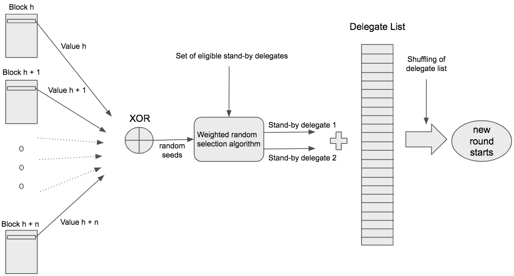

```
LIP: 0022
Title: Use Randao-based scheme to include standby delegates and reorder delegate list
Author: Iker Alustiza <iker@lightcurve.io>
Discussions-To: https://research.lisk.com/t/use-randao-based-scheme-to-include-standby-delegates-and-reorder-delegate-list/
Status: Replaced
Type: Standards Track
Created: 2019-09-30
Updated: 2024-01-04
Superseded-By: 0057
```

## Abstract

This LIP proposes to include two standby delegates in the forging delegate list of every round to incentivize a greater number of online nodes in the Lisk network. The selection of these standby delegates is done by a Randao-based weighted random selection scheme to ensure the fairness and unpredictability of the process. This scheme is also used to reorder the forging delegates list in every round (see [LIP 0003](https://github.com/LiskHQ/lips/blob/main/proposals/lip-0003.md)).

## Copyright

This LIP is licensed under the [Creative Commons Zero 1.0 Universal](https://creativecommons.org/publicdomain/zero/1.0/).

## Motivation

Since the Bitcoin network was released back in 2009, the number of online nodes has been an important figure to assess the health and decentralization of a certain blockchain. In general, nodes can be thought as the backbone of a blockchain, they contribute to keeping the network decentralized and protect the protocol’s consensus rules. This is done by validating every new transaction and block and eventually broadcasting them, and, usually, by keeping a complete copy of the blockchain. Hence the more online nodes a network has, the more secure and decentralized it is. However, in the majority of the existing blockchains, most of the online nodes do not get a direct reward for this work, and only those nodes that actively participate in the block production (e.g., miners in Bitcoin or active delegates in Lisk) get a block reward. At first sight, this may look like a misalignment of network incentives. One could argue that [there are enough incentives](https://en.bitcoin.it/wiki/Clearing_Up_Misconceptions_About_Full_Nodes#Myth:_There_is_no_incentive_to_run_nodes.2C_the_network_relies_on_altruism) to run a node, but the experience shows that nodes are run mainly because there is an expected profit in doing so. This profit can be generated by getting network rewards (e.g., generating new blocks), or by providing a service to customers (e.g., cryptocurrency exchanges). This situation is also present in Lisk where only the active delegates (top 101 by amount of LSK tokens voting for them) get a reward and collect the transaction fees for forging new blocks. In the same way as in Bitcoin, the rest of online nodes, which also broadcast and validate blocks and transactions, do not get anything in exchange. Also, in the Lisk DPoS system there are the so-called standby delegates, which are all the delegates below the 101st position in the delegate list ([1705](https://explorer.lisk.com/delegateMonitor) at the time of writing this document). As it is the case with the rest of the nodes that are not run by delegates, online nodes run by standby delegates get no reward from being part of the network even though they may have a considerable delegate weight (i.e., a considerable amount of LSK tokens voting for them). This proposal aims to change this by allowing these standby delegates to participate in the block forging with a probability proportional to their delegate weight. This will create an incentive for these delegates to run Lisk nodes, and an incentive for some LSK holders to register new delegates. And consequently, this should facilitate the achievement of the original objective of a more secure, decentralized and stable network for Lisk.

## Rationale

This LIP proposes to include 2 standby delegates in the forging delegate list every round with a probability proportional to their delegate weight. This implies that the rounds are now constituted of 103 block slots where 101 active delegates and 2 standby delegates are randomly assigned to each of these slots. The selection of these standby delegates is done by a low-complexity randomized selection algorithm. To ensure the fairness and unpredictability of the output of the process, the random seed of this algorithm is generated by a commit-reveal procedure based on the [Randao scheme](https://www.randao.org/whitepaper/Randao_v0.85_en.pdf) proposed for blockchains adapted to Lisk. Also, given the properties of the generated random seed, this LIP proposes to use it as the input seed to reorder [the forging delegates list](https://github.com/LiskHQ/lips/blob/main/proposals/lip-0003.md).
In the following subsections, the key points and changes of this proposal are justified and explained in detail. However, for a quick overview, the diagram below provides a very high level description of what this proposal entails:



### Random Seed Generation

The demand of randomness for decentralized applications and, in special, for blockchain technology has increased notably in the last years. For example, a secure Proof of Stake system requires a source of randomness to select the next block generator. However, the problem of generating a good random seed has proven to be a very challenging issue for these applications. Conventional number generators (based on a physical input or a computational algorithm) are not suitable since they imply a trusted setup. Here the random seed generation process has to be decentralized in the way that a single output is computed from the input of multiple independent parties. In this context, a _good_ random seed is a random seed with the following properties:

*   **Unpredictable:** No one can predict the value of the next random seed based on past information.
*   **Unbiasable:** None of the parties involved in the seed generation can bias the output of the process.
*   **Conspiracy-resistant:** As long as there are honest participants, collusion of some of the participating parties cannot bias the outcome.
*   **Available (liveness):** As long as there are honest parties involved in the seed generation, a random seed can be computed.
*   **Tamper-resistant:** No-one can modify the output of the random seed generation process once the process is completed.
*   **Verifiable:** Everyone can verify that the output is correct once the random seed generation process is completed.
*   **Unconcealable:** The parties involved in the seed generation cannot refuse to disclose the output of the process.

The theoretical problem of generating a random seed that fulfils each of these properties is still an open problem and a considerable effort is currently being spent on it (an example of this is [the work on Verifiable Delay Functions by Justin Drake et al. for Ethereum 2.0](https://slideslive.com/38911623/ethereum-20-randomness)). With this consideration, in this proposal a random seed generation scheme is presented which generates a _good enough_ random seed under the assumption that at least one honest delegate participated in the seed generation process. This random seed is _good enough_ in the way that even though it is not unpredictable or unbiasable by definition, the new incentives created in the protocol make biasing or predicting the seed not profitable for the attacker. This scheme is described in detail in the next subsection.

#### Randao-based scheme with hash onion adapted to Lisk

The approach proposed here is based on a [Randao-like scheme with a hash onion](https://ethresear.ch/t/rng-exploitability-analysis-assuming-pure-randao-based-main-chain) for the [commit-reveal process](https://www.randao.org/whitepaper/Randao_v0.85_en.pdf) to generate the random seed for the next round. Particularly, the proposed scheme follows the next steps:

1. Every delegate computes locally a hash onion, _H(H(H(..... S.....)))_, where _S_ is any arbitrary number chosen by the delegate and with an arbitrarily large number of hash layers. _H_ is a cryptographic hash function with 128 bits output.

2. Every forging delegate adds a 128 bit value, _C<sub>h</sub>_, at heigh h to its forged block. If a delegate forges at heights _h<sub>1</sub>_, _h<sub>2</sub>_,..., in one chain, then the values should satisfy _H(C<sub>h<sub>i</sub></sub> ) = C<sub>h<sub>i-1</sub></sub>_ for every _i > 1_, i.e., the delegate iteratively reveals the preimage (the next inner layer of the hash onion) of the value committed in its previously forged block.

3. Assuming that every round contains _n_ blocks and the current round _r_ started at block height _h_, then two random seeds, _rs1_ and _rs2_, are computed in the following way:
    1. _rs1 = XOR ( H (h + ⌊n/2⌋), V<sub>h - ⌊n/2⌋</sub>,  V<sub>h - ⌊n/2⌋ + 1</sub>, ...,  V<sub>h + ⌊n/2⌋</sub> )_

    2. _rs2 = XOR ( H (h -1), V<sub>h - n</sub>,  V<sub>h - n + 1</sub>, ...,  V<sub>h - 1</sub> )_

    where every _V<sub>k</sub>_ in ( _V<sub>h - n</sub>_,  _V<sub>h - n + 1</sub>_, ...,  _V<sub>h + ⌊n/2⌋</sub>_) is assigned as _V<sub>k</sub> = C<sub>k</sub>_ if the delegate forging at height _k_ previously forged at height _k'_ with _H(C<sub>k</sub>) = C<sub>k'</sub>_, i.e., the delegate correctly revealed the committed value, and _V<sub>k</sub> = 0_ otherwise. This means that only correctly revealed values are considered in the random seed computation. Otherwise the revealed values are not taken into account for the random seed.

Then _rs2_ is used as a random seed for the randomized algorithm to select one standby delegate whereas _rs1_ is used as a random seed to select the other standby delegate and to re-order the delegate list for round _r + 1_. This requires that at least one honest delegate participates in the computation of each of the seeds _rs1_ and _rs2_.

It is worth mentioning that in general _H( )_ can be any cryptographic hash function. For simplicity and to save space in the block header, in this proposal _H( )_ is constructed by truncating the SHA-256 output to the 128 most significant bits.

#### Mitigating last revealer attack and incentives

It is known that _commit and reveal_ based schemes like Randao can be slightly biased by the _[last revealer attack](http://paul.oemm.org/commit_reveal_subcommittees.pdf)_. A _last revealer_ attack occurs when the last member to reveal its value, in this case the delegate forging at height _h + ⌊n/2⌋_ (assuming that the current round _r_ started at block height _h_), decides whether to reveal or not the correct value based on the effect on the final output, creating bias. Because this delegate may arbitrarily decide not to reveal a preimage of its previously committed value, the proposed scheme includes the following mechanisms that make this behaviour not profitable:

1. If any forging delegate reveals a wrong value, i.e., _H(C<sub>h<sub>i</sub></sub> ) ≠ C<sub>h<sub>i-1</sub></sub>_, then the reward of the forged block is 0 (see [Specification](#validating-new-block-header-property) section for the details).
2. Instead of a unique random seed output at the end of _r_, two random seeds, _rs1_ and _rs2_, are generated from partially independent revealed values. This implies that delegates forging at height _h - 1_ or at _h + ⌊n/2⌋_ could perform the _last revealer_ attack, but also, this effectively reduces the effect of the bias to the selection of only one standby delegate per random seed.
3. The delegate weights at the end of round _r - 2_ are considered<sup>1</sup> to choose the standby delegates so that the delegate forging at height _h + ⌊n/2⌋_ cannot affect to its advantage the set of eligible standby delegates by submitting a vote transaction in the last block of _r_.

Thus delegates forging at heights _h - 1_ or at _h + ⌊n/2⌋_ can only choose to reveal a wrong value to bias the selection of one of the next round’s standby delegate forgers, but consequently, losing their forged block reward. This means that even in the best case scenario for the attackers, their expected profit is zero compared to revealing the correct value, i.e., there is no practical advantage for last revealers. What is more, the chances of having this best case scenario for the attacker are very low.

### Set of Eligible Standby Delegates

It is also important to clearly define what are the parameters for a delegate to be part of the set of eligible standby delegates. In order to have a straightforward requirement, this proposal sets a minimum delegate weight as threshold to become an eligible standby delegate. This way, a delegate that has a delegate weight over or equal to this quantity is automatically eligible to forge a block and should run a Lisk node.

The minimum required delegate weight to become eligible is **1000 LSK**. This quantity sets a low barrier for medium sized accounts to get a reward for securing the network. At the moment, there are [more than 5000 accounts](https://explorer.lisk.com/topAccounts) with a balance equal or higher than 1000 LSK that could immediately register a delegate, vote for themselves and become an eligible standby delegate. In the [Appendix A](#a-study-on-the-number-of-forged-blocks-for-standby-delegates), a brief study of the expected number of blocks forged by these accounts is included.

### Weighted Random Selection Algorithm

Assuming that a random seed is available, two delegates have to be randomly selected every new round from the set of standby delegates with a probability proportional to their delegate weight. In computer science, the problem of choosing two samples out of an input set according to their weight has been usually addressed as _weighted random selection_ or _weighted random sampling_. It is a commonly present topic for many applications, especially in statistical computing, data science and video-games development. Several algorithms can be found in the literature optimized for different situations (large input sets, large number of selected samples, unknown size of the sets, etc). However, here both the input set (number of eligible standby delegates) and the selected samples (two standby delegates per round) are rather small. Thus the proposed algorithm aims for simplicity, robustness and performance for this specific case.

The high-level description of the algorithm is as follows:

1. Generate an ordered list with the set of eligible standby delegates, _S<sub>sb</sub>_. The list is ordered by delegate weight. Assuming the current round _r_, the list is generated with the account state information at the end of _r - 2_.
2. Create a first number _rnd1 = rs1 mod dw<sub>sb</sub>_ where _dw<sub>sb</sub>_ is the sum of all the delegate weights in _S<sub>sb</sub>_. _rnd1_ is approximately uniformly distributed in the interval [0, _dw<sub>sb</sub>_).
3. Associate to every delegate in _S<sub>sb</sub>_ a part of the interval [0, _dw<sub>sb</sub>_) and select the first standby delegate _D<sub>1</sub>_ using _rnd1_.
4. Create a second number _rnd2 = rs2 mod dw'<sub>sb</sub>_ where _dw'<sub>sb</sub>_ is the sum of all the delegate weights in _S<sub>sb</sub>_ after removing _D<sub>1</sub>_ from the list. _rnd2_ is approximately uniformly distributed in the interval [0, _dw'<sub>sb</sub>_).
5. Associate to every delegate in _S<sub>sb</sub>_, after removing _D<sub>1</sub>_, a part of the interval [0, _dw'<sub>sb</sub>_) and select the second standby delegate _D<sub>2</sub>_ using _rnd2_.

With this algorithm, and assuming that _rs1_ and _rs2_ are uniformly distributed, some standby delegates will have a probability 10<sup>-22</sup> higher of being selected than others, which is more than acceptable for this case.

## Specification

### Block Header

This proposal requires to add an additional property, `seedReveal`, to the block header. `seedReveal` has to be a 128 bit value that contains the new value revealed by each forging delegate every round. Also, in a JSON object representing the block header, `seedReveal` has to be represented as a hexadecimal string.

This additional property needs to be included in the byte array that is used for generating the signature and `blockID` of a block. This way this property cannot be altered by a malicious node. For this, the <code>[getBytes()](https://github.com/LiskHQ/lisk/blob/de766a70d1c507c60c2893007263907fb428af45/logic/block.js#L385)</code> function needs to additionally include the 16 bytes of <code>seedReveal</code> value in big-endian encoding. It should be included in the byte array directly after the <code>previousBlock</code> property.

#### Hashing Function

As introduced in the previous section, a new hashing function, `H()`, is defined:

*   Input: A bit string of arbitrary length, `input`.
*   Output: A 128-bit string, `digest`.
*   Pseudo-code:

    ```
    function H(input):
        t = SHA-256(input)
        digest = trunc(t)
        return digest
    ```

    where the function `trunc()` truncates its input to the 128 most significant bits.

#### Validating New Block Header Property

In order to implement the random seed generation scheme introduced in the previous section, new rules need to be in place for a new block `B` to be valid. Assume `A` is the last block forged by the forger of `B` on the same chain and in the previous round or in the same round of `B`. Then:

*   If `B.seedReveal` is a preimage of  `A.seedReveal`, i.e. `A.seedReveal == H(B.seedReveal)`, then `B.reward` is not modified.
*   If `B.seedReveal` is not a preimage of `A.seedReveal`, i.e.`A.seedReveal != H(B.seedReveal)`, then `B.reward` must be equal to 0.

Also,

*   If the forger of `B` did not forge any block in the previous round or previously in the same round of `B`, `B.seedReveal` can be any value and `B.reward` is not modified.

We assume that the delegate forging the block adjusts the reward property in the block in the case of the second bullet point. Note that in any other case (i.e., `B.reward` > 0 but `B.seedReveal` does not fulfil the rule in the first bullet point), `B` is invalid.  

For this validation, only the properties `generatorPublicKey`, `seedReveal` and `height` for each block in the current and previous rounds are needed which may be kept in memory for efficiency reasons. [LIP 0014](https://github.com/LiskHQ/lips/blob/main/proposals/lip-0014.md) specifies that the block headers of the last three rounds are stored in memory, which will imply the availability of the required information if that proposal is already implemented.

Note that every value of `seedReveal` for a new forged block by each delegate reveals a new layer of the hash onion introduced [before](#randao-based-scheme-with-hash-onion-adapted-to-Lisk). In the [Appendix B](#b-hash-onion-computation), an efficient way to compute and manage this hash onion for the delegates is proposed.

### Random Seeds Computation

Once the first 51 blocks of the current round, `round`, have been forged, the two random seeds associated to `round` and used as input for the selection algorithm and the delegate list ordering  for `round` + 1 can be computed. If `round` started at block height _h_, the first random seed, `randomSeed1`, is the output of the XOR of the valid `seedReveal` values contained in the blocks from height _h - 51_ to _h + 51_ and <code>H(<em>h + 51</em>)</code>. The second random seed, <code>randomSeed2</code>, is the output of the XOR of the valid <code>seedReveal</code> values contained in the blocks from height _h - 103_ to _h -1_ and <code>H(<em>h - 1</em>)</code>. Here XOR stands for the [XOR bitwise operation](https://en.wikipedia.org/wiki/Bitwise_operation#XOR).

For a specific `B.seedReveal` value in a block `B `with height` B.height ` between <em>h - 103 </em> and <em> h + 51</em>, when any of these two cases occur, <code>B.seedReveal</code> value is not valid and hence it is not input of the random seed computation:

*   If the forger of `B` neither forged a block in the previous round nor previously in the same round of `B`.
*   If `B.seedReveal` is not a preimage of `A.seedReveal`, i.e. `A.seedReveal != H(B.seedReveal)`, where `A` is the last block forged by the forger of `B` in the previous round or the same round as `B`.  

As in the previous subsection, the random seed computation can be performed efficiently if the block headers of the current round and the previous two rounds are stored in memory.

### Round Computation

A round is composed of 103 blocks now. The block slots in the round are assigned to the delegates by looping over the forging list from the start. This implies that a delegate may forge multiple blocks in a round if some delegates missed their forging slot, or if the forging list is shorter than the round length.

Before being ordered according to [LIP 0003](https://github.com/LiskHQ/lips/blob/main/proposals/lip-0003.md) to generate the forging list, the set of forging delegates for `round` + 1 is constructed as follows:

1. The addresses of the top 101 delegates by delegate weight are added to the set of forging delegates from the set of all non-banned delegates at the end of `round` - 2 (the 2 rounds delay is specified in [Change of Delegates](https://github.com/LiskHQ/lips/blob/main/proposals/lip-0014.md#change-of-delegates) subsection of LIP 0014). Ties are broken in favor of the smaller address. In case there are 103 or less delegates to select from, all non-banned delegates at the end of `round` - 2 are added to this set and the following step of adding 2 extra delegates is omitted.
2. The addresses of `delegate1` and `delegate2` are included to the set of forging delegates. These two delegates are the output of the selection algorithm specified in the next section.

Moreover, for block validation, the delegate address has to be derived from the block property `generatorPublicKey` in order to verify the correct block slot.

### Weighted Random Selection Algorithm

The **input** parameters for the selection algorithm are:

1. Assuming the current round, `round`, an array with the set of standby delegates, `ListStandbyDelegates` is generated. This array contains every delegate with delegate weight ≥ 1000 LSK at the end of round `round` - 2 that is not part of the top 101 as specified in the previous section<sup>2</sup>. Each standby delegate object in the array has:
    *   the binary address of the delegate, `address`,
    *   the delegate weight, `delegateWeight`.
2. The random seeds `randomSeed1` and `randomSeed2` associated to `round` and generated as per the specification in the previous subsection.

The **output** is the two selected standby delegates, `delegate1` and `delegate2` to be included in `round`+ 1.

Internally, the algorithm works as follows:

1. Sort `ListStandbyDelegates` in descending order by `delegateWeight`. Ties are broken in favor of the smaller `address`.
2. Compute the sum, `WeightStandbyDelegates`, of all the delegate weights in `ListStandbyDelegates`.
3. Compute `rnd1 = randomSeed1 mod WeightStandbyDelegates`.
4. Select first standby delegate `delegate1` as:

    ```
    for i in {0,1,..., ListStandbyDelegates.length-1}:
        if (ListStandbyDelegates[i].delegateWeight > rnd1)
            delegate1 = ListStandbyDelegates[i]
            break
        else
            rnd1 = rnd1 - ListStandbyDelegates[i].delegateWeight
        end
    end
    ```

5. Remove `delegate1` from `ListStandbyDelegates`, recalculate `WeightStandbyDelegates` and compute the second random number as `rnd2 = randomSeed2 mod WeightStandbyDelegates`.
6. Repeat step 4 with `rnd2` instead of `rnd1` to select `delegate2` and stop afterwards.

In the case that `ListStandbyDelegates` contains less than 2 elements, the delegates at 102nd and 103rd positions (as per the sorting criteria defined in the previous section) will be chosen as `delegate1 `and `delegate2` respectively.

### BFT Consensus Rules for Standby Delegates

Assuming that [LIP 0014](https://github.com/LiskHQ/lips/blob/main/proposals/lip-0014.md) is already implemented, standby delegates are expected to generate, process and validate new blocks as defined in the specifications of that LIP, i.e. in the same way an active delegate does it.

In order to preserve the properties introduced in Theorem 4.4 in [A lightweight BFT consensus protocol for blockchains](https://arxiv.org/abs/1903.11434), votes and precommits implied by standby delegates have to be ignored. This implies that the logic specified at [Computing Prevotes and Precommits](https://github.com/LiskHQ/lips/blob/main/proposals/lip-0014.md#computing-prevotes-and-precommits) subsection has to be skipped if `newBlockheader` was produced by a standby delegate, i.e., only blocks produced by active delegates and with `heightPrevious < height` imply `prevotes` and `precommits`.

Note that here standby delegate is any delegate belonging to the set of forging delegates below the top 101 delegates by delegate weight.  

## Backwards Compatibility

The changes will introduce a hard fork for the following reasons:

1.  The block headers will include the `seedReveal` property, which implies that the block signatures and the block validation logic will be different from the previous version.
2.  The way in which the delegate list is computed every round changes from the previous version. Moreover, the delegate list will have 103 elements now and thus, rounds will be 2 slots longer.

Finally, for the migration, assuming that this LIP becomes active at height _h_, which is the height of the first block of round _r_, the following applies:

*   It is assumed that  _V<sub>k</sub>_ = 0 for _k < h_, where _V<sub>k</sub>_ are the values defined in [Rationale](#randao-based-scheme-with-hash-onion-adapted-to-Lisk) section above.
*   Since block headers for _k < h_ do not have the property `seedReveal`, it is assumed for the commit-reveal process that forging delegates in _r_ did not forge any block before _r_.

Note that this only affects the standby delegate selection process of _r_ and _r + 1_, which is not more biasable than the normal situation.

## Reference Implementation

[Network Consensus - Update DPoS voting system with BFT punishment](https://github.com/LiskHQ/lisk-sdk/issues/4915)

## Appendix

### A. Study on the Number of Forged Blocks for Standby Delegates

Assuming that a delegate gets a delegate weight of 10,000 LSK, which is enough to become a standby delegate, this appendix gives a basic estimation on the number of blocks this account is expected to forge in a certain period of time. The graph below provides this expectation in terms of average number of blocks per month against the total delegate weight of the standby delegates set.


It is worth mentioning that this study is assuming a uniform distribution of the weights in the standby delegate set where every delegate has a weight of 10,000 LSK. In practice, a standby delegate with this delegate weight may expect slightly higher figures, depending on the concrete delegate weight distribution.

### B. Hash Onion Computation

Delegates should take good care of their own committed and revealed values so that they do not lose rewards unintentionally. In this appendix we describe a way for the delegates to locally compute and manage the hash onion with the values to be committed and revealed:

1. Let _S_ be a 16 bytes number generated by a cryptographically secure pseudo-random number generator. Then _S_ is the initial input of the hash onion, _H(H(H(..... S.....)))_, where _H( )_ is the hash function defined in [Rationale](#randao-based-scheme-with-hash-onion-adapted-to-Lisk) section.
2. Compute 1M hashes to generate the hash onion as
    * _h<sub>0</sub> = S_,
    * _h<sub>n</sub> = H( h<sub>n - 1</sub>)_ for _n_ = 1,...,10<sup>6</sup>.
3. Store an ordered list with the last 1000 hashes as _h<sub>10<sup>6</sup></sub>, ..., h<sub>10<sup>6</sup>-10<sup>3</sup></sub>_.
4. Store a second ordered list with the hash _checkpoints_ every 1000 hashes until the initial preimage _S_ as _h<sub>10<sup>6</sup>-10<sup>3</sup></sub>, ..., h<sub>10<sup>6</sup>-2*10<sup>3</sup></sub>, ..., S_.
5. Start forging blocks revealing the entries of the list of step 3 in order.
6. When the list at step 3 reaches the last entry, compute the next 1000 hash outputs starting from the next checkpoint, and store them in reversed order.
7. Continue revealing the entries of the new list as in step 5.
8. Repeat step 6 until the list at step 4 reaches the last entry.

With a hash onion of 1M layers as the one just described an active delegate can reveal a correct value for approximately 1M rounds, which is more than 30 years. There is a realistic chance that the delegate will miss a block (for unrelated reasons) before it runs out of preimages in the hash onion. Also, once a delegate misses a block, it is recommendable to compute a new hash onion to have a fresh start in the next forging opportunity.

Note that this is just a recommendation, and delegates can choose different parameters to generate their hash onion or any other process they may consider more suitable.

## Notes

[1]: This is in line with [LIP 0014](https://github.com/LiskHQ/lips/blob/main/proposals/lip-0014.md), where a delay of 2 rounds is introduced to compute a new set of delegates.

[2]: For efficiency, this array can be computed at the end of `round` - 2 and kept in memory until the end of `round`. Another more general approach can be to store a snapshot of the delegate weight values for the registered delegates at the end of `round` - 2 to be used for the algorithm and other potential purposes until the end of `round`.
