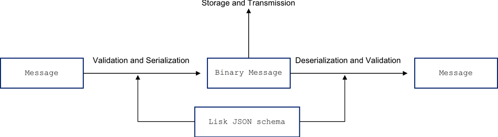

```
LIP: 0027
Title: A generic serialization method
Author: Maxime Gagnebin <maxime.gagnebin@lightcurve.io>
        Andreas Kendziorra <andreas.kendziorra@lightcurve.io>
Discussions-To: https://research.lisk.com/t/a-generic-serialization-method/208
Status: Active
Type: Informational
Created: 2020-02-18
Updated: 2022-03-30
```

## Abstract

This LIP proposes a serialization method that is generic, deterministic, size efficient and deserializable. This method could be used to serialize arbitrary data for hashing and signing but also for storing and transmitting. This could be applied to (custom) transactions, blocks or account states. Concrete use cases will be defined in separate LIPs.

The encoding is based on [protocol buffers](https://developers.google.com/protocol-buffers) proto2, also referred to as protobuf, with a few additional requirements. Instead of providing a `.proto` file, users will specify the serialization schema as a [JSON schema](https://json-schema.org/). The encoding is kept compatible with protobuf in the sense that protobuf implementations with the adequate `.proto` file deserialize binary messages correctly.

## Copyright

This LIP is licensed under the [Creative Commons Zero 1.0 Universal](https://creativecommons.org/publicdomain/zero/1.0/).

## Technical Glossary

* Message: A data structure, such as a JavaScript object.
* Binary message: A sequence of bytes. Our serialization method outputs a binary message.
* Encoding, serializing: Converting a message into a binary message.
* Decoding, deserializing: Converting a binary message into a message.
* Lisk JSON schema: A JSON schema fulfilling certain restrictions, defined in section [Lisk JSON Schemas](#lisk-json-schemas).

Lisk JSON schemas are used in the Lisk protocol for serialization, deserialization and validation of data.

## Motivation

The following points motivate a serialization method that is generic, deterministic, size efficient and allows deserialization:

1. When a custom transaction is created, it should be unnecessary to implement a specific serialization function for the transaction. Instead, it should be sufficient to provide a Lisk JSON schema specifying the template of the transaction.
2. Parts of the blockchain, like accounts, are not serialized yet. Having a generic serialization method makes it easy to serialize them.
3. Storing serialized transactions, blocks or accounts reduces the storage size of the blockchain.
4. Sending the serialized transaction or block (instead of the JSON encoding) reduces the size of the messages for peer-to-peer communications. In particular, this allows new nodes to synchronize faster.
5. Updating the serialization only requires changing the provided schema. This implies less development work and reduces the risk of errors.

## Rationale

Schemas will be written in the form of a JSON schema. JSON schemas allow to include restrictions and conditions on the data, and are already widely used in the Lisk codebase. Those restrictions are not used for serializing, but are used with validation tools to make sure that the data follows a strict template.

Using two different schemas for validation and serialization would be possible, but would introduce risks of incompatibilities between the two schemas. We therefore recommend using the same schema for both validation and serialization.



_In the Lisk protocol, messages are validated and serialized using the same Lisk JSON schema. The resulting binary message can be stored and transmitted efficiently. Finally, using the same schema, the binary message can be deserialized, and eventually validated, to recover the original data structure._

### Data Types

The Lisk protocol uses the following data types:

* **Bytes** (or byte array) is widely used, for example to represent key pairs (private and public keys) or signatures. In general, any input or output of a hash function will be of type _bytes_.
* **String** is used to represent text, for example usernames of delegates.
* **Integer** is used to represent an amount of tokens or other integers, like the height of a block or the transaction type.
  * In Lisk, amounts can be larger than 2^53 (90 million LSK). Therefore, they are not suited to be stored in a JavaScript _number_ and are stored as _[bigints](https://developer.mozilla.org/en-US/docs/Web/JavaScript/Reference/Global_Objects/BigInt)_.
* **Boolean** is used in [LIP 0023](https://github.com/LiskHQ/lips/blob/main/proposals/lip-0023.md) to indicate if a delegate is banned or not.

**Floating point number** is not used in the Lisk protocol and should be avoided in blockchain applications. If the need to represent fractional parts of an object arises, it is best to define a new fractional object (like Beddows in Lisk) and then consider integer amounts of this fractional object.

#### JSON Types

The JSON schema specifications describe the "type" keyword. This keyword should usually be used to define the data type of a property. However, this keyword has two drawbacks for our use case:

* There is no value for "type" specifying a byte array.

We could use _string_ or _object_ to represent bytes. This is however confusing and could lead to errors. Validation is also a concern here, the only type validating a byte array in JavaScript is _object_. But object also validates other values, like dictionaries.

* "Integer" can be specified as a JSON type.

The JSON specifications do not limit the range of _integers_. However, in JavaScript, large numbers (greater than 2^53) have to be represented by _bigints_, whereas smaller integers can be represented by _numbers_.

This implies that the schema would need an additional keyword to specify the range of the variable and its potential sign (signed or unsigned). As per validation, the validation library currently used in Lisk ([ajv](https://ajv.js.org/)) does not validate a _bigint_ value as an _integer_. Validating _bigints_ as _integers_ would require modifying the validation libraries, or writing our own.

Several other standards exists to try to solve this problem, see for example: [Google API Discovery Service](https://developers.google.com/discovery/v1/type-format) or [OpenAPI Specification version 3](https://github.com/OAI/OpenAPI-Specification/blob/master/versions/3.0.2.md#data-types). Those two solutions rely on the `format` keyword to relay additional information about the type.

As the `format` keyword already exists in the JSON specifications, this might seem a good solution, but brings additional drawbacks: `format` is intented to be used for strings. Extending `format` to integers or objects will not be supported by most JSON validators. Those specifications are therefore neither totally satisfactory, nor do they solve the issue of JSON validation.

To solve the above shortcomings of JSON schema validation, we propose to introduce a new keyword in Lisk JSON schemas: "dataType". Using a new keyword avoids any risks of unwanted behavior due to reuse of an existing keyword. We use this new keyword to specify any "scalar" type: "bytes", "uint32", "sint32", "uint64", "sint64, "string" or "bool". The "type" keyword is kept for "structural" type: "object" or "array". In particular, the "type" keyword cannot have the values: "integer", "number", "boolean", "string" or "null" in our schemas.

### Protobuf Encoding

The encoding specification of this proposal is based on [Protocol Buffers](https://developers.google.com/protocol-buffers), a widely used language-neutral serialization method. The encoding and decoding rules were chosen in such a way that any decoder following the protobuf specification with the correct `.proto` file decodes valid binary messages correctly. Hence, third party implementations could use other protobuf implementations to decode binary messages derived from this protocol. [Appendix B](#appendix-b-json-schema-to-protobuf) describes how to create a `.proto` file corresponding to a Lisk JSON schema.

The same cannot be achieved for serializing data. For example, protobuf’s specification [does not specify a deterministic encoding order](https://developers.google.com/protocol-buffers/docs/encoding#order). Hence, it cannot be guaranteed that an arbitrary protobuf implementation will serialize data as specified in this protocol. Besides the order, there are several other rules that make a binary message invalid with regard to this scheme but valid with regard to protobuf.

Other serialization protocols used in the industry have been considered. For example, Ethereum uses a custom serialization method called [RLP](https://github.com/ethereum/wiki/wiki/rlp) (Recursive Length Prefix), and it is planning to move to [SSZ](https://github.com/ethereum/eth2.0-specs/blob/dev/ssz/simple-serialize.md) (Simple Serialize). These protocols are deterministic, and as such would be viable candidates for these specifications. However, we think that protobuf is better suited to encode generic data structures. Further, it has a much larger userbase reaching outside the blockchain ecosystem. This makes it the prefered choice to allow an easy integration of Lisk with third-party libraries.

### Encoding Default Values

The encoding procedure should encode messages as faithfully as possible. In this regard, our encoding follows the proto2 specifications: properties set to a default value are encoded. Furthermore, our encoding does not include missing properties in the binary message.

For example, a block header with empty bytes (the default value for bytes) in the `signature` property is not encoded to the same binary message as a block header with a missing `signature` property.

### Uniqueness of Encoding

Special care should be taken when creating binary messages. If the binary message, `binaryMsg`, is not [valid](#uniqueness-of-binary-messages), it could be that `encode(decode( binaryMsg )) != binaryMsg`. This could cause a signature validation to fail or could generate a distinct ID for seemingly the same transaction. This happens because the decoder populates missing fields with their default values and the encoder will reorder the fields.

This is not the case for valid binary messages properly generated by the Lisk protocol, and will not be the case if all fields are set to their default value before encoding. To ensure that this does not create future issues, we suggest to specify every property of custom assets as _required_. In Lisk JSON schemas, this is done by including the name of the property in the array value of the `required` keyword of the object. This guarantees that unset fields are detected on the validation layer and that invalid binaries are not generated.

A possible way to assess the validity of a binary message is to check that `encode(decode( binaryMsg )) == binaryMsg`. If this is not the case, the original binary message was not properly generated and should be rejected.

### Arrays of Arrays

The specifications below state that the data type of elements of an array should be specified in the value of `items`. It is also specified that the value of `items` cannot be of type _array_. This may suggest that nested arrays are not supported at all. However, one can easily circumvent this limitation by wrapping the inner array of a nested array into an object. The example below shows a property of type array where each element is an array of _strings_ (wrapped into an object). This will be encoded in the same way as nested repeated objects in protobuf.

<table width="100%">
<tr>
  <td width="50%"><strong>Lisk JSON schema</strong></td>
  <td><strong>Corresponding protobuf message</strong></td>
</tr>
<tr>
<td valign="top">

```json
"arrayOne": {
  "type": "array",
  "numberField": 1,
  "items": {
    "type": "object",
    "properties": {
      "arrayTwo": {
        "type": "array",
        "numberField": 1,
        "items": {
          "dataType": "string"
        }
      }
    }
  }
}
```

</td>
<td valign="top">

```js
...
repeated NM_arrayOne arrayOne = 1;

message NM_arrayOne {
  repeated string arrayTwo = 1;
}
...
```

</td></tr></table>

## Specification

### Overview

A Lisk JSON schema has to be provided for each data structure for which instances (also referred to as messages) will be serialized. The same schema is used whenever a binary message is deserialized into an instance of this data structure.

The next subsections are structured as follows:

1. In [Lisk JSON Schemas](#lisk-json-schemas), we define the requirements that a JSON schema needs to fulfill in order to be a Lisk JSON schema.
2. In [Encoding](#encoding), we give the encoding rules to be used. Those are obtained by making the protobuf encoding rules more strict.
3. In [Uniqueness of Binary Messages](#uniqueness-of-binary-messages), we give the rules that the binary message has to respect to be considered valid by the Lisk protocol.
4. In [Decoding](#decoding), the conversion of binary messages to JavaScript objects is defined.

### Lisk JSON Schemas

A Lisk JSON schema is a [JSON schema](https://json-schema.org/) according to [draft 7](https://json-schema.org/specification-links.html#draft-7) of "JSON Schema: A media Type for Describing JSON Documents" (see the [core specification](https://tools.ietf.org/html/draft-handrews-json-schema-01) and the [validation specification](https://tools.ietf.org/html/draft-handrews-json-schema-validation-01)) with the following additional rules:

1. The [root schema](https://tools.ietf.org/html/draft-handrews-json-schema-01#section-4.3.3) must be of type _object_.
2. Every schema of type _object_ must have the `properties` keyword.
3. Every property of a schema of type _object_ must follow:
    1. Exactly one of the keywords `dataType` or `type` must be included. It must have a value from the [encoding table](#encoding-summary-table). As a consequence, the value of `type` cannot be "null", "number", "integer", "string", "boolean" or an array of values.
    2. The keyword <code>fieldNumber</code> must be included. All values used for <code>fieldNumber</code> in a given object have to be different; nested objects can reuse the same values for <code>fieldNumber</code>. This value is used to generate the key in the binary message. Values for <code>fieldNumber</code> have to be integers greater or equal than 1 and strictly smaller than 19000. As a consequence, every object must have less than 19000 properties.
4. We restrict properties of type _array_ to [list validation](https://json-schema.org/understanding-json-schema/reference/array.html#list-validation) where each item matches the same schema. A property of type _array_ must have the <code>items</code> keyword and its value is a schema specifying the repeated schema. The value of items must include exactly one of the keywords <code>dataType</code> or <code>type</code>. This keyword must have a value from the [encoding table](#encoding-summary-table), but it is not allowed to be "array".
5. Keywords other than `type`, `dataType`, `properties`, `items` and `fieldNumber` will be ignored by the serialization process.

#### DataType Keyword

We introduce the `dataType` keyword. The possible values for this keyword are: "uint32", "sint32", "uint64", "sint64", "bytes", "string" and "boolean". The values associated with properties with those keywords have to validate as follows.

<table width="100%">
<tr>
<th width="25%">If data is of "dataType"</th>
<th>JavaScript validation</strong></th>
</tr>
<tr>
<td>bytes</td>
<td>

```js
Buffer.isBuffer(data)
```

</td>
</tr>
<tr>
<td>uint32</td>
<td>

```js
typeof data === 'number' &&
0 <= data < Math.pow(2, 32) &&
Number.isInteger(data)
```

</td>
</tr><tr>
<td>sint32</td>
<td>

```js
typeof data === 'number' &&
- Math.pow(2, 31) <= data < Math.pow(2, 31) &&
Number.isInteger(data)
```

</td>
</tr>
<tr>
<td>uint64</td>
<td>

```js
typeof data === 'bigint' &&
0n <= data < (2n ** 64n)
```

</td></tr>
<tr>
<td>sint64</td>
<td>

```js
typeof data === 'bigint' &&
- (2n ** 63n) <= data < (2n ** 63n)
```

</td>
</tr>
<tr>
<td>string</td>
<td>

```js
typeof data === 'string'
```

</td>
</tr>
<tr>
<td>boolean</td>
<td>

```js
typeof data === 'boolean'
```

</td>
</tr>
</table>

### Encoding

The encoding specified in this document follows the [protobuf specification](https://developers.google.com/protocol-buffers/docs/encoding) proto2 with some additional restrictions. For the sake of completeness, we recall some of the protobuf features.

#### Base 128 Varints

In binary messages, integer values are encoded using [varints](https://developers.google.com/protocol-buffers/docs/encoding#varints). Varints are an efficient way to encode numbers without needing to explicitly specify the length of the byte sequence. In general, smaller numbers take a smaller number of bytes.

#### Encoding Objects

All instances to be encoded by the Lisk protocol are object instances. All properties of the object are encoded as key-value pairs. Keys and values are generated according to the sections below. The key-value pairs are then concatenated into a byte string in increasing `fieldNumber` order.

##### Keys

The key can be of two different [wire types](https://developers.google.com/protocol-buffers/docs/encoding#structure), either type 0 or type 2. The wire type is dependent on the data type of the property and is specified in the [encoding table](#encoding-summary-table) below.

* Keys of wire type 0 are constituted of 1 varint: They are the varint encoding of 8*`fieldNumber`.

This is equal to the varint encoding of (`fieldNumber` << 3) | 000 .

* Keys of wire type 2 are constituted of 2 varints. The first is the varint encoding of 8*`fieldNumber`+2.

This is equal to the varint encoding of (`fieldNumber` << 3) |010. The second is the varint encoding of the length of the byte sequence to follow.

#### Encoding Summary Table

Starting from a Lisk JSON schema, the properties are encoded as in the following table. Each data type encoding is described in detail in the next sections, accompanied with a few examples.

<table width="100%">
<tr>
<th width="33%">Data type in Lisk JSON schema</th>
<th>Value encoded as</th>
<th>Wire type of key</th>
</tr>
<tr>
<td>"dataType": "uint32", "uint64"</td>
<td>varint</td>
<td>0</td>
</tr>
<tr>
<td>"dataType": "sint32", "sint64"</td>
<td>varint, according to <a href="https://developers.google.com/protocol-buffers/docs/encoding#signed-integers">signed integer</a></td>
<td>0</td>
</tr>
<tr>
<td>"dataType": "boolean"</td>
<td>0x00 = false<br>0x01 = true</td>
<td>0</td>
</tr>
<tr>
<td>"dataType": "string" </td>
<td>byte sequence with utf8 encoding</td>
<td>2</td>
</tr>
<tr>
<td>"dataType": "bytes"</td>
<td>byte sequence (itself)</td>
<td>2</td>
</tr>
<tr>
<td>"type": "object"</td>
<td>series of key-value pairs as described <a href="#encoding-objects">above</a></td>
<td>2</td>
</tr>
<tr>
<td>"type": "array"<br/>"items": <em>someSchema</em></td>
<td>
If <em>someSchema</em> is of numeric or boolean type:

- Byte sequence containing the concatenated encoded values of the array.

If <em>someSchema</em> is not of numeric or boolean type:

- Repeated key-value pairs for every array entry.

<em>SomeSchema</em> cannot be of type array.
</td>
<td>2</td>
</tr>
</table>

#### Encoding Booleans

Boolean values are encoded as per the following table. Their key is of wire type 0.

| Boolean | In hexadecimal |
| ------- | -------------- |
| true    | **01**         |
| false   | **00**         |

#### Encoding Integers

Integers are encoded as [varints](https://developers.google.com/protocol-buffers/docs/encoding#varints). Signed integer (sint32 and sint64) follow the [protobuf specifications](https://developers.google.com/protocol-buffers/docs/encoding#signed-integers) for signed integers. Notice that they are different than int32 and int64. Their key is of wire type 0.

| uint32 or uint64 | Binary           | Varint                | Varint in hexadecimal |
| ---------------- | ---------------- | ----------------------|-----------------------|
| 0                | 0b**0**          | **00000000**          | **00**                |
| 1                | 0b**1**          | **00000001**          | **01**                |
| 45               | 0b**101101**     | **00101101**          | **2d**                |
| 678              | 0b**1010100110** | **10100110 00000101** | **a6 05**             |

| sint32 or sint64                     | Binary            | Varint                | Varint in hexadecimal |
| ------------------------------------ | ----------------- | ----------------------|-----------------------|
| 0                                    | 0b**0**           | **00000000**          | **00**                |
| -1                                   | 0b**1**           | **00000001**          | **01**                |
| 1                                    | 0b**10**          | **00000010**          | **02**                |
| -2                                   | 0b**11**          | **00000011**          | **03**                |
| 45 (encoded the same as uint 90)     | 0b**1011010**     | **01011010**          | **5a**                |
| -678 (encoded the same as uint 1355) | 0b**10101001011** | **11001011 00001010** | **cb 0a**             |

#### Encoding Strings and Bytes

Bytes are encoded as themselves and strings are encoded as their [UTF-8](https://tools.ietf.org/html/rfc3629) encoding. Their key is of wire type 2, generated with the `fieldNumber` and the length of the bytes, or the length of the UTF-8 encoding of the string.

| String or byte array | Encoded as      |
| -------------------- | --------------- |
| ""                   | (empty bytes)   |
| "lisk"               | **6c 69 73 6b** |
| **ef6245a4aa**       | **ef6245a4aa**  |

#### Encoding Arrays

Arrays of numeric types and boolean are always encoded [packed](https://developers.google.com/protocol-buffers/docs/encoding#packed). As such, arrays of _string_, _bytes_ or _object_ are encoded differently from arrays of _uint32_, _sint32_, _uint64_, _sint64_ or _boolean_. Arrays of arrays are not directly supported.

##### Arrays of Varints or Booleans

Arrays of _uint32_, _sint32_, _uint64_, _sint64_ and _boolean_ are encoded packed. The encoding is obtained by the following procedure:

1. Encode each element of the array as a varint.
2. Concatenate the outputs of step 1, respecting the order of the original array.
3. If the length of the array is non-zero, the output of step 2 is then encoded as data type _bytes_. If the array is of length zero, it is not encoded in the binary message.

<table width="100%">
<tr>
<th width="33%">Object schema</th>
<th>Object instance</th>
<th>Encoded as</th>
</tr>
<tr>
<td valign="top">

```json
{
  "type": "object",
  "properties": {
    "myArray": {
      "type": "array",
      "fieldNumber": 3,
      "items": {
        "dataType": "uint32"
      }
    }
  }
}
```

</td>
<td valign="top">

```json
{
  "myArray": [45, 678]
}
```

</td>
<td valign="top"><strong>1a 03 2d a605</strong></td>
</tr>
</table>

##### Arrays of Strings, Objects and Bytes

Arrays of those types are encoded differently than numeric types or booleans. The encoding is obtained by the following procedure:

1. Encode each element of the array with a key generated with the same number obtained from the `property.fieldNumber`.
2. Concatenate the outputs of step 1, respecting the order of the original array.

<table width="100%">
<tr>
<th width="33%">Object schema</th>
<th>Object instance</th>
<th>Encoded as</th>
</tr><tr>
<td valign="top">

```json
{
  "type": "object",
  "properties": {
    "myArray": {
      "type": "array",
      "fieldNumber": 3,
      "items": {
        "dataType": "string"
      }
    }
  }
}
```

</td>
<td valign="top">

```js
{
  "myArray": ["lisk", "", "LSK"]
}
```

</td>
<td valign="top"><strong>1a 04 6c69736b <br> 1a 00 <br> 1a 03 4c534b</strong></td>
</tr>
</table>

### Uniqueness of Binary Messages

The protobuf proto2 specifications are flexible with the order in which different fields are encoded and the presence of additional fields in a binary message. We do not allow such flexibility.

A binary message is valid, with respect to the corresponding data and schema, if the following rules are respected:

1. All properties are encoded according to the rules explained in [Encoding](#encoding).
2. All properties of objects are ordered in the binary message with respect to their `fieldNumber`. In particular, when an object is serialized, its properties are added to the binary message by increasing `fieldNumber`. As a consequence, all elements of an array must be added consecutively to the binary message.
3. The binary message contains exactly one value for each property specified in the schema.
    There are three exceptions to this rule:
    1. Empty arrays do not appear in the binary message.
    2. [Non-packed arrays](#array-of-string-object-and-bytes) may contain multiple values.
    3. Non-required properties for which no value was provided do not appear in the binary message. In particular, the key is also NOT contained in the binary message.
4. The binary message does not contain properties not present in the schema nor does it contain any additional bytes that cannot be decoded to key-value pairs.

A few examples are available in the [Testing and Examples](#testing-and-examples) section, and more can be found in the [protobuf documentation](https://developers.google.com/protocol-buffers/docs/encoding).

### Decoding

Only [valid messages](#uniqueness_of_binary_messages) can be decoded. For invalid messages, decoding fails. When a valid binary message is parsed, the binary message is decoded according to the [proto2](https://developers.google.com/protocol-buffers/docs/encoding) specifications. In particular, the following rule regarding missing values will be applied:

Whenever a binary message does not contain a specific field, the corresponding field in the parsed object is set to its default value. The default value is type-specific:
1. For strings, the default value is the empty string.
2. For bytes, the default value is the empty bytes.
3. For booleans, the default value is false.
4. For numeric types, the default value is zero.
5. For arrays, the default value is the empty array.
6. For objects, the default value is an object in which each of the properties is set to its default value.

The entries are then stored as follows in the JavaScript object:

| Data type in Lisk JSON schema          | Decoded as                                   |
| -------------------------------------- | -------------------------------------------- |
| "dataType": "uint32" or "sint32"       | number                                       |
| "dataType": "uint64" or "sint64"       | bigint                                       |
| "dataType": "boolean"                  | boolean                                      |
| "dataType": "string"                   | string                                       |
| "dataType": "bytes"                    | [Buffer](https://nodejs.org/api/buffer.html) |
| "type": "array"                        | array                                        |
| "type": "object"                       | object                                       |

## Testing and Examples

This section is meant to help understand the above specification as well as to test future implementations. It does not show a schema example used in the Lisk protocol. The Lisk JSON schemas used by the Lisk protocol are specified in separate documents.

### Simple Examples

<table width="100%">
<tr>
<th width="33%">Lisk JSON schema</th>
<th>Object instance</th>
<th>Encoded in hexadecimal as</th>
</tr>
<tr>
<td valign="top">

```json
{
  "type": "object",
  "properties": {
    "firstNumber": {
      "dataType": "uint32",
      "fieldNumber": 3
    },
    "secondNumber": {
      "dataType": "sint32",
      "fieldNumber": 7
    }
  },
  "required": ["firstNumber",
               "secondNumber"]
}
```

</td><td valign="top">

```js
{
  "firstNumber": 45,
  "secondNumber": -678
}
```

</td>
<td valign="top"><strong>18 2d 38 cb0a</strong></td>
</tr><tr>
<td valign="top">

```json
{
  "type": "object",
  "properties": {
    "firstNumber": {
      "dataType": "uint32",
      "fieldNumber": 678
    },
    "secondNumber": {
      "dataType": "sint32",
      "fieldNumber": 7
    }
  },
  "required": ["firstNumber",
               "secondNumber"]
}
```

</td><td valign="top">

```json
{
  "firstNumber": 45,
  "secondNumber": -678
}
```

</td>
<td valign="top"><strong>38 cb0a b02a 2d</strong></td>
</tr>
<tr>
<td valign="top">

```json
{
  "type": "object",
  "properties": {
    "firstNumber": { "dataType" : "uint32",
                     "fieldNumber" : 3 },
    "secondNumber": { "dataType" : "sint32",
                      "fieldNumber" : 7 },
    "myString": { "dataType" : "string",
                  "fieldNumber" : 33 }
  },
  "required": ["firstNumber",
               "secondNumber",
               "myString"]
}
```

</td><td valign="top">

```js
{
  "firstNumber": 45,
  "secondNumber": -678,
  "myString": "lisk"
}
```

</td>
<td valign="top"><strong>18 2d 38 cb0a 8a02 04 6c69736b</strong></td>
</tr>
</table>

### More involved example

<table width="100%">
<tr>
<th width="50%">Lisk JSON schema</th>
<th>Corresonding proto message</th>
</tr>
<tr>
<td valign="top">

```js
MySchema = {
  "type": "object",
  "properties": {
    "amount": {
      "dataType": "uint64",
      "fieldNumber": 1
    },
    "name": {
      "dataType": "string",
      "fieldNumber": 2
    },
    "myObject": {
      "fieldNumber": 5,
      "type": "object",
      "properties": {
        "myAge": {
          "dataType": "uint32",
          "fieldNumber": 17
        },
        "data": {
          "dataType": "bytes",
          "fieldNumber": 3
        },
      },
      "required": ["myAge", "data"]
    },
    "myArray": {
      "fieldNumber": 3,
      "type": "array",
      "items": {
        "type": "object",
        "properties": {
          "newName": {
            "dataType": "string",
            "fieldNumber": 1
          },
          "aBoolean": {
            "dataType": "boolean",
            "fieldNumber": 2
          },
          "numbers": {
            "type": "array",
            "items": { "dataType": "sint32" },
            "fieldNumber": 3
          }
        },
        "required": ["newName",
                     "aBoolean",
                     "numbers"]
      }
    }
  },
  "required": ["amount",
               "name",
               "myObject",
               "myArray"]
}
```

</td>
<td valign="top">

```js
message MySchema {
  optional uint64 amount = 1;
  optional string name = 2;
  repeated NM_myArray myArray = 3;
  optional NM_myObject myObject = 5;

  message NM_myObject {
    optional bytes data = 3;
    optional uint32 myAge = 17;
  }

  message NM_myArray {
    optional string newName = 1;
    optional bool aBoolean = 2;
    repeated sint32 numbers = 3;
  }
}
```

</td>
</tr>
</table>

#### Data Example 1:

```js
example1 = {
  amount: 3n,
  name: "me",
  myObject: {
    myAge: 543,
    data: empty bytes,
  },
  myArray: [] // NB: this will not appear in the binary
}
```

Will be encoded as 14 bytes: **08 03 12 02 6d 65 2a 06 1a 00 88 01 9f 04**

#### Data Example 2:

```js
example2 = {
  amount: 3n,
  name: "me",
  myObject: {
    myAge: 543,
    data: bytes from 0xab 0xcd 0xef,
  },
  myArray : [
    {
      newName: "you",
      aBoolean: false,
      numbers: [1, -2, 678]
    }
  ]
}
```

Will be encoded as 32 bytes: **08 03 12 02 6d 65 1a 0d 0a 03 79 6f 75 10 00 1a 04 02 03 cc 0a 2a 09 1a 03 ab cd ef 88 01 9f 04**

#### Data Example 3:

```js
example3 = {
  amount: 3n,
  name: "me",
  myObject : {
    myAge: 543,
    data: bytes from 0xab 0xcd 0xef,
  },
  myArray : [
    {
      newName: "you",
      aBoolean: false,
      numbers: [1, -2, 678]
    },
    {
      newName: "they",
      aBoolean: true,
      numbers: [] // NB: this will not appear in the binary
    }
  ]
}
```

Will be encoded as 44 bytes: **08 03 12 02 6d 65 1a 0d 0a 03 79 6f 75 10 00 1a 04 02 03 cc 0a 1a 08 0a 04 74 68 65 79 10 01 2a 09 1a 03 ab cd ef 88 01 9f 04**

## Backwards Compatibility

There are no incompatibilities since the protocol is not changed. Applications of the proposed serialization method will be proposed in separate LIPs.

## Appendix A: Examples

### Invalid JSON schemas

* Root schema does not specify an object:

```json
{ "dataType": "string" }
```

* Root schema does not have the `properties` keyword:

```json
{ "type": "object" }
```

* `dataType` or `type` is not specified for the property `a`:

```json
{
  "type": "object",
  "properties": {
    "a": { "maxLength": 5 }
  },
  "required": ["a"]
}
```

* `dataType` and `type` are both specified for the property `a`:

```json
{
  "type": "object",
  "properties": {
    "a": {
      "dataType": "string",
      "type" : "string"
    }
  },
  "required": ["a"]
}
```

* The keyword `fieldNumber` is missing for the property `a`:

```json
{
  "type": "object",
  "properties": {
    "a": { "dataType": "uint32" }
  },
  "required": ["a"]
}
```

* The keyword `properties` is missing for the property `a`:

```json
{
  "type": "object",
  "properties": {
    "a": {
      "type": "object",
      "fieldNumber": 1
    }
  },
  "required": ["a"]
}
```

* The property `a` is of type array, but the `items` keyword is missing:

```json
{
  "type": "object",
  "properties": {
    "a": {
      "type": "array",
      "fieldNumber": 1
    }
  },
  "required": ["a"]
}
```

* The items of the array `a` have several types:

```json
{
  "type": "object",
  "properties": {
    "a": {
      "type": "array",
      "fieldNumber": 1,
      "items": ["string", "integer"]
    }
  },
  "required": ["a"]
}
```

## Reference Implementation

1. [Pablo Vicente](https://github.com/pablitovicente): https://github.com/LiskHQ/lisk-sdk/pull/5322
2. [Shusetsu Toda](https://github.com/shuse2): https://github.com/LiskHQ/lisk-sdk/pull/5319
3. [Ishan Tiwari](https://github.com/ishantiw): https://github.com/LiskHQ/lisk-sdk/pull/5334
4. [Manu Nelamane Siddalingegowda](https://github.com/manugowda): https://github.com/LiskHQ/lisk-sdk/pull/5341

## Appendix B: JSON Schema to Protobuf

Protobuf is a very popular mechanism for serializing structured data. Therefore we aim to be compatible with third party libraries wanting to read the Lisk encoded data with their protobuf implementation. This section describes how to derive a `.proto` file from a Lisk JSON schema. The [Testing and Examples](#testing-and-examples) section contains examples of JSON schemas and corresponding `.proto` files.

### Field Name and Field Number

All properties in Lisk JSON schemas have a name and a `fieldNumber`. This value is used when creating the keys in the binary messages and should be used as the field name and field number when creating the `.proto` file. To make sure that the `fieldNumber` specified in the Lisk JSON schema is compatible with protobuf, we restrict the value of `fieldNumber` to the range 1 to 18’999.

### Type Conversion

The following table specifies how the  type for the field in the protobuf message should be chosen with respect to a given property in the Lisk JSON schema.

| **Data type in Lisk JSON schema**                            |  **Field type in proto message**                                                                                              |
| ------------------------------------------------------------ | ----------------------------------------------------------------------------------------------------------------------------- |
| Not used                                                     | double, float, fixed32, fixed64, sfixed32, sfixed64, int32 and int64                                                          |
| `"dataType": "uint32"`, `"sint32"`, `"uint64"` or `"sint64"` | uint32, sint32, uint64, sint64 (respectively)                                                                                 |
| `"dataType": "boolean"`                                      | bool                                                                                                                          |
| `"dataType": "string"`                                       | string                                                                                                                        |
| `"dataType": "bytes"`                                        | bytes                                                                                                                         |
| `"type":"array"` with `items: {dataType or type : someType}` | _repeated_ field with type given by _someType_                                                                                |
| `"type": "object"`                                           | [nested](https://developers.google.com/protocol-buffers/docs/proto#nested) message type representing the object in question |

### Pseudo Code

Let _schema_ be a fixed JSON schema. Then the corresponding `.proto` file can be obtained by taking the output of `create_proto_message_type_for_object("rootMessage", schema)` from the pseudo code below.

```python
NESTED_MESSAGE_PREFIX = "NM_"

get_type(schema):
  if schema.type:
    return schema.type
  return schema.dataType

is_scalar_type(dataType):
  if dataType in {"uint32", "uint64", "sint32", "sint64", "boolean", "string", "bytes"}:
    return True
  return False

get_proto_type_for_scalar_json_type(dataType):
  if dataType == "boolean":
    return "bool"
  return dataType

create_proto_message_type_for_object(messageName, jsonSchema):
  create a proto message type, MSG, with the name messageName
  for each key in jsonSchema.properties
    propSchema = jsonSchema.properties[key]
    type = get_type(propSchema)
    fieldNumber = propSchema.fieldNumber
    if is_scalar_type(type):
      fieldString = "optional " + get_proto_type_for_scalar_json_type(type)
    else if type == "object":
      nestedMessageName = NESTED_MESSAGE_PREFIX + key
      nestedMessage = create_proto_message_type_for_object(nestedMessageName, propSchema)
      fieldString = "optional " + nestedMessageName
    else if type == "array":
      fieldString = "repeated "
      itemsType = get_type(propSchema.items)
      if is_scalar_type(itemsType):
        fieldString += get_proto_type_for_scalar_json_type(itemsType)
      else:
        # itemsType must be "object"
        nestedMessageName = NESTED_MESSAGE_PREFIX + key
        fieldString += nestedMessageName
        nestedMessage = create_proto_message_type_for_object(nestedMessageName, propSchema)
    fieldString += " " + key + " = " + fieldNumber + ";"
    add the field specified by fieldString to MSG
    if nestedMessage:
      add the message nestedMessage as a nested message to MSG
  return MSG
```
