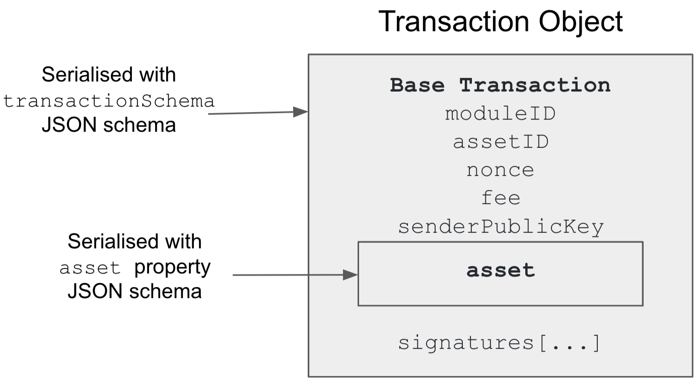

```
LIP: 0028
Title: Define schema and use generic serialization for transactions
Author: Iker Alustiza <iker@lightcurve.io>
Discussions-To: https://research.lisk.io/t/define-schema-and-use-generic-serialization-for-transactions/211
Type: Standards Track
Created: 2020-02-18
Updated: 2020-07-21
Requires: 0027, 0036
```

## Abstract

This LIP defines a generic serialization for transactions by specifying the appropriate JSON schema. The proposed serialization method is applied in two steps, first to the transaction asset, which contains the custom properties specific to the transaction, and then to the transaction base object, which is the same for all transactions. It will be used for signing but also for storing and transmitting transactions in the Lisk protocol. Further, this shall be the default serialization method for custom transactions created via the Lisk SDK.

## Copyright

This LIP is licensed under the [Creative Commons Zero 1.0 Universal](https://creativecommons.org/publicdomain/zero/1.0/).

## Motivation

A standard way of serializing transactions is beneficial in several parts of the Lisk protocol:

1. A generic and standard transaction serialization facilitates the task of managing and upgrading critical points of the protocol as signature and transaction ID generation or payload-hash computation.
2. An optimized transaction serialization can improve storage efficiency.
3. This serialization can also improve efficiency both for blocks and transactions propagation in the [Lisk P2P protocol](https://github.com/LiskHQ/lips/blob/master/proposals/lip-0004.md).

When a transaction object is serialized, also the asset property has to be serialized. In the current protocol, there exists a customized way to serialize the asset property for each transaction type. If a new transaction type is added, either to the Lisk mainchain or to a sidechain, then a new serialization method for the transaction specific to the new asset property has to be defined and implemented. This increases the barrier for creating sidechains with custom transactions. To simplify the development process, it is desirable to have a generic way to serialize the asset property which makes the mentioned specification and implementation unnecessary. This generic method may then be the default for custom transactions created with the Lisk SDK.

## Rationale

This proposal follows the specifications in the [LIP 0027](https://github.com/LiskHQ/lips/blob/master/proposals/lip-0027.md) to define a generic and deterministic way of serializing transactions in the Lisk protocol. This implies that JSON schemas have to be defined in order to perform the serialization-deserialization process.

As it is shown in the diagram below, all the transaction objects in the Lisk protocol have a common set of 7 properties. The data related to the specific transaction type is given in the `asset` property. This architecture is also expected to be used for custom transactions created with the Lisk SDK. For simplicity and consistency, custom transactions should have these 7 properties, while all new data is defined as part of the custom `asset` property.



For this reason, this LIP proposes to divide the serialization-deserialization process. First it defines a serialization-deserialization process for the whole transaction object with the `transactionSchema` JSON schema where the `asset` property is assumed to be of type `bytes`. Secondly, it defines the serialization-deserialization process for the `asset` property with the corresponding `asset` property JSON schema depending on the type of the transaction (given by the value of the properties `moduleID` and `assetID`). There are 7 different `asset` property schemas, one for each of the transaction types in the Lisk protocol. In order to simplify the creation of custom transactions with the SDK and to make the validation process less error prone, every property defined inside a given `asset` schema is required.

## Specification

Assuming that the JSON schemas for the `transactionSchema` and for the `asset` properties are provided according to the specifications in the [LIP 0027](https://github.com/LiskHQ/lips/blob/master/proposals/lip-0027.md), the serialization and deserialization of a transaction object are done as follows.

### Serialization

Consider a data structure `trsData` representing a valid (signed or unsigned) transaction object to be serialized. The serialization procedure is done in 3 steps:

1. The `trsData.asset` property is serialized to bytes according to the corresponding `asset` property schema given by the values of `trsData.moduleID` and `trsData.assetID`. The `asset` property schemas are defined below and the correspondence between `asset` property schema and values of `trsData.moduleID` and `trsData.assetID` is defined in [LIP 0036](https://github.com/LiskHQ/lips/blob/master/proposals/lip-0036.md#specification).
2. The resulting bytes are inserted into the `trsData.asset` property replacing the original value.
3. The transaction object from step 2 is serialized according to the `transactionSchema` schema.

### Deserialization

Consider a binary message `trsMsg` to be deserialized. The deserialization procedure is done in 3 steps:

1. The serialized bytes of `trsMsg` are deserialized according to the `transactionSchema` schema to obtain `trsData`.
2. The bytes value of the `trsData.asset` property is deserialized according to the corresponding `asset` property schema given by the values of `trsData.moduleID` and `trsData.assetID`.
3. The deserialized transaction object is the object from step 1, `trsData`, where the value of `trsData.asset` is the output of the step 2.

### Transaction signature calculation

Consider a data structure `unsignedTrsData` representing a valid transaction object in which the `signatures` array is initialized to the default value (an empty array). The signature of the object is calculated as follows:

1. `unsignedTrsData` is serialized using the method explained above. In particular, the empty `signatures` array is not part of the serialized data (see [below](#transactionSchema-schema)).
2. The transaction signature is calculated by signing the binary message from step 1.
3. The signature bytes from step 2 are inserted into the corresponding element of the `unsignedTrsData.signatures` array.

### Transaction signature validation

Consider a binary message `trsMsg` representing a serialized transaction object. The signature of the object is validated as follows:

1. `trsMsg` is deserialized to an object, `trsData`, as explained above in [Deserialization](#deserialization).
2. The signatures in `trsData.signatures` are removed from `trsData`, but kept for signature verification purposes. The array `trsData.signatures` is set to its default value.
3. The transaction object, `trsData`, from step 2 is serialized using the method explained above.
4. The signatures saved in step 2 are verified against the binary message from step 3 and the associated public keys.

### Transaction ID

Given a data structure, `signedTrsData`, representing a transaction object with the corresponding signatures present in the `signatures` property, the transaction ID is calculated as follows:

1. `signedTrsData` is serialized as [explained above](#serialization).
2. The transaction ID is calculated as the SHA-256 hash of the binary message from step 1.

### `transactionSchema` schema

The schema `transactionSchema` contains 7 properties:

1. `moduleID`: An integer identifying the module the transaction belongs to. Together with `assetID`, it specifies the JSON schema to be used to serialize-deserialize the `asset` property of the transaction.
2. `assetID`: An integer identifying the specific asset for the transaction in the module. Together with `moduleID`, it specifies the JSON schema to be used to serialize-deserialize the `asset` property of the transaction.
3. <code>[nonce](https://github.com/LiskHQ/lips/blob/master/proposals/lip-0015.md)</code>: An integer which is unique for each transaction from the account corresponding to the <code>senderPublicKey.</code>
4. <code>fee</code>: An integer that specifies the fee in Beddows to be spent by the transaction.
5. <code>senderPublicKey</code>: The public key of the account issuing the transaction. A valid public key is 32 bytes long.
6. <code>asset</code>: The serialized asset.
7. <code>signatures</code>: An array with the signatures of the transaction. Note that this property is an array which implies that in case of <code>signatures</code> being initialized to its default value, it does not appear in the binary message. The elements of this array are bytes, either of length 64, or of length 0.

```js
transactionSchema = {
  "type": "object",
  "properties": {
    "moduleID": {
      "dataType": "uint32",
      "fieldNumber": 1
    },
    "assetID": {
      "dataType": "uint32",
      "fieldNumber": 2
    },
    "nonce": {
      "dataType": "uint64",
      "fieldNumber": 3
    },
    "fee": {
      "dataType": "uint64",
      "fieldNumber": 4
    },
    "senderPublicKey": {
      "dataType": "bytes",
      "fieldNumber": 5
    },
    "asset": {
      "dataType": "bytes",
      "fieldNumber": 6
    },
    "signatures": {
      "type": "array",
      "items": {
        "dataType": "bytes",
      },
      "fieldNumber": 7
    }
  },
  "required": [
    "moduleID",
    "assetID",
    "nonce",
    "fee",
    "senderPublicKey",
    "asset"
  ]
}
```

### `asset` property schema

The `asset` property schema of a transaction has to be uniquely implied by the value of the properties `moduleID` and `assetID`. For the default transaction this correspondence is defined in [LIP 0036](https://github.com/LiskHQ/lips/blob/master/proposals/lip-0036.md#specification). All the properties defined in any `asset` schema are required.

#### Balance transfer

The schema `balanceTransferAsset` contains 3 properties:

1. `amount`: The amount in Beddows to be transferred to the account specified in `recipientAddress`.
2. `recipientAddress`: The address of the recipient of `amount`. This property is 20 bytes long.
3. `data`: A string with a maximum length of 64 bytes.

```js
balanceTransferAsset = {
  "type": "object",
  "properties": {
    "amount": {
      "dataType": "uint64",
      "fieldNumber": 1
    },
    "recipientAddress": {
      "dataType": "bytes",
      "fieldNumber": 2
    },
    "data": {
      "dataType": "string",
      "fieldNumber": 3
    }
  },
  "required": [
    "amount",
    "recipientAddress",
    "data"
  ]
}
```

#### Vote

The `voteAsset` schema contains an array of objects. Each of these objects contains the following properties:

1. `delegateAddress`: The address of the voted delegate. An address is 20 bytes long.
2. `amount`: The amount, in Beddows, voted for the delegate.

```js
voteAsset = {
  "type": "object",
  "properties": {
    "votes": {
      "type": "array",
      "items": {
        "type": "object",
        "properties": {
          "delegateAddress": {
            "dataType": "bytes",
            "fieldNumber": 1
          },
          "amount": {
            "dataType": "sint64",
            "fieldNumber": 2
          }
        },
        "required": [
          "delegateAddress",
          "amount"
        ]
      },
      "fieldNumber": 1
    }
  },
  "required": [
    "votes"
  ]
}
```

#### Delegate registration

The schema `delegateRegAsset` contains the `username` property. This property specifies the name of the registered delegate and is a string with a minimum length of 1 character and a maximum length of 20 characters.

```js
delegateRegAsset = {
  "type": "object",
  "properties": {
    "username": {
      "dataType": "string",
      "fieldNumber": 1
    }
  },
  "required": [
    "username"
  ]
}
```

#### Multisignature registration

The schema `multisigRegAsset` contains 3 properties:

1. `numberOfSignatures`: The number of private keys that must sign a transaction.
2. `mandatoryKeys`: An array of public keys. The corresponding private keys necessarily have to sign the transaction. A valid public key is 32 bytes long.
3. `optionalKeys`: An array of public keys. A valid public key is 32 bytes long.

```js
multisigRegAsset = {
  "type": "object",
  "properties": {
    "numberOfSignatures": {
      "dataType": "uint32",
      "fieldNumber": 1
    },
    "mandatoryKeys": {
      "type": "array",
      "items": {
        "dataType": "bytes",
      },
      "fieldNumber": 2
    },
    "optionalKeys": {
      "type": "array",
      "items": {
        "dataType": "bytes",
      },
      "fieldNumber": 3
    }
  },
  "required": [
    "numberOfSignatures",
    "mandatoryKeys",
    "optionalKeys"
  ]
}
```

#### Unlock vote

The `unlockVoteAsset` schema contains an array of objects. Each of these objects contains the following properties:

1. `delegateAddress`: The address of the unvoted delegate. An address is 20 bytes long.
2. `amount`: The amount, in Beddows, unvoted in a previous vote transaction.
3. `unvoteHeight`: The height at which the transaction to unvote the delegate has been included in the blockchain.

```js
unlockVoteAsset = {
  "type": "object",
  "properties": {
    "unlockObjects": {
      "type": "array",
      "items": {
        "type": "object",
        "properties": {
          "delegateAddress": {
            "dataType": "bytes",
            "fieldNumber": 1
          },
          "amount": {
            "dataType": "uint64",
            "fieldNumber": 2
          },
          "unvoteHeight": {
            "dataType": "uint32",
            "fieldNumber": 3
          }
        },
        "required": [
          "delegateAddress",
          "amount",
          "unvoteHeight"
        ]
      }
    },
    "fieldNumber": 1
  },
  "required": [
    "unlockObjects"
  ]
}
```

#### PoM

The `pomAsset` schema contains two properties: `header1` and `header2`. Each of the properties contain the serialized version of a signed block header of the Lisk blockchain. The specification to generate the serialized block headers is explained in the [LIP 0029](https://github.com/LiskHQ/lips/blob/master/proposals/lip-0029.md).

```js
pomAsset = {
  "type": "object",
  "properties:": {
    "header1": {
      "dataType": "bytes",
      "fieldNumber": 1
    },
    "header2": {
      "dataType": "bytes",
      "fieldNumber": 2
    }
  },
  "required": [
    "header1",
    "header2"
  ]
}
```

#### Reclaim

The schema `reclaimAsset` contains the `amount` property. This property accounts for the balance in Beddows to be reclaimed.

```js
reclaimAsset = {
  "type": "object",
  "properties": {
    "amount": {
      "dataType": "uint64",
      "fieldNumber": 1
    },
  },
  "required": [
    "amount"
  ]
}
```

## Reference Implementation

1. [Manu Nelamane Siddalingegowda](https://github.com/manugowda): https://github.com/LiskHQ/lisk-sdk/pull/5366
2. [Shusetsu Toda](https://github.com/shuse2): https://github.com/LiskHQ/lisk-sdk/pull/5383

## Backwards Compatibility

This proposal introduces a hard fork in the network. Since the transaction serialization is computed in a different way, this proposal impacts the way in which transactions are signed, stored and transmitted in the Lisk protocol. This also affects how transaction IDs are computed.

## Appendix: Serialization Example of Balance Transfer Transaction

#### **Transaction object to serialize:**

```js
myTrs = {
  moduleID: 2,
  assetID: 0,
  nonce: 5n,
  fee: 1216299416n,
  senderPublicKey: '6689d38d0d89e072b5339d24b4bff1bd6ef99eb26d8e02697819aecc8851fd55',
  asset: {
    amount: 123986407700n,
   recipientID: '2ca4b4e9924547c48c04300b320be84e8cd81e4a',
   data: 'Odi et amo. Quare id faciam, fortasse requiris.'
  },
  signatures: [
    '0898af68bd57e17a51fc5caa06a4acbea3a3c5d70e917632e3cd27498d64b701eab0269065ee48701546eceaedcbd849912c7413f8d321979931686c7b9f0c01',
    'f616daae47cca08630a8a17d478c478ec8ef895393c650a01e2f754d4812041d196c813e2876eddfc0415d6cbdbf35f1d56b816bfbe0b198446d17842a7df20e'
  ]
}
```

#### **Binary message (258 bytes):**

```
0x080210001805209883fdc3042a206689d38d0d89e072b5339d24b4bff1bd6ef99eb26d8e02697819aecc8851fd55324e0894e2a9f1cd0312142ca4b4e9924547c48c04300b320be84e8cd81e4a1a2f4f646920657420616d6f2e2051756172652069642066616369616d2c20666f7274617373652072657175697269732e3a400898af68bd57e17a51fc5caa06a4acbea3a3c5d70e917632e3cd27498d64b701eab0269065ee48701546eceaedcbd849912c7413f8d321979931686c7b9f0c013a40f616daae47cca08630a8a17d478c478ec8ef895393c650a01e2f754d4812041d196c813e2876eddfc0415d6cbdbf35f1d56b816bfbe0b198446d17842a7df20e
```

#### **Transaction ID:**

```
0x6ff4a496692a3926a30a74e8827dcc09cc79654f0f0f4682f17c13e908656b7d
```

#### **Private keys:**

```
0x42d93fa53d631181540ad630b9ad913835db79e7d2510be915513836bc175edc6689d38d0d89e072b5339d24b4bff1bd6ef99eb26d8e02697819aecc8851fd55

0x3751d0dee5ee214809118514303fa50a1daaf7151ec8d30c98b12e0caa4bb7deaa3f553d66b58d6167d14fe9e91b1bd04d7cf5eef27fed0bec8aaac6c73c90b3
```
