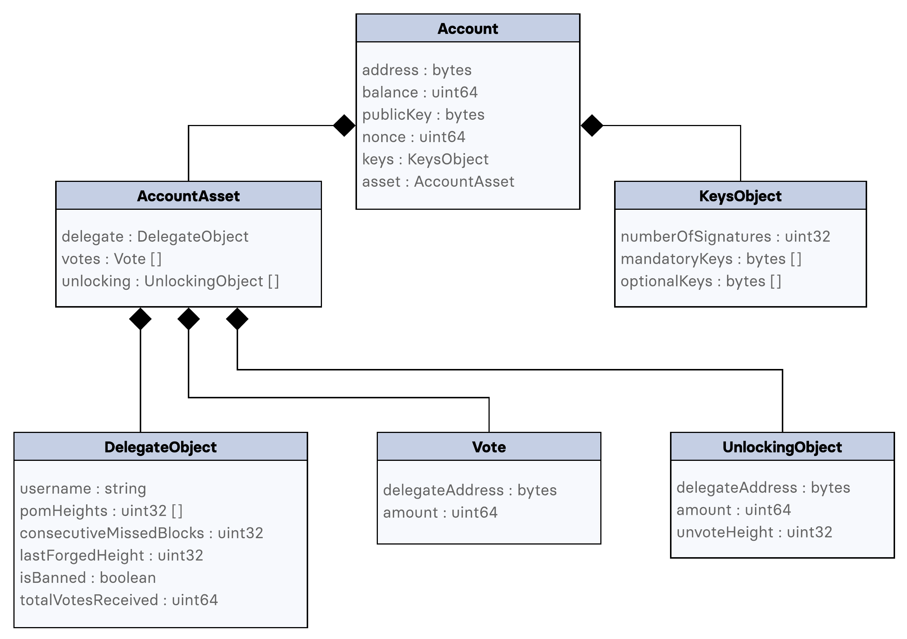

```
LIP: 0030
Title: Define schema and use generic serialization for account state
Author: Alessandro Ricottone <alessandro.ricottone@lightcurve.io>
Discussions-To: https://research.lisk.io/t/define-schema-and-use-generic-serialization-for-account-state/210
Status: Draft
Type: Standards Track
Created: 2020-02-18
Updated: 2021-04-26
Requires: 0027
```

## Abstract

This LIP defines how the generic serialization algorithm will be applied to accounts by specifying the appropriate JSON schema. We specify how the different address format introduced in [LIP 0018](https://github.com/LiskHQ/lips/blob/master/proposals/lip-0018.md) will be handled, to ensure that all of the account states are consistent across all Lisk nodes.

## Copyright

This LIP is licensed under the [Creative Commons Zero 1.0 Universal](https://creativecommons.org/publicdomain/zero/1.0/).

## Motivation

As part of the "[Introduce decentralized re-genesis](https://lisk.io/roadmap)" roadmap objective, all accounts will be serialized and inserted in a Merkle tree to calculate the Merkle root that will be included in the Regenesis Transaction. For this reason, it is fundamental to uniquely specify how accounts are serialized in order to achieve a consistent state across all Lisk nodes.

Furthermore, having a standard way of serializing the accounts state is beneficial in other parts of the Lisk protocol:

1. A standard account serialization system can help improve storage efficiency.
2. Developers using the Lisk-SDK will benefit from a flexible and expandable serialization method.

[LIP 0027 "A generic, deterministic and size efficient serialization method"][generic-serialization] defines the general serialization method and how JSON schemas are used to serialize data in the Lisk protocol.

In this LIP, we specify the JSON schema used to serialize an account.

## Rationale

We define a root schema `account` to serialize accounts. Each account is identified by the `address` property and contains 4 other properties, serialized according to their respective subschemas. Each one of these properties corresponds to a different Lisk SDK module.


### Handling Legacy Addresses

After [LIP 0018 "Use base32 encoding of long hash of public key plus checksum for address"](https://github.com/LiskHQ/lips/blob/master/proposals/lip-0018.md) is implemented, the address format in the Lisk protocol will change. In particular, the current 8 bytes addresses will be replaced by 20 bytes addresses. Accounts that have issued no transactions at the time of the address conversion will have no public key set, and as such the two address formats can not be linked (and the old format can not be updated). In this case, the `address`  property will contain an address in the old format and users will have to move their balance from an old to a new account by issuing a [Reclaim Transaction](https://github.com/LiskHQ/lips/blob/master/proposals/lip-0018.md#reclaim-transaction) from the new account. If the public key is present instead, the `address` property will be updated to the new format.

Note that the public key is not serialized as part of the account. Instead, the `senderPublicKey` property of a transaction is used to calculate the `address` property used to access the account.

## Specification



_A schematic of the account-serialization structure. Objects are indicated in bold and their properties are included in a box. Arrays are indicated with the items type followed by square brackets, and the attached boxes represent the schema of their items._

### `account` Schema

Accounts are serialized and deserialized according to the `account` schema. The `account` schema contains the following properties:

1. `address`: The account address. This can either be:
    1. The new address format, used after the implementation of [LIP 0018](https://github.com/LiskHQ/lips/blob/master/proposals/lip-0018.md). This value is 20 bytes long.
    2. The legacy address, used before the implementation of [LIP 0018](https://github.com/LiskHQ/lips/blob/master/proposals/lip-0018.md). This value is 8 bytes long.
2. `token`: This property corresponds to the token module and contains the account balance in Beddows.
3. `sequence`: This property corresponds to the sequence module and contains the current [nonce](https://github.com/LiskHQ/lips/blob/master/proposals/lip-0015.md#nonce), representing the total number of transactions sent from the account.
4. `keys`: Accounts that issued a multisignature registration transaction store the transaction-signing rules in this property.
5. `dpos`: This module contains the properties related to the [Lisk Delegated Proof-of-Stake](https://github.com/LiskHQ/lips/blob/master/proposals/lip-0023.md) protocol.


```js
account = {
  "type": "object",
  "properties": {
    "address": {
      "dataType": "bytes",
      "fieldNumber": 1
    },
    "token": {
      "type": "object",
      "properties": {
        "balance": {
          "dataType": "uint64",
          "fieldNumber": 1
        },
      },
      "fieldNumber": 2
    },
    "sequence": {
      "type": "object",
      "properties": {
        "nonce": {
          "dataType": "uint64",
          "fieldNumber": 1
        },
      },
      "fieldNumber": 3
    },
    "keys": {
      ...keysObject,
      "fieldNumber": 4
    },
    "dpos": {
      ...dposObject,
      "fieldNumber": 5
    }
  },
  "required": ["address", "token", "sequence", "keys", "dpos"]
}
```

Here, the `...` notation, borrowed from [JavaScript ES6 data destructuring](https://developer.mozilla.org/en-US/docs/Web/JavaScript/Reference/Operators/Destructuring_assignment#Object_destructuring), indicates that the corresponding schema should be inserted in place, and it is just used for notational convenience.

### `keysObject` Schema

This property contains the public keys necessary to sign a transaction from the account as defined by [LIP 0017](https://github.com/LiskHQ/lips/blob/master/proposals/lip-0017.md).

The schema `keysObject` contains 3 properties:

1. `numberOfSignatures`: The number of private keys that must sign a transaction. This value is greater than 0 only if the account issued a multisignature registration transaction.
2. `mandatoryKeys`: An array of public keys in lexicographical order. The corresponding private keys necessarily have to sign the transaction. A valid public key is 32 bytes long.
3. `optionalKeys`: An array of public keys in lexicographical order. The number of corresponding private keys that have to sign the transaction equals `numberOfSignatures` minus the size of `mandatoryKeys`. A valid public key is 32 bytes long.

```js
keysObject = {
  "type": "object",
  "properties": {
    "numberOfSignatures": {
      "dataType": "uint32",
      "fieldNumber": 1
    },
    "mandatoryKeys": {
      "type": "array",
      "items": {
        "dataType": "bytes"
      },
      "fieldNumber": 2
    },
    "optionalKeys": {
      "type": "array",
      "items": {
        "dataType": "bytes"
      },
      "fieldNumber": 3
    }
  },
  "required": [
    "numberOfSignatures",
    "mandatoryKeys",
    "optionalKeys"
  ]
}
```

### `dposObject` Schema

This property stores all information relevant to the Lisk DPoS protocol.
The `dposObject` schema  contains the following properties:

1. `delegate`: This property contains information about forging functionalities of an account registered as a delegate.
2. <code>[sentVotes](https://github.com/LiskHQ/lips/blob/master/proposals/lip-0023.md#new-vote-transaction-1)</code>: An array storing all votes cast by the account using a Vote Transaction, ordered lexicographically by <code>delegateAddress</code> .
3. <code>[unlocking](https://github.com/LiskHQ/lips/blob/master/proposals/lip-0023.md#new-unlock-transaction)</code>: An array storing all votes withdrawn by the account using a Vote Transaction and the corresponding block height at which the transaction was included in the blockchain, ordered lexicographically by <code>(delegateAddress, unvoteHeight, amount)</code>.

```js
dposObject = {
  "type": "object",
  "properties": {
    "delegate": {
      ...delegateObject,
      "fieldNumber": 1
    },
    "sentVotes": {
      "type": "array",
      "items": {
        ...vote
      },
      "fieldNumber": 2
    },
    "unlocking": {
      "type": "array",
      "items": {
        ...unlockingObject
      },
      "fieldNumber": 3
    }
  },
  "required": [
    "delegate",
    "sentVotes",
    "unlocking"
  ]
}
```

#### `delegateObject` Schema

The `delegateObject` schema contains the following properties:

1. `username`: A string representing the delegate username. For non-delegate accounts, the string must be empty. For delegate accounts, the string must have a length between 1 and 20 characters.
2. <code>[pomHeights](https://github.com/LiskHQ/lips/blob/master/proposals/lip-0024.md)</code>: An array containing the heights (in ascending order) at which a Proof-of-Misbehaviour Transaction regarding the delegate has been included in the blockchain.
3. <code>[consecutiveMissedBlocks](https://github.com/LiskHQ/lips/blob/master/proposals/lip-0023.md)</code>: Number of consecutive blocks missed by the delegate, used to determine if the delegate has to be banned.
4. <code>[lastForgedHeight](https://github.com/LiskHQ/lips/blob/master/proposals/lip-0023.md)</code>: The height of the last block forged by the delegate, used to determine if the delegate has to be banned.
5. <code>[isBanned](https://github.com/LiskHQ/lips/blob/master/proposals/lip-0023.md)</code>: A boolean, true if the delegate has been banned.
6. <code>[totalVotesReceived](https://github.com/LiskHQ/lips/blob/master/proposals/lip-0024.md)</code>: Total amount of votes for the delegate. This value is used to calculate the delegate weight.

```js
delegateObject = {
  "type": "object",
  "properties": {
    "username": {
      "dataType": "string",
      "fieldNumber": 1
    },
    "pomHeights": {
      "type": "array",
      "items": {
        "dataType": "uint32"
      },
      "fieldNumber": 2
    },
    "consecutiveMissedBlocks": {
      "dataType": "uint32",
      "fieldNumber": 3
    },
    "lastForgedHeight": {
      "dataType": "uint32",
      "fieldNumber": 4
    },
    "isBanned": {
      "dataType": "boolean",
      "fieldNumber": 5
    },
    "totalVotesReceived": {
      "dataType": "uint64",
      "fieldNumber": 6
    },
  },
  "required": [
    "username",
    "pomHeights",
    "consecutiveMissedBlocks",
    "lastForgedHeight",
    "isBanned",
    "totalVotesReceived"
  ]
```

#### `vote` Schema

The `vote` schema contains the following properties:

1. `delegateAddress`: The address of the voted delegate. Notice that this address is always in the new format, and therefore it is 20 bytes long.
2. `amount`: The amount of Beddows voted for the delegate.

```js
vote = {
  "type": "object",
  "properties": {
    "delegateAddress": {
      "dataType": "bytes",
      "fieldNumber": 1
    },
    "amount": {
      "dataType": "uint64",
      "fieldNumber": 2
    }
  },
  "required": [
    "delegateAddress",
    "amount"
  ]
}
```

#### `unlockingObject` Schema

The `unlockingObject` schema contains the following properties:

1. `delegateAddress`: The address of the unvoted delegate. Notice that this address is always in the new format, and therefore it is 20 bytes long.
2. `amount`: The amount of Beddows withdrawn from the vote amount.
3. `unvoteHeight`: The height at which the transaction to unvote the delegate has been included in the blockchain.

```js
unlockingObject = {
  "type": "object",
  "properties": {
    "delegateAddress": {
      "dataType": "bytes",
      "fieldNumber": 1
    },
    "amount": {
      "dataType": "uint64",
      "fieldNumber": 2
    },
    "unvoteHeight": {
      "dataType": "uint32",
      "fieldNumber": 3
    }
  },
  "required": [
    "delegateAddress",
    "amount",
    "unvoteHeight"
  ]
}
```

## Backwards Compatibility

This proposal does not introduce any forks in the network, as it only defines the JSON schema used to serialize an account in the Lisk protocol.

## Reference Implementation

1. [Shusetsu Toda](https://github.com/shuse2): https://github.com/LiskHQ/lisk-sdk/pull/5367

## Appendix: Serialization Example

```js
accountData = {
  "address": "e11a11364738225813f86ea85214400e5db08d6e",
  "token": { "balance": 10 },
  "sequence": { "nonce": 5 },
  "keys": {
    "numberOfSignatures": 2,
    "mandatoryKeys": [
      "c8b8fbe474a2b63ccb9744a409569b0a465ee1803f80435aec1c5e7fc2d4ee18",
      "6115424fec0ce9c3bac5a81b5c782827d1f956fb95f1ccfa36c566d04e4d7267"
    ],
    "optionalKeys": []
  },
  "dpos": {
    "delegate": {
      "username": "Catullo",
      "pomHeights": [ 85 ],
      "consecutiveMissedBlocks": 32,
      "lastForgedHeight": 64,
      "isBanned": false,
      "totalVotesReceived": 300000000
    },
    "votes": [
      {
        "delegateAddress": "d459adcd2d79491adf5804978bbf137123b6b9e6",
        "amount": 100000000
      },
      {
        "delegateAddress": "e44ddf6ffb4d006599157dd1503ac2c21bdd6a30",
        "amount": 250000000
      }
    ],
    "unlocking": [
      {
        "delegateAddress": "f288105058a52555b5ab040d582629fe592a0527",
        "amount": 400000000,
        "unvoteHeight": 128
      }
    ]
  }
}
```

```
accountMsg = {
  0a14: e11a11364738225813f86ea85214400e5db08d6e,
  1202: { 08: 0a },
  1a02: { 08: 05 },
  2246: {
    08: 02,
    (12): [
      1220 c8b8fbe474a2b63ccb9744a409569b0a465ee1803f80435aec1c5e7fc2d4ee18,
      1220 6115424fec0ce9c3bac5a81b5c782827d1f956fb95f1ccfa36c566d04e4d7267
    ],
    optionalKeys: []
  },
  2a9901: {
    0a18: {
      0a07: 436174756c6c6f,
      (1201): 1201 55,
      18: 20,
      20: 40,
      28: 00,
      30: 80c6868f01
    },
    (12): [
      { 1227 0a20: d459adcd2d79491adf5804978bbf137123b6b9e6,
        10: 80c2d72f },
      { 1227 0a20: e44ddf6ffb4d006599157dd1503ac2c21bdd6a30,
        10: 80e59a77 }
    ],
    (1a): [
      { 1a2b 0a20: f288105058a52555b5ab040d582629fe592a0527,
        10: 8088debe01,
        18: 8001 }
    ]
  }
}
```

```
binaryMsg [221 bytes] = 0a14e11a11364738225813f86ea85214400e5db08d6e1202080a1a020805224608021220c8b8fbe474a2b63ccb9744a409569b0a465ee1803f80435aec1c5e7fc2d4ee1812206115424fec0ce9c3bac5a81b5c782827d1f956fb95f1ccfa36c566d04e4d72672a750a180a07436174756c6c6f1201551820204028003080c6868f01121b0a14d459adcd2d79491adf5804978bbf137123b6b9e61080c2d72f121b0a14e44ddf6ffb4d006599157dd1503ac2c21bdd6a301080e59a771a1f0a14f288105058a52555b5ab040d582629fe592a0527108088debe01188001
```

[generic-serialization]: https://github.com/LiskHQ/lips/blob/master/proposals/lip-0027.md
