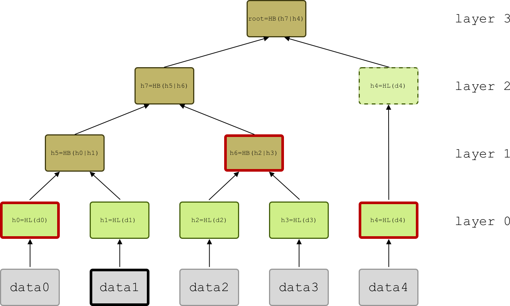
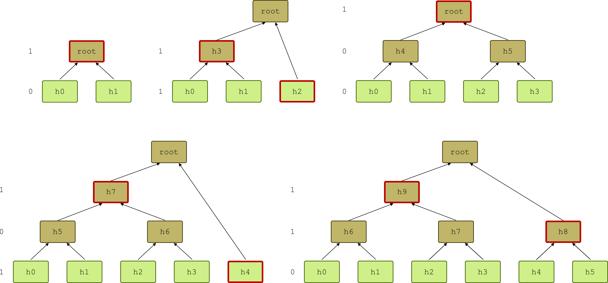

```
LIP: 0031
Title: Introduce Merkle trees and inclusion proofs
Author: Alessandro Ricottone <alessandro.ricottone@lightcurve.io>
Discussions-To: https://research.lisk.com/t/introduce-merkle-trees-and-inclusion-proofs/213
Status: Active
Type: Informational
Created: 2020-02-19
Updated: 2021-12-01
Requires: 0027
```

## Abstract

The purpose of this LIP is to define a generic Merkle Tree structure and a format for proof-of-inclusion that can be used in different parts of the Lisk protocol.

## Copyright

This LIP is licensed under the [Creative Commons Zero 1.0 Universal](https://creativecommons.org/publicdomain/zero/1.0/).

## Motivation

A Merkle tree is an authenticated data structure organized as a tree ([Fig. 1](#Specification)). The hash of each data block is stored in a node on the base layer, or leaf, and every internal node of the tree, or branch, contains a cryptographic hash that is computed from the hashes of its two child nodes. The top node of the tree, the Merkle root, uniquely identifies the data array from which the tree was constructed.

Merkle trees allow for an efficient _proof-of-inclusion_, where a _Prover_ shows to a _Verifier_ that a certain data block is part of the authenticated data array by sending them a _proof_ with an _audit path_. The audit path contains the node hashes necessary to recalculate the Merkle root, without requiring the Verifier to store or the Prover to reveal the whole data array. For an array of size _N_, the audit path contains at most _Log(N)_ hashes, and the proof-of-inclusion is verified by calculating at most _Log(N)_ hashes (here and later _Log_ indicates the base 2 logarithm of the argument). Furthermore, if the Verifier wants to check the presence of multiple data blocks at once, it is possible to obtain some hashes directly from the data blocks and reuse them for multiple simultaneous verifications.

In Bitcoin, the transactions contained in a block are stored in a [Merkle tree](https://github.com/bitcoin/bips/blob/master/bip-0098.mediawiki). This allows for [Simplified Payment Verification (SPV)](https://bitcoin.org/bitcoin.pdf), i.e., a lightweight client can verify that a certain transaction is included in a block without having to download the whole block or Bitcoin blockchain.

In [Ethereum](https://github.com/ethereum/wiki/wiki/Patricia-Tree#state-trie), the roots of Merkle Patricia trees are included in each block header to authenticate the global state of the blockchain (`stateRoot`), the transactions within the block (`transactionsRoot` and `receiptsRoot`) and the smart contract data (`storageRoot` for each Ethereum account).

The inclusion of Merkle trees can be beneficial in several parts of the Lisk protocol:

* Storing the root of a Merkle tree for the transactions in the `payloadHash` in the block header would allow users to verify efficiently that a transaction has been included in the block. At the moment the `payloadHash` contains the hash of the serialized transactions, and to verify the presence of a single transaction users have to download the whole block. After the [proposed change](https://github.com/LiskHQ/lips/blob/main/proposals/lip-0002.md) to limit the block size to 15kb, a full block will contain approximately 120 transactions at most. In this case, performing a proof-of-inclusion will require to query 7 hashes, and the size of the corresponding proof would be 232 bytes (see "Proof serialization" section below). Thus, the amount of data to be queried to verify the presence of a single transaction in a full block is reduced by \~98%.
* Merkle trees as an authenticated data structure can be helpful to create a snapshot of the account states as well as the transaction and block history, for example for the ["Introduce decentralized re-genesis"](https://lisk.com/roadmap) roadmap objective.

## Rationale

This LIP defines the general specifications to build a Merkle tree from a data array, calculate the Merkle root and perform a proof-of-inclusion in the Lisk protocol. We require the following features:

* Cryptographically secure: the data array can not be altered without changing the Merkle root.
* Proof-of-inclusion: presence of data blocks in the data array or in the tree can be verified without querying the whole tree.
* Efficient append: new data blocks can be appended to the data array, and the tree is updated with at most _Log(N)_ operations for an array of size _N_.

We consider two possible implementations for a Merkle tree: regular Merkle trees (RMT) and sparse Merkle trees (SMT).

### Regular Merkle Trees

In a RMT, data blocks are inserted in the tree in the order in which they appear in the data array. Hence, the order can not be altered to reproduce the same Merkle root consistently. This also implies that in a RMT it is not possible to insert a new leaf in an arbitrary position efficiently, as this changes the position in the tree of many other leaf nodes, so that the number of branch nodes to be updated is proportional to the size of the tree _N_. On the other hand, RMTs are suitable for append-only data array, as appending a new elements to the array updates a number of branch nodes proportional to _Log(N)_ only.

RMT accepting input data blocks with arbitrary length are susceptible to second pre-image attacks. In a second pre-image attack, the goal of the attacker is to find a second input _x′_ that hashes to the same value of another given input _x_, i.e. find _x’ ≠ x_ such that _hash(x) = hash(x’)_. In Merkle trees, this corresponds to having two different input data arrays _x_ and _x’_ with the same Merkle root. [This is trivial in an RMT](https://flawed.net.nz/2018/02/21/attacking-merkle-trees-with-a-second-preimage-attack/): choose _x = [D1, D2, D3, D4]_ and _x’  = [D1, D2, hash(D3) || hash(D4)]_, where || indicates input concatenation. To solve this problem we use a different hashing function for leaf and branch nodes [1].

RMTs are in general easier to implement because of their limited storage requirements. Furthermore, the data array can be sorted in such a way that most queries would ask for a proof-of-inclusion for data blocks stored consecutively, allowing then for smaller audit paths. For example this is the case for the Merkle tree built out of blocks headers where blocks are stored according to their height, and a typical query could ask to verify the presence of consecutive blocks in the blockchain.

### Sparse Merkle Trees

In a SMT, all possible leaf nodes are initialized to the empty value. Every leaf occupies a fixed position, indexed by its key. In a SMT, the order of insertion of the data blocks is not relevant, as all leaf nodes are indexed by their respective keys.

In a SMT it is possible to obtain a proof-of-absence for a certain key by simply showing that the empty value is stored in the corresponding leaf with a proof-of-inclusion. SMTs are easy to update: once a leaf node with a certain key is updated, one has to update only _Log(N)_ branch nodes up the tree. For 256 bits-long keys, there are 2<sup>256</sup> possible leaf nodes, and the height of the tree is 256. Hence, each update changes the value of 256 nodes.

SMT are too large to be stored explicitly and require further optimization to reduce their size. For example, one could decide to place a leaf node at the highest subtree with only 1 non-null entry and trim out all empty nodes below it. This is the approach taken by the [Aergo State trie](https://github.com/aergoio/aergo/tree/master/pkg/trie).

We choose to implement RMTs and reserve the possibility to implement SMTs in different parts of the Lisk protocols in the future.

### Proof-of-Inclusion Protocol

In this section, we clarify the steps necessary for a proof-of-inclusion and introduce some useful terminology. The elements constituting a proof-of-inclusion are:

1. `merkleRoot`: The Merkle root of the tree built from the data array `data`.
2. `queryHashes`: An array of `bytes`. The elements of the array can be the hash values of either leaf or branch nodes.
3. `proof`: The proof itself, consisting of 3 parts: `size`, `idxs` and `siblingHashes`:
  1. `size`: The total number of data blocks in the data array (the length of `data`).
  2. `idxs`: An array of indices corresponding to the position in the tree of the nodes corresponding to `queryHashes`.
  3. `siblingHashes`: The hashes that are part of the audit path, an array of `bytes` necessary to compute the Merkle root starting from `queryHashes`.

The procedure for a proof-of-inclusion is as follows:

1. **Verifier**:
  The Verifier knows `merkleRoot` and sends the Prover an array of hash values `queryHashes` for which they wish to obtain a proof-of-inclusion.
2. **Prover**:
  1. The Prover finds the nodes corresponding to `queryHashes` in the Merkle tree and generates the array of corresponding indices `idxs`.
  2. The Prover generates `siblingHashes` and transmits the complete `proof` to the Verifier; `proof` contains `size`, `idxs` and `siblingHashes`.
3. **Verifier**:
  The Verifier uses `proof` to recalculate the Merkle root using elements from `queryHashes` and checks that it equals `merkleRoot`.

In Fig. 1 we sketch a simple proof-of-inclusion for data block `data1`. The Verifier asks the Prover for a proof for `queryHashes=[leafHash(data1)]`. The Prover sends back `proof` with `size=5`, `idxs=[0001]`and `siblingHashes=[h0, h6, h4]`.

### Representation of indices

On an abstract level, indices in the array `idxs` are represented as bit strings. The length of such a bit string is [determined by the layer and the height of the tree](#proof-construction). For compactness, these bit strings are converted to `uint64` before being serialized such that they are [varint encoded](https://github.com/LiskHQ/lips/blob/main/proposals/lip-0027.md#base-128-varints). As the indices can represent arbitrary nodes of the tree and not just leave nodes, different indices could represent the same integer. For example, `idxs` could contain the two indices `idx1 = "001"` and `idx2 = "0001"` (see [Fig. 2](#proof-of-inclusion)). Both would be converted to the unsigned integer `0`. To avoid this, a `1` is prepended to the bit string prior to converting to `uint64`. This way, `idx1` is converted to `0b1001 = 9` and `idx2` to `0b10001 = 17`.

## Specification



_Figure 1: A Merkle tree built from the data array `[data0, ...data4]`. Here N=5. The leaf hash `HL=leafHash` of the data blocks (grey rectangles) is inserted as leaf node (green rectangles). Branch nodes (brown rectangles) contain the branch hash `HB=branchHash` of two children nodes below them. Unpaired nodes are just passed up the tree until a pairing node is found. The `siblingHashes` for `data1` (red-bordered rectangles) includes h0, h6 and h4 in this order. The layers of the tree, starting from the bottom, have 5, 2, 1 and 1 nodes._

In this section we define the general construction rules of a Merkle tree. Furthermore, we specify how the Merkle root of a data array is calculated and how the proof construction and verification work. The protocol to efficiently append a new element to the tree is specified in Appendix B.

We assume data blocks forming the data array are `bytes` of arbitrary length, and the hash values stored in the tree and the Merkle root are `bytes` of length 32. We define the leaf- and branch-nodes hash function by prepending a different constant flag to the data before hashing [1, Section 2.1. “Merkle Hash Trees“]:

* `leafHash(msg) = hash(LEAF_PREFIX || msg)`
* `branchHash(msg) = hash(BRANCH_PREFIX || msg)`

where || indicates bytes concatenation and `LEAF_PREFIX` and `BRANCH_PREFIX` are two constants set to:

* `LEAF_PREFIX = 0x00`
* `BRANCH_PREFIX = 0x01`

Here the function `hash` returns the SHA-256 hash of the input. Data blocks from the data array are hashed and inserted in the tree as leaf nodes. Then nodes are hashed together recursively in pairs until the final Merkle root is reached. If _N_ is not a power of two, some layers will have an odd number of nodes, resulting in some nodes being unpaired during the construction of the tree. In this case we just pass the node to the level above without hashing it (Fig. 1 where _N=5_).

### Merkle Root

For an input data array of arbitrary length of the form:

* `data`: An (ordered) array of `bytes` of arbitrary length,

we define a unique `bytes` value of length 32, the Merkle root `merkleRoot`.

The Merkle root is calculated recursively by splitting the input `data` into two arrays, one containing the first `k` data blocks and one for the rest, where `k` is the largest power of 2 smaller than _N_, until the leaf nodes are reached and their `leafHash` is returned [1]. Notice that the order of the input array matters to reproduce the same Merkle root.

```java
function merkleRoot(data):
  size = data.length
  if size == 0: return EMPTY_HASH
  if size == 1: return leafHash(data[0])
  k = largestPowerOfTwoSmallerThan(size)
  // Split the data array into 2 subtrees. leftTree from index 0 to index k (not included), rightTree for the rest
  leftTree = data[0:k]
  rightTree = data[k:size]
  return branchHash(merkleRoot(leftTree) || merkleRoot(rightTree))
```

The Merkle root of an empty data array is equal to the hash of an empty string: `EMPTY_HASH=SHA-256("")`.

### Proof-of-Inclusion


_Figure 2: An indexed Merkle tree. The binary index uniquely identifies the position of each node in the tree: the length of the index, together with the tree height, specifies the layer the node belongs to, while the index specifies the position within the layer._

For an input data array of arbitrary length of the form:

* `queryHashes`: an array of `bytes` of length 32,

we define an array `proof` containing 3 parts:

1. `size`: The total length of the data array `data`.
2. `idxs`: An array indicating the position in the data array `data` of the elements to be verified, corresponding to `queryHashes`. Each entry is a bit string where the length is determined by the layer and the tree height (see [below](#proof-construction)). 
3. `siblingHashes`: An array of `bytes`, containing the node values necessary to recompute the Merkle root starting from `queryHashes`.

#### Proof Construction

The Prover searches for the position in the tree of each node corresponding to the values given in `queryHashes`, and generates the corresponding array `idxs` assigning an index to the node according to the following rules:

* If the node is not part of the tree, it is assigned a special index (see "Proof serialization" section), and the node is not taken into consideration when constructing the rest of the proof.
* The index of a node present in the tree equals its position in the layer converted to binary, with a fixed length equal to the tree height minus the layer number, with `0`s prepended as necessary (see Fig. 2). Notice that in this representation each index starts with a `0`, and the layer the node belongs to can be inferred from the length of the index and `size`.

Notice that the elements of `idxs` are placed in the same order as the corresponding values in `queryHashes` and _not_ sorted. The Prover generates `siblingHashes` by adding the necessary hashes in a bottom-up/left-to-right order. For the example in Fig.1, starting from the base layer and the leftmost node, the hash values added in the audit path are _h0_, _h6_ and _h4_. This order reflects the order in which `siblingHashes` is consumed by the Verifier during the verification.

#### Proof Serialization

The proof is serialized according to the specifications defined in [LIP 0027 "A generic, deterministic and size efficient serialization method"][lip-0027] using the following JSON schema:

```json
proof = {
  "type": "object",
  "properties": {
    "size": {
      "dataType": "uint64",
      "fieldNumber": 1
    },
    "idxs": {
      "type": "array",
      "items": {
        "dataType": "uint64"
      },
      "fieldNumber": 2
    },
    "siblingHashes": {
      "type": "array",
      "items": {
        "dataType": "bytes"
      },
      "fieldNumber": 3
    }
  },
  "required": [
    "size",
    "idxs",
    "siblingHashes"
  ]
}
```

In particular:

* `size` is encoded as a `uint64`.
* Each index in `idxs` represented as a bit string is prepended a `1` and encoded as a `uint64` (see [above](#representation-of-indices) for the reasoning). Whenever an index needs to be converted from its `unit64` representation to a binary string, the bit string following the most significant bit must be taken. Furthermore, we use the special index `0` to flag any element which is not part of the data array, and as such can be discarded during the verification. Notice that this does not constitute a proof-of-absence for that element.
* The elements of `siblingHashes` are encoded as an array of `bytes` of length 32.

The hex-encoded proof for the example in Fig. 1 is `proof=0x0805||0x120111||0x1a20||h0||0x1a20||h6||0x1a20||h4`, with a length `L=107` bytes.

#### Verification

The Verifier obtains `size` from the `proof`, and calculates the structure of the tree from `size`. In particular, they know how many nodes are present in each layer with the following simple rule:

* There are a total number of layers equal to `height=ceiling(Log(size))+1`.
* The base layer contains a number of nodes equal to `size`.
* Each other layer contains half the number of nodes of the layer below. If this is an odd number, we round either down and up, alternating every time it is necessary and starting by rounding down.

For example, to `size=13` corresponds `height=5` and `#nodesPerLayer=[13, 6, 3, 2, 1]`.

With the structure of the tree and `idxs`, the Verifier is able to identify the position in the tree of each element of `queryHashes` and to drop all elements that are not part of the tree using the special flag. They consume `siblingHashes` in the same order in which it was constructed to calculate the Merkle root. Finally, they check that the resulting Merkle root equals `merkleRoot` to complete the verification.

## Backwards Compatibility

This proposal does not introduce any forks in the network, as it only defines the specification to build a Merkle tree in the Lisk protocol. Future protocol changes involving the introduction of Merkle trees (such as [LIP 0032 "Replace payloadHash with Merkle tree root in block header"][lip-0032] or the ["Introduce decentralized re-genesis"](https://lisk.com/roadmap) roadmap objective) will require this proposal.

## Reference Implementation

1. [Mitsuaki Uchimoto](https://github.com/mitsuaki-u): https://github.com/LiskHQ/lisk-sdk/pull/5467
2. [Shusetsu Toda](https://github.com/shuse2): https://github.com/LiskHQ/lisk-sdk/pull/5342

## Appendix A: Proof-of-Inclusion Implementation

We describe two functions to perform a proof-of-inclusion:

1. `generateProof(queryHashes)`: This function generates and returns the inclusion proof for the input hash values `queryHashes`.
2. `verify(queryHashes, proof, merkleRoot)`: This function checks that the inclusion proof `proof` is valid for the input hash values `queryHashes` with respect to the Merkle root `merkleRoot`, returning a boolean value.

We split `generateProof` into 3 different subroutines and define the following 3 accessory function, one for each part of the proof (see section "Proof-of-inclusion"):

```java
function getSize():
  return length of the underlying data array
```

```java
function getIndices(queryHashes):
  idxs = []
  for elem in queryHashes:
    currentNode = tree node with node.hash == elem
    if currentNode not in tree:
      idx = constant value to flag missing nodes
    else:
      idx = binary(currentNode.index), with length = height - currentNode.layer
    push idx to idxs
  return idxs
```

```java
function getSiblingHashes(idxs):
  siblingHashes = []
  for idx in idxs:
    if idx == missing node flag:
      remove idx from idxs
      continue
    currentNode = tree node with node.index == idx

    if currentNode is unpaired:
      pass
    else:
      sibling = sibling node of currentNode
      // Notice that the sibling node could come from a lower layer
      if sibling.index in idxs:
        remove sibling.index from idxs
      else:
        push sibling.hash to siblingHashes

    remove idx from idxs
    // Parent index is idx without last bit
    parentIndex = idx >> 1
    push parentIndex to idxs
  return siblingHashes
```

`generateProof` is then simply given by:
```java
function generateProof(queryHashes):
  size = getSize()
  idxs = getIndices(queryHashes)
  siblingHashes = getSiblingHashes(idxs)
  return proof = [size, idxs, siblingHashes]
```

We define the accessory function `calculatePathNodes`. This function calculates all nodes of the tree that can be obtained from the elements of `queryHashes`, and returns them as a dictionary. `calculatePathNodes` works similarly to `generateProof`, but gets missing nodes from `siblingHashes` instead of adding them to it.

```java
function calculatePathNodes(queryHashes, size, idxs, siblingHashes):
  // tree is a dictionary where we store the known values
  tree = {}
  for (idx, hash) in zip(idxs, queryHashes):
    if idx == missing node flag:
      remove idx from idxs
      continue
    tree[idx] = node with node.hash == hash

  for idx in idxs:
    node = tree[idx]
    // Notice that the sibling node could come from a lower layer
    siblingIndex = index of sibling of node
    // Parent index is idx without last bit
    parentIndex = idx >> 1
    if node is unpaired:
      pass
    else:
      if siblingIndex in tree:
        siblingHash = tree[siblingIndex].hash
      else:
        siblingHash = siblingHashes[0]
        siblingHashes = siblingHashes[1:]
      if node.side == left:
        tree[parentIndex] = parentNode
                            with parentNode.hash = branchHash(node.hash || siblingHash)
      else:
        tree[parentIndex] = parentNode
                            with parentNode.hash = branchHash(siblingHash || node.hash)
    remove idx from idxs
    push parentIndex to idxs

  return tree
```

`verify` just checks that the root node returned by `calculatePathNodes` as hash value equal to `merkleRoot`.

```java
function verify(queryHashes, proof, merkleRoot):
  [size, idxs, siblingHashes] = proof
  calculatedTree = calculatePathNodes(queryHashes, size, idxs, siblingHashes)
  // The root node has index 0
  calculatedRoot = calculatedTree["0"]
  return calculatedRoot == merkleRoot
```

## Appendix B: Append-Path Implementation



_Figure 4: Some examples of append paths for Merkle trees of size 2 to 6. On the left of each tree, the binary representation of their respective size is indicated, top to bottom. Whenever a 1 is present, a node in the layer is part of the append path, which therefore contains at most a number of elements equal to Log(N)._

Adding new data blocks to the tree updates the value of at most _Log(N)_ branch nodes. We define the _append path_ to be an array of `bytes` containing the branch-node values necessary to compute the updated tree (Fig. 4). Adding new data blocks updates the append path as well. Assigning a digit of the binary representation of _N_ to each layer of the tree, starting from the bottom, we notice that a layer contains a node which is part of the append path if and only if we assigned 1 to it. Therefore, the append path contains at most _Log(N)_ elements, and updating the tree requires to calculate at most _Log(N)_ hashes.

To append a new element we need to do the following:

1. Add the leaf hash of the element to the base layer.
2. Update the affected branch nodes in the tree.
3. Update the append path.

In some circumstances, one can be interested in checking that a new data block has been appended correctly to the tree. This can be done without storing the whole tree by recomputing the new Merkle root. In this case it is sufficient to store and update the data array length, the append path and the Merkle root.

In the following pseudocode, the function `append` takes as input the new data block `newElement` and updates the Merkle tree. The strategy is to use the binary representation of `size`: each digit d<sub>i</sub> ∈ {0, 1} labels a layer of the tree according to the power of 2 it represents, starting with the rightmost digit d<sub>0</sub> for the base layer (Fig. 4). Possibly the root has no digit assigned to it (in this case we can assign it a 0).

```java
function append(newElement):
  // 1. Add the leaf hash of the element to the base layer
  hash = leafHash(newElement)
  add new node to base layer, with node.hash = hash
  // 2. Update the affected branch nodes in the tree
  k=0
  height = current height of the tree
  size = length of the underlaying data array
  for j in range(height):
    // d is the l-th binary digit of size (from the right)
    d = (size >> j) & 1
    if d == 1:
      hash = branchHash(appendPath[k] || hash)
      if k == 0: add new node to layer above, with node.hash = hash
      else: set node.hash = hash, where node is the rightmost node in the layer above
      k++
  // 3. Update the append path
  for j in range(height):
    // d is the h-th binary digit of size (from the right)
    d = (size >> j) & 1
    if d == 0:
      break
    // Split appendPath into bottomPath = appendPath[:l] (bottom layers) and topPath = appendPath[l:] (upper layers)
  bottomPath = appendPath[:j]
  topPath = appendPath[j:]
  // Hash the new element recursively with the hashes in bottomPath
  for h in bottomPath:
    hash = branchHash(h || hash)
  // The new append path contains the final hash concatenated with topPath
  newAppendPath = [hash] + topPath
```


## Appendix C: Proof-of-Inclusion Protocol for Leaf Nodes

In this section, we define a protocol that can be used for verifying that a set of data blocks `queryData` is part of the tree. The procedure is similar to the one for a proof-of-inclusion, but before generating the proof and running the verification, the array `queryData` is converted to the array containing the corresponding leaf hash values `queryHashes`.

In analogy with a normal proof-of-inclusion, we describe two functions to perform a proof-of-inclusion for an array of data blocks:

1. `generateDataBlockProof(queryData)`: This function returns the inclusion proof for an input array of data blocks `queryData`.
2. `verifyDataBlock(queryData, proof, merkleRoot)`: This function checks that the data blocks in `queryData` are stored in the tree using the inclusion proof `proof` and comparing the calculated tree root to the root of the tree `merkleRoot`.

```java
function generateDataProof(queryData):
  queryHashes = [leafHash(data) for data in queryData]
  proof = generateProof(queryHashes)
  return proof
```

```java
function verifyDataBlock(queryData, proof, merkleRoot):
  queryHashes = [leafHash(data) for data in queryData]
  check = verify(queryHashes, proof, merkleRoot)
  return check
```

## Appendix D: Right Witness Implementation

Given a Merkle tree of size _N_, it is possible to compute the Merkle root starting from a partial version of the tree, i.e. the root and append path of the tree after _idx<=N_ data blocks had been appended to the tree, and a _right witness_. Similarly to the append path, the right witness is an array of hash values that can be consumed and hashed together to calculate the root. The difference is that, while elements of the append path are always hashed on the left, elements of the right witness are always hashed on the right. In particular, to calculate the root of the complete tree, one only needs the append path and right witness of the partial tree.

We define the function `generateRightWitness(idx)`. This function generates the right witness of the partial tree of size `idx`. The input is an integer `idx` between 0 and the current size of the tree and the returned value an array of hashes.

```java
function generateRightWitness(idx):
  if idx == 0:
    return tree.appendPath
  if idx == tree.size:
    return []

  rightWitness = []
  // incrementalIdx is initially equal to idx and it is later increased to signal that a subtree has been completed
  incrementalIdx = idx
  lastLeftNodeIndex = idx - 1

  for l in range(tree.height):
    // d is the l-th binary digit of incrementalIdx (from the right)
    d = (incrementalIdx >> l) & 1
    if d == 1:
      currentNode = tree node with node.index == lastLeftNodeIndex >> l

      if currentNode is unpaired:
        break
      // We want to push the sibling node hash only if it is located "on the right" of current node in the tree
      sibling = sibling node of currentNode
      if sibling.layer > currentNode.layer or sibling.index < currentNode.index:
        break

      push sibling.hash to rightWitness
      // Complete the subtree after right hashing
      incrementalIdx += (1 << l)

  return rightWitness
```

We define the accessory functions `calculateRootFromPath(path)` and `calculateRootFromRightWitness(idx, appendPath, rightWitness)`.

The function `calculateRootFromPath(path)` calculates the root by iteratively hashing elements of `path`.

```java
function calculateRootFromPath(path):
  if path.length == 0:
    return EMPTY_HASH
  currentHash = path[0]
  path = path[1:]

  while path.length > 0:
    pathHash = path[0]
    path = path[1:]
    currentHash = branchHash(pathHash || currentHash)

  return currentHash
```

The function `calculateRootFromRightWitness` calculates and returns the Merkle root of the complete tree from the append path at index `idx` and the right witness obtained from `generateRightWitness(idx)`. The inputs are an integer `idx`, the append path `appendPath` and right witness `rightWitness` at index `idx` (explained above).

```java
function calculateRootFromRightWitness(idx, appendPath, rightWitness):
  if appendPath.length == 0:
    return calculateRootFromPath(rightWitness)
  if rightWitness.length == 0:
    return calculateRootFromPath(appendPath)
  l = 0
  // incrementalIdx is initially equal to idx and it is later increased to signal that a subtree has been completed
  incrementalIdx = idx
  while appendPath.length > 0 or rightWitness.length > 0:
    // d is the l-th binary digit of idx (from the right)
    d = (idx >> l) & 1
    if appendPath.length > 0 and d == 1:
      if currentHash is not initialized:
        leftHash = appendPath[0]
        appendPath = appendPath[1:]
        rightHash = rightWitness[0]
        rightWitness = rightWitness[1:]
        currentHash = branchHash(leftHash || rightHash)
        incrementalIdx += (1 << l)
      else:
        leftHash = appendPath[0]
        appendPath = appendPath[1:]
        currentHash = branchHash(leftHash || currentHash)

    // r is the l-th binary digit of incrementalIdx (from the right)
    r = (incrementalIdx >> l) & 1
    if rightWitness.length > 0 and r == 1:
      rightHash = rightWitness[0]
      rightWitness = rightWitness[1:]
      currentHash = branchHash(currentHash || rightHash)
      incrementalIdx += (1 << l)

    l++

  return currentHash
```

The function `verifyRightWitness(idx, appendPath, rightWitness, merkleRoot)` checks that the Merkle root computed using `calculateRootFromRightWitness(idx, appendPath, rightWitness)` equals the Merkle root of the tree `merkleRoot`. The returned value is a boolean, indicating the success of the check.

```java
function verifyRightWitness(idx, appendPath, rightWitness, merkleRoot):
  calculatedRoot = calculateRootFromRightWitness(idx, appendPath, rightWitness)
  return calculatedRoot == merkleRoot
```

## Appendix E: Update of Leaf Nodes

The value of leaf nodes can be updated efficiently with a protocol similar to the one for the verification of the inclusion proof. This time the calculated intermediary hashes are also stored, updating the branch nodes in the path, and the new Merkle root is returned.

The function `update(idxs, updateData)` updates the leaf nodes corresponding to `idxs` and the branch nodes in the path. The input is an array of integers `idxs` and an array of bytes values `updateData`. The function returns the new Merkle root of the tree.

```java
function update(idxs, updateData):
  updateHashes = [leafHash(data) for data in updateData]
  size = getSize()
  siblingHashes = getSiblingHashes(idxs)
  calculatedTree = calculatePathNodes(updateHashes, size, idxs, siblingHashes)
  store elements of calculatedTree
  // The root node has index 0
  calculatedRoot = calculatedTree["0"]
  return calculatedRoot
```

The root of the tree can also be updated in a trustless setup, using the inclusion proof for the leaf nodes that would be changed. In this case, the proof is first checked using the old value of the leaf nodes `oldData` against the current Merkle root `merkleRoot` by calling `verifyDataBlock(oldData, proof, merkleRoot)`. Afterwards, the new Merkle root can be calculated using the `calculateRootFromUpdateData(updateData, proof)` function. This function is very similar to `update`, but does not store the updated values. The input is an array of bytes values `updateData` and an inclusion proof `proof` for these values. The function returns the new Merkle root of the tree.

```java
function calculateRootFromUpdateData(updateData, proof):
  updateHashes = [leafHash(data) for data in updateData]
  [size, idxs, siblingHashes] = proof
  calculatedTree = calculatePathNodes(updateHashes, size, idxs, siblingHashes)
  // The root node has index 0
  calculatedRoot = calculatedTree["0"]
  return calculatedRoot
```

## Appendix F: Merkle Aggregation

Merkle trees can support efficient and verifiable queries of specific content through _Merkle aggregation_ [2]. In a Merkle aggregation, extra information is stored on each node of the Merkle tree as a flag. When a new leaf is appended to the tree, its flag is included in the hash, for example by prepending it to the leaf node value, and is stored together with the resulting hash in a tuple `leafNodeValue=(flag, hash(flag || LEAF_PREFIX || message))`. A parent node combines the flags from its children nodes (performing the OR operation on the flags) and stores them: `branchNodeValue=(flag, hash(flag || BRANCH_PREFIX || childrenHashes))`.

The Verifier can then query the Merkle tree for all those elements containing a given flag. The Prover constructs a pruned Merkle tree, where each subtree not containing any flagged node is removed and only the highest node in the pruned subtree is appended to the result. The Verifier can check that each pruning has been done correctly by asking for an inclusion proof for a leaf node in that pruned subtree. They can then verify that the leaf node did not contain the flag. Therefore, the Verifier receives a list of flagged elements with a proof that no element is missing from the list (no false positives).

If we want to allow for _F_ different flags, each node will store an _F_-bits array. Each flag is set by setting the corresponding bit to 1, and branch nodes apply bitwise `or` on the children-nodes flags.

## Appendix G: Example of Proof-of-Inclusion Protocol for Transaction IDs

As an example, the following procedure can be used to verify the presence of a set of transactions in a block.

**Client**:

  1. Choose a set of transaction IDs `queryIDs` and a block ID `blockID`. We assume the client already knows `merkleRoot`, the Merkle root of the transactions included in the respective block.
  2. Ask the server (for example a full node) for the `proof` necessary to verify the transactions corresponding to `queryIDs`, for example with a get request passing `(queryIDs, blockID)` as parameters.

**Server**:

  3. Get block from `blockID`. If `blockID` does not give a valid block, return an empty `proof`.
  4. Get the list of transactions `blockTxs` from the block payload.
  5. Compute the `queryHashes` array by hashing every element in `queryIDs` with the `leafHash` function.
  6. Get the indices `idxs` of the requested `queryHashes`. If a transaction is not in the block, set its index to a flag indicating that it is not part of the block.
  7. Generate `siblingHashes`.
  8. Transmit `proof=[blockTxs.length, idxs, siblingHashes]`.

**Client**:

  9. Compute the `queryHashes` array by hashing every element in `queryIDs` with the `leafHash` function.
  10. Reorder `queryHashes` based on the order in which the indices in `idxs` are given. If a transaction has been flagged, drop the corresponding hash value from `queryHashes`. Notice that this does not constitute a proof-of-non-inclusion for the transaction.
  11. Verify the presence of the transactions calling `verify(queryHashes, proof, merkleRoot)`.

## References

[1] Laurie, B., Langley, A. and Kasper, E., 2014. Certificate Transparency. _ACM Queue_, _12_(8), pp.10-19.
[https://tools.ietf.org/html/rfc6962](https://tools.ietf.org/html/rfc6962#page-3)

[2] Crosby, S.A. and Wallach, D.S., 2009, August. Efficient Data Structures For Tamper-Evident Logging. In _USENIX Security Symposium_ (pp. 317-334).
[http://static.usenix.org/event/sec09/tech/full_papers/crosby.pdf](http://static.usenix.org/event/sec09/tech/full_papers/crosby.pdf)

[lip-0027]: https://github.com/LiskHQ/lips/blob/main/proposals/lip-0027.md
[lip-0032]: https://github.com/LiskHQ/lips/blob/main/proposals/lip-0032.md
