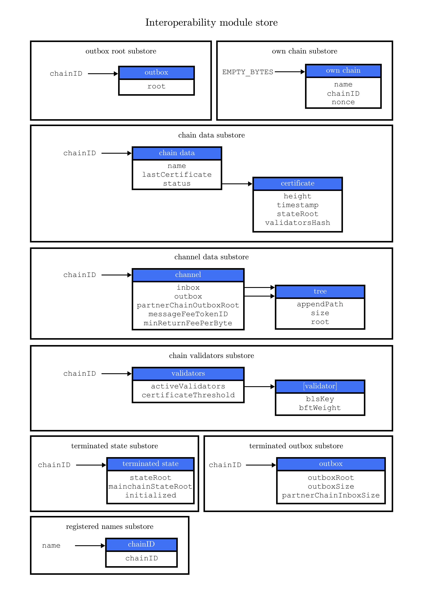

```
LIP: 0043
Title: Introduce chain registration mechanism
Author: Iker Alustiza <iker@lightcurve.io>
Discussions-To: https://research.lisk.com/t/chain-registration
Status: Draft
Type: Standards Track
Created: 2021-05-22
Updated: 2022-11-11
Requires: 0038, 0045, 0049, 0056
```

## Abstract

This LIP introduces the concept of chain registration in the Lisk ecosystem. The chain registration is a necessary step to make a sidechain interoperable with the Lisk mainchain. Specifically, for the Lisk mainchain, this LIP specifies a new command for the sidechain registration. This command creates a sidechain account in the Lisk mainchain with some specific properties given by the user submitting the transaction. Similarly for sidechains, this LIP specifies the mainchain registration command.

## Copyright

This LIP is licensed under the [Creative Commons Zero 1.0 Universal][creative].

## Motivation

The Lisk ecosystem is a permissionless network of blockchains where a sidechain following the standard protocol can interoperate with any other Lisk compatible chain. In particular, the Lisk mainchain serves as a central node or relayer for the entire ecosystem and every cross-chain interaction has to be sent through it. This implies there should exist a standardized protocol for the Lisk mainchain to maintain a _cross-chain channel_ to communicate with every sidechain.

The first step for establishing this _cross-chain channel_ protocol is the chain registration process, which can be thought of as the creation/opening of the channel between two chains. This process defines the data structures, and protocol rules that every chain needs to implement in the ecosystem if they want to interoperate with another specific chain.

For a general picture of the Lisk interoperability architecture, please refer to [LIP 0045][lip-0045].

## Rationale

In this LIP, the registration process introduced in the previous section is specified from the point of view of both the Lisk mainchain and sidechains. For the Lisk mainchain, this is done by the sidechain registration command, whereas for sidechains, it is done by the mainchain registration command.

### Sidechain Registration Process

As mentioned above, for a sidechain to be interoperable in the Lisk ecosystem, it has to be registered in the Lisk Mainchain via a sidechain registration command. A transaction with this command can be sent by any user account in the Lisk Mainchain with enough funds to pay the required fee. The processing of this command implies the creation of a _sidechain account_ in the mainchain state associated with a unique chain identifier and a name. This means that every new sidechain occupies a certain namespace in the ecosystem. Additionally, every newly registered sidechain can increase the size of every mainchain cross-chain update command posted on the sidechain (due to the increasing size of the [`outboxRootWitness`][lip-0053#outbox-root-witness] property of the command). For these two reasons, the minimum fee for this command has an added constant similar to the extra fee in a [delegate registration command][docs:delegate]. The value of this extra registration fee is `REGISTRATION_FEE` LSK.

Once the sidechain registration command is processed, the sidechain account status is set to _registered_. In this state, the cross-chain channel is still not active, so the users on the mainchain or other chains cannot send [cross-chain messages (CCMs)][lip-0049] to this sidechain yet. Moreover, the [liveness condition][lip-0045#liveness-condition] to maintain the channel is not enforced, this means that there is no specific time requirement for a sidechain to be activated on the mainchain, it can stay in the registered status for any period of time.  When a first valid cross-chain update command from this sidechain is processed, the sidechain status is changed to _active,_ making it active in the ecosystem. Now it is possible to send CCMs to the sidechain and the liveness condition is enforced.

#### Sidechain Structures on Mainchain

When a new sidechain is registered on the mainchain via a sidechain registration command, new data structures are inserted for the sidechain in the Lisk mainchain state. Specifically, a new entry is created in five different substores of the interoperability module store (see Figure 1): [outbox root substore][lip-0045#outbox-substore], [chain data substore][lip-0045#chain-substore], [channel data substore][lip-0045#channel-substore], [chain validators substore][lip-0045#validators-substore], and [registered names][lip-0045#names-substore]. The values of these entries are initialized as specified in [LIP 0045][lip-0045].



_Figure 1: A summary of the Interoperability module store: Each box represents a substore, where we indicate the `storeKey --> storeValue` relation. For the Lisk mainchain, the 'own chain' substore exists by default in the state whereas there is one entry per registered sidechain for five other substores (outbox root, chain data, channel data, chain validators, registered names) created by a sidechain registration command. For sidechains, the 'own chain' and one entry for the mainchain account for four other substores (outbox root, chain data, channel data, and chain validators) are created by the mainchain registration command._

#### Sidechain Registration Command

The sidechain registration command contains the following parameters used to connect a new sidechain in the ecosystem.

##### name

The `name` property sets the name of the sidechain as a string of characters. It has to be unique in the ecosystem and contain only characters from the set [a-z0-9!@$&_.].

##### chainID

The chain ID is a 4-byte constant set in the chain configuration. Chain IDs serve two purposes: (i) They are [prepended to the input of the signing function of every transaction, block, or message of the chain][lip-0037] to avoid transaction replays between different chains in the ecosystem;
(ii) they uniquely identify a chain in the Lisk ecosystem. In particular, in the Interoperability module, it serves a similar purpose for chains as [addresses][docs:address] do for user accounts, as it is used to identify the chain account in the Interoperability module store. Furthermore, the chain ID has to be stated in every cross-chain interaction. For example, it has to be specified in the `receivingChainID` property of a CCM to this sidechain and in the `sendingChainId` property of a cross-chain update command from this sidechain.

 The sidechain chain ID is given as a parameter in the sidechain registration command: If the given value is already taken by another sidechain, the sidechain registration command fails. In this case, the sidechain has to change the chain ID with a hardfork, and resubmit the sidechain registration command with a new value. The first byte should be set to the correct value [depending on the network on which the chain is running][lip-0037#chainID].

The chain ID is known to the mainchain as soon as the sidechain is registered, thus it can validate cross-chain update commands coming from the sidechain without further context.

##### sidechainValidators

This property defines the set of eligible [BLS public keys][lip-0038] with their respective [BFT weights][lip-0056] required to sign the first certificate from the sidechain.

##### sidechainCertificateThreshold

The `sidechainCertificateThreshold` property is an integer setting the required cumulative weight needed for a certificate signature from the sidechain to be valid.

### Mainchain Registration on a Sidechain

Once the sidechain has been registered on the mainchain, a similar registration process should happen in the sidechain before the interoperable channel is opened between the two chains. This is done by submitting a transaction with the mainchain registration command in the sidechain, which implies the creation of a _mainchain account_ in the sidechain state associated with the Lisk mainchain and other structures needed for interoperability. This mainchain account has a similar structure as the one depicted in Figure 1. By protocol, the chain ID of the mainchain is a constant equal to `CHAIN_ID_MAINCHAIN` in the ecosystem.

This mainchain registration process has to happen always after the sidechain registration on the mainchain since the sidechain has no prior knowledge of its name and must be certain that the correct chain ID has been registered. Similar to the sidechain registration case, the mainchain account status will not change to active until a valid cross-chain update command from the mainchain containing a valid [registration CCM][lip-0049] is processed.

#### Mainchain Registration Command

The mainchain registration command sets certain parameters in the sidechain related to the interoperability module and initializes the corresponding mainchain data structures. This command requires the approval of the sidechain validators. They have to agree on the content of this command and add their aggregated signatures accordingly. It is important that the sidechain validators make sure that they are signing the registration command with the right information from the mainchain, otherwise, the sidechain interoperable functionality may be unusable.

This command has no requirement for a minimum fee since it should be submitted only once in a sidechain and approved by a majority of validators. For this reason, a transaction with this command should be treated differently in terms of priority in case it is included in a sidechain node’s transaction pool. The recommendation is that, once the transaction is properly signed by the validators and ready to be submitted, a validator simply includes it in its next forged block without including it in the transaction pool. The command has the following parameters:

##### ownChainID

The chain ID set on the mainchain after processing the corresponding sidechain registration command.

##### ownName

The `ownName` property sets the name of the sidechain in its own state according to the name given in the mainchain.

##### mainchainValidators

Similar to the `sidechainValidators` property in the sidechain registration command, it defines the set of mainchain validators with their respective BFT weight expected to sign the first certificate from the mainchain.

##### mainchainCertificateThreshold

Similar to the `sidechainCertificateThreshold` property in the sidechain registration command, the `mainchainCertificateThreshold` property is an integer setting the required cumulative weight needed for a certificate signature from the mainchain to be valid.

##### signature

The `signature` property is an aggregated signature of the sidechain validators. It ensures that the sidechain validators agree on registering the mainchain in the sidechain.

##### aggregationBits

The `aggregationBits` property is a bit vector used to validate the aggregated signature.

## Specification

### Notation and Constants

All interoperability constants are defined in [LIP 0045][lip-0045#constants].

#### Functions from Other Modules

In this LIP, we use the function `computeValidatorsHash` defined in [LIP 0058][lip-0058#computevalidatorshash] and the function `getValidatorParams` from [LIP 0044][lip-0044#getvalidatorparams].

### Commands

#### Sidechain Registration Command

Transactions executing this command have:

* `module = MODULE_NAME_INTEROPERABILITY`,
* `command = COMMAND_SIDECHAIN_REG`.

##### Parameters

```java
sidechainRegParams = {
    "type": "object",
    "required": [
        "name",
        "chainID",
        "sidechainValidators",
        "sidechainCertificateThreshold"
    ],
    "properties": {
        "name": {
            "dataType": "string",
            "minLength": MIN_CHAIN_NAME_LENGTH,
            "maxLength": MAX_CHAIN_NAME_LENGTH,
            "fieldNumber": 1
        },
        "chainID": {
            "dataType": "bytes",
            "length": CHAIN_ID_LENGTH,
            "fieldNumber": 2
        },
        "sidechainValidators": {
            "type": "array",
            "fieldNumber": 3,
            "items": {
                "type": "object",
                "required": ["blsKey", "bftWeight"],
                "properties": {
                    "blsKey": {
                        "dataType": "bytes",
                        "length": BLS_PUBLIC_KEY_LENGTH,
                        "fieldNumber": 1
                    },
                    "bftWeight": {
                        "dataType": "uint64",
                        "fieldNumber": 2
                    }
                }
            }
        },
        "sidechainCertificateThreshold": {
            "dataType": "uint64",
            "fieldNumber": 4
        }
    }
}
```

##### Verification

```python
def verify(trs: Transaction) -> None:
    # The name property has to contain only characters from the set [a-z0-9!@$&_.].
    if not re.match(r"^[a-z0-9!@$&_.]+$", trs.params.name):
        raise Exception("Invalid name property. It should contain only characters from the set [a-z0-9!@$&_.].")
    # The name property has to be unique with respect to the set of already registered sidechain names.
    if there exists an entry in the registered names substore with store key equal to trs.params.name.encode("utf-8"):
        raise Exception("Name already registered.")

    # Chain ID has to be unique with respect to the set of already registered sidechains.
    if there exists an entry in the chain data substore with store key equal to trs.params.chainID:
        raise Exception("Chain ID already registered.")

    # Check that the first byte of the chainID, indication the network, matches.
    if trs.params.chainID[0] != CHAIN_ID_MAINCHAIN[0]:
        raise Exception("Chain ID does not match the mainchain network.")

    # Chain ID cannot be the mainchain chain ID.
    if trs.params.chainID == CHAIN_ID_MAINCHAIN:
        raise Exception("Chain ID cannot be the mainchain chain ID.")

    # sidechainValidators must have at least 1 element and at most MAX_NUM_VALIDATORS elements.
    if len(trs.params.sidechainValidators) < 1 or len(trs.params.sidechainValidators) > MAX_NUM_VALIDATORS:
        raise Exception(f"Invalid sidechainValidators array. It must have at least 1 element and at most {MAX_NUM_VALIDATORS} elements.")

    validatorKeys = [validator.blsKey for validator in trs.params.sidechainValidators]
    # All validator keys must be distinct.
    if len(validatorKeys) != len(set(validatorKeys)):
        raise Exception("Duplicate BLS keys.")

    # Validator keys must be in lexicographic order.
    if not all(validatorKeys[i] < validatorKeys[i + 1] for i in range(len(validatorKeys) - 1)):
        raise Exception("Validator keys are not in lexicographic order.")

    totalWeight = 0
    for validator in trs.params.sidechainValidators:
        # The bftWeight property of each element is a positive integer.
        if validator.bftWeight == 0:
            raise Exception("Invalid bftWeight property.")
        totalWeight += validator.bftWeight
    # Total BFT weight has to be less than or equal to MAX_UINT64.
    if totalWeight > MAX_UINT64:
        raise Exception("Total BFT weight exceeds maximum value.")

    # The range of valid values of the sidechainCertificateThreshold property is given by the total sum of the validators weights:
    # Minimum value: floor(1/3 * total BFT weight) + 1.
    # Maximum value = total BFT weight.
    if trs.params.sidechainCertificateThreshold < totalWeight//3 + 1:
        raise Exception("Certificate threshold is too small.")
    if trs.params.sidechainCertificateThreshold > totalWeight:
        raise Exception("Certificate threshold is too large.")

    # Transaction fee has to be greater or equal than the registration fee.
    if trs.fee < REGISTRATION_FEE:
        raise Exception("Insufficient transaction fee.")
```

##### Execution

```python
def execute(trs: Transaction) -> None:
    senderAddress = sha256(trs.senderPublicKey)[:ADDRESS_LENGTH]

    # Create chain account.
    sidechainAccount = {
        "name": trs.params.name,
        "lastCertificate": {
            "height": 0,
            "timestamp": 0,
            "stateRoot": EMPTY_HASH,
            "validatorsHash": computeValidatorsHash(trs.params.sidechainValidators, trs.params.sidechainCertificateThreshold)
        },
        "status": CHAIN_STATUS_REGISTERED
    }

    chainID = trs.params.chainID
    create an entry in the chain data substore with
        storeKey = chainID,
        storeValue = encode(chainDataSchema, sidechainAccount)

    # Create channel.
    sidechainChannel = {
        "inbox": {
            "appendPath": [],
            "size": 0,
            "root": EMPTY_HASH
        },
        "outbox": {
            "appendPath": [],
            "size": 0,
            "root": EMPTY_HASH
        },
        "partnerChainOutboxRoot": EMPTY_HASH,
        "messageFeeTokenID": TOKEN_ID_LSK
    }
    create an entry in the channel data substore with
        storeKey = chainID
        storeValue = encode(channelDataSchema, sidechainChannel)

    # Create validators account.
    sidechainValidators = {
        "activeValidators": trs.params.sidechainValidators,
        "certificateThreshold": trs.params.sidechainCertificateThreshold
    }
    create an entry in the chain validators data substore with
        storeKey = chainID
        storeValue = encode(chainValidatorsSchema, sidechainValidators)

    # Create outbox root entry.
    create an entry in the outbox root substore with
        storeKey = chainID
        storeValue = encode(outboxRootSchema, {"root": sidechainChannel.outbox.root})

    # Create registered names entry.
    create an entry in the registered names substore with
        storeKey = trs.params.name
        storeValue = encode(registeredNamesSchema, {"chainID": chainID})

    # Pay the registration fee.
    Fee.payFee(REGISTRATION_FEE)

    # Emit chain account updated event.
    emitEvent(
        module = MODULE_NAME_INTEROPERABILITY,
        name = EVENT_NAME_CHAIN_ACCOUNT_UPDATED,
        data = sidechainAccount,
        topics = [chainID]
    )

    # Send registration CCM to the sidechain.
    # We do not call sendInternal because it would fail as
    # the receiving chain is not active yet.
    registrationCCMParams = {
        "name": trs.params.name,
        "chainID": chainID,
        "messageFeeTokenID": sidechainChannel.messageFeeTokenID
    }

    ccm = {
        "nonce": ownChainAccount.nonce,
        "module": MODULE_NAME_INTEROPERABILITY,
        "crossChainCommand": CROSS_CHAIN_COMMAND_REGISTRATION,
        "sendingChainID": ownChainAccount.chainID,
        "receivingChainID": chainID,
        "fee": 0,
        "status": CCM_STATUS_CODE_OK,
        "params": encode(registrationCCMParamsSchema, registrationCCMParams) # registrationCCMParamsSchema is defined in LIP0049
    }

    addToOutbox(chainID, ccm)
    ownChainAccount.nonce += 1

    # Emit CCM Sent Event.
    ccmID = sha256(encode(crossChainMessageSchema, ccm))
    emitEvent(
        module = MODULE_NAME_INTEROPERABILITY,
        name = EVENT_NAME_CCM_SENT_SUCCESS,
        data = {"ccmID": ccmID},
        topics = [ccm.sendingChainID, ccm.receivingChainID, ccmID]
    )
```

#### Mainchain Registration Command

Transactions executing this command have:

* `module = MODULE_NAME_INTEROPERABILITY`,
* `command = COMMAND_MAINCHAIN_REG`.

##### Parameters

```java
mainchainRegParams = {
    "type": "object",
    "required": [
        "ownChainID",
        "ownName",
        "mainchainValidators",
        "signature",
        "aggregationBits"
    ],
    "properties": {
        "ownChainID": {
            "dataType": "bytes",
            "length": CHAIN_ID_LENGTH,
            "fieldNumber": 1
        },
        "ownName": {
            "dataType": "string",
            "minLength": MIN_CHAIN_NAME_LENGTH,
            "maxLength": MAX_CHAIN_NAME_LENGTH,
            "fieldNumber": 2
        },
        "mainchainValidators": {
            "type": "array",
            "fieldNumber": 3,
            "items": {
                "type": "object",
                "required": ["blsKey", "bftWeight"],
                "properties": {
                    "blsKey": {
                        "dataType": "bytes",
                        "length": BLS_PUBLIC_KEY_LENGTH,
                        "fieldNumber": 1
                    },
                    "bftWeight": {
                        "dataType": "uint64",
                        "fieldNumber": 2
                    }
                }
            }
        },
        "mainchainCertificateThreshold": {
            "dataType": "uint64",
            "fieldNumber": 4
        },
        "signature": {
            "dataType": "bytes",
            "length": BLS_SIGNATURE_LENGTH,
            "fieldNumber": 5
        },
        "aggregationBits": {
            "dataType": "bytes",
            "fieldNumber": 6
        }
    }
}
```

##### Verification

```python
def verify(trs: Transaction) -> None:
    # The ownChainID property has to match with the chain identifier.
    if trs.params.ownChainID != OWN_CHAIN_ID:
        raise Exception("Invalid ownChainID property.")

    # The ownName property has to contain only characters from the set [a-z0-9!@$&_.].
    if not re.match(r"^[a-z0-9!@$&_.]+$", trs.params.ownName):
        raise Exception("Invalid ownName property. It should contain only characters from the set [a-z0-9!@$&_.].")

    # mainchainValidators must have exactly MAINCHAIN_NUMBER_ACTIVE_VALIDATORS elements.
    if len(trs.params.mainchainValidators) != MAINCHAIN_NUMBER_ACTIVE_VALIDATORS:
        raise Exception(f"Invalid mainchainValidators property. It must have exactly {MAINCHAIN_NUMBER_ACTIVE_VALIDATORS} elements.")

    validatorKeys = [validator.blsKey for validator in trs.params.mainchainValidators]
    # All validator keys must be distinct.
    if len(validatorKeys) != len(set(validatorKeys)):
        raise Exception("Duplicate BLS keys.")

    # Validator keys must be in lexicographic order.
    if not all(validatorKeys[i] < validatorKeys[i + 1] for i in range(len(validatorKeys) - 1)):
        raise Exception("Validator keys are not in lexicographic order.")

    for validator in trs.params.mainchainValidators:
        # The bftWeight property of each element must be positive.
        if validator.bftWeight == 0:
            raise Exception("Invalid bftWeight property.")
    
    # The range of valid values of the mainchainCertificateThreshold property is given by the total sum of the validators weights:
    # Minimum value: floor(1/3 * total BFT weight) + 1.
    # Maximum value = total BFT weight.
    if trs.params.mainchainCertificateThreshold < totalWeight//3 + 1:
        raise Exception("Certificate threshold is too small.")
    if trs.params.mainchainCertificateThreshold > totalWeight:
        raise Exception("Certificate threshold is too large.")
```

##### Execution

```python
def execute(trs: Transaction) -> None:
    # Check signature property.
    sidechainValidators = sorted([(validator.blsKey, validator.bftWeight) for validator in Validators.getValidatorParams().validators], key = lambda v: v.blsKey)
    blsKeys = [params[0] for params in sidechainValidators]
    bftWeights = [params[1] for params in sidechainValidators]
    certificateThreshold = Validators.getValidatorParams().certificateThreshold

    registrationSignatureMessageSchema = {  
        "type": "object",
        "required": ["ownChainID", "ownName", "mainchainValidators", "mainchainCertificateThreshold"],
        "properties": {
            "ownChainID": {
                "dataType": "bytes",
                "length": CHAIN_ID_LENGTH,
                "fieldNumber": 1
            },
            "ownName": {
                "dataType": "string",
                "minLength": MIN_CHAIN_NAME_LENGTH,
                "maxLength": MAX_CHAIN_NAME_LENGTH,
                "fieldNumber": 2
            },
            "mainchainValidators": {
                "type": "array",
                "fieldNumber": 3,
                "items": {
                    "type": "object",
                    "required": ["blsKey", "bftWeight"],
                    "properties": {
                        "blsKey": {
                            "dataType": "bytes",
                            "length": BLS_PUBLIC_KEY_LENGTH,
                            "fieldNumber": 1
                        },
                        "bftWeight": {
                            "dataType": "uint64",
                            "fieldNumber": 2
                        }
                    }
                }
            },
            "mainchainCertificateThreshold": {
                "dataType": "uint64",
                "fieldNumber": 4
            },
        }
    }

    message = encode(registrationSignatureMessageSchema,
        {
            "ownChainID": trs.params.ownChainID,
            "ownName": trs.params.ownName,
            "mainchainValidators": trs.params.mainchainValidators,
            "mainchainCertificateThreshold": trs.params.mainchainCertificateThreshold
        }
    )

    # verifyWeightedAggSig is specified in LIP 0062.
    if verifyWeightedAggSig(blsKeys, trs.params.aggregationBits, trs.params.signature, MESSAGE_TAG_CHAIN_REG, trs.params.ownChainID, bftWeights, certificateThreshold, message) == False:
        emitPersistentEvent(
            module = MODULE_NAME_INTEROPERABILITY,
            name = EVENT_NAME_INVALID_REGISTRATION_SIGNATURE,
            data = {},
            topics = [trs.params.ownChainID]
        raise Exception("Invalid signature property.")

    # Create chain account.
    mainchainAccount = {
        "name": CHAIN_NAME_MAINCHAIN,
        "lastCertificate": {
            "height": 0,
            "timestamp": 0,
            "stateRoot": EMPTY_HASH,
            "validatorsHash": computeValidatorsHash(trs.params.mainchainValidators, trs.params.mainchainCertificateThreshold)
        },
        "status": CHAIN_STATUS_REGISTERED
    }
    create an entry in the chain data substore with
        storeKey = CHAIN_ID_MAINCHAIN
        storeValue = encode(chainDataSchema, mainchainAccount)

    # Create channel.
    mainchainChannel = {
        "inbox": {
            "appendPath": [],
            "size": 0,
            "root": EMPTY_HASH
        },
        "outbox": {
            "appendPath": [],
            "size": 0,
            "root": EMPTY_HASH
        },
        "partnerChainOutboxRoot": EMPTY_HASH,
        "messageFeeTokenID": TOKEN_ID_LSK
    }
    create an entry in the channel data substore with
        storeKey = CHAIN_ID_MAINCHAIN
        storeValue = encode(channelDataSchema, mainchainChannel)

    # Create validators account.
    mainchainValidators = {
        "activeValidators": trs.params.mainchainValidators,
        "certificateThreshold": trs.params.mainchainCertificateThreshold
    }
    create an entry in the chain validators data substore with
        storeKey = CHAIN_ID_MAINCHAIN
        storeValue = encode(chainValidatorsSchema, mainchainValidators)

    # Create outbox root entry.
    create an entry in the outbox root substore with
        storeKey = CHAIN_ID_MAINCHAIN
        storeValue = encode(outboxRootSchema, {"root": mainchainChannel.outbox.root})

    # Create own chain account.
    ownChainAccount = {
        "name": trs.params.ownName,
        "chainID": trs.params.ownChainID,
        "nonce": 0
    }
    create an entry in the own chain data substore with
        storeKey = EMPTY_BYTES
        storeValue = encode(ownChainAccountSchema, ownChainAccount)

    # Emit chain account updated event.
    emitEvent(
        module = MODULE_NAME_INTEROPERABILITY,
        name = EVENT_NAME_CHAIN_ACCOUNT_UPDATED,
        data = mainchainAccount,
        topics = [CHAIN_ID_MAINCHAIN]
    )

    # Send registration CCM to the mainchain.
    # Notice that we do not use the send function because the channel
    # has not been activated yet.
    registrationCCMParams = {
        "name": CHAIN_NAME_MAINCHAIN,
        "chainID": CHAIN_ID_MAINCHAIN,
        "messageFeeTokenID": mainchainChannel.messageFeeTokenID
    }

    ccm = {
        "nonce": ownChainAccount.nonce,
        "module": MODULE_NAME_INTEROPERABILITY,
        "crossChainCommand": CROSS_CHAIN_COMMAND_REGISTRATION,
        "sendingChainID": ownChainAccount.chainID,
        "receivingChainID": CHAIN_ID_MAINCHAIN,
        "fee": 0,
        "status": CCM_STATUS_CODE_OK,
        "params": encode(registrationCCMParamsSchema, registrationCCMParams) # registrationCCMParamsSchema is defined in LIP0049
    }

    addToOutbox(CHAIN_ID_MAINCHAIN, ccm)
    ownChainAccount.nonce += 1

    # Emit CCM Sent Event.
    ccmID = sha256(encode(crossChainMessageSchema, ccm))
    emitEvent(
        module = MODULE_NAME_INTEROPERABILITY,
        name = EVENT_NAME_CCM_SENT_SUCCESS,
        data = {"ccmID": ccmID},
        topics = [ccm.sendingChainID, ccm.receivingChainID, ccmID]
    )
```

## Backwards Compatibility

This proposal, together with [LIP 0045][lip-0045], [LIP 0053][lip-0053], [LIP 0049][lip-0049], and [LIP 0054][lip-0054], is part of the Interoperability module. Chains adding this module will need to do so with a hardfork.

## Reference Implementation

TBA

[creative]: https://creativecommons.org/publicdomain/zero/1.0/
[docs:address]: https://lisk.com/documentation/lisk-sdk/protocol/accounts.html#address
[docs:delegate]: https://lisk.com/documentation/lisk-sdk/protocol/transactions.html#delegate
[docs:nonces]: https://lisk.com/documentation/lisk-sdk/protocol/transactions.html#nonce
[lip-0009]: https://github.com/LiskHQ/lips/blob/main/proposals/lip-0009.md
[lip-0009#rationale]: https://github.com/LiskHQ/lips/blob/main/proposals/lip-0009.md#rationale
[lip-0027]: https://github.com/LiskHQ/lips/blob/main/proposals/lip-0027.md
[lip-0034]: https://github.com/LiskHQ/lips/blob/main/proposals/lip-0034.md
[lip-0037]: https://github.com/LiskHQ/lips/blob/main/proposals/lip-0037.md
[lip-0037#chainID]: https://github.com/LiskHQ/lips/blob/main/proposals/lip-0037.md#chain-identifiers-1
[lip-0038]: https://github.com/LiskHQ/lips/blob/main/proposals/lip-0038.md
[lip-0044#getvalidatorparams]: https://github.com/LiskHQ/lips/blob/main/proposals/lip-0044.md#getvalidatorparams
[lip-0045]: https://github.com/LiskHQ/lips/blob/main/proposals/lip-0045.md
[lip-0045#chain-substore]: https://github.com/LiskHQ/lips/blob/main/proposals/lip-0045.md#chain-data-substore
[lip-0045#channel-substore]: https://github.com/LiskHQ/lips/blob/main/proposals/lip-0045.md#channel-data-substore
[lip-0045#liveness-condition]: https://github.com/LiskHQ/lips/blob/main/proposals/lip-0045.md#liveness-condition
[lip-0045#constants]: https://github.com/LiskHQ/lips/blob/main/proposals/lip-0045.md#notation-and-constants
[lip-0045#names-substore]: https://github.com/LiskHQ/lips/blob/main/proposals/lip-0045.md#registered-names-substore
[lip-0045#outbox-substore]: https://github.com/LiskHQ/lips/blob/main/proposals/lip-0049.md#outbox-root-substore
[lip-0045#validators-substore]: https://github.com/LiskHQ/lips/blob/main/proposals/lip-0045.md#chain-validators-substore
[lip-0049]: https://github.com/LiskHQ/lips/blob/main/proposals/lip-0049.md
[lip-0049#registration-message]: https://github.com/LiskHQ/lips/blob/main/proposals/lip-0049.md#registration-message-1
[lip-0053]: https://github.com/LiskHQ/lips/blob/main/proposals/lip-0053.md
[lip-0053#outbox-root-witness]: https://github.com/LiskHQ/lips/blob/main/proposals/lip-0053.md#outboxrootwitness
[lip-0054]: https://github.com/LiskHQ/lips/blob/main/proposals/lip-0054.md
[lip-0056]: https://github.com/LiskHQ/lips/blob/main/proposals/lip-0056.md
[lip-0058#computevalidatorshash]: https://github.com/LiskHQ/lips/blob/main/proposals/lip-0058.md#computevalidatorshash

