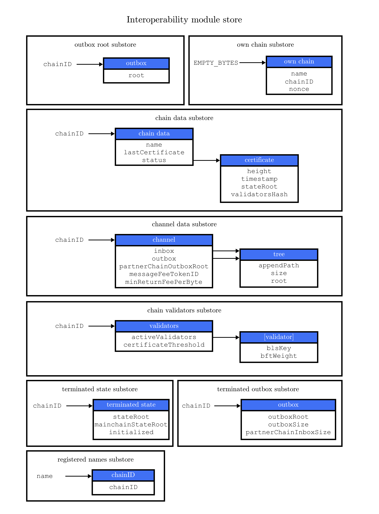

```
LIP: 0045
Title: Introduce Interoperability module
Author: Alessandro Ricottone <alessandro.ricottone@lightcurve.io>
        Mitsuaki Uchimoto <mitsuaki.uchimoto@lightcurve.io>
Discussions-To: https://research.lisk.com/t/introduce-interoperability-module/290
Status: Draft
Type: Standards Track
Created: 2021-05-21
Updated: 2023-02-17
Requires: 0043, 0049, 0053, 0054
```

## Abstract

The Interoperability module provides basic functionalities to transmit information between interoperable chains in the Lisk ecosystem using cross-chain messages. In this LIP the properties, serialization, and initial values of this module are specified. Additionally, this LIP also provides a broad overview of the Lisk interoperability solution, motivating several design choices and presenting the new commands that are part of the Interoperability module.

## Copyright

This LIP is licensed under the [Creative Commons Zero 1.0 Universal](https://creativecommons.org/publicdomain/zero/1.0/).

## Motivation

Interoperability has the potential to solve the scaling issue of blockchains: Instead of deploying applications and their corresponding commands onto a single blockchain, these are implemented into separate blockchains which then communicate with each other using an interoperability protocol.

To achieve interoperability, chains in the Lisk ecosystem (the mainchain and the sidechains participating in interoperability) exchange information via _cross-chain transactions_. As an example, a user can issue a cross-chain transaction to transfer part of their mainchain LSK balance to a sidechain, and subsequently use it to issue one of the sidechain commands.

In the Lisk protocol, cross-chain transactions are special in that, after being included in their origin ledger, some new data structures, the _cross-chain messages_ (CCMs), are created, which are transmitted to other chains via special commands called _cross-chain update_ (CCU) commands. CCUs also contain information about the chain, in the form of a _certificate_.
In the receiving chain, CCMs trigger the execution of _cross-chain commands_, in a way similar to how transactions trigger the execution of regular commands.

One of the main motivations for proposing a [certificate-based communication](https://lisk.com/blog/research/introduction-blockchain-interoperability) between chains is the ability for all chains in the ecosystem to remain state machines. This means that all information needed to validate and advance a chain to the next block is present on the chain itself.  In the Lisk interoperability solution, the only information that needs social consensus is information about the initial validators of the other chain. On the mainchain, this information is received via the sidechain registration command; on sidechains, in a similar way, via the mainchain registration command.

The Interoperability module provides the data structures and functionalities necessary for interoperability between chains of the Lisk ecosystem. In this LIP, we specify the properties, serialization, and initial values of the Interoperability module.

## Rationale

### Interoperability Commands

The Interoperability module stores the properties necessary to validate and process the following new commands.

#### [Sidechain Registration Command][lip-0043]

The sidechain registration command is used to register a sidechain on the Lisk mainchain. When this command is processed, a new account for the sidechain is created in the mainchain state under the interoperability store. The account is initialized with an empty inbox and outbox, while the sidechain name and the initial validators set are given in the command parameters. The chain ID, used as store key, is also given in the command parameters.

#### [Mainchain Registration Command][lip-0043]

The mainchain registration command is used to register the Lisk mainchain on a sidechain. When this command is processed, a new account for the mainchain is created in the sidechain state under the interoperability store. The account is initialized with an empty inbox and outbox, while the initial validators set is given in the command parameters. The name and chain ID of the mainchain are global protocol constants in the whole ecosystem.

This command also initializes another data structure in the interoperability store, containing some information about the sidechain itself. In particular, it sets the sidechain name and chain ID to the ones that have been previously registered on the mainchain via the sidechain registration command.

#### [Cross-Chain Update Commands][lip-0053]


_Figure 1: A sketch of an interoperability interaction between the Lisk mainchain and a sidechain. Information (cross-chain messages and updated state) from mainchain blocks (light blue) is collected into a cross-chain update command by the relayer, which then posts it on the sidechain._

CCUs are used to post the updated state of the sending chain on the receiving chain. Furthermore, they transmit the cross-chain messages that need to be sent to the receiving chain (see Figure 1). We introduce two different CCUs, one for posting on the Lisk mainchain, and the other for posting on sidechains. They differ in the way the included messages are handled: on the mainchain, messages targeting another sidechain are forwarded to that sidechain outbox, while messages targeting the mainchain are simply processed. On the other hand, a CCU posted on a sidechain can only contain CCMs targeting that sidechain, being invalid otherwise.


#### [State Recovery Command][lip-0054]

This command is used to recover a certain state (for example fungible and non-fungible tokens) from a sidechain that has been terminated. The user proves the existence of an entry in the terminated state substore with an inclusion proof. The proof is validated against the current state root stored in the terminated chain account. The recovery of the state is then handled by the relevant module (for example the token module would refund the user).

#### [Message Recovery Command][lip-0054]

This command is used to recover a pending message from the outbox of a terminated chain. The user proves with an inclusion proof that the message is in the terminated sidechain outbox. The proof is validated against the outbox root stored in the terminated outbox account. The recovered message is then bounced back to the original sending chain or processed directly (if the sending chain is the mainchain).

#### [Liveness Termination Command][lip-0054]

This command is used to terminate a sidechain that has been inactive for too long. The timestamp of the last certificate provided by the sidechain is checked against the current timestamp. If the difference is greater than the maximum allowed timespan, the sidechain is terminated. This command can only be submitted on the mainchain.

#### [State Recovery Initialization Command][lip-0054]

This command is used to initialize a terminated state account on a sidechain. The user proves with an inclusion proof that the target chain state on the mainchain implies that that chain is terminated (either the status is set to 'terminated' or the liveness condition is violated). Once the terminated state account has been initialized, the state recovery command can be issued in the sidechain.

#### [Message Recovery Initialization Command][lip-0054]

This command is used to initialize a terminated outbox account and can only be issued after the corresponding terminated state account has been created. This command contains the chain account of the current chain as stored in the state of the terminated chain and an inclusion proof for it against the state root stored in the corresponding terminated state account. Once the terminated outbox account has been initialized, the message recovery command can be issued.

### Liveness Condition

Active sidechains are required to prove their liveness to the mainchain at least once every 30 days. This is done by including a CCU with non-empty certificate on the mainchain. If a sidechain does not post such a CCU within 30 days, the sidechain account is terminated. This rule guarantees that users do not send funds to inactive sidechains and that users who have tokens in a sidechain which stops communicating with the ecosystem can recover their tokens.

There are extra requirements for the first CCU posted on the mainchain: It must contain a non-empty `certificate` which follows the schema defined in [LIP 0061][lip-0061#certificate-schema]; furthermore, if this first CCU also contains a non-empty `inboxUpdate`, the certificate is only valid if it allows the sidechain account to remain live for a reasonable amount of time.

### Life Cycle of a Sidechain

The life cycle of a sidechain can be split into 3 parts, corresponding to the 3 values of the account status property: ''registered'', ''active'', and ''terminated''.

A sidechain registers on the mainchain with a [sidechain registration command][lip-0043]. This command creates the sidechain account on the mainchain. In particular, it creates an entry in the chain data substore, with initial status set to 'registered'; an entry in the channel data substore, with empty inbox and outbox; and an entry in the validators data substore, holding the initial sidechain validators set. Thereafter, the mainchain account is similarly created on a sidechain with a [mainchain registration command][lip-0043].

After a sidechain has been registered on the mainchain, it cannot receive any cross-chain message and does not need to follow the liveness rule, until the first sidechain CCU containing cross-chain messages has been included in the mainchain. At this point, the status of the sidechain account on the mainchain is updated to ''active'' and the liveness condition is enforced.

If no CCU with non-empty certificate is received within 30 days, the [chain account is terminated](#terminateChain) and no more CCMs can be sent to or received from the sidechain. A sidechain account can also be terminated if the sidechain posts a CCU containing a CCM with an invalid schema or with an invalid sending chain ID. A message targeting a terminated chain is bounced on the mainchain instead of being forwarded. When this happens, a ''terminated sidechain'' message is emitted by the mainchain, targeting the original sending chain. When this message is processed, the chain is also terminated in the sending chain, blocking future messages.

When a chain is terminated, a 'terminated state' account is created, storing the last certified state root of the terminated chain. Then, users can recover tokens from the terminated sidechain with a state recovery command or proceed with the message recovery initialization command to kick-off the recovery of pending cross-chain messages.

### Properties of the Interoperability Module

Each interoperable sidechain maintains a chain account, channel, and the chain validators for the mainchain, while the mainchain maintains these data structures for each registered sidechain. Correspondingly, on a sidechain we denote with ''partner chain'' the mainchain, while on the mainchain we denote with ''partner chain'' the relevant sidechain.

Each chain also includes an account storing the chain name and ID in the ecosystem as well as the current chain nonce. This ''own chain'' account is present by default in the mainchain, while on a sidechain is created by the mainchain registration command.



_Figure 2: A summary of the Interoperability module store: Each box represents a substore, where we indicate the `storeKey --> storeValue` relation. The Interoperability module defines 7 substores on a sidechain: the outbox substore for outbox roots, the chain data substore for partner chain accounts and the own chain data substore for the own chain account, the channel data substore keeping track of the inbox and outbox, the validators data substore storing the partner-chain validators set, and the terminated state and terminated outbox substores to allow for recovery commands. The name substore, keeping track of the names of registered sidechains, is present only on the mainchain._

### Message Forwarding and the Role of the Lisk Mainchain

In the Lisk ecosystem, the Lisk mainchain plays a central role, distinct from any other chain. It acts as an intermediary chain, [relaying cross-chain messages between sidechains][lip-0053]. This has a few notable advantages:

1. Relayers (users that post the CCU transaction) only need to follow the chosen sidechain and the mainchain. All CCMs sent to a given chain will go through the sidechain outbox on the mainchain.
2. The mainchain guarantees that messages are available and can be delivered to active sidechains. In the case in which the receiving sidechain is not active, the messages are returned to their sending chain. This allows the sidechain protocol to remain simple and agnostic to the state of other sidechains. In particular, transaction handling does not require knowledge of all potential receiving chains.

### Inbox and Outbox

Inbox and outbox are organized as regular Merkle trees. Since the root of the tree depends on the order of insertion, all cross-chain messages have to be inserted in the receiving chain in the same order in which they were included in the sending chain, guaranteeing that they are processed in the correct order.

Using a Merkle tree also guarantees that the number of sibling hashes that are part of inclusion proofs grows only logarithmically with the number of elements in the tree. In particular, this means that the number of sibling hashes required to validate the cross-chain messages in a CCU against the partner chain `lastCertificate.stateRoot` grows logarithmically with the number of processed messages.

#### Storage of the Outbox Root

The outbox root property is duplicated and additionally stored separately from all other properties of the chain account. The substore prefix of the outbox root is the constant `SUBSTORE_PREFIX_OUTBOX_ROOT` and the store key is the chain ID of the partner chain. Storing the outbox root with a different substore prefix allows to separate the subtree corresponding to the outbox roots from the rest of the data in the interoperability store. This choice allows for shorter inclusion proofs for the outbox root, as the other properties of the Interoperability module are not needed to recalculate the state root if the outbox root is known. In particular, the inclusion proof contained in a CCU from a sidechain posted on the mainchain will contain only one hash.

### Storage of Auxiliary Data

In order to process sidechain registration commands more efficiently, it is convenient to store on the mainchain the names already registered in the ecosystem to quickly check the uniqueness of the sidechain name.  

## Specification

In this section, we specify the substores that are part of the Interoperability module store and the functions exposed to other modules. The Interoperability module has module name `MODULE_NAME_INTEROPERABILITY` (see the [table below](#Notation-and-Constants)).

### Notation and Constants

| Name | Type | Value | Description |
|------|------|-------|-------------|
| **Interoperability Constants** | | | |
| `MODULE_NAME_INTEROPERABILITY` | string | "interoperability" | Name of the Interoperability module. |
| `CHAIN_NAME_MAINCHAIN` | string | "lisk_mainchain" | Name of the Lisk mainchain. |
| `NUMBER_ACTIVE_VALIDATORS_MAINCHAIN` | uint32 | 101 | The maximum number of mainchain validators. |
| **Interoperability Store** | | | |
| `STORE_PREFIX_INTEROPERABILITY` | bytes | 0x83ed0d25 | Prefix of the interoperability store. |
| `SUBSTORE_PREFIX_OUTBOX_ROOT` | bytes | 0x0000 | Substore prefix of the outbox root substore. |
| `SUBSTORE_PREFIX_CHAIN_DATA` | bytes | 0x8000 | Substore prefix of the chain data substore. |
| `SUBSTORE_PREFIX_OWN_CHAIN_DATA` | bytes | 0xb000 | Substore prefix of the own chain data substore. |
| `SUBSTORE_PREFIX_CHANNEL_DATA` | bytes | 0xa000 | Substore prefix of the channel data substore. |
| `SUBSTORE_PREFIX_CHAIN_VALIDATORS` | bytes | 0x9000 | Substore prefix of the chain validators substore. |
| `SUBSTORE_PREFIX_TERMINATED_STATE` | bytes | 0xc000 | Substore prefix of the terminated state substore. |
| `SUBSTORE_PREFIX_TERMINATED_OUTBOX` | bytes | 0xd000 | Substore prefix of the terminated outbox substore. |
| `SUBSTORE_PREFIX_REGISTERED_NAMES` | bytes | 0xe000 | Substore prefix of the chain names substore. |
| **Interoperability Commands** | | | |
| `COMMAND_SIDECHAIN_REG` | string | "registerSidechain" | Name of sidechain registration command. |
| `COMMAND_MAINCHAIN_REG` | string | "registerMainchain" | Name of mainchain registration command. |
| `COMMAND_SIDECHAIN_CCU` | string | "submitSidechainCrossChainUpdate" | Name of sidechain cross-chain update command. |
| `COMMAND_MAINCHAIN_CCU` | string | "submitMainchainCrossChainUpdate" | Name of mainchain cross-chain update command. |
| `COMMAND_STATE_RECOVERY` | string | "recoverState" | Name of state recovery initialization command. |
| `COMMAND_MESSAGE_RECOVERY` | string | "recoverMessage" | Name of message recovery command. |
| `COMMAND_LIVENESS_TERMINATION` | string | "terminateSidechainForLiveness" | Name of liveness termination command. |
| `COMMAND_STATE_RECOVERY_INITIALIZATION` | string | "initializeStateRecovery" | Name of message recovery initialization command. |
| `COMMAND_MESSAGE_RECOVERY_INITIALIZATION` | string | "initializeMessageRecovery" | Name of initiate recovery command. |
| **Interoperability Cross-chain Commands** | | | |
| `CROSS_CHAIN_COMMAND_REGISTRATION` | string | "registration" | Name of chain registration cross-chain command. |
| `CROSS_CHAIN_COMMAND_CHANNEL_TERMINATED` | string | "channelTerminated" | Name of channel terminated cross-chain command. |
| `CROSS_CHAIN_COMMAND_SIDECHAIN_STATUS_TERMINATED` | string | "sidechainStatusTerminated" | Name of sidechain terminated cross-chain command. |
| **Event Names** | | | |
| `EVENT_NAME_INVALID_REGISTRATION_SIGNATURE` | string | "invalidRegistrationSignature" | Name of the invalid registration signature event. |
| `EVENT_NAME_CHAIN_ACCOUNT_UPDATED` | string | "chainAccountUpdated"| Name of the chain account updated event. |
| `EVENT_NAME_CCM_SENT_SUCCESS` | string | "ccmSentSucess" | Name of the event emitted when successfully sending a CCM. |
| `EVENT_NAME_CCM_SENT_FAILED` | string | "ccmSentFailed" | Name of the event emitted when sending a CCM fails. |
| `EVENT_NAME_CCM_PROCESSED` | string | "ccmProcessed" | Name of the cross-chain message processed event. |
| `EVENT_NAME_TERMINATED_STATE_CREATED` | string | "terminatedStateCreated" | Name of the terminated state account created event. |
| `EVENT_NAME_TERMINATED_OUTBOX_CREATED` | string | "terminatedOutboxCreated"| Name of the terminated outbox created event. |
| **CCM Processed Event Results** | | | |
| `CCM_PROCESSED_RESULT_APPLIED` | uint32 | 0 | Value of `result` of CCM Processed Event if CCM is applied. |
| `CCM_PROCESSED_RESULT_FORWARDED` | uint32 | 1 | Value of `result` of CCM Processed Event if CCM is forwarded. |
| `CCM_PROCESSED_RESULT_BOUNCED` | uint32 | 2 | Value of `result` of CCM Processed Event if CCM is bounced. |
| `CCM_PROCESSED_RESULT_DISCARDED` | uint32 | 3 | Value of `result` of CCM Processed Event if CCM is discarded. |
| **CCM Processed Event Codes** | | | |
| `CCM_PROCESSED_CODE_SUCCESS` | uint32 | 0 | Value of `code` of CCM Processed Event if processing succeeded. |
| `CCM_PROCESSED_CODE_CHANNEL_UNAVAILABLE` | uint32 | 1 | Value of `code` of CCM Processed Event if processing failed due to: channel unavailable. |
| `CCM_PROCESSED_CODE_MODULE_NOT_SUPPORTED` | uint32 | 2 | Value of `code` of CCM Processed Event if processing failed due to: module not supported. |
| `CCM_PROCESSED_CODE_CROSS_CHAIN_COMMAND_NOT_SUPPORTED` | uint32 | 3 | Value of `code` of CCM Processed Event if processing failed due to: cross-chain command not supported. |
| `CCM_PROCESSED_CODE_FAILED_CCM` | uint32 | 4 | Value of `code` of CCM Processed Event if processing failed due to: exception in cross-chain command execution. |
| `CCM_PROCESSED_CODE_INVALID_CCM_DECODING_EXCEPTION` | uint32 | 5 | Value of `code` of CCM Processed Event if processing failed due to: exception in ccm decoding. |
| `CCM_PROCESSED_CODE_INVALID_CCM_VALIDATION_EXCEPTION` | uint32 | 6 | Value of `code` of CCM Processed Event if processing failed due to: exception in format validation. |
| `CCM_PROCESSED_CODE_INVALID_CCM_ROUTING_EXCEPTION` | uint32 | 7 | Value of `code` of CCM Processed Event if processing failed due to: exception in validation of ccm routing rules. |
| `CCM_PROCESSED_CODE_INVALID_CCM_VERIFY_CCM_EXCEPTION` | uint32 | 8 | Value of `code` of CCM Processed Event if processing failed due to: exception in CCM verification. |
| `CCM_PROCESSED_CODE_INVALID_CCM_VERIFY_EXCEPTION` | uint32 | 9 | Value of `code` of CCM Processed Event if processing failed due to: exception in cross-chain command verification. |
| `CCM_PROCESSED_CODE_INVALID_CCM_BEFORE_CCC_EXECUTION_EXCEPTION` | uint32 | 10 | Value of `code` of CCM Processed Event if processing failed due to: exception in before cross-chain command execution. |
| `CCM_PROCESSED_CODE_INVALID_CCM_AFTER_CCC_EXECUTION_EXCEPTION` | uint32 | 11 | Value of `code` of CCM Processed Event if processing failed due to: exception in after cross-chain command execution. |
| `CCM_PROCESSED_CODE_INVALID_CCM_BEFORE_CCC_FORWARDING_EXCEPTION`| uint32 |12 | Value of `code` of CCM Processed Event if processing failed due to: exception in before cross-chain command forwarding. |
| **CCM Sent Failed Event Codes** | | | |
| `CCM_SENT_FAILED_CODE_CHANNEL_UNAVAILABLE` | uint32 | 1 | Value of `code` of CCM Sent Failed Event if sending failed due to the receiving chain not being active. |
| `CCM_SENT_FAILED_CODE_MESSAGE_FEE_EXCEPTION` | uint32 | 11 | Value of `code` of CCM Sent Failed Event if sending failed due to the fee payment failing. |
| `CCM_SENT_FAILED_CODE_INVALID_FORMAT` | uint32 | 12 | Value of `code` of CCM Sent Failed Event if sending failed due to invalid message format. |
| `CCM_SENT_FAILED_CODE_INVALID_RECEIVING_CHAIN` | uint32 | 13 | Value of `code` of CCM Sent Failed Event if sending failed due to invalid receiving chain. |
| **Chain Status** | | | |
| `CHAIN_STATUS_REGISTERED` | uint32 | 0 | Chain registered status. |
| `CHAIN_STATUS_ACTIVE` | uint32 | 1 | Chain active status. |
| `CHAIN_STATUS_TERMINATED` | uint32 | 2 | Chain terminated status. |
| **Cross-chain Message Status Codes** | | | |
| `CCM_STATUS_CODE_OK` | uint32 | 0 | Value of `status` of a new CCM which is not a response due do an error. |
| `CCM_STATUS_CODE_CHANNEL_UNAVAILABLE` | uint32 | 1 | Value of `status` of returned CCM due to error: channel unavailable. |
| `CCM_STATUS_CODE_MODULE_NOT_SUPPORTED` | uint32 | 2 | Value of `status` of returned CCM due to error: module not supported. |
| `CCM_STATUS_CODE_CROSS_CHAIN_COMMAND_NOT_SUPPORTED`| uint32| 3 | Value of `status` of returned CCM due to error: cross-chain command not supported. |
| `CCM_STATUS_CODE_FAILED_CCM` | uint32 | 4 | Value of `status` of returned CCM due to error: failed ccm execution. |
| `CCM_STATUS_CODE_RECOVERED` | uint32 | 5 | Value of `status` of CCM that have been recovered with a message recovery command. |
| **Message Tags** | | | |
| `MESSAGE_TAG_CHAIN_REG_MESSAGE` | bytes | `“LSK_CHAIN_REGISTRATION_”` ASCII-encoded | Message tag for chain registration message. |
| `MESSAGE_TAG_CERTIFICATE ` | bytes | `"LSK_CE_"` ASCII-encoded | Message tag for certificates. |
| **General Constants** | | | |
| `OWN_CHAIN_ID` | bytes | | The chain ID of the chain under consideration. |
| `CHAIN_REGISTRATION_FEE` | uint64 | 1000000000 | Fee to pay for a sidechain registration command in Beddows. |
| `EMPTY_HASH` | bytes | `sha256(b"")` | SHA-256 hash of empty bytes. |
| `EMPTY_CCM` | CCM | A CCM object partially following the [`crossChainMessageSchema`][lip-0049#ccmschema] schema with all properties set to their default values (see exact definition [below](#empty-cross-chain-message)). | The empty ccm object. |
| `LIVENESS_LIMIT` | uint32 | 30x24x3600 | The maximum time interval for the liveness condition. |
| `MAX_NUM_VALIDATORS` | uint32 | 199 | The maximum number of validators that can be registered.|
| `MAX_UINT64` | uint64 | 18446744073709551615 | The maximum value that can be encoded in a uint64. |
| `MAX_RESERVED_ERROR_STATUS` | uint64 | 63 | The largest error code reserved for the Interoperability module. |
| `EMPTY_BYTES` | bytes | "" | The empty byte string. |
| `EMPTY_FEE_ADDRESS` | bytes | "" | The empty byte string. |
| `MIN_RETURN_FEE_PER_BYTE_LSK` | uint64 | 1000 | The minimum return fee per byte for a cross-chain message in Beddows for channels between the mainchain and a sidechain. |
| `MAX_CCM_SIZE` | uint32 | 10*1024 | The maximum size of a serialized cross-chain message in bytes. |
| **Length Constants** | | | |
| `ADDRESS_LENGTH` | uint32 | 20 | Length in bytes of type `Address`. |
| `ED25519_PUBLIC_KEY_LENGTH` | uint32 | 32 | Length in bytes of type `PublicKeyEd25519`. |
| `BLS_PUBLIC_KEY_LENGTH` | uint32 | 48 | Length in bytes of type `PublicKeyBLS`. |
| `BLS_SIGNATURE_LENGTH` | uint32 | 96 | Length in bytes of type `SignatureBLS`. |
| `CHAIN_ID_LENGTH` | uint32 | 4 | Length in bytes of type `ChainID`. |
| `TOKEN_ID_LENGTH` | uint32 | 8 | Length in bytes of a token ID. |
| `HASH_LENGTH` | uint32 | 32 | Length in bytes of outputs of SHA-256 hash function. |
| `MIN_MODULE_NAME_LENGTH` | uint32 | 1 | The minimum length of a string specifying the name of a module. |
| `MAX_MODULE_NAME_LENGTH` | uint32 | 32 | The maximum length of a string specifying the name of a module. |
| `MIN_CROSS_CHAIN_COMMAND_NAME_LENGTH` | uint32 | 1 | The minimum length of a string specifying the name of a command. |
| `MAX_CROSS_CHAIN_COMMAND_NAME_LENGTH` | uint32 | 32 | The maximum length of a string specifying the name of a command. |
| `MIN_CHAIN_NAME_LENGTH` | uint32 | 1 | The minimum length of a string specifying the name of a chain. |
| `MAX_CHAIN_NAME_LENGTH` | uint32 | 32 | The maximum length of a string specifying the name of a chain. |

We further use the utility function `getMainchainID` defined in [LIP 0037][lip-0037#getMainchainID] to obtain the chain ID of the mainchain.

#### Empty Cross-chain Message

The empty cross-chain message is defined as follows. Notice that it does not strictly follow the cross-chain message schema, as some properties do not have the correct length.

```java
EMPTY_CCM = {
    "module": "",
    "crossChainCommand": "",
    "nonce": 0,
    "fee": 0,
    "sendingChainID": EMPTY_BYTES,
    "receivingChainID": EMPTY_BYTES,
    "params": EMPTY_BYTES,
    "status": 0
}
```

### Type Definition

| Name | Type | Validation | Description |
|------|------|------------|-------------|
| `Address` | bytes | Must be of length `ADDRESS_LENGTH`. | Address of an account. |
| `Module` | string | Must have length between `MIN_MODULE_NAME_LENGTH` and `MAX_MODULE_NAME_LENGTH`. | Name of a module. |
| `CrossChainCommand` | string | Must have length between `MIN_CROSS_CHAIN_COMMAND_NAME_LENGTH` and `MAX_CROSS_CHAIN_COMMAND_NAME_LENGTH`. | Name of a cross-chain command. |
| `ChainID` | bytes | Must be of length `CHAIN_ID_LENGTH`. | ID of a chain. |
| `TokenID` | bytes | Must be of length `TOKEN_ID_LENGTH`. | Used for token identifiers. |
| `CCM` | object | Must follow the [`crossChainMessageSchema`][lip-0049#ccmschema] schema. | The type of cross-chain messages. |
| `PublicKeyEd25519` | bytes | Must be of length `ED25519_PUBLIC_KEY_LENGTH`. | Used for Ed25519 public keys. |
| `PublicKeyBLS` | bytes | Must be of length `BLS_PUBLIC_KEY_LENGTH`. | Used for BLS keys. |
| `ActiveValidator` | object | Must have `blsKey: PublicKeyBLS` and `bftWeight: uint64` properties. | The BLS key and BFT weight of an active validator. |
| `ChainAccount` | object | Must follow the `chainDataSchema` schema. | An entry in the chain data substore. |
| `Channel` | object | Must follow the `channelDataSchema` schema. | An entry in the channel substore. |
| `Validators` | object | Must follow the `chainValidatorsSchema` schema. | An entry in the chain validators substore. |
| `OwnChainAccount` | object | Must follow the `ownChainAccountSchema` schema. | An entry in the own chain data substore. |
| `TerminatedStateAccount` | object | Must follow the `terminatedStateAccountSchema` schema. | An entry in the terminated state substore. |
| `TerminatedOutboxAccount` | object | Must follow the `terminatedOutboxAccountSchema` schema. | An entry in the terminated outbox substore. |

### Interoperability Module Store

The key-value pairs in the module store are organized in the following substores.

#### Outbox Root Substore

The outbox root substore holds the root of the Merkle tree containing the messages targeting the respective partner chain.

##### Substore Prefix, Store Key, and Store Value

* The substore prefix is set to `SUBSTORE_PREFIX_OUTBOX_ROOT`.
* Each store key is set to the ID of the partner chain `chainID`.
* Each store value is the serialization of an object following the JSON schema `outboxRootSchema` presented below.
* Notation: For the rest of this proposal let `outboxRoot(chainID)` be the value stored in the outbox root substore with store key `chainID`, deserialized using the `outboxRootSchema` schema.

##### JSON Schema

```java
outboxRootSchema = {
    "type": "object",
    "required": ["root"],
    "properties": {
        "root": {
            "dataType": "bytes",
            "length": HASH_LENGTH,
            "fieldNumber": 1
        }
    }
}
```

##### Properties

* `root`: The root of the underlying Merkle tree of the partner chain outbox. This value is initialized to `EMPTY_HASH`.

#### Chain Data Substore

The chain data substore holds information about other partner chains.

##### Substore Prefix, Store Key, and Store Value

* The substore prefix is set to `SUBSTORE_PREFIX_CHAIN_DATA`.
* Each store key is set to the ID of the partner chain `chainID`.
* Each store value is the serialization of an object following the JSON schema `chainDataSchema` presented below.
* Notation: For the rest of this proposal let `chainAccount(chainID)` be the value stored in the chain data substore with store key `chainID`, deserialized using the `chainDataSchema` schema.

##### JSON Schema

```java
chainDataSchema = {
    "type": "object",
    "required": ["name", "lastCertificate", "status"],
    "properties": {
        "name": {
            "dataType": "string",
            "minLength": MIN_CHAIN_NAME_LENGTH,
            "maxLength": MAX_CHAIN_NAME_LENGTH,
            "fieldNumber": 1
        },
        "lastCertificate": {
            "type": "object",
            "fieldNumber": 2,
            "required": ["height", "timestamp", "stateRoot", "validatorsHash"],
            "properties": {
                "height": {
                    "dataType": "uint32",
                    "fieldNumber": 1
                },
                "timestamp": {
                    "dataType": "uint32",
                    "fieldNumber": 2
                },
                "stateRoot": {
                    "dataType": "bytes",
                    "length": HASH_LENGTH,
                    "fieldNumber": 3
                },
                "validatorsHash": {
                    "dataType": "bytes",
                    "length": HASH_LENGTH,
                    "fieldNumber": 4
                }
            }
        },
        "status": {
            "dataType": "uint32",
            "fieldNumber": 3
        }
    }
}
```

##### Properties

* `name`: This property corresponds to the name of the sidechain as a string of characters. It has to be unique in the ecosystem and contain only characters from the set [a-z0-9!@$&_.]. For the mainchain account on a sidechain, this property is initialized to the string `CHAIN_NAME_MAINCHAIN`. For a sidechain account on the mainchain, this property is set by the sidechain registration command.
* `lastCertificate`: This property holds some information from the last certificate posted from the partner chain. It is an object containing the following properties:
  * `height`: The height contained in the last certificate from the partner chain. It is used to [validate a certificate][lip-0053] (certificates must contain block headers with increasing heights). The default value of this property is 0.
  * `timestamp`: The timestamp contained in the last certificate from the partner chain. On the mainchain, it is used to check that the sidechain chain fulfills the liveness condition (see [above](#Liveness-Condition)). The default value of this property is 0.
  * `stateRoot`: The state root contained in the last certificate from the partner chain. It is used to validate the inclusion proof of the cross-chain messages contained in a CCU and to verify the validity of the token recovery command. The default value of this property is the constant `EMPTY_HASH`.
  * `validatorsHash`: The initial value of this property is calculated from the parameters of the registration transaction. Subsequent values are set to the validators hash contained in the last certificate from the partner chain. This value always corresponds to the hash calculated from the validators data substore entry for the partner chain.
* `status`: This property stores the current status of the partner chain account. As explained [above](#Life-Cycle-of-a-Sidechain), there are 3 possible statuses: ''active'', ''registered'', and ''terminated''. The default value of this property is `CHAIN_STATUS_REGISTERED`, corresponding to the "registered" status.

#### Channel Data Substore

The channel data substore holds information about the inbox and outbox with other partner chains.

##### Substore Prefix, Store Key, and Store Value

* The substore prefix is set to `SUBSTORE_PREFIX_CHANNEL_DATA`.
* Each store key is set to the ID of the partner chain `chainID`.
* Each store value is the serialization of an object following the JSON schema `channelDataSchema` presented below.
* Notation: For the rest of this proposal let `channel(chainID)` be the value stored in the channel data substore with store key `chainID`, deserialized using the `channelDataSchema` schema.

##### JSON Schema

```java
channelDataSchema = {
    "type": "object",
    "required": ["inbox", "outbox", "partnerChainOutboxRoot", "messageFeeTokenID", "minReturnFeePerByte"],
    "properties": {
        "inbox": {
            "type": "object",
            "fieldNumber": 1,
            "required": ["appendPath", "size", "root"],
            "properties": {
                "appendPath": {
                    "type": "array",
                    "items": {
                        "dataType": "bytes",
                        "length": HASH_LENGTH
                    },
                    "fieldNumber": 1
                },
                "size": {
                    "dataType": "uint32",
                    "fieldNumber": 2
                },
                "root": {
                    "dataType": "bytes",
                    "length": HASH_LENGTH,
                    "fieldNumber": 3
                }
            }
        },
        "outbox": {
            "type": "object",
            "fieldNumber": 2,
            "required": ["appendPath", "size", "root"],
            "properties": {
                "appendPath": {
                    "type": "array",
                    "items": {
                        "dataType": "bytes",
                        "length": HASH_LENGTH
                    },
                    "fieldNumber": 1
                },
                "size": {
                    "dataType": "uint32",
                    "fieldNumber": 2
                },
                "root": {
                    "dataType": "bytes",
                    "length": HASH_LENGTH,
                    "fieldNumber": 3
                }
            }
        },
        "partnerChainOutboxRoot": {
            "dataType": "bytes",
            "length": HASH_LENGTH,
            "fieldNumber": 3
        },
        "messageFeeTokenID": {
            "dataType": "bytes",
            "length": TOKEN_ID_LENGTH,
            "fieldNumber": 4
        },
        "minReturnFeePerByte": {
            "dataType": "uint64",
            "fieldNumber": 5
        }
    }
}
```

##### Properties

* `inbox`: The data structure containing information about the cross-chain messages received from the partner chain, organized in a regular Merkle tree (specified for the Lisk protocol in [LIP 0031](https://github.com/LiskHQ/lips/blob/main/proposals/lip-0031.md#regular-merkle-trees)). The underlying Merkle tree of the inbox is initialized as an empty tree, as defined in [LIP 0031](https://github.com/LiskHQ/lips/blob/main/proposals/lip-0031.md). It contains the following properties:
  * `root`:  The root of the Merkle tree. The default value of this property is `EMPTY_HASH`.
  * `appendPath`: An array of hashes necessary to append new data to the tree efficiently. The default value of this property is an empty array.
  * `size`: The current size of the tree, i.e. the number of cross-chain messages received from the partner chain and processed. The default value of this property is 0.
* `outbox`: The data structure containing information about the cross-chain messages sent to the partner chain, organized in a regular Merkle tree. The underlying Merkle tree of the outbox is initialized as an empty tree, as defined in [LIP 0031](https://github.com/LiskHQ/lips/blob/main/proposals/lip-0031.md). It contains the following properties:
  * `root`:  The root of the Merkle tree. The default value of this property is `EMPTY_HASH`.
  * `appendPath`: An array of hashes necessary to append new data to the tree efficiently. The default value of this property is an empty array.
  * `size`: The current size of the tree, i.e. the number of cross-chain messages sent to the partner chain. The default value of this property is 0.
* `partnerChainOutboxRoot`: The value of this property is set to the outbox root computed from the last CCU from the partner chain containing some cross-chain messages. It is used to validate the cross-chain messages contained in a future CCU when the CCU does not certify a new outbox root. The default value of this property is the constant `EMPTY_HASH`.
* `messageFeeTokenID`: This property is the token ID of the token used to pay for the cross-chain message fees. The value used in channels between mainchain and sidechains is `messageFeeTokenID = Token.getTokenIDLSK()`, corresponding to the LSK token.
* `minReturnFeePerByte`: This property is the minimum fee per byte to automatically send back a CCM from the partner chain in case of exeuction errors (see the [`bounce`](#bounce) function). In particular, the CCM fee must be larger or equal than the product of its size in bytes and `minReturnFeePerByte`. The value used in channels between mainchain and sidechains is `minReturnFeePerByte = MIN_RETURN_FEE_PER_BYTE_LSK`.

#### Chain Validators Substore

The chain validators substore holds information about the validators of other partner chains.

##### Substore Prefix, Store Key, and Store Value

* The substore prefix is set to `SUBSTORE_PREFIX_CHAIN_VALIDATORS`.
* Each store key is set to the ID of the partner chain `chainID`.
* Each store value is the serialization of an object following the JSON schema `chainValidatorsSchema` presented below.
* Notation: For the rest of this proposal let `validators(chainID)` be the value stored in the chain validators substore with store key `chainID`, deserialized using the `chainValidatorsSchema` schema.

##### JSON Schema

```java
chainValidatorsSchema = {
    "type": "object",
    "required": ["activeValidators", "certificateThreshold"],
    "properties": {
        "activeValidators": {
            "type": "array",
            "fieldNumber": 1,
            "items": {
                "type": "object",
                "required": ["blsKey", "bftWeight"],
                "properties": {
                    "blsKey": {
                        "dataType": "bytes",
                        "length": BLS_PUBLIC_KEY_LENGTH,
                        "fieldNumber": 1
                    },
                    "bftWeight": {
                        "dataType": "uint64",
                        "fieldNumber": 2
                    }
                }
            }
        },
        "certificateThreshold": {
            "dataType": "uint64",
            "fieldNumber": 2
        }
    }
}
```

##### Properties

* `activeValidators`: An array of objects corresponding to the set of validators eligible to sign the certificates from the partner chain. Each entry contains the following properties:
  * `blsKey`: The BLS public key used to sign certificates.
  * `bftWeight`: An integer indicating the weight of the corresponding BLS public key for signing a certificate.
* `certificateThreshold`: An integer setting the required cumulative weight needed for the certificate signature to be valid.
For the mainchain account on a sidechain, the `activeValidators` and `certificateThreshold` properties are initialized by the mainchain registration command. For a sidechain account on the mainchain, they are set by the sidechain registration command.

#### Own Chain Data

The own chain data substore stores the name and ID of the chain.

##### Substore Prefix, Store Key, and Store Value

* The substore prefix is set to `SUBSTORE_PREFIX_OWN_CHAIN_DATA`.
* The store key is set to `EMPTY_BYTES`.
* The store value is the serialization of an object following the JSON schema `ownChainAccountSchema` presented below.
* Notation: For the rest of this proposal let `ownChainAccount` be the value stored in the own chain data substore with store key `EMPTY_BYTES`, deserialized using the `ownChainAccountSchema` schema.

##### JSON Schema

```java
ownChainAccountSchema = {
    "type": "object",
    "required": ["name", "chainID", "nonce"],
    "properties": {
        "name": {
            "dataType": "string",
            "minLength": MIN_CHAIN_NAME_LENGTH,
            "maxLength": MAX_CHAIN_NAME_LENGTH,
            "fieldNumber": 1
        },
        "chainID": {
            "dataType": "bytes",
            "length": CHAIN_ID_LENGTH,
            "fieldNumber": 2
        },
        "nonce": {
            "dataType": "uint64",
            "fieldNumber": 3
        }
    }
}
```

##### Properties

On a sidechain, the own chain account is initialized as part of the mainchain registration command processing. It contains the following properties:

* `name`: The name of the sidechain registered on the mainchain with the sidechain registration command.
* `chainID`: The chain ID assigned to the sidechain on the mainchain after processing the sidechain registration command.
* `nonce`: The chain nonce, an incremental integer indicating the total number of CCMs sent from the chain. The initial value is set to `0`.

On the manchain, the own chain account is present by default, set to an object with properties:

* `name = CHAIN_NAME_MAINCHAIN`,
* `ID = getMainchainID()`,
* `nonce = 0`,

serialized with the JSON schema `ownChainAccountSchema`.

#### Terminated State Substore

##### Substore Prefix, Store Key, and Store Value

* The substore prefix is set to `SUBSTORE_PREFIX_TERMINATED_STATE`.
* The store key is set to the ID of the terminated chain `chainID`.
* The store value is the serialization of an object following the JSON schema `terminatedStateAccountSchema` presented below.
* Notation: For the rest of this proposal let `terminatedStateAccount(chainID)` be the value stored in the terminated state substore with store key `chainID`, deserialized using the `terminatedStateAccountSchema` schema.

##### JSON Schema

```java
terminatedStateAccountSchema = {
    "type": "object",
    "required": ["stateRoot", "mainchainStateRoot", "initialized"],
    "properties": {
        "stateRoot": {
            "dataType": "bytes",
            "length": HASH_LENGTH,
            "fieldNumber": 1
        },
        "mainchainStateRoot": {
            "dataType": "bytes",
            "length": HASH_LENGTH,
            "fieldNumber": 2
        },
        "initialized": {
            "dataType": "boolean",
            "fieldNumber": 3
        }
    }
}
```
##### Properties

* `stateRoot`: The state root of the terminated chain, initialized to `chainAccount(chainID).lastCertificate.stateRoot`, where `chainID` is the chain ID of the terminated chain. If the account is not initialized, it is set to `EMPTY_HASH` instead.
* `mainchainStateRoot`: The state root of the mainchain at the moment in which the chain was terminated, set to `chainAccount(getMainchainID()).lastCertificate.stateRoot` for non-initialized terminated state accounts. If the account is initialized, it is set to `EMPTY_HASH` instead.
* `initialized`: A boolean value, indicating whether the terminated state account has been initialized, i.e. if the `stateRoot` property has been set.

A terminated state account is created as part of the `terminateChain` function, as part of the processing of a sidechain terminated CCM, as part of the processing of a channel terminated CCM, or as part of the processing of a state recovery initialization command.

#### Terminated Outbox Substore

##### Substore Prefix, Store Key, and Store Value

* The substore prefix is set to `SUBSTORE_PREFIX_TERMINATED_OUTBOX`.
* The store key is set to the ID of the terminated chain `chainID`.
* The store value is the serialization of an object following the JSON schema `terminatedOutboxAccountSchema` presented below.
* Notation: For the rest of this proposal let `terminatedOutboxAccount(chainID)` be the value stored in the terminated outbox substore with store key `chainID`, deserialized using the `terminatedOutboxAccountSchema` schema.

##### JSON Schema

```java
terminatedOutboxAccountSchema = {
    "type": "object",
    "required": ["outboxRoot", "outboxSize", "partnerChainInboxSize"],
    "properties": {
        "outboxRoot": {
            "dataType": "bytes",
            "length": HASH_LENGTH,
            "fieldNumber": 1
        },
        "outboxSize": {
            "dataType": "uint64",
            "fieldNumber": 2
        },
        "partnerChainInboxSize": {
            "dataType": "uint64",
            "fieldNumber": 3
        }
    }
}
```
##### Properties

* `outboxRoot`: The outbox root of the terminated chain, initialized to `channel(chainID).outbox.root`, where `chainID` is the chain ID of the terminated chain.
* `outboxSize`: The outbox size of the terminated chain, set to `channel(chainID).outbox.size`, where `chainID` is the chain ID of the terminated chain.
* `partnerChainInboxSize`: The number of cross-chain messages  processed in the terminated chain, set to the `partnerChainInboxSize` property contained in the message recovery initialization command.

A terminated outbox account is created as part of the processing of a message recovery initialization command.

#### Registered Names Substore

This substore contains the names of all chains in the ecosystem. It is present only on the mainchain. Entries are created as part of the processing of the sidechain registration command.

##### Substore Prefix, Store Key, and Store Value

* The substore prefix is set to `SUBSTORE_PREFIX_REGISTERED_NAMES`.
* The store key is set to `name`, serialized as a utf-8 encoded string, where `name` is the name of the registered chain.
* The store value is the serialization of an object following the JSON schema `registeredNamesSchema` presented below.

##### JSON Schema

```java
registeredNamesSchema = {
    "type": "object",
    "required": ["chainID"],
    "properties": {
        "chainID": {
            "dataType": "bytes",
            "length": CHAIN_ID_LENGTH,
            "fieldNumber": 1
        }
    }
}
```

##### Properties

* `chainID`: The ID of the chain.

An entry for the mainchain is present by default, where:

* The store key is set to `CHAIN_NAME_MAINCHAIN`.
* The store value is an object with `chainID == getMainchainID()`, serialized using the JSON schema `registeredNamesSchema`.

### Internal Functions

#### appendToInboxTree

The `appendToInboxTree` function appends a new element to the underlying Merkle tree of the inbox of a chain account.

```python
def appendToInboxTree(chainID: ChainID, appendData: bytes) -> None:
    # Update root, appendPath, and size.
    inboxTree = partial Merke tree with properties from channel(chainID).inbox
    inboxTree.append(sha256(appendData))
    channel(chainID).inbox.root = inboxTree.root
    channel(chainID).inbox.appendPath = inboxTree.appendPath
    channel(chainID).inbox.size = inboxTree.size
```

#### appendToOutboxTree

The `appendToOutboxTree` function appends a new element to the underlying Merkle tree of the outbox of a chain account.

```python
def appendToOutboxTree(chainID: ChainID, appendData: bytes) -> None:
    # Update root, appendPath, and size.
    outboxTree = partial Merke tree with properties from channel(chainID).outbox
    outboxTree.append(sha256(appendData))
    channel(chainID).outbox.root = outboxTree.root
    channel(chainID).outbox.appendPath = outboxTree.appendPath
    channel(chainID).outbox.size = outboxTree.size
```

#### addToOutbox

The `addToOutbox` function adds a new CCM to the outbox of a chain account.

```python
def addToOutbox(chainID: ChainID, ccm: CCM) -> None:
    ccmBytes = encode(crossChainMessageSchema, ccm)
    appendToOutboxTree(chainID, ccmBytes)
    outboxRoot(chainID) = channel(chainID).outbox.root
```

#### isLive

The `isLive` function checks that a partner chain has not been terminated. On the mainchain, it also checks the liveness condition for the partner chain (which would imply termination if violated).

```python
def isLive(chainID: ChainID) -> bool:
    if chainID == ownChainAccount.chainID:
        return True

    # Processing on the mainchain.
    if ownChainAccount.chainID == getMainchainID():
        if chainAccount(chainID) exists:
            # Check if chain has been already terminated.
            if chainAccount(chainID).status == CHAIN_STATUS_TERMINATED:
                return False
            # Check liveness condition.
            elif chainAccount(chainID).status == CHAIN_STATUS_ACTIVE:
                timestamp = timestamp of the block where this state transition is processed
                if timestamp - chainAccount(chainID).lastCertificate.timestamp > LIVENESS_LIMIT:
                    return False

            return True
        # Account has to exist on the mainchain.
        return False
    # Processing on a sidechain.
    else:
        # Account may not exist on a sidechain.
        if chainAccount(chainID) exists:
            # Check if chain has been already terminated.
            # Liveness condition is not checked on sidechains.
            if chainAccount(chainID).status == CHAIN_STATUS_TERMINATED:
                return False

        if terminatedStateAccount(chainID) exists:
            return False

        return True
```

#### sendInternal

The `sendInternal` function is used to create and add a message to the outbox of a partner chain.

```python
def sendInternal(sendingAddress: Address,
    module: Module,
    crossChainCommand: CrossChainCommand,
    receivingChainID: ChainID,
    fee: uint64,
    status: uint32,
    params: bytes
) -> None:

    ccm = {
        "nonce": ownChainAccount.nonce,
        "module": module,
        "crossChainCommand": crossChainCommand,
        "sendingChainID": ownChainAccount.chainID,
        "receivingChainID": receivingChainID,
        "fee": fee,
        "status": status,
        "params": params
    }

    # Validate ccm size.
    try:
        validateFormat(ccm)
    except Exception as e:
        ccm.params = EMPTY_BYTES
        emitPersistentEvent(
            module = MODULE_NAME_INTEROPERABILITY,
            name = EVENT_NAME_CCM_SENT_FAILED,
            data = {"ccm": ccm, "code": CCM_SENT_FAILED_CODE_INVALID_FORMAT},
            topics = []
        )
        raise e

    # From now on, we can assume that the ccm format is valid.

    # Not possible to send messages to the own chain.
    if receivingChainID == ownChainAccount.chainID:
        emitPersistentEvent(
            module = MODULE_NAME_INTEROPERABILITY,
            name = EVENT_NAME_CCM_SENT_FAILED,
            data = {"ccm": ccm, "code": CCM_SENT_FAILED_CODE_INVALID_RECEIVING_CHAIN},
            topics = []
        )
        raise Exception("Sending chain cannot be the receiving chain.")

    # receivingChainID must correspond to a live chain.
    if not isLive(receivingChainID):
        emitPersistentEvent(
            module = MODULE_NAME_INTEROPERABILITY,
            name = EVENT_NAME_CCM_SENT_FAILED,
            data = {"ccm": ccm, "code": CCM_SENT_FAILED_CODE_CHANNEL_UNAVAILABLE},
            topics = []
        )
        raise Exception('Receiving chain is not live.')

    # Pay message fee.
    if fee > 0:
        try:
            Token.payMessageFee(sendingAddress, fee, ccm.receivingChainID)
        except Exception as e:
            emitPersistentEvent(
                module = MODULE_NAME_INTEROPERABILITY,
                name = EVENT_NAME_CCM_SENT_FAILED,
                data = {"ccm": ccm, "code": CCM_SENT_FAILED_CODE_MESSAGE_FEE_EXCEPTION},
                topics = []
            )
            raise e

    # Processing on the mainchain.
    if ownChainAccount.chainID == getMainchainID():
        partnerChainID = receivingChainID
    # Processing on a sidechain.
    else:
        # Check for direct channel.
        if chainAccount(receivingChainID) does not exist:
            partnerChainID = getMainchainID()
        else:
            partnerChainID = receivingChainID

    # partnerChainID must correspond to an active chain (in this case, not registered).
    if not chainAccount(partnerChainID).status == CHAIN_STATUS_ACTIVE:
        emitPersistentEvent(
            module = MODULE_NAME_INTEROPERABILITY,
            name = EVENT_NAME_CCM_SENT_FAILED,
            data = {"ccm": ccm, "code": CCM_SENT_FAILED_CODE_CHANNEL_UNAVAILABLE},
            topics = []
        )
        raise Exception('Channel is not active.')

    ccmID = sha256(encode(crossChainMessageSchema, ccm))
    addToOutbox(partnerChainID, ccm)
    ownChainAccount.nonce += 1

    # Emit CCM Sent Event.
    emitEvent(
        module = MODULE_NAME_INTEROPERABILITY,
        name = EVENT_NAME_CCM_SENT_SUCCESS,
        data = {"ccm": ccm},
        topics = [ccm.sendingChainID, ccm.receivingChainID, ccmID]
    )
```

#### terminateChain

The `terminateChain` function terminates a chain account.

```python
def terminateChain(chainID: ChainID) -> None:
    # Chain was already terminated, do nothing.
    if terminatedStateAccount(chainID) exists:
        return

    sendInternal(
        EMPTY_FEE_ADDRESS,
        MODULE_NAME_INTEROPERABILITY,
        CROSS_CHAIN_COMMAND_CHANNEL_TERMINATED,
        chainID,
        0,
        CCM_STATUS_CODE_OK,
        EMPTY_BYTES
    )

    createTerminatedStateAccount(chainID)
```

#### validateFormat

The `validateFormat` function checks that a CCM follows the correct schema and does not exceed a size limit of 10KB. It is specified in [LIP 0049][lip-0049].

#### apply

The `apply` function applies a CCM. It is specified in [LIP 0049][lip-0049].

#### forward

The `forward` function forwards a CCM to the specified receiving chain. This function is only called on the mainchain when processing a CCU. It is specified in [LIP 0049][lip-0049].

#### bounce

The `bounce` function returns a CCM that errored during the CCM execution stages to the sending chain if the message fee is larger than a minimum return fee (that depends on the message length) and the status of the CCM is `CCM_STATUS_CODE_OK`. If the function is called after the cross-chain command execution failed (see [`apply` function][lip-0049#apply]), the status of the returned message is `CCM_STATUS_CODE_FAILED_CCM`. In this case the message fee is set to 0, as it was already assigned to the relayer. Otherwise, the fee is reduced by the minimum fee.

```python
def bounce(ccm: CCM, newCCMStatus: uint32, ccmProcessedEventCode: uint32) -> None:
    minimumFee = getMinReturnFeePerByte(ccm.sendingChainID) * len(encode(crossChainMessageSchema, ccm))
    if ccm.status == CCM_STATUS_CODE_OK and ccm.fee >= minimumFee:
        emitEvent(
            module = MODULE_NAME_INTEROPERABILITY,
            name = EVENT_NAME_CCM_PROCESSED,
            data = {"ccm": ccm, "result": CCM_PROCESSED_RESULT_BOUNCED, "code": ccmProcessedEventCode},
            topics = [ccm.sendingChainID, ccm.receivingChainID]
        )
        ccm.status = newCCMStatus
        ccm.sendingChainID, ccm.receivingChainID = ccm.receivingChainID, ccm.sendingChainID

        # If the function is called during the cross-chain command execution, the fee is set to 0.
        if newCCMStatus == CCM_STATUS_CODE_FAILED_CCM:
            ccm.fee = 0
        else:
            ccm.fee -= minimumFee     

        # Processing on the mainchain.
        if ownChainAccount.chainID == getMainchainID():
            partnerChainID = ccm.receivingChainID
        # Processing on a sidechain.
        else:
            # Check for direct channel.
            if chainAccount(ccm.receivingChainID) does not exist:
                partnerChainID = getMainchainID()
            else:
                partnerChainID = ccm.receivingChainID

        addToOutbox(partnerChainID, ccm)
        newCcmID = sha256(encode(crossChainMessageSchema, ccm))
        emitEvent(
            module = MODULE_NAME_INTEROPERABILITY,
            name = EVENT_NAME_CCM_SENT_SUCCESS,
            data = {"ccm": ccm},
            topics = [ccm.sendingChainID, ccm.receivingChainID, newCcmID]
        )
    else:
        emitEvent(
            module = MODULE_NAME_INTEROPERABILITY,
            name = EVENT_NAME_CCM_PROCESSED,
            data = {"ccm": ccm, "result": CCM_PROCESSED_RESULT_DISCARDED, "code": ccmProcessedEventCode},
            topics = [ccm.sendingChainID, ccm.receivingChainID]
        )
```

#### createTerminatedStateAccount

The `createTerminatedStateAccount` function creates an entry in the terminated state substore.

```python
def createTerminatedStateAccount(chainID: ChainID, stateRoot: bytes = EMPTY_HASH) -> None:    
    if chainAccount(chainID) exists:
        chainAccount(chainID).status = CHAIN_STATUS_TERMINATED
        remove the entry with storeKey = chainID from the outbox root substore

        # If no stateRoot is given as input, get it from the state.
        if stateRoot == EMPTY_HASH:
            stateRoot = chainAccount(chainID).lastCertificate.stateRoot

        terminatedState = {
            "stateRoot": stateRoot,
            "mainchainStateRoot": EMPTY_HASH,
            "initialized": True
        }

        # Emit chain status updated event.
        emitEvent(
            module = MODULE_NAME_INTEROPERABILITY,
            name = EVENT_NAME_CHAIN_ACCOUNT_UPDATED,
            data = chainAccount(chainID),
            topics = [chainID]
        )

    # State root is not available, set it to empty hash temporarily.
    # This should only happen on a sidechain.
    else:
        # Processing on the mainchain.
        if ownChainAccount.chainID == getMainchainID():
            # If the account does not exist on the mainchain, the input chainID is invalid.
            raise Exception('Chain to be terminated is not valid.')

        terminatedState = {
            "stateRoot": EMPTY_HASH,
            "mainchainStateRoot": chainAccount(getMainchainID()).lastCertificate.stateRoot,
            "initialized": False
        }

    create an entry in the terminated state substore with
        storeKey = chainID
        storeValue = encode(terminatedStateAccountSchema, terminatedState)

    emitEvent(
        module = MODULE_NAME_INTEROPERABILITY,
        name = EVENT_NAME_TERMINATED_STATE_CREATED,
        data = terminatedState,
        topics = [chainID]
    )
```

#### createTerminatedOutboxAccount

The `createTerminatedOutboxAccount` function creates an entry in the terminated outbox substore.

```python
def createTerminatedOutboxAccount(
    chainID: ChainID,
    outboxRoot: MerkleRoot,
    outboxSize: uint64,
    partnerChainInboxSize: uint64,
) -> None:
    terminatedOutbox = {
        "outboxRoot": outboxRoot,
        "outboxSize": outboxSize,
        "partnerChainInboxSize": partnerChainInboxSize,
    }
    create an entry in the terminated outbox substore with
        storeKey = chainID
        storeValue = encode(terminatedOutboxAccountSchema, terminatedOutbox)

    emitEvent(
        module = MODULE_NAME_INTEROPERABILITY,
        name = EVENT_NAME_TERMINATED_OUTBOX_CREATED,
        data = terminatedOutbox,
        topics = [chainID]
    )
```

#### verifyLivenessConditionForRegisteredChains

The `verifyLivenessConditionForRegisteredChains` function verifies the special liveness condition for sidechains with status `CHAIN_STATUS_REGISTERED`. It is specified in [LIP 0053][lip-0053].

#### verifyCertificate

The `verifyCertificate` function verifies the validity of a certificate. It is specified in [LIP 0053][lip-0053].

#### verifyCertificateSignature

The `verifyCertificateSignature` function verifies the signature of a certificate. It is specified in [LIP 0053][lip-0053].

#### verifyValidatorsUpdate

The `verifyValidatorsUpdate` function verifies the validity of a validators update. It is specified in [LIP 0053][lip-0053].

#### calculateNewActiveValidators

The `calculateNewActiveValidators` function calculates the new active validators of a chain account based on the `activeValidatorsUpdate` property of a CCU. It is specified in [LIP 0053][lip-0053].

#### verifyPartnerChainOutboxRoot

The `verifyPartnerChainOutboxRoot` function verifies the validity of the outbox root of a partner chain. It is specified in [LIP 0053][lip-0053].

#### updateValidators

The `updateValidators` function updates the validators of a chain account. It is specified in [LIP 0053][lip-0053].

#### updateCertificate

The `updateCertificate` function updates the last certificate of a chain account. It is specified in [LIP 0053][lip-0053].

#### updatePartnerChainOutboxRoot

The `updatePartnerChainOutboxRoot` function updates the outbox root of a partner chain. It is specified in [LIP 0053][lip-0053].

### Commands

The Interoperability module contains the following commands:

* [Sidechain registration command][lip-0043]
* [Mainchain registration command][lip-0043]
* [Mainchain cross-Chain update command][lip-0053]
* [Sidechain cross-Chain update command][lip-0053]
* [State recovery command][lip-0054]
* [Message recovery command][lip-0054]
* [Liveness termination command][lip-0054]
* [State recovery initialization command][lip-0054]
* [Message recovery initialization command][lip-0054]

### Cross-chain Commands

The Interoperability module contains the following cross-chain commands:

* [Sidechain terminated cross-chain command][lip-0049]
* [Registration cross-chain command][lip-0049]
* [Channel terminated cross-chain command][lip-0049]

### Events

#### ChainAccountUpdated

This event has `name = EVENT_NAME_CHAIN_ACCOUNT_UPDATED`. This event is emitted when a chain account is updated.

##### Topics

- `chainID`: The ID of the chain.

##### Data

The `data` property of this event uses the `chainDataSchema` schema given [above](#json-schema-1).

#### InvalidRegistrationSignature

This event has `name = EVENT_NAME_INVALID_REGISTRATION_SIGNATURE`. This event is emitted when the signature in the mainchain registration command parameters is invalid.

##### Topics

- `chainID`: The ID of the chain.

##### Data

The `data` property of this event is empty.

#### CrossChainMessageProcessed

This event has `name = EVENT_NAME_CCM_PROCESSED`. This event is emitted when a CCM is processed. The `result` property of the data schema can take any of the constants with prefix `CCM_PROCESSED_RESULT_` in the "Events" section of the constants table as value. The `code` property of the data schema can take any of the constants with prefix `CCM_PROCESSED_CODE_` in the "Events" section of the constants table as value.

##### Topics

- `sendingChainID`: The ID of the sending chain.
- `receivingChainID`: The ID of the receiving chain.

##### Data

```java
ccmProcessedDataSchema = {
    "type": "object",
    "required": ["ccm", "result", "code"],
    "properties": {
        "ccm": {
            ...crossChainMessageSchema,
            "fieldNumber": 1
        },
        "result": {
            "dataType": "uint32",
            "fieldNumber": 2
        },
        "code": {
            "dataType": "uint32",
            "fieldNumber": 3
        }
    }
}
```

#### CrossChainMessageSentSuccess

This event has `name = EVENT_NAME_CCM_SENT_SUCCESS`. This event is emitted when a CCM is sent successfully.

##### Topics

- `sendingChainID`: The ID of the sending chain.
- `receivingChainID`: The ID of the receiving chain.
- `sentCCMID`: The ID of the CCM that was sent.

##### Data

```java
ccmSentDataSchema = {
    "type": "object",
    "required": ["ccm"],
    "properties": {
        "ccm": {
            ...crossChainMessageSchema,
            "fieldNumber": 1
        }
    }
}
```

#### CrossChainMessageSentFailed

This event has `name = EVENT_NAME_CCM_SENT_FAILED`. This event is emitted when sending a CCM fails. Note that in this case a CCM is not created and stored by the blockchain. Therefore, the CCM ID is not added as a topic and instead the whole CCM is part of the CCM data. Due to event size limits, the `params` property of the CCM in the event data is always set to empty bytes.

##### Topics

The event just has the default topic.

##### Data

```java
ccmSentDataSchema = {
    "type": "object",
    "required": ["ccm", "code"],
    "properties": {
        "ccm": {
            ...crossChainMessageSchema,
            "fieldNumber": 1
        }
        "code": {
            "dataType": "uint32",
            "fieldNumber": 2
        }
    }
}
```

#### TerminatedStateAccountCreated

This event has `name = EVENT_NAME_TERMINATED_STATE_CREATED`. This event is emitted when a new entry is created in the terminated state substore.

##### Topics

- `chainID`: The ID of the terminated chain account.

##### Data

The data property follows the `terminatedStateAccountSchema` schema given [above](#json-schema-5).

#### TerminatedOutboxCreated

This event has `name = EVENT_NAME_TERMINATED_OUTBOX_CREATED`. This event is emitted when a new entry is created in the terminated outbox substore.

##### Topics

- `chainID`: The ID of the terminated outbox account.

##### Data

The data property follows the `terminatedOutboxAccountSchema` schema given [above](#json-schema-6).

### Protocol Logic for Other Modules

#### send

The `send` function is used to create and add a message to the outbox of a partner chain. The ccm status is automatically set to `CCM_STATUS_CODE_OK`.

```python
def send(sendingAddress: Address,
    module: Module,
    crossChainCommand: CrossChainCommand,
    receivingChainID: ChainID,
    fee: uint64,
    params: bytes
) -> None:

    sendInternal(
        sendingAddress,
        module,
        crossChainCommand,
        receivingChainID,
        fee,
        CCM_STATUS_CODE_OK,
        params
    )
```

#### error

The `error` function is used to add an error code to a CCM and then add it to the outbox of a partner chain.

```python
def error(ccm: CCM, errorStatus: uint32) -> None:
    # Error codes from 0 to MAX_RESERVED_ERROR_STATUS (included) are reserved to the Interoperability module.
    if 0 <= errorStatus <= MAX_RESERVED_ERROR_STATUS:
        raise Exception('Invalid error status.')

    sendInternal(
        EMPTY_FEE_ADDRESS,
        ccm.module,
        ccm.crossChainCommand,
        ccm.sendingChainID,
        0,
        errorStatus,
        ccm.params
    )
```

#### getChainAccount

```python
def getChainAccount(chainID: ChainID) -> ChainAccount:
    if chainAccount(chainID) does not exist:
        raise Exception('Chain account does not exist.')
    return chainAccount(chainID)
```

#### getMessageFeeTokenID

```python
def getMessageFeeTokenID(chainID: ChainID) -> TokenID:
    # Processing on a sidechain.
    if ownChainAccount.chainID != getMainchainID():
        # Check for direct channel.
        if chainAccount(chainID) does not exist:
            chainID = getMainchainID()

    if channel(chainID) does not exist:
        raise Exception('Channel does not exist.')

    return channel(chainID).messageFeeTokenID
```

#### getMinReturnFeePerByte

```python
def getMinReturnFeePerByte(chainID: ChainID) -> uint64:
    # Processing on a sidechain.
    if ownChainAccount.chainID != getMainchainID():
        # Check for direct channel.
        if chainAccount(chainID) does not exist:
            chainID = getMainchainID()

    if channel(chainID) does not exist:
        raise Exception('Channel does not exist.')

    return channel(chainID).minReturnFeePerByte
```

#### getChannel

```python
def getChannel(chainID: ChainID) -> Channel:
    if channel(chainID) does not exist:
        raise Exception('Channel does not exist.')
    return channel(chainID)
```

#### getChainValidators

```python
def getChainValidators(chainID: ChainID) -> Validators:
    if validators(chainID) does not exist:
        raise Exception('Chain account does not exist.')
    return validators(chainID)
```

#### getOwnChainAccount

```python
def getOwnChainAccount() -> OwnChainAccount:
    if ownChainAccount does not exist:
        raise Exception('Own chain account does not exist.')
    return ownChainAccount
```

#### getTerminatedStateAccount

```python
def getTerminatedStateAccount(chainID: ChainID) -> TerminatedStateAccount:
    if terminatedStateAccount(chainID) does not exist:
        raise Exception('Terminated state account does not exist.')
    return terminatedStateAccount(chainID)
```

#### getTerminatedOutboxAccount

```python
def getTerminatedOutboxAccount(chainID: ChainID) -> TerminatedOutboxAccount:
    if terminatedOutboxAccount(chainID) does not exist:
        raise Exception('Terminated outbox account does not exist.')
    return terminatedOutboxAccount(chainID)
```

#### isChainIDAvailable

```python
def isChainIDAvailable(chainID: ChainID) -> bool:
    if chainAccount(chainID) does not exist:
        return True
    return False
```

### Genesis Block Processing

#### Genesis Assets Schema

```java
genesisInteroperabilityStoreSchema = {
    "type": "object",
    "required": [
        "ownChainName",
        "ownChainNonce",
        "chainInfos",
        "terminatedStateAccounts",
        "terminatedOutboxAccounts"
    ],
    "properties": {
        "ownChainName": {
            "dataType": "string",
            "maxLength": MAX_CHAIN_NAME_LENGTH,
            "fieldNumber": 1
        },
        "ownChainNonce": {
            "dataType": "uint64",
            "fieldNumber": 2
        }
        "chainInfos": {
            "type": "array",
            "fieldNumber": 3,
            "items": {
                "type": "object",
                "required": [
                    "chainID",
                    "chainData",
                    "channelData",
                    "chainValidators"
                ],
                "properties": {
                    "chainID": {
                        "dataType": "bytes",
                        "length": CHAIN_ID_LENGTH,
                        "fieldNumber": 1
                    },
                    "chainData": {
                        ...chainDataSchema,
                        "fieldNumber": 2
                    },
                    "channelData": {
                        ...channelDataSchema,
                        "fieldNumber": 3
                    },
                    "chainValidators": {
                        ...chainValidatorsSchema,
                        "fieldNumber": 4
                    }
                }
            }
        },
        "terminatedStateAccounts": {
            "type": "array",
            "fieldNumber": 4,
            "items": {
                "type": "object",
                "required": [
                    "chainID",
                    "terminatedStateAccount"
                ],
                "properties": {
                    "chainID": {
                        "dataType": "bytes",
                        "length": CHAIN_ID_LENGTH,
                        "fieldNumber": 1
                    },
                    "terminatedStateAccount": {
                        ...terminatedStateAccountSchema,
                        "fieldNumber": 2
                    }
                }
            }
        },
        "terminatedOutboxAccounts": {
            "type": "array",
            "fieldNumber": 5,
            "items": {
                "type": "object",
                "required": [
                    "chainID",
                    "terminatedOutboxAccount"
                ],
                "properties": {
                    "chainID": {
                        "dataType": "bytes",
                        "length": CHAIN_ID_LENGTH,
                        "fieldNumber": 1
                    },
                    "terminatedOutboxAccount": {
                        ...terminatedOutboxAccountSchema,
                        "fieldNumber": 2
                    }
                }
            }
        }
    }
}
```

Here, the `...` notation, borrowed from [JavaScript ES6 data destructuring](https://developer.mozilla.org/en-US/docs/Web/JavaScript/Reference/Operators/Destructuring_assignment#Object_destructuring), indicates that the corresponding schema should be inserted in place, and it is just used for notational convenience.

#### Genesis State Initialization

During the genesis state initialization stage of a genesis block `g`, the following steps are executed. If any step fails, the block is discarded and has no further effect.

Let `genesisBlockAssetBytes` be the `data` bytes included in the genesis block assets for the Interoperability module and let `interoperabilityAsset = decode(genesisInteroperabilityStoreSchema, genesisBlockAssetBytes)`. Let `ownChainName = interoperabilityAsset.ownChainName`, `ownChainNonce = interoperabilityAsset.ownChainNonce`, `chainInfos = interoperabilityAsset.chainInfos`, `terminatedStateAccounts = interoperabilityAsset.terminatedStateAccounts`, and `terminatedOutboxAccounts = interoperabilityAsset.terminatedOutboxAccounts`.

##### Genesis Asset Verification

The genesis asset verification follows different rules on the mainchain or on a sidechain. In both cases, it is checked that `validateObjectSchema(genesisInteroperabilityStoreSchema, genesisBlockAssetBytes)` does not throw an error.

###### Mainchain

On the mainchain, the following checks are performed:

* `ownChainName == CHAIN_NAME_MAINCHAIN`.
* If `chainInfos` is non-empty, then `ownChainNonce > 0`. Conversely, if `chainInfos` is empty, then `ownChainNonce == 0`.
* Each entry `chainInfo` in `chainInfos` has a unique `chainInfo.chainID` and `chainInfos` is ordered lexicographically by `chainInfo.chainID`. Furthermore for each entry it holds:
  * `chainInfo.chainID != getMainchainID()`;
  * `chainInfo.chainId[0] == getMainchainID()[0]`.
* For each entry `chainInfo` in `chainInfos`, let `chainData = chainInfo.chainData`. The entries `chainData.name` must be pairwise distinct. Furthermore for each entry it holds:
  * `chainData.lastCertificate.timestamp < g.header.timestamp`;
  * `chainData.name` only uses the character set `a-z0-9!@$&_.`;
  * property `chainData.status` is in set `{CHAIN_STATUS_REGISTERED, CHAIN_STATUS_ACTIVE, CHAIN_STATUS_TERMINATED}`.
* For each entry `chainInfo` in `chainInfos`, let `channelData = chainInfo.channelData`, then check:
  * `channelData.messageFeeTokenID == Token.getTokenIDLSK()`;
  * `channelData.minReturnFeePerByte == MIN_RETURN_FEE_PER_BYTE_LSK`.
* For each entry `chainInfo` in `chainInfos`, let `activeValidators = chainInfo.chainValidators.activeValidators` and let `certificateThreshold = chainInfo.chainValidators.certificateThreshold`, then check:
  * `activeValidators` must have at least 1 element and at most `MAX_NUM_VALIDATORS` elements;
  * `activeValidators` must be ordered lexicographically by `blsKey` property;
  * all `blsKey` properties must be pairwise distinct;
  * for each `validator` in `activeValidators`, `validator.bftWeight > 0` must hold;
  * let `totalWeight` be the sum of the `bftWeight` property of every element in `activeValidators`. Then `totalWeight` has to be less than or equal to `MAX_UINT64`;
  * check that `totalWeight//3 + 1 <= certificateThreshold <= totalWeight`, where `//` indicates integer division;
  * check that the corresponding `validatorsHash` stored in `chainInfo.chainData.lastCertificate.validatorsHash` matches with the value computed from `activeValidators` and `certificateThreshold`.
* For each entry `chainInfo` in `chainInfos`, `chainInfo.chainData.status == CHAIN_STATUS_TERMINATED` if and only if a corresponding entry (i.e., with `chainID == chainInfo.chainID`) exists in `terminatedStateAccounts`.
* Each entry `stateAccount` in `terminatedStateAccounts` has a unique `stateAccount.chainID` and `terminatedStateAccounts` is ordered lexicographically by `stateAccount.chainID`.
* For each entry `stateAccount` in `terminatedStateAccounts` holds `stateAccount.stateRoot == chainData.lastCertificate.stateRoot`, `stateAccount.mainchainStateRoot == EMPTY_HASH`, and `stateAccount.initialized == True`. Here `chainData` is the corresponding entry (i.e., with `chainID == stateAccount.chainID`) in `chainInfos`.
* Each entry `outboxAccount` in `terminatedOutboxAccounts` has a unique `outboxAccount.chainID` and `terminatedOutboxAccounts` is ordered lexicographically by `outboxAccount.chainID`. Furthermore, an entry `outboxAccount` in `terminatedOutboxAccounts` must have a corresponding entry (i.e., with `chainID == outboxAccount.chainID`) in `terminatedStateAccounts`. Notice that the opposite is not necessarily true, so that there could be an entry in `terminatedStateAccounts` without a corresponding entry in `terminatedOutboxAccounts`.


###### Sidechain

On a sidechain, the Interoperability state can only contain the chain account for the mainchain (if the mainchain registration was done) or be empty. Hence, `chainInfos` is either empty or it contains exactly one entry for the mainchain.

If `chainInfos` is empty, then check that: 

* `ownChainName` is the empty string;
* `ownChainNonce == 0`;
* `terminatedStateAccounts` is empty;
* `terminatedOutboxAccounts` is empty.


If `chainInfos` is not empty, then check that:

* `ownChainName` is from the character set `a-z0-9!@$&_.`, has length between `MIN_CHAIN_NAME_LENGTH` and `MAX_CHAIN_NAME_LENGTH`, and `ownChainName != CHAIN_NAME_MAINCHAIN`;
* `ownChainNonce > 0`;
* `chainInfos` contains exactly one entry `mainchainInfo` with:
  * `mainchainInfo.chainID == getMainchainID()`;
  * `mainchainInfo.chainData.name == CHAIN_NAME_MAINCHAIN`, `mainchainInfo.chainData.status` is either equal to `CHAIN_STATUS_REGISTERED` or to `CHAIN_STATUS_ACTIVE`, and `mainchainInfo.chainData.lastCertificate.timestamp < g.header.timestamp`;
  * `mainchainInfo.channelData.messageFeeTokenID == Token.getTokenIDLSK()`;
  * `mainchainInfo.channelData.minReturnFeePerByte == MIN_RETURN_FEE_PER_BYTE_LSK`.
* Let `activeValidators = mainchainInfo.chainValidators.activeValidators` and let `certificateThreshold = mainchainInfo.chainValidators.certificateThreshold`, then check:
  * `activeValidators` must have at least 1 element and at most `MAX_NUM_VALIDATORS` elements;
  * `activeValidators` must be ordered lexicographically by `blsKey` property;
  * all `blsKey` properties must be pairwise distinct;
  * for each `validator` in `activeValidators`, `validator.bftWeight > 0` must hold;
  * let `totalWeight` be the sum of the `bftWeight` property of every element in `activeValidators`. Then `totalWeight` has to be less than or equal to `MAX_UINT64`;
  * check that `totalWeight//3 + 1 <= certificateThreshold <= totalWeight`, where `//` indicates integer division;
  * check that the corresponding `validatorsHash` stored in `mainchainInfo.chainData.lastCertificate.validatorsHash` matches with the value computed from `activeValidators` and `certificateThreshold`.
* Each entry `stateAccount` in `terminatedStateAccounts` has a unique `stateAccount.chainID` and `terminatedStateAccounts` is ordered lexicographically by `stateAccount.chainID`. Furthermore for each entry it holds `stateAccount.chainID != getMainchainID()` and `stateAccount.chainID != ownChainAccount.chainID`.
* For each entry `stateAccount` in `terminatedStateAccounts` either:
  * `stateAccount.stateRoot != EMPTY_HASH`, `stateAccount.mainchainStateRoot == EMPTY_HASH`, and `stateAccount.initialized == True`;
  * or `stateAccount.stateRoot == EMPTY_HASH`, `stateAccount.mainchainStateRoot != EMPTY_HASH`, and `stateAccount.initialized == False`.
* `terminatedOutboxAccounts` is empty;

##### Genesis State Processing

* If `ownChainName` is not the empty string, add an entry to the own chain substore with key set to `EMPTY_BYTES` and value set to `{"name": ownChainName, "chainID": OWN_CHAIN_ID, "nonce": ownChainNonce}`.
* For each entry `chainInfo` in `chainInfos` add the following substore entries with key set to `chainInfo.chainID`:
    * with the value `chainInfo.chainData` to the chain data substore;
    * with the value `chainInfo.channelData` to the channel data substore;
    * with the value `chainInfo.chainValidators` to the chain validators substore;
    * with the value `chainInfo.channelData.outbox.root` to the outbox root substore, only if `chainInfo.chainData.status != CHAIN_STATUS_TERMINATED`. 
* For each entry `stateAccount` in `terminatedStateAccounts` add an entry to the terminated state substore with key set to `stateAccount.chainID` and value set to `stateAccount.terminatedStateAccount`.
* For each entry `outboxAccount` in `terminatedOutboxAccounts` add an entry to the terminated outbox substore with key set to `outboxAccount.chainID` and value set to `outboxAccount.terminatedOutboxAccount`.
* On the mainchain, for each `chainInfo` in `chainInfos` add an entry to the registered names substore with key `chainInfo.chainData.name` and value `chainInfo.chainID`. Furthermore add an entry for the mainchain with key `CHAIN_NAME_MAINCHAIN` and value `getMainchainID()`.

#### Genesis State Finalization

* For each entry `chainInfo` in `chainInfos`, check that `Token.escrowSubstoreExists(chainInfo.chainID, chainInfo.channelData.messageFeeTokenID) == True`.

## Backwards Compatibility

This proposal, together with [LIP 0043][lip-0043], [LIP 0049][lip-0049], [LIP 0053][lip-0053], and [LIP 0054][lip-0054], is part of the Interoperability module. Chains adding this module will need to do so with a hard fork.

[lip-0037#getMainchainID]: https://github.com/LiskHQ/lips/blob/main/proposals/lip-0037.md#mainchain-chain-id
[lip-0043]: https://github.com/LiskHQ/lips/blob/main/proposals/lip-0043.md
[lip-0049]: https://github.com/LiskHQ/lips/blob/main/proposals/lip-0049.md
[lip-0049#apply]: https://github.com/LiskHQ/lips/blob/main/proposals/lip-0049.md#apply
[lip-0049#ccmschema]: https://github.com/LiskHQ/lips/blob/main/proposals/lip-0049.md#cross-chain-message-schema
[lip-0053]: https://github.com/LiskHQ/lips/blob/main/proposals/lip-0053.md
[lip-0054]: https://github.com/LiskHQ/lips/blob/main/proposals/lip-0054.md
[lip-0055#block-processing-stages]: https://github.com/LiskHQ/lips/blob/main/proposals/lip-0055.md#block-processing-stages
[lip-0061#certificate-schema]: https://github.com/LiskHQ/lips/blob/main/proposals/lip-0061.md#schema
