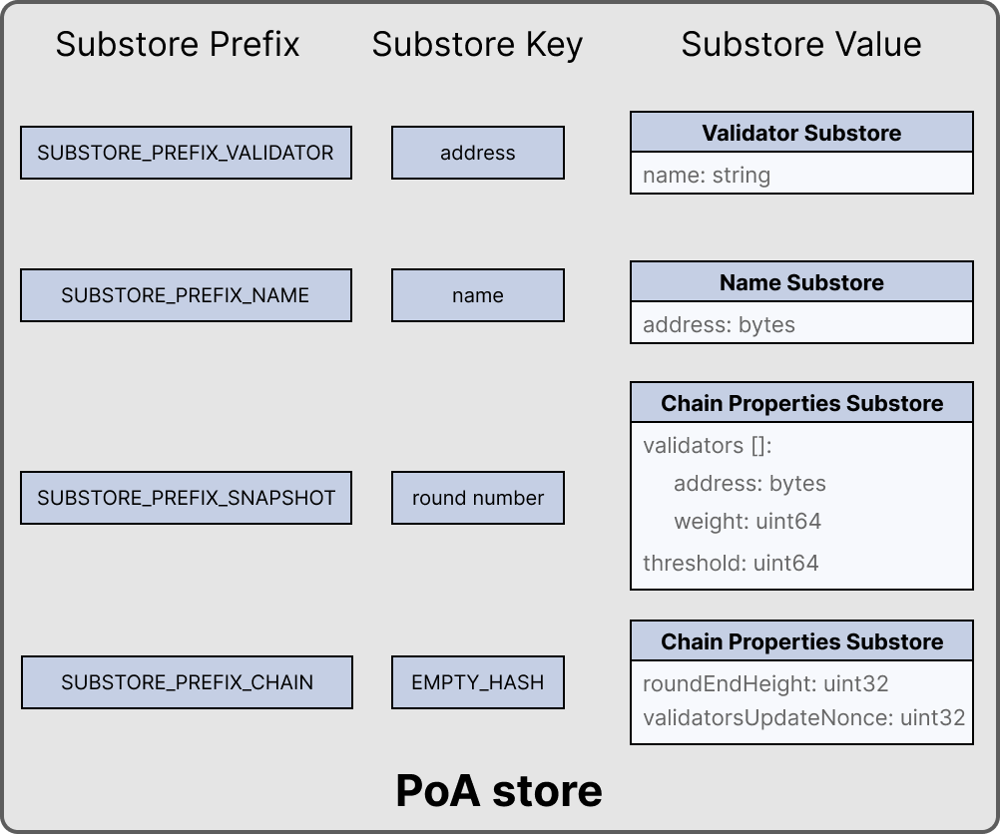

```
LIP: 0047
Title: Introduce PoA module
Author: Iker Alustiza <iker@lightcurve.io>
        Ishan Tiwari <ishan.tiwari@lightcurve.io>
Discussions-To: https://research.lisk.com/t/introduce-poa-module/288
Status: Draft
Type: Standards Track
Created: 2021-04-29
Updated: 2023-09-04
Requires: 0038, 0040, 0044
```

## Abstract

This LIP introduces the Lisk Proof-of-Authority (PoA) mechanism for the selection of validators, known as authorities in this context, to generate blocks.  In particular, this document specifies the PoA module with its module store structure and the stored key-value pairs. Furthermore, it specifies the state transition logic defined within this module, i.e. the commands, the protocol logic injected during the block lifecycle, and the functions that can be called from other modules or off-chain services.

## Copyright

This LIP is licensed under the [Creative Commons Zero 1.0 Universal][creative].

## Motivation

In Proof-of-Authority (PoA) blockchains only a pre-defined set of validators, called the authorities, can propose blocks and they are selected based on off-chain information such as their reputation or identity. It trades the decentralization of the network (arbitrarily selected authorities) for efficiency and performance. This mechanism was first proposed by [Gavin Wood in 2015][ethereum:poa].

A PoA blockchain is especially attractive for small projects or blockchain apps where the project owners are expected to run the network nodes. Due to the simplicity of its validator selection algorithm, it is also suitable for applications where a high transaction per second throughput is important. That is why a self-contained PoA module seems to be a very useful feature to be added as one of the modules available for sidechain developers in the Lisk SDK.

## Rationale

This LIP specifies the PoA module which defines a complete Proof-of-Authority blockchain. Sidechain developers creating a sidechain with the Lisk SDK will have the out-of-the-box choice between this module or the PoS module as the mechanism for validator selection in their sidechain.

As mentioned, the Lisk PoA module only sets the mechanism for the selection of the validators, which implies that the underlying algorithm to reach consensus for blocks of the chain is assumed to be given by the [Lisk-BFT consensus algorithm][lip-0014]. The PoA module also assumes the same round system as [currently specified for the Lisk Mainchain][lip-0057#round-number]. That is, the assignment of block forging slots is done in batches of consecutive blocks called rounds.

Typically, PoA systems do not define any reward system. However, sidechain developers may choose to have a reward system in the chain native token to incentivize the authorities. In this case, the Reward module specified in [LIP 0042][lip-0042] can be used to define block rewards for PoA blockchains. Note that the Dynamic Reward module as defined in [LIP 0071][lip-0071] depends on the PoS information to properly function and thus can not be implemented on PoA blockchains.

Moreover, the banning mechanism (as defined in [LIP 0023][lip-0023#delegate-productivity]) and the punishment of BFT violations (as defined in [LIP 0024][lip-0024] for the Lisk-BFT protocol) are not  necessary for a functional PoA blockchain. Hence, in this LIP they are not included in the specifications.

### Updating the Set of Authorities

The current active authorities, i.e., those authorities eligible to forge blocks and participate in the Lisk-BFT consensus, are stored in the store of the PoA module together with their associated weights. It further contains a threshold property. The weights and threshold are used in the Lisk-BFT consensus algorithm and for the validity of the [update authority command](#update-authority-command). This command is specific to the PoA module and allows to update the mentioned parameters. In particular, the update authority command allows PoA chains to increase (or decrease) the number of active authorities, to change their associated weights and the threshold. This is a particularly interesting feature for blockchain apps that start with a small set of validators and nodes in the network (for example, the sidechain developers themselves). With the success and maturity of the application, there may be an interest in opening the project to a bigger and more decentralized set of participants. The command is only valid if a threshold of active authorities approve it by adding their signature (to be aggregated) to the command parameters. Finally, as explained in the [LIP 0056][lip-0056], it is highly recommended that the weights and active validator set updates are done in a cautious and gradual way so that the security conditions of the Lisk-BFT consensus protocol are respected.

This command can set a maximum of `MAX_NUM_VALIDATORS` active authorities which is the maximum number of active validators in any chain built with the Lisk SDK.

### Migration from PoA to PoS

As mentioned before, the sidechain developers using the Lisk SDK may specify their blockchain app to be deployed on a PoA or PoS chain (assuming they do not develop a custom mechanism). Thus, a sidechain will be either a PoA or a PoS blockchain and both modules cannot co-exist in the same chain. However, there may be an interest for some projects that started as a PoA chain to migrate to PoS. If this is the case, the developers and the future network validators have two choices:

1. After launching the project, if there is a need for a more decentralized approach: Hard-fork the chain to include the PoS module instead of PoA. This can be eased by following a snapshot mechanism similar to the one specified in [LIP 0035][lip-0035].
When transitioning to PoS consensus, it is recommended that the block reward payout scheme is updated to the Dynamic Reward module (see [LIP 0071][lip-0071]). PoA chains could implement no rewards at all, or block rewards as defined in [LIP 0042][lip-0042], however PoS chains could profit from [dynamic rewards][lip-0071] proportional to weight of the generator.
2. If during the development phase, it is decided that the application should start on a PoA chain and then run on a PoS chain for the long term: The sidechain developers can define an arbitrarily long bootstrapping period for the PoS chain in the genesis block as explained in [LIP 0034][lip-0034]. This bootstrapping period effectively mimics a PoA chain where there is a fixed set of validators given by the public keys in the `initValidators` property of the block header asset. This will allow it to first have a preparatory phase of the application so it can mature sufficiently before transferring to a PoS chain.

## Specification

In this section, we specify the PoA module with its module store structure and the stored key-value pairs. Furthermore, we specify the state transition logic defined within this module, i.e. the commands, the protocol logic injected during the block lifecycle, and the functions that can be called from other modules or off-chain services. The PoA module has name `MODULE_NAME_POA`.

### Types

The LIP uses the following types.

| Name | Type | Validation | Description |
|------|------|------------|-------------|
| `Address` | bytes | must have length `NUM_BYTES_ADDRESS` | Account address in Lisk ecosystem |
| `RandomSeed` | bytes | must have length 32 | Random seed used in validator shuffling |

### Constants and Notation

| Name | Type | Value |
|------|------|-------|
| `MODULE_NAME_POA` | string | "poa" |
| `SUBSTORE_PREFIX_VALIDATOR` | bytes | `0x0000` |
| `SUBSTORE_PREFIX_CHAIN` | bytes |`0x8000` |
| `SUBSTORE_PREFIX_NAME` | bytes | `0x4000` |
| `SUBSTORE_PREFIX_SNAPSHOT` | bytes |`0xc000` |
| `COMMAND_REGISTER_AUTHORITY` | string | "registerAuthority" |
| `COMMAND_UPDATE_KEY` | string | "updateKey" |
| `COMMAND_UPDATE_AUTHORITY` | string | "updateAuthority" |
| `EVENT_NAME_AUTHORITY_UPDATE` | string | "authorityUpdate" |
| `UPDATE_AUTHORITY_SUCCESS` | uint32 | 0 |
| `UPDATE_AUTHORITY_FAIL_INVALID_SIGNATURE` | uint32 | 1 |
| `REGISTRATION_FEE` | uint64 | config parameter |
| `MAX_LENGTH_NAME` | uint32 | 20 |
| `NUM_BYTES_ADDRESS` | uint32 | 20 |
| `LENGTH_BLS_KEY` | uint32 | 48 |
| `LENGTH_PROOF_OF_POSSESSION` | uint32 | 96 |
| `LENGTH_GENERATOR_KEY` | uint32 | 32 |
| `MAX_NUM_VALIDATORS` | uint32 | 199 |
| `MAX_UINT64` | uint64 | 18446744073709551615 |
| `MESSAGE_TAG_POA` | bytes | ASCII encoded string “LSK_POA_” |

The constant `REGISTRATION_FEE` is configured for each chain separately. For a reference, an analogous parameter in [PoS](https://github.com/LiskHQ/lips/blob/main/proposals/lip-0057.md#notation-and-constants) is set to `10*(10^8)` on the Lisk mainchain.

#### uint32be Function

The function `uint32be(x)` returns the big endian uint32 serialization of an integer `x`, with `0 <= x < 2^32`. This serialization is always 4 bytes long.

### PoA Module Store

The key-value pairs in the module store are organized as in the following Figure 1.



_Figure 1: The PoA module store is organized in four substores, one for the validator address, one for the names, one for the validators snapshots and the fourth to store the general chain properties._

#### Validator Substore

The validator names of the registered authorities are stored as distinct key-value entries in the PoA module store.

##### Substore Prefix, Store Keys, and Store Values

* The substore prefix is set to `SUBSTORE_PREFIX_VALIDATOR`.
* Each substore key is a byte array `address` of length `NUM_BYTES_ADDRESS`, where `address` is the address of the user account registered as validator, either in the genesis block or with an [register authority command](#register-authority-command).
* Each substore value is the serialization of an object following the JSON schema `validatorObjectSchema` defined below.
* Notation: let `validators(address)` denote the validator substore entry with the key `address`, deserialized using the `validatorObjectSchema` schema.

##### JSON Schema

```java
validatorObjectSchema = {
   "type": "object",
   "required": ["name"],
   "properties": {
       "name": {
           "dataType": "string",
           "minLength": 1,
           "maxLength": MAX_LENGTH_NAME,
           "fieldNumber": 1
       }
   }
}
```

##### Properties

- `name` is a string representing the validator name, its value is set in the genesis block or with an [register authority command](#register-authority-command)

#### Name Substore

The name substore is an auxiliary store used to validate the [register authority command](#register-authority-command).

##### Substore Prefix, Store Keys, and Store Values

* The substore prefix is set to `SUBSTORE_PREFIX_NAME`.
* Each substore key is a name of a validator as given in the genesis block or with an [register authority command](#register-authority-command), serialized as a utf-8 encoded string.
* Each substore value is set to the address of the corresponding validator, serialized according to the JSON schema `validatorAddressSchema` below.
* Notation: let `name(nameBytes)` denote the entry in the name substore with the key `nameBytes`, deserialized using the `validatorAddressSchema` schema.

##### JSON Schema

``` java
validatorAddressSchema = {
   "type": "object",
   "required": ["address"],
   "properties": {
       "address": {
           "dataType": "bytes",
           "length": NUM_BYTES_ADDRESS,
           "fieldNumber": 1
       }
   }
}
```

##### Properties

- `address` is a byte array with the address of the user account registered as validator in the genesis block or with an [register authority command](#register-authority-command).

#### Snapshot Substore

This substore contains the snapshot of the active authorities for the current round, next round and in two rounds.

##### Substore Prefix, Store Key, and Store Value

* The substore prefix is set to `SUBSTORE_PREFIX_SNAPSHOT`.
* Each substore key is `uint32be(roundNumber)`, where `roundNumber` can be 0, 1 or 2 corresponding to the current round, the next round and in two rounds respectively.
* Each substore value is the serialization of an object following `snapshotSubstoreSchema`.
* Notation: Let `snapshotStore(roundNumber)` be the substore entry in the snapshot substore with the key `uint32be(roundNumber)`, deserialized using the `snapshotSubstoreSchema` schema.

##### JSON Schema

```java
snapshotSubstoreSchema = {
    "type": "object",
    "required": ["validators", "threshold"],
    "properties": {
        "validators": {
            "type": "array",
            "fieldNumber": 1,
            "items": {
                "type": "object",
                "required": ["address", "weight"],
                "properties": {
                    "address": {
                        "dataType": "bytes",
                        "length": NUM_BYTES_ADDRESS,
                        "fieldNumber": 1
                    },
                    "weight": {
                        "dataType": "uint64",
                        "fieldNumber": 2
                    }
                }
            }
        },
        "threshold": {
            "dataType": "uint64",
            "fieldNumber": 2
        }
    }
}
 ```

##### Properties

* Each element in the `validators` array corresponds to a validator and stores its address and weight property. The elements in the array must be sorted lexicographically by `address` property. It specifies the set of active validators in the chain.
* `threshold`: An integer stating the weight threshold for finality in the BFT consensus protocol.

#### Chain Properties Substore

This substore contains the general properties of the chain.

##### Substore Prefix, Store Key, and Store Value

* The substore prefix is set to `SUBSTORE_PREFIX_CHAIN`.
* The substore key is set to empty bytes.
* The substore value is set to the serialization of an object following `chainPropSchema` below.
* Notation: Let `chainProperties` be the entry in the chain properties substore, deserialized using the `chainPropSchema` schema.

##### JSON Schema

```java
chainPropSchema = {
    "type": "object",
    "required": ["roundEndHeight", "validatorsUpdateNonce"],
    "properties": {
        "roundEndHeight": {
            "dataType": "uint32",
            "fieldNumber": 1
        },
        "validatorsUpdateNonce": {
            "dataType": "uint32",
            "fieldNumber": 2
        }
    }
}
```

##### Properties

* `roundEndHeight`: An integer stating the last height of the round.
* `validatorsUpdateNonce`: An integer representing the number of times that the validator set has been updated with an update authority command. It is initialized to 0.

### Event

#### AuthorityUpdate

This event has `name = EVENT_NAME_AUTHORITY_UPDATE` and is emitted during update authority command execution. The event has no topics and records only the result status in data. The possible result values are: `[UPDATE_AUTHORITY_SUCCESS, UPDATE_AUTHORITY_FAIL_INVALID_SIGNATURE]`.

##### Data

```java
authorityUpdateDataSchema = {
    "type": "object",
    "required": ["result"],
    "properties": {
        "result": {
            "dataType": "uint32",
            "fieldNumber": 1
        }
    }
}
```

### Commands

#### Register Authority Command

This command is equivalent to the [validator registration command][lip-0057#validator-registration] in the PoS module and has the same schema and similar validity rules. The command name of this transaction is `COMMAND_REGISTER_AUTHORITY`.

##### Parameters

```java
registerAuthorityParamsSchema = {
    "type": "object",
    "required": [
        "name",
        "blsKey",
        "proofOfPossession",
        "generatorKey"],
    "properties": {
        "name": {
            "dataType": "string",
            "minLength": 1,
            "maxLength": MAX_LENGTH_NAME,
            "fieldNumber": 1
        },
        "blsKey": {
            "dataType": "bytes",
            "length": LENGTH_BLS_KEY,
            "fieldNumber": 2
        },
        "proofOfPossession": {
            "dataType": "bytes",
            "length": LENGTH_PROOF_OF_POSSESSION,
            "fieldNumber": 3
        },
        "generatorKey": {
            "dataType": "bytes",
            "length": LENGTH_GENERATOR_KEY,
            "fieldNumber": 4
        }
    }
}
```

##### Verification

A transaction with module name `MODULE_NAME_POA` and command name `COMMAND_REGISTER_AUTHORITY` is verified as follows:

```python
def verify(trs: Transaction) -> None:
    trsParams = decode(registerAuthorityParamsSchema, trs.params)

    if trsParams.name is empty or (not trsParams.name.regexMatch("[a-z0-9!@$&_.]*")):
        raise Exception()
    if name(bytes(trsParams.name, 'utf-8')) is not empty:
        raise Exception()
    senderAddress = SHA-256(trs.senderPublicKey)[:NUM_BYTES_ADDRESS]
    if validators(senderAddress) is not empty:
        raise Exception()
```

##### Execution

A transaction with module name `MODULE_NAME_POA` and command name `COMMAND_REGISTER_AUTHORITY` is executed as follows:

```python
def execute(trs: Transaction) ->  None:
    trsParams = decode(registerAuthorityParamsSchema, trs.params)

    senderAddress = SHA-256(trs.senderPublicKey)[:NUM_BYTES_ADDRESS]
    Fee.payFee(REGISTRATION_FEE)

    validatorEntry = {"name": trsParams.name}
    validators(senderAddress) = encode(validatorObjectSchema, validatorEntry)

    nameEntry = {"address": senderAddress}
    name(bytes(trsParams.name, 'utf-8')) = encode(validatorAddressSchema, nameEntry)

    Validators.registerValidatorKeys(senderAddress, trsParams.proofOfPossession,
                                    trsParams.generatorKey, trsParams.blsKey)
```

The function `registerValidatorKeys` is defined in the [Validators module][lip-0044#register-validator-keys].

#### Update Generator Key Command

This command is used to update the generator key (from [the Validators module][lip-0044]) for a specific authority. The command name of this transaction is `COMMAND_UPDATE_KEY`.

##### Parameters

```java
updateGeneratorKeyParamsSchema = {
    "type": "object",
    "required": ["generatorKey"],
    "properties": {
        "generatorKey": {
            "dataType": "bytes",
            "length": LENGTH_GENERATOR_KEY,
            "fieldNumber": 1
        }
    }
}
```

##### Verification

A transaction with module name `MODULE_NAME_POA` and command name `COMMAND_UPDATE_KEY` is verified as follows:

```python
def verify(trs: Transaction) -> None:
    senderAddress = SHA-256(trs.senderPublicKey)[:NUM_BYTES_ADDRESS]
    if validators(senderAddress) is empty:
        raise Exception()
```

##### Execution

A transaction with module name `MODULE_NAME_POA` and command name `COMMAND_UPDATE_KEY` is executed as follows:

```python
def execute(trs: Transaction) -> None:
    trsParams = decode(updateGeneratorKeyParamsSchema, trs.params)
    senderAddress = SHA-256(trs.senderPublicKey)[:NUM_BYTES_ADDRESS]
    Validators.setValidatorGeneratorKey(senderAddress, trsParams.generatorKey)
```

Here `setValidatorGeneratorKey` is the function exposed by [the Validators module][lip-0044].

#### Update Authority Command

The command name for this command is `COMMAND_UPDATE_AUTHORITY`.

##### Parameters

``` java
updateAuthorityValidatorParams = {
    "type": "object",
    "required": [
    "newValidators",
    "threshold",
    "validatorsUpdateNonce",
    "signature",
    "aggregationBits"
    ],
    "properties": {
        "newValidators": {
            "type": "array",
            "minLength": 1,
            "maxLength": MAX_NUM_VALIDATORS,
            "fieldNumber": 1,
            "items": {
                "type": "object",
                "required": ["address", "weight"],
                "properties": {
                    "address": {
                        "dataType": "bytes",
                        "length": NUM_BYTES_ADDRESS,
                        "fieldNumber": 1
                    },
                    "weight": {
                        "dataType": "uint64",
                        "fieldNumber": 2
                    }
                }
            }
        },
        "threshold": {
            "dataType": "uint64",
            "fieldNumber": 2
        },
        "validatorsUpdateNonce": {
            "dataType": "uint32",
            "fieldNumber": 3
        },
        "signature": {
            "dataType": "bytes",
            "fieldNumber": 4
        },
        "aggregationBits": {
            "dataType": "bytes",
            "fieldNumber": 5
        }
    }
}
```

##### Verification

A transaction with module name `MODULE_NAME_POA` and command name `COMMAND_UPDATE_AUTHORITY` is verified as follows:

```python
def verify(trs: Transaction) -> None:
    trsParams = decode(updateAuthorityValidatorParams, trs.params)

    newValidators = trsParams.newValidators
    # Validator entries are ordered lexicographically with respect to address. Address is unique.
    for i in range(length(newValidators) - 1):
        if newValidators[i+1].address <= newValidators[i].address: # Lexicographical ordering.
            raise Exception()
    totalWeight = 0
    for validator in newValidators:
        if validators(validator.address) is empty:
            raise Exception()
        if validator.weight == 0:
            raise Exception()
        totalWeight += validator.weight
    if totalWeight == 0 or totalWeight > MAX_UINT64:
        raise Exception()

    if trsParams.threshold < totalWeight // 3 + 1 or trsParams.threshold > totalWeight:
        raise Exception()

    if trsParams.validatorsUpdateNonce != chainProperties.validatorsUpdateNonce:
        raise Exception()
```
##### Execution

Let `chainId` be the byte array with the chain ID of the chain. A transaction with module name `MODULE_NAME_POA` and command name `COMMAND_UPDATE_AUTHORITY` is executed as follows:

```python
def execute(trs: Transaction) -> None:
    trsParams = decode(updateAuthorityValidatorParams, trs.params)
    # Verify weighted aggregated signature.
    m = encode(validatorSignatureMessageSchema, {
                "newValidators": trsParams.newValidators,
                "threshold": trsParams.threshold,
                "validatorsUpdateNonce": trsParams.validatorsUpdateNonce
            })
    validatorInfos = []
    for validator in snapshotStore(0).validators:
        key = Validators.getValidatorKeys(validator.address).blsKey
        validatorInfos.add({"key": key, "weight": validator.weight})
    sort validatorInfos lexicographically by "key"

    verified = verifyWeightedAggSig([validatorInfo["key"] for validatorInfo in validatorInfos],
                                    trsParams.aggregationBits,
                                    trsParams.signature,
                                    MESSAGE_TAG_POA,
                                    chainId,
                                    [validatorInfo["weight"] for validatorInfo in validatorInfos],
                                    snapshotStore(0).threshold,
                                    m)
    if verified == False:
        emitPersistentEvent(
            module = MODULE_NAME_POA,
            name = EVENT_NAME_AUTHORITY_UPDATE,
            data = {"result": UPDATE_AUTHORITY_FAIL_INVALID_SIGNATURE},
            topics = []
        )
        raise Exception()

    # Set new authorities.
    snapshotStore(2).validators = trsParams.newValidators
    snapshotStore(2).threshold = trsParams.threshold
    chainProperties.validatorsUpdateNonce = trsParams.validatorsUpdateNonce + 1
    emitEvent(
        module = MODULE_NAME_POA,
        name = EVENT_NAME_AUTHORITY_UPDATE,
        data = {"result": UPDATE_AUTHORITY_SUCCESS},
        topics = []
    )
```

The function `verifyWeightedAggSig` is specified in [LIP 0062][lip-0062#sign-verify-bls], `getValidatorKeys` is exposed by the [Validators module][lip-0044]. The schema `validatorSignatureMessageSchema` is:

```java
validatorSignatureMessageSchema = {
    "type": "object",
    "required": ["newValidators", "threshold", "validatorsUpdateNonce"],
    "properties": {
        "newValidators": {
            "type": "array",
            "fieldNumber": 1,
            "items": {
                "type": "object",
                "required": ["address", "weight"],
                "properties": {
                    "address": {
                        "dataType": "bytes",
                        "fieldNumber": 1
                    },
                    "weight": {
                        "dataType": "uint64",
                        "fieldNumber": 2
                    }
                }
            }
        },
        "threshold": {
            "dataType": "uint64",
            "fieldNumber": 2
        },
        "validatorsUpdateNonce": {
            "dataType": "uint32",
            "fieldNumber": 3
        }
    }
}
```

### Internal Function

#### shuffleValidatorsList

The function reorders and returns the list of validators as specified in [LIP 0003][lip-0003#specs]. It must be implemented exactly as the `shuffleValidatorsList` function in the [PoS module](https://github.com/LiskHQ/lips/blob/main/proposals/lip-0057.md#shufflevalidatorslist).

### Protocol Logic for Other Modules

This module does not define any specific logic for other modules.

### Endpoints for Off-Chain Services

This module does not have any non-trivial or recommended endpoints for off-chain services.

### Genesis Block Processing

The following two steps are executed as part of the genesis block processing, see the [LIP 0060][lip-0060] for details.

#### Genesis State Initialization

To initialize the state of a genesis block `g`, the following logic is executed. If any step fails, the block is discarded and has no further effect.

Let `genesisBlockAssetBytes` be the bytes included in the `data` property of a deserialized entry in `g.assets` for the PoA module and let `assetPoA` be the deserialization of `genesisBlockAssetBytes` according to the `genesisPoAStoreSchema` schema. Then:

* Checks for the `assetPoA.validators` (note that these checks are equivalent to those for the verification of the register authority command):
  * Check that the `address` properties of all entries in the `assetPoA.validators` array are pairwise distinct.
  * Check that entries in the `assetPoA.validators` array are ordered lexicographically according to `address`.
  * Check that the `name` property of every entry in the `assetPoA.validators` array contains only characters from the set `[a-z0-9!@$&_.]`.
  * Check that the `name` property of all entries in the `assetPoA.validators` array are pairwise distinct.

* Checks for the `assetPoA.snapshotSubstore` (note that these checks are similar to those for the verification of the update authority command):
  * Check that the array has at least 1 element and at most `MAX_NUM_VALIDATORS` elements.
  * Check that the `address` properties of entries in the `assetPoA.snapshotSubstore.activeValidators` are pairwise distinct.
  * Check that entries in the `assetPoA.snapshotSubstore.activeValidators` array are ordered lexicographically according to `address`.
  * Check that for every element `activeValidator` in the `assetPoA.snapshotSubstore.activeValidators` array, there is an entry `validator` in the `assetPoA.validators` array with `validator.address == activeValidator.address`.
  * Check that the `weight` property of every entry in the `assetPoA.snapshotSubstore.activeValidators` array is a positive integer.
  * Let `totalWeight` be the sum of the `weight` property of every entry in `assetPoA.snapshotSubstore.activeValidators`. Then, check that `totalWeight` is less than or equal to `MAX_UINT64`.
  * Check that the value of `assetPoA.snapshotSubstore.threshold` is within the following range:
     * Minimum value: `(totalWeight // 3) + 1`, where // is the integer division.
     * Maximum value: `totalWeight`

* Create an entry in the validator substore for each entry `validator` in the `assetPoA.validators` array as:
  * `storeKey`: `validator.address`.
  * The `storeValue` is the serialization of the object `validatorObject` following `validatorObjectSchema` with `validatorObject.name = validator.name`. 	

* Create an entry in the name substore for each entry `validator` in the `assetPoA.validators` array as:
  * `storeKey`: `validator.name` serialized as a utf-8 encoded string.
  * The `storeValue` is the serialization of the object `validatorAddress` following `validatorAddressSchema` with `validatorAddress.address = validator.address`.

* Create three entries in the snapshot substore as:
  * The `storeKey` of each of the entries are `uint32be(0)`, `uint32be(1)`, and `uint32be(2)` respectively.
  * The `storeValue` is the same for the three entries and equal to the serialization of `assetPoA.snapshotSubstore` where parameter name `activeValidators` is replaced with `validators`.

* Create an entry in the chain properties substore as:
  * The `storeValue` is the serialization of a `chainProperties` object following `chainPropSchema` where:
    * `chainProperties.roundEndHeight` = `g.header.height`.
    * `chainProperties.validatorsUpdateNonce` = 0.

##### Genesis PoA Store Schema

```java
genesisPoAStoreSchema = {
    "type": "object",
    "required": ["validators", "snapshotSubstore"],
    "properties": {
        "validators": {
            "type": "array",
            "fieldNumber": 1,
            "items": {
                "type": "object",
                "required": [
                    "address",
                    "name",
                    "blsKey",
                    "proofOfPossession",
                    "generatorKey"
                ],
                "properties": {
                    "address": {
                        "dataType": "bytes",
                        "length": NUM_BYTES_ADDRESS,
                        "fieldNumber": 1
                    },
                    "name": {
                        "dataType": "string",
                        "minLength": 1,
                        "maxLength": MAX_LENGTH_NAME,
                        "fieldNumber": 2
                    },
                    "blsKey": {
                        "dataType": "bytes",
                        "length": LENGTH_BLS_KEY,
                        "fieldNumber": 3
                    },
                    "proofOfPossession": {
                        "dataType": "bytes",
                        "length": LENGTH_PROOF_OF_POSSESSION,
                        "fieldNumber": 4
                    },
                    "generatorKey": {
                        "dataType": "bytes",
                        "length": LENGTH_GENERATOR_KEY,
                        "fieldNumber": 5
                    }
                }
            }
        },
        "snapshotSubstore": {
            "type": "object",
            "fieldNumber": 2,
            "properties": {
                "activeValidators": {
                    "type": "array",
                    "fieldNumber": 1,
                    "items": {
                        "type": "object",
                        "required": ["address", "weight"],
                        "properties": {
                            "address": {
                                "dataType": "bytes",
                                "length": NUM_BYTES_ADDRESS,
                                "fieldNumber": 1
                            },
                            "weight": {
                                "dataType": "uint64",
                                "fieldNumber": 2
                            }
                        }
                    }
                },
                "threshold": {
                    "dataType": "uint64",
                    "fieldNumber": 2
                }
            },
            "required": ["activeValidators", "threshold"]
        }
    }
}
```

#### Genesis State Finalization

To finalize the state of a genesis block `g`, the following logic is executed.  If any step fails, the block is discarded and has no further effect.

Let `genesisBlockAssetBytes` be the bytes included in the `data` property of a deserialized entry in `g.assets` for the PoA module and let `assetPoA` be the deserialization of `genesisBlockAssetBytes` according to the `genesisPoAStoreSchema` schema. Then:

```python
chainProperties.roundEndHeight = chainProperties.roundEndHeight + length(snapshotStore(0).validators)

# Pass the BLS keys and generator keys to the Validators module.
for validator in assetPoA.validators:
    registerValidatorKeys(validator.address, validator.proofOfPossession, validator.generatorKey, validator.blsKey)

# Pass the required information to the Validators module.
bftThreshold = snapshotStore(0).threshold
validatorsList = [{"address": item.address, "bftWeight": item.weight} for item in snapshotStore(0).validators]
Validators.setValidatorParams(bftThreshold, bftThreshold, validatorsList)
```
where:

* `registerValidatorKeys` is defined in the [Validators module][lip-0044#register-validator-keys].
* `setValidatorParams` is a function exposed by the [Validators module][lip-0044#setvalidatorparams].

### Block Processing

The following steps are executed as part of the block processing, see the [LIP 0055][lip-0055] for details.

#### After Transactions Execution

```python
def afterTransactionsExecute(b: Block) -> None:
    if b.header.height == chainProperties.roundEndHeight:
        previousLengthValidators = length(snapshotStore(0).validators)
        # Update the chain information for the next round.
        snapshotStore(0) = snapshotStore(1)
        snapshotStore(1) = snapshotStore(2)

        # Reshuffle the list of validators and pass it to the Validators module.
        roundStartHeight = chainProperties.roundEndHeight - previousLengthValidators + 1
        randomSeed = Random.getRandomBytes(roundStartHeight, previousLengthValidators)

        validatorsList = [{"address": item.address, "bftWeight": item.weight} for item in snapshotStore(0).validators]
        nextValidators  = shuffleValidatorsList(validatorsList, randomSeed)
        Validators.setValidatorParams(snapshotStore(0).threshold, snapshotStore(0).threshold, nextValidators)

        chainProperties.roundEndHeight = chainProperties.roundEndHeight + length(snapshotStore(0).validators)
```

where:

* `getRandomBytes` is a function exposed by the [Random module][lip-0046].
* `setValidatorParams` is a function exposed by the [Validators module][lip-0044#setvalidatorparams].

## Backwards Compatibility

This LIP introduces a new module for sidechains in the Lisk ecosystem. As such it does not affect any existing chain, hence it does not imply any incompatibilities.

## Reference Implementation

TBA

[creative]: https://creativecommons.org/publicdomain/zero/1.0/
[ethereum:poa]: https://github.com/ethereum/guide/blob/master/poa.md
[lip-0003#specs]: https://github.com/LiskHQ/lips/blob/main/proposals/lip-0003.md#specification
[lip-0014]: https://github.com/LiskHQ/lips/blob/main/proposals/lip-0014.md
[lip-0022#random-seeds]: https://github.com/LiskHQ/lips/blob/main/proposals/lip-0022.md#random-seeds-computation
[lip-0023#delegate-productivity]: https://github.com/LiskHQ/lips/blob/main/proposals/lip-0023.md#delegate-productivity-1
[lip-0024]: https://github.com/LiskHQ/lips/blob/main/proposals/lip-0024.md
[lip-0027]: https://github.com/LiskHQ/lips/blob/main/proposals/lip-0027.md
[lip-0034]: https://github.com/LiskHQ/lips/blob/main/proposals/lip-0034.md
[lip-0035]: https://github.com/LiskHQ/lips/blob/main/proposals/lip-0035.md
[lip-0038#public-key-registration]: https://github.com/LiskHQ/lips/blob/master/proposals/lip-0038.md#public-key-registration-and-proof-of-possession
[lip-0042]: https://github.com/LiskHQ/lips/blob/main/proposals/lip-0042.md
[lip-0044#register-validator-keys]: https://github.com/LiskHQ/lips/blob/main/proposals/lip-0044.md#registervalidatorkeys
[lip-0044#setvalidatorparams]: https://github.com/LiskHQ/lips/blob/main/proposals/lip-0044.md#setvalidatorparams
[lip-0044]: https://github.com/LiskHQ/lips/blob/main/proposals/lip-0044.md
[lip-0046]: https://github.com/LiskHQ/lips/blob/main/proposals/lip-0046.md
[lip-0055]: https://github.com/LiskHQ/lips/blob/main/proposals/lip-0055.md
[lip-0056]: https://github.com/LiskHQ/lips/blob/main/proposals/lip-0056.md#validator-changes
[lip-0057#validator-registration]: https://github.com/LiskHQ/lips/blob/main/proposals/lip-0057.md#validator-registration
[lip-0057#round-number]: https://github.com/LiskHQ/lips/blob/main/proposals/lip-0057.md#round-number-and-end-of-rounds
[lip-0060]: https://github.com/LiskHQ/lips/blob/main/proposals/lip-0060.md
[lip-0062#sign-verify-bls]: https://github.com/LiskHQ/lips/blob/main/proposals/lip-0062.md#signing-and-verifying-with-bls
[lip-0071]: https://github.com/LiskHQ/lips/blob/main/proposals/lip-0071.md
