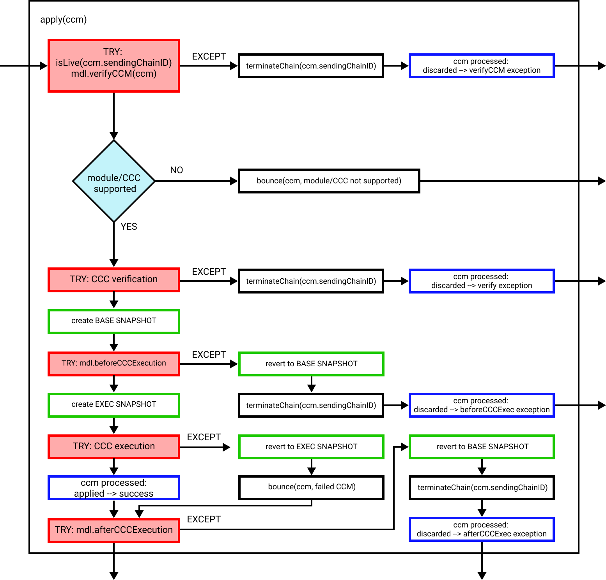
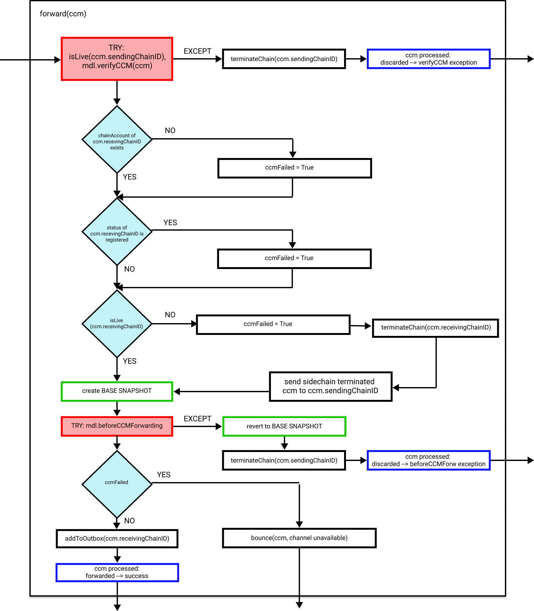

```
LIP: 0049
Title: Introduce cross-chain messages
Author: Maxime Gagnebin <maxime.gagnebin@lightcurve.io>
        Alessandro Ricottone <alessandro.ricottone@lightcurve.io>
Discussions-To: https://research.lisk.com/t/introduce-cross-chain-messages/299
Status: Draft
Type: Standards Track
Created: 2021-05-22
Updated: 2023-02-22
Requires: 0053
```

## Abstract

This proposal introduces the cross-chain message schema, the generic message processing and the base error handling. Defining a base cross-chain message allows all chains in the ecosystem to read and understand the base properties of messages.

The proposal also introduces three messages used by the Interoperability module, the channel terminated message, the sidechain terminated message and the registration message.

## Copyright

This LIP is licensed under the [Creative Commons Zero 1.0 Universal](https://creativecommons.org/publicdomain/zero/1.0/).

## Motivation

To achieve interoperability, chains need to exchange information by sending messages to each other. To this end, we introduce a new message format, which we call a _cross-chain message_ and define in this proposal the base schema of cross-chain messages. Specifying a unified base message schema allows all chains in the Lisk ecosystem to deserialize and read cross-chain messages.

To achieve some of its basic functionalities, the Interoperability module uses three messages. The first one, the _channel terminated message_, is sent to chains which have been terminated. The second one, the _registration message_, is used when registering a chain. This message must be the first message added to the inbox for a CCU to activate the channel between the chains. Furthermore, it serves as a guarantee that the correct chain ID, name, and message fee token were used when the registration transaction was sent on the sidechain. The third one, the _sidechain terminated message_ is created on the Lisk mainchain when a message should be routed to a terminated or inactive chain. This message allows other sidechains to automatically trigger the creation of the terminated sidechain account.

Further motivation and rationale behind the Lisk interoperability architecture is given in the general interoperability document [LIP 0045][lip-0045].

## Rationale

Messages in the Lisk ecosystem will be included in multiple chains. It is therefore important that all chains can deserialize and process the base part of cross-chain messages in the same way. The properties of the message contain all the information necessary for this purpose while trying to keep a minimal size.

### Cross-chain Message Properties

In the following, we list all the properties of a cross-chain message.

#### Module and Cross-chain Command

Once the message has reached the receiving chain, the two properties `module` and `crossChainCommand` specify which logic should be used to validate and execute the message. In case the required logic is not available on the chain, the Interoperability module sends a message with an error status back to the sending chain, provided the message included enough fees. This brings the benefit that sending chains do not need to monitor all other chains in the ecosystem and the modules they support.

For a given module, the set of commands and cross-chain commands are allowed to overlap.

#### Nonce

When a cross-chain message is created and added to the partner chain outbox, the nonce of the sending chain (total number of messages that were added to outboxes so far) is added to the message in the `nonce` property. This allows all messages to be uniquely identified by the `(sendingChainID, receivingChainID, nonce, status)` tuple, which implies that the message ID defined below will be unique for all messages in the ecosystem. The uniqueness of messages in the Lisk ecosystem is important for identifying messages with message IDs and tracking them throughout the ecosystem.

#### Fee

For all cross-chain messages, the message fee is used to account for the transaction processing in the receiving chain. This fee must be transferred from the sending chain account to the receiving chain account in order to maintain the correct balances on all chains in the ecosystem. The [token ID][lip-0051#tokenID] for this fee is stored in the channel account and is by default the token ID of the LSK token. As it is stored in the channel account, it does not need to be repeated in the message. Being the main utility token of the Lisk ecosystem, the LSK token is always the token ID for this fee for channels between the Lisk mainchain and registered sidechains.

#### Sending Chain ID and Receiving Chain ID

Used to identify the chains exchanging the cross-chain message. On the mainchain, the receiving chain ID is read to route the message to the corresponding chain outbox, as specified in [LIP 0053][lip-0053]. The sending chain ID is used, for example, if the message triggers an error and has to be sent back.

#### Parameters

The `params` property of the messages is defined by each module and can follow any schema, similar to the `params` property of a transaction. The `params` property is not deserialized or validated by the Interoperability module.

In the Lisk ecosystem, all cross-chain messages are routed through the mainchain. This means that messages should always have a sufficiently small size in order to be easily included in mainchain blocks. As the mainchain payload size limit is 15 KiB, and [other properties][lip-0053] in the cross-chain updates will not be larger than 4 KiB, we limit the message size to 10 KiB. To guarantee that all messages can be included and handled, sidechains in the Lisk ecosystem should have a payload size limit equal to or greater than 15 KiB (15 x 1024 bytes).

#### Status

The basic error handling for routing messages to other chains is done by the mainchain. For example, in the case the receiving chain does not exist, is not active or has been terminated, the mainchain will return the message to the sending chain. The sending chain can then revert the message and potentially refund users. This design choice allows sidechains to send messages to other chains without needing to monitor the status (or even existence) of every other chain. Information about the reason why the message failed is stored in the `status` property.

The [constants table][lip-0045#constants] lists the different status codes defined by the Interoperability module. To allow for future updates or improvements of the Interoperability module, we restrict other modules from using status codes up to 63 (included). Other modules may use other status codes larger or equal to 64.

### Cross-chain Message ID

As all messages emitted in the Lisk ecoystem are distinct (thanks to the unicity of the `(sendingChainID, receivingChainID, nonce, status)` tuple), we can assign a unique ID to them. The message ID is obtained in the same way as other IDs in the protocol, namely by hashing the serialized object. This assigns to each message a value of length `HASH_LENGTH` that can be used whenever the message needs to be referenced.

### Message Tracking and Error Handling

Tracking messages throughout the ecosystem could be a challenge, particularly if messages are errored (and hence spawn new messages from the erroring chain). However, this can easily be done using the logs emitted by the CCM processing. Indeed, messages which are errored and which send a response message to their sending chain, will log the ID of the return message, allowing off-chain services to display the current status of CCMs (or the status of the returned message if needed). More generally, the logged records will allow users to know whether a CCM is forwarded, successfully executed, or triggers an error mechanism.

The Interoperability module perfoms some basic validations for all messages and then forwards them to the respective module which is responsible for their validation and execution. During this process, no return message is spawned when a message is successfully delivered. Error messages are only spawned by the Interoperability module when a message should be sent to an inactive chain, or if the receiving chain does not support the required logic.

### Sending Cross-chain Messages

Whenever a message is created, it must be added to the outbox of the corresponding partner chain. On sidechains, this logic always appends to the mainchain outbox, while on the mainchain, this logic can append to any registered sidechain outbox.

The Interoperability module exposes the <code>[send][lip-0045#send]</code> function which should be used whenever other modules need to send cross-chain messages. This functions also checks the liveness of the receiving chain, sets the message nonce property and appends the message to the outbox of the partner chain.

### CCMs Specified by the Interoperability Module

Then Interoperability module specifies the messages described in the following subsections.

#### Channel Terminated Message

The role of the channel terminated message is to inform chains that their channel has been terminated on the mainchain. The chain receiving this message can then also close the channel to the mainchain. This is helpful in preventing users from sending transactions to a chain whilst the cross-chain update transaction will be invalid. Note that the Interoperability module is designed in such a way that no channel should be terminated while the sidechain is respecting the Lisk interoperability protocol. Sending and receiving this message should therefore be a rare occurrence.

#### Registration Message

The role of the registration message is to allow for a safe activation of the channel between the sending and receiving chains. It guarantees that when the CCU activating the channel is executed, a registration transaction has been included on the partner chain.

When a sidechain is registered on the mainchain, an ecosystem wide chain ID and name are assigned to this chain. The chain name, chain ID, and the token ID used for message fees are included in a registration message that is appended to the sidechain outbox. When the first cross-chain update containing messages is sent to the sidechain, the equality between the properties in the registration message and the ones in the interoperability store is verified.

#### Sidechain Terminated Message

The role of the sidechain terminated message is to inform sidechains that another sidechain has been terminated on the mainchain and is unable to receive messages. The message contains the ID of the terminated chain as well as the last certified state root of the terminated sidechain (as certified on the mainchain). This value is used for the creation of the terminated state account (on the sidechain receiving the CCM), allowing state recoveries.

This message allows to inform sidechains about other terminated sidechains efficiently. Indeed, this message will automatically trigger the creation of the terminated sidechain account as soon as the first message is unable to be delivered. This also prevents further messages to be sent to already terminated sidechains.

## Specification

Cross-chain messages (CCM) are used by modules to execute actions on other chains in the ecosystem. They are part of the Interoperability module.

### Notation and Constants

All interoperability constants are defined in [LIP 0045][lip-0045#constants].

### Use of Cross-chain Command

The logic associated with a cross-chain message is identified by the pair `(module, crossChainCommand)`.

A pair `(module, crossChainCommand)` must uniquely correspond to:

* one cross-chain message parameters schema,
* one cross-chain message verification logic, and
* one cross-chain message execution logic

in one blockchain, with uniqueness being among all cross-chain commands. This means that for any change with respect to the three aspects above, a different pair `(module, crossChainCommand)` must be used for the new message. Typically, new messages are still contained in the same module, i.e., the value of `module` stays the same, and a new unique value of `crossChainCommand` is used.

### CCM Status and Interoperability Restricted Range

The CCM statuses from `0` to `63` (included) are reserved for the Interoperability module. They should not be used by other modules to signify a module specific status.

### Cross-chain Message Schema

All cross-chain messages in the Lisk ecosystem use the following schema.

```java
crossChainMessageSchema = {
    "type": "object",
    "required": [
        "module",
        "crossChainCommand",
        "nonce",
        "fee",
        "sendingChainID",
        "receivingChainID",
        "params",
        "status"
    ],
    "properties": {
        "module": {
            "dataType": "string",
            "minLength": MIN_MODULE_NAME_LENGTH,
            "maxLength": MAX_MODULE_NAME_LENGTH,
            "fieldNumber": 1
        },
        "crossChainCommand": {
            "dataType": "string",
            "minLength": MIN_CROSS_CHAIN_COMMAND_NAME_LENGTH,
            "maxLength": MAX_CROSS_CHAIN_COMMAND_NAME_LENGTH,
            "fieldNumber": 2
        },
        "nonce": {
            "dataType": "uint64",
            "fieldNumber": 3
        },
        "fee": {
            "dataType": "uint64",
            "fieldNumber": 4
        },
        "sendingChainID": {
            "dataType": "bytes",
            "length": CHAIN_ID_LENGTH,
            "fieldNumber": 5
        },
        "receivingChainID": {
            "dataType": "bytes",
            "length": CHAIN_ID_LENGTH,
            "fieldNumber": 6
        },
        "params": {
            "dataType": "bytes",
            "fieldNumber": 7
        },
        "status": {
            "dataType": "uint32",
            "fieldNumber": 8
        }
    }
}
```

The `module` and `crossChainCommand` properties can only contain alphanumeric characters.

### Serialization

The serialization of an object of type `CCM` is described in the following pseudocode.

```python
def encodeCCM(ccm: CCM) -> bytes:
    return encode(crossChainMessageSchema, ccm)
```

### Deserialization

Consider a binary message `ccmBytes`, corresponding to a serialized cross-chain message. The deserialization procedure is as follows:

```python
def decodeCCM(ccmBytes: bytes) -> CCM:
    return decode(crossChainMessageSchema, ccmBytes)
```

### Validation

All cross-chain messages must satisfy the validation rules given by the [`validateFormat`](#validateFormat) function.
This is enforced by the Interoperability module when sending a CCM (see the [`send` method][lip-0045#send]) and when receiving a CCM via a cross-chain update transaction (see [LIP 0053][lip-0053]).
It is, however, the responsibility of every module to validate in the "Cross-Chain Command Verification" hook that the bytes in `ccm.params` of a CCM `ccm` satisfy the parameter schema of the respective cross-chain command.

### Cross-chain Message ID

The ID of a cross-chain message `ccm` is computed as `sha256(encode(crossChainMessageSchema, ccm))`.

### Internal Functions

When processing a cross-chain message `ccm`, the functions below may be called by commands from the Interoperability module. Recall that `chainAccount(chainID)` returns the corresponding entry in the chain data substore.

#### validateFormat

All cross-chain messages must have the correct format, which is checked by the following logic:

```python
def validateFormat(ccm: CCM) -> None:
    # ccm must satisfy root schema. The following function throws an exception if this is not the case.
    validateObjectSchema(crossChainMessageSchema, ccm)
    # ccm.module must be an alphanumeric string.
    if not re.match("^[a-zA-Z0-9]*$", ccm.module):
        raise Exception("Cross-chain message module name must be alphanumeric.")
    # ccm.crossChainCommand must be an alphanumeric string.
    if not re.match("^[a-zA-Z0-9]*$", ccm.crossChainCommand):
        raise Exception("Cross-chain message command name must be alphanumeric.")
    # Check ccm size.
    ccmBytes = encode(crossChainMessageSchema, ccm)
    if len(ccmBytes) > MAX_CCM_SIZE:
        raise Exception(f"Cross-chain message size is larger than {MAX_CCM_SIZE}.")
```

#### apply

The `apply` function applies a cross-chain message, in the context of a cross-chain update `ccu`.



_Figure 1: A schematic of the steps executed in the `apply` function. Blue bordered boxes indicate the emission of an event. Functions called from other modules during the CCM execution (indicated as `mdl.<FUNCTION_NAME>`) are repeated for each module in the chain for which the function exists._

```python
def apply(ccu: CCU, ccm: CCM) -> None:
    try:
        if not isLive(ccm.sendingChainID):  
            raise Exception(f"Sending chain {ccm.sendingChainID} is not live.")
        # Modules can verify the CCM.
        # The Token module verifies the escrowed balance in the CCM sending chain for the message fee.
        for each module mdl for which verifyCrossChainMessage exists:
            mdl.verifyCrossChainMessage(ccu, ccm)
    except:    
        terminateChain(ccm.sendingChainID)
        # Notice that, since the sending chain has been terminated,
        # the verification of all future CCMs will fail.
        emitEvent(
            module = MODULE_NAME_INTEROPERABILITY,
            name = EVENT_NAME_CCM_PROCESSED,
            data = {"ccm": ccm, "result": CCM_PROCESSED_RESULT_DISCARDED, "code": CCM_PROCESSED_CODE_INVALID_CCM_VERIFY_CCM_EXCEPTION},
            topics = [ccm.sendingChainID, ccm.receivingChainID]
        )
        return

    if ccm.module is not supported:
        bounce(ccm, CCM_STATUS_CODE_MODULE_NOT_SUPPORTED, CCM_PROCESSED_CODE_MODULE_NOT_SUPPORTED)
        return
    elif ccm.crossChainCommand is not supported:
        bounce(ccm, CCM_STATUS_CODE_CROSS_CHAIN_COMMAND_NOT_SUPPORTED, CCM_PROCESSED_CODE_CROSS_CHAIN_COMMAND_NOT_SUPPORTED)
        return

    crossChainCommand = cross-chain command associated with (ccm.module, ccm.crossChainCommand)
    try:  
        crossChainCommand.verify(ccu, ccm)
    except:
        terminateChain(ccm.sendingChainID)
        emitEvent(
            module = MODULE_NAME_INTEROPERABILITY,
            name = EVENT_NAME_CCM_PROCESSED,
            data = {"ccm": ccm, "result": CCM_PROCESSED_RESULT_DISCARDED, "code": CCM_PROCESSED_CODE_INVALID_CCM_VERIFY_EXCEPTION},
            topics = [ccm.sendingChainID, ccm.receivingChainID]
        )
        return

    # Create a state snapshot.
    baseSnapshot = snapshot of the current state
    try:  
        # Call the beforeCrossChainCommandExecution functions from other modules.
        # For example, the Token module assigns the message fee to the CCU sender.
        for each module mdl for which beforeCrossChainCommandExecution exists:
            mdl.beforeCrossChainCommandExecution(ccu, ccm)
    except:
        revert state to baseSnapshot
        terminateChain(ccm.sendingChainID)
        emitEvent(
            module = MODULE_NAME_INTEROPERABILITY,
            name = EVENT_NAME_CCM_PROCESSED,
            data = {"ccm": ccm, "result": CCM_PROCESSED_RESULT_DISCARDED, "code": CCM_PROCESSED_CODE_INVALID_CCM_BEFORE_CCC_EXECUTION_EXCEPTION},
            topics = [ccm.sendingChainID, ccm.receivingChainID]
        )
        return
    # Create a state snapshot.
    executionSnapshot = snapshot of the current state
    try:
        # This could happen during the execution of a mainchain CCU containing a CCM
        # from a sidechain for which a direct channel has been registered.
        # Then, ccu.params.sendingChainID == getMainchainID().
        # This is not necessarily a violation of the protocol, since the message
        # could have been sent before the direct channel was opened.
        if chainAccount(ccm.sendingChainID) exists and ccu.params.sendingChainID != ccm.sendingChainID:
            raise Exception("Cannot receive forwarded messages for a direct channel.")
        # Execute the cross-chain command.
        crossChainCommand.execute(ccu, ccm)
        emitEvent(
            module = MODULE_NAME_INTEROPERABILITY,
            name = EVENT_NAME_CCM_PROCESSED,
            data = {"ccm": ccm, "result": CCM_PROCESSED_RESULT_APPLIED, "code": CCM_PROCESSED_CODE_SUCCESS},
            topics = [ccm.sendingChainID, ccm.receivingChainID]
        )
    except:
        revert state to executionSnapshot
        bounce(ccm, CCM_STATUS_CODE_FAILED_CCM, CCM_PROCESSED_CODE_FAILED_CCM)

    try:
        # Call the afterCrossChainCommandExecution functions from other modules.
        for each module mdl for which afterCrossChainCommandExecution exists:
            mdl.afterCrossChainCommandExecution(ccu, ccm)     
    except:
        revert state to baseSnapshot
        terminateChain(ccm.sendingChainID)
        emitEvent(
            module = MODULE_NAME_INTEROPERABILITY,
            name = EVENT_NAME_CCM_PROCESSED,
            data = {"ccm": ccm, "result": CCM_PROCESSED_RESULT_DISCARDED, "code": CCM_PROCESSED_CODE_INVALID_CCM_AFTER_CCC_EXECUTION_EXCEPTION},
            topics = [ccm.sendingChainID, ccm.receivingChainID]
        )
```

The `terminateChain`, `bounce`, and `isLive` functions are defined in [LIP 0045][lip-0045].

#### forward

The `forward` function forwards a CCM to the specified receiving chain. This function is only called on the mainchain when processing a CCU. If an error occurs, the CCM is bounced back to the sending chain or discarded.



_Figure 2: A schematic of the steps executed in the `forward` function. Blue bordered boxes indicate the emission of an event. Functions called from other modules during the CCM execution (indicated as `mdl.<FUNCTION_NAME>`) are repeated for each module in the chain for which the function exists._

```python
def forward(ccu: CCU, ccm: CCM) -> None:
    try:
        if not isLive(ccm.sendingChainID):  
            raise Exception(f"Sending chain {ccm.sendingChainID} is not live.")
        # Modules can verify the CCM.
        # The Token module verifies the escrowed balance in the CCM sending chain for the message fee.
        for each module mdl for which verifyCrossChainMessage exists:
            mdl.verifyCrossChainMessage(ccu, ccm)
    except:    
        terminateChain(ccm.sendingChainID)
        # Notice that, since the sending chain has been terminated,
        # the verification of all future CCMs will fail.
        emitEvent(
            module = MODULE_NAME_INTEROPERABILITY,
            name = EVENT_NAME_CCM_PROCESSED,
            data = {"ccm": ccm, "result": CCM_PROCESSED_RESULT_DISCARDED, "code": CCM_PROCESSED_CODE_INVALID_CCM_VERIFY_CCM_EXCEPTION},
            topics = [ccm.sendingChainID, ccm.receivingChainID]
        )
        return

    # If the chain account does not exist, do not continue.
    if chainAccount(ccm.receivingChainID) does not exist:
        bounce(ccm, CCM_STATUS_CODE_CHANNEL_UNAVAILABLE, CCM_PROCESSED_CODE_CHANNEL_UNAVAILABLE)
        return

    # If the chain is registered, do not continue.
    if chainAccount(ccm.receivingChainID).status == CHAIN_STATUS_REGISTERED:  
        bounce(ccm, CCM_STATUS_CODE_CHANNEL_UNAVAILABLE, CCM_PROCESSED_CODE_CHANNEL_UNAVAILABLE)
        return

    if not isLive(ccm.receivingChainID):
        # If the receiving chain is active, it means it violated the liveness condition and we terminate it.
        # If the receiving chain is already terminated, terminateChain does nothing.
        terminateChain(ccm.receivingChainID)
        emitEvent(
            module = MODULE_NAME_INTEROPERABILITY,
            name = EVENT_NAME_CCM_PROCESSED,
            data = {"ccm": ccm, "result": CCM_PROCESSED_RESULT_DISCARDED, "code": CCM_PROCESSED_CODE_CHANNEL_UNAVAILABLE},
            topics = [ccm.sendingChainID, ccm.receivingChainID]
        )

        # A sidechain terminated message is returned to the sending chain
        # to inform them that the receiving chain is terminated.
        stmParams = {
            "chainID": ccm.receivingChainID,
            "stateRoot": chainAccount(ccm.receivingChainID).lastCertificate.stateRoot
        }

        sendInternal(
            EMPTY_FEE_ADDRESS,
            MODULE_NAME_INTEROPERABILITY,
            CROSS_CHAIN_COMMAND_SIDECHAIN_STATUS_TERMINATED,
            ccm.sendingChainID,
            0,
            CCM_STATUS_CODE_OK,
            encode(sidechainTerminatedCCMParamsSchema, stmParams)
        )
        return

    # Create a state snapshot.
    baseSnapshot = snapshot of the current state
    try:  
        # Call the beforeCrossChainMessageForwarding functions from other modules.
        # For example, the Token module transfers the fee from escrow to escrow.
        for each module mdl for which beforeCrossChainMessageForwarding exists:
            mdl.beforeCrossChainMessageForwarding(ccu, ccm)
    except:
        revert state to baseSnapshot
        terminateChain(ccm.sendingChainID)
        emitEvent(
            module = MODULE_NAME_INTEROPERABILITY,
            name = EVENT_NAME_CCM_PROCESSED,
            data = {"ccm": ccm, "result": CCM_PROCESSED_RESULT_DISCARDED, "code": CCM_PROCESSED_CODE_INVALID_CCM_BEFORE_CCC_FORWARDING_EXCEPTION},
            topics = [ccm.sendingChainID, ccm.receivingChainID]
        )
        return

    addToOutbox(ccm.receivingChainID, ccm)
    # Emit CCM forwarded event.
    emitEvent(
        module = MODULE_NAME_INTEROPERABILITY,
        name = EVENT_NAME_CCM_PROCESSED,
        data = {"ccm": ccm, "result": CCM_PROCESSED_RESULT_FORWARDED, "code": CCM_PROCESSED_CODE_SUCCESS},
        topics = [ccm.sendingChainID, ccm.receivingChainID]
    )
```

The `addToOutbox`, `terminateChain`, `bounce`, `sendInternal`, and `isLive` functions are defined in [LIP 0045][lip-0045].

### Cross-chain Commands

#### Channel Terminated Message

The channel terminated message is a CCM with:

* `module = MODULE_NAME_INTEROPERABILITY`,
* `crossChainCommand = CROSS_CHAIN_COMMAND_CHANNEL_TERMINATED`.

The role of the channel terminated message is to inform chains that their chain account has been terminated on another chain.

##### Parameters

The `params` schema for the channel terminated CCM is the empty schema.

##### Creation

A channel terminated message is created by the Interoperability module when [terminating a chain account][lip-0045#terminateChain], for example when processing an invalid cross-chain message.

##### Execution

```python
def execute(trs: Transaction, ccm: CCM) -> None:
    if terminatedStateAccount(ccm.sendingChainID) exists:
        return
    createTerminatedStateAccount(ccm.sendingChainID)
```

The function `createTerminatedStateAccount` is defined in [LIP 0045][lip-0045#createTerminatedStateAccount].

#### Registration Message

The registration message is a CCM with:

* `module = MODULE_NAME_INTEROPERABILITY`,
* `crossChainCommand  = CROSS_CHAIN_COMMAND_REGISTRATION`.

The role of the registration message is to guarantee that a registration transaction was included in the partner chain when activating the cross-chain channel. It also serves to guarantee that the channel was opened on the sidechain with the correct chain ID, name, message fee token ID, and mininimum return fee per byte.

##### Parameters

The `params` schema for the registration CCM is:

```java
registrationCCMParamsSchema = {
    "type": "object",
    "required" : [
        "name",
        "chainID",
        "messageFeeTokenID",
        "minReturnFeePerByte"
    ],
    "properties": {
        "name": {
            "dataType": "string",
            "minLength": MIN_CHAIN_NAME_LENGTH,
            "maxLength": MAX_CHAIN_NAME_LENGTH,
            "fieldNumber": 1
        },
        "chainID": {
            "dataType": "bytes",
            "length": CHAIN_ID_LENGTH,
            "fieldNumber": 2
        },
        "messageFeeTokenID": {
            "dataType": "bytes",
            "length": TOKEN_ID_LENGTH,
            "fieldNumber": 3
        },
        "minReturnFeePerByte": {
            "dataType": "uint64",
            "fieldNumber": 4
        }
    }
}
```

* `name`: name registered on the mainchain.
* `chainID`: chain ID registered on the mainchain.
* `messageFeeTokenID`: ID of the token used for cross-chain message fees.
* `minReturnFeePerByte`: the minimum value of the CCM fee per byte required for the CCM to be bounced in case of execution errors.

##### Creation

A registration message is created by the Interoperability module when registering a chain, as specified in [LIP 0043][lip-0043].

##### Verification

```python
def verify(trs: Transaction, ccm: CCM) -> None:
    ccmParams = decode(registrationCCMParamsSchema, ccm.params)
    validateObjectSchema(registrationCCMParamsSchema, ccmParams)
    trsParams = decode(crossChainUpdateTransactionParams, trs.params)

    if chainAccount(ccm.sendingChainID) does not exist:
        raise Exception("Registration message must be sent from a registered chain.")

    if ccm.sendingChainID != trsParams.sendingChainID:
        raise Exception("Registration message must be sent from a direct channel.")

    if chainAccount(ccm.sendingChainID).status != CHAIN_STATUS_REGISTERED:
        raise Exception("Registration message must be sent from a chain with status 'registered'.")

    if channel(ccm.sendingChainID).inbox.size != 0:
        raise Exception("Registration message must be the first message in the inbox.")

    if ccm.status != CCM_STATUS_CODE_OK:
        raise Exception("Registration message must have status OK.")

    if ownChainAccount.chainID != ccm.receivingChainID:
        raise Exception("Registration message must be sent to the chain account ID of the chain.")

    if ownChainAccount.chainID != ccmParams.chainID:
        raise Exception("Registration message must contain the chain ID of the receiving chain.")

    if ownChainAccount.name != ccmParams.name:
        raise Exception("Registration message must contain the name of the registered chain.")

    if channel(ccm.sendingChainID).messageFeeTokenID != ccmParams.messageFeeTokenID:
        raise Exception("Registration message must contain the same message fee token ID as the channel account.")

    if channel(ccm.sendingChainID).minReturnFeePerByte != ccmParams.minReturnFeePerByte:
        raise Exception("Registration message must contain the same minimum return fee per byte as the channel account.")

    # Processing on the mainchain.
    if ownChainAccount.chainID == getMainchainID():
        if ccm.nonce != 0:
            raise Exception("Registration message must have nonce 0.")
```

##### Execution

```python
def execute(trs: Transaction, ccm: CCM) -> None:
    # Activate the chain account.
    chainAccount(ccm.sendingChainID).status = CHAIN_STATUS_ACTIVE
    # Emit chain account updated event.
    emitEvent(
        module = MODULE_NAME_INTEROPERABILITY,
        name = EVENT_NAME_CHAIN_ACCOUNT_UPDATED,
        data = chainAccount(ccm.sendingChainID),
        topics = [ccm.sendingChainID]
    )
```

#### Sidechain Terminated Message

The sidechain terminated message is a CCM with:

* `module = MODULE_NAME_INTEROPERABILITY`.
* `crossChainCommand  = CROSS_CHAIN_COMMAND_SIDECHAIN_STATUS_TERMINATED`.

The role of the sidechain terminated message is to inform sidechains that another sidechain is unable to receive messages. This then triggers the creation of the terminated state account, allowing state recoveries. This cross-chain message can only be sent by the mainchain and therefore can only be processed on a sidechain.

##### Parameters

The `params` schema for the sidechain terminated CCM is:

```java
sidechainTerminatedCCMParamsSchema = {
    "type": "object",
    "required": ["chainID", "stateRoot"],
    "properties": {
        "chainID": {
            "dataType": "bytes",
            "length": CHAIN_ID_LENGTH,
            "fieldNumber": 1
        },
        "stateRoot": {
            "dataType": "bytes",
            "length": HASH_LENGTH,
            "fieldNumber": 2
        }
    }
}
```

* `chainID`: chain ID of the terminated chain,
* `stateRoot`: last state root of the terminated sidechain, as certified on the mainchain.

##### Creation

A sidechain terminated message is created by the Interoperability module when a message should be routed to a terminated or inactive chain.

##### Verification
```python
def verify(trs: Transaction, ccm: CCM) -> None:
    ccmParams = decode(sidechainTerminatedCCMParamsSchema, ccm.params)
    validateObjectSchema(sidechainTerminatedCCMParamsSchema, ccmParams)

    if ccm.status != CCM_STATUS_CODE_OK:
        raise Exception("Sidechain terminated message must have status OK.")
    # This message should only be created on the mainchain.
    if ccm.sendingChainID != getMainchainID():
        raise Exception("Sidechain terminated message must be sent from the mainchain.")
```

##### Execution

```python
def execute(trs: Transaction, ccm: CCM) -> None:
    ccmParams = decode(sidechainTerminatedCCMParamsSchema, ccm.params)

    if terminatedStateAccount(ccmParams.chainID) exists:
        if terminatedStateAccount(ccmParams.chainID).initialized == True:
            return
        terminatedStateAccount(ccmParams.chainID).stateRoot = ccmParams.stateRoot
        terminatedStateAccount(ccmParams.chainID).mainchainStateRoot = EMPTY_HASH
        terminatedStateAccount(ccmParams.chainID).initialized = True
    else:
        createTerminatedStateAccount(ccmParams.chainID, ccmParams.stateRoot)
```

The function `createTerminatedStateAccount` is defined in [LIP 0045][lip-0045#createTerminatedStateAccount].

## Backwards Compatibility

This proposal, together with [LIP 0043][lip-0043], [LIP 0045][lip-0045], [LIP 0053][lip-0053], and [LIP 0054][lip-0054], is part of the Interoperability module. This new module defines and specifies its store, which in turn will become part of the state tree and will be authenticated by the state root. As such, it will induce a hardfork.

## Reference Implementation

TBA

[lip-0043]: https://github.com/LiskHQ/lips/blob/main/proposals/lip-0043.md
[lip-0045]: https://github.com/LiskHQ/lips/blob/main/proposals/lip-0045.md
[lip-0045#createTerminatedStateAccount]: https://github.com/LiskHQ/lips/blob/main/proposals/lip-0045.md#createTerminatedStateAccount
[lip-0045#send]: https://github.com/LiskHQ/lips/blob/main/proposals/lip-0045.md#send
[lip-0045#terminateChain]: https://github.com/LiskHQ/lips/blob/main/proposals/lip-0045.md#terminatechain
[lip-0045#constants]: https://github.com/LiskHQ/lips/blob/main/proposals/lip-0045.md#notation-and-constants
[lip-0051#tokenID]: https://github.com/LiskHQ/lips/blob/main/proposals/lip-0051.md#token-identification-and-interoperability
[lip-0053]: https://github.com/LiskHQ/lips/blob/main/proposals/lip-0053.md
[lip-0054]: https://github.com/LiskHQ/lips/blob/main/proposals/lip-0054.md
