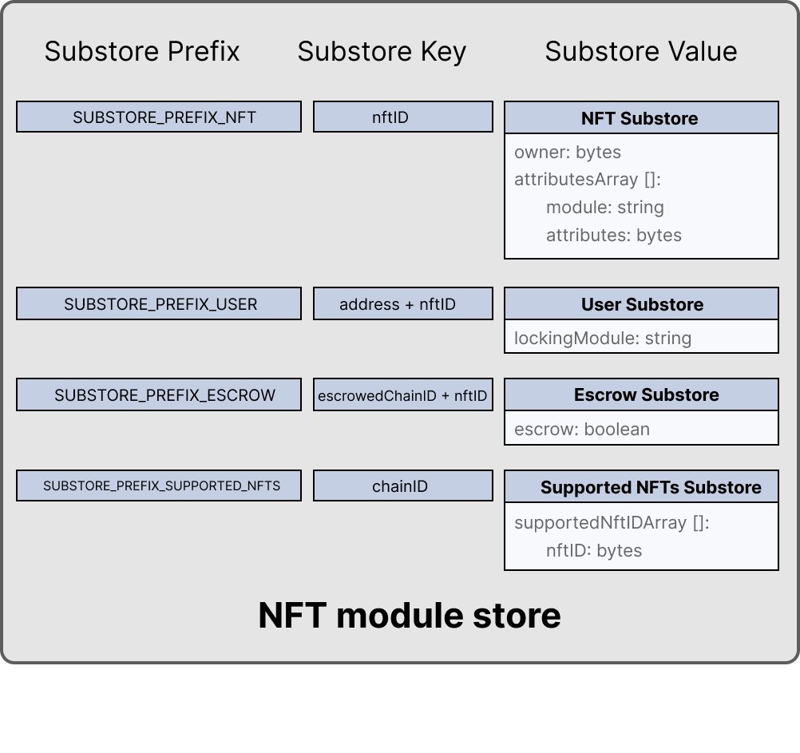

```
LIP: 0052
Title: Introduce NFT module
Author: Maxime Gagnebin <maxime.gagnebin@lightcurve.io>
Discussions-To: https://research.lisk.com/t/introduce-nft-module/297
Status: Draft
Type: Standards Track
Created: 2021-05-22
Updated: 2021-10-19
Requires: 0045
```

## Abstract

This topic introduces an NFT (non-fungible token) module to be used in the Lisk ecosystem for creating, destroying NFTs, and transferring them in the ecosystem.

NFTs are uniquely identified assets. They can be transferred similarly to fungible tokens, but their unique identifiers can never be modified. In this module, NFTs also carry a list of attributes that are used to store information specific to the NFT.

## Copyright

This LIP is licensed under the [Creative Commons Zero 1.0 Universal](https://creativecommons.org/publicdomain/zero/1.0/).

## Motivation

NFTs are very common in the blockchain space and have uses in a wide range of applications. This can go from being the virtual representation of a real world object (art, fashion, event tickets ...) to purely virtual collectibles (crypto kitties, ...).

Therefore, providing a unified module to handle, transfer and modify NFTs is a necessity for the Lisk ecosystem. The module presented here contains all the basic features that are needed to incorporate NFTs in a blockchain ecosystem without being restrictive on the way NFTs will be used by custom modules and applications.

## Rationale

### Technical Glossary

* **Native chain:** with regards to an NFT, this is the chain where the NFT was created.
* **Native NFT:** with regards to a chain, all NFTs created on this chain.
* **Foreign chain:** with regards to an NFT, all chains other than the native chain.

### NFT Module Store



*Figure 1: The NFT module store is divided into 5 substores. All NFTs held by users are stored sequentially in the user substore with keys given by the user address and the NFT ID.*

#### NFT Store

The NFT store contains entries for all NFTs present on the chain, as well as entries for all native NFTs that have been sent cross-chain. Each entry contains three properties, the owner, the locking module ID and the attributes of the NFT. The owner can either be a 20 bytes user address, or a 4 bytes serialization of a chain ID. In the latter case, the token is a native token that has been sent cross-chain and is escrowed.

The locking module ID stores the information regarding the locking status of the NFT. If the NFT is unlocked, this property will have the value `NFT_NOT_LOCKED`, whereas if the NFT is locked, this property will store the ID of the locking module.

Lastly, the NFT stores an attribute property which can be used by custom applications to store information about the NFT, or modify interactions with the NFT.

#### User Substore

In the proposed solution, all NFTs associated with a given address are stored sequentially in the user substore part of the state. In this way, getting all NFTs of a given account can be done efficiently. This is in contrast to specifications (like [ERC 721](https://github.com/ethereum/EIPs/blob/master/EIPS/eip-721.md) without optional extensions) where the NFT owner is only stored as one of the NFTs properties. We think that this feature is useful in an account based blockchain ecosystem and the user substore is designed accordingly.

### NFT Identifier

To identify NFTs in the Lisk ecosystem, we introduce the NFT ID in this proposal. An NFT ID will be unique in the ecosystem. It is built from 3 integers: the [chain ID][research:chain-registration] of the chain creating the token, a collection integer chosen when the token is created and an index which is automatically assigned to the new NFT.

This allows chains to define multiple sets of NFTs, each identified by their respective collection. Each collection can then easily have its own attribute schema and custom logic. For example, an art NFT exchange could have a different collection per artist. The index being then the unique integer associated with each art piece of this artist.

### Cross-chain NFT Transfer

To allow cross-chain transfers of NFTs, we define a specific command which makes use of the [Interoperability module][research:base-interoperability] and creates a [cross-chain message][research:ccm] with the relevant information. When sending NFTs cross-chain, it is crucial that every chain can correctly escrow its native tokens sent to other chains. In this way, a native NFT can never be created by a foreign chain and sent across the ecosystem. When receiving non-native NFTs on a chain, users can query this NFT's native chain to make sure that the NFT is properly escrowed.

#### Transfer To and From the Native Chain

These specifications only allow NFTs to be transferred to and from their native chain. In particular, this means that a token created on chain A cannot be transferred directly from chain B to chain C. This is required to allow the native chain to maintain correctly escrowed NFTs.

### Attributes

Each NFT is stored with an attribute property. This property is a byte sequence that is not deserialized by the NFT module. Each custom module using an NFT collection should define schemas to serialize and deserialize the attribute property of NFTs of their collection.

When an NFT is sent to another chain, the attributes property of the NFT can be modified according to specifications set on the receiving chain. For this reason, custom modules specifying an NFT collection must also implement the behavior to adopt when an NFT is returned with a modified attributes property. This custom behavior will compare the returned attributes with the ones stored with the escrowed NFT. If the returned NFT has an empty attribute, the native chain will restore the attributes as stored, this can be used to save on cross-chain messages size when returning non-modified NFTs to their native chains.

### Protocol Logic for Other Modules

The NFT module provides the following functions to modify the NFT state. Any other modules should use those functions to modify the NFT state. The NFT state should never be modified from outside the module without using one of the provided functions as this could result in unexpected behavior and could cause an improper state transition.

#### create

This function is used to create a new NFT. The NFT will always be native to the chain creating it. The index of the created NFT will be the next available index, as specified by the max index corresponding to the collection.

#### destroy

This function is used to destroy NFTs. The NFT will be removed from the NFT store and cannot be retrieved. The use of this function is limited to destroying native NFTs.

#### transfer

This function is used to transfer ownership of NFTs within one chain.

#### transferCrossChain

This function is used to transfer ownership of NFTs across chains in the Lisk ecosystem.

#### lock

This function is used to lock an NFT to a module ID. A locked NFT cannot be transferred (within the chain or across chains). This can be useful, for example, when the NFT is used as a deposit for a service. A module ID is specified when locking the NFT and this ID has to be specified when unlocking the NFT. This avoids NFTs being accidentally locked and unlocked by different modules.

#### unlock

This function is used to unlock an NFT that was locked to a module ID.

#### setAttributes

This function is used to modify the attributes of NFTs. Each custom module can define the rules surrounding modifying NFT attributes and should call this function. This function will be executed even if the NFT is locked.

#### recover

This function should only be called by the Interoperability module to trigger the recovery of NFTs escrowed to terminated chains.

## Specification

### Constants and Notations

The following constants are used throughout the document:

| Name                                  | Type    | Value           |
|---------------------------------------|---------|-----------------|
| **Interoperability Constants**        |         |                 |
| `MIN_RETURN_FEE`                      | uint64  | 1000            |
| **NFT Module Constants**              |         |                 |
| `MODULE_ID_NFT`                       | uint32  | TBD             |
| `COMMAND_ID_TRANSFER`                 | uint32  | 0               |
| `COMMAND_ID_CROSS_CHAIN_TRANSFER`     | uint32  | 1               |
| `CROSS_CHAIN_COMMAND_ID_TRANSFER`     | uint32  | 0               |
| `CHAIN_ID_ALIAS_NATIVE`               | uint32  | 0               |
| `NFT_NOT_LOCKED`                      | uint32  | `MODULE_ID_NFT` |
| `MAX_BYTE_LENGTH_ATTRIBUTES`          | uint32  | 9 * 1024        |
| `CCM_STATUS_OK`                       | uint32  | 0               |
| `CCM_STATUS_NFT_NOT_SUPPORTED`        | uint32  | 64              |
| `CCM_STATUS_NFT_PROTOCOL_VIOLATION`   | uint32  | 65              |
| **Store Constants**                   |         |                 |
| `STORE_PREFIX_NFT`                    | bytes   | 0x00 00         |
| `STORE_PREFIX_USER`                   | bytes   | 0x80 00         |
| `STORE_PREFIX_COLLECTION`             | bytes   | 0xc0 00         |
| `STORE_PREFIX_AVAILABLE_COLLECTION`   | bytes   | 0xd0 00         |
| `STORE_PREFIX_TERMINATED_ESCROW`      | bytes   | 0xe0 00         |
| `STORE_KEY_LENGTH_NFT`                | uint32  | 16              |
| **General Constants**                 |         |                 |
| `EMPTY_BYTES`                         | bytes   | ""              |
| `ADDRESS_LENGTH`                      | uint32  | 20              |

#### uint32be Function

The function `uint32be(x)` returns the big endian uint32 serialization of an integer `x`, with `0 <= x < 2^32`. This serialization is always 4 bytes long.

#### uint64be Function

The function `uint64be(x)` returns the big endian uint64 serialization of an integer `x`, with `0 <= x < 2^64`. This serialization is always 8 bytes long.

#### length Function

In this LIP, `length(byteSequence)` returns the length in bytes of `byteSequence`.

#### Functions from Other Modules

Calling a function `fct` from the [Interoperability module][research:base-interoperability] is represented by `interoperability.fct(required inputs)`.

### NFT Module Store

The store keys and schemas for value serialization of the NFT store are set as follows:

#### NFT Substore

* The store prefix is set to `STORE_PREFIX_NFT`.
* Each store key is an NFT ID: `uint32be(chainID)||uint32be(collection)||uint64be(index)`.
* Each store value is the serialization of an object following `NFTStoreSchema`.

```java
NFTStoreSchema = {
    "type": "object",
    "required": [
        "owner",
        "lockingModuleID",
        "attributes"
    ],
    "properties": {
        "owner": {
            "dataType": "bytes",
            "fieldNumber": 1
        },
        "lockingModuleID": {
            "dataType": "uint32",
            "fieldNumber": 2
        },
        "attributes": {
            "dataType": "bytes",
            "fieldNumber": 3
        }
    }
}
```

#### User Substore

* The store prefix is set to `STORE_PREFIX_USER`.
* Each store key is a 20-byte address and an NFT ID: `address||uint32be(chainID)||uint32be(collection)||uint64be(index)`.
* Each store value is the serialization of an object following `userStoreSchema`.

```java
userStoreSchema = {
    "type": "object",
    "required": ["exists"],
    "properties": {
        "exists": {
            "dataType": "boolean",
            "fieldNumber": 1
        }
    }
}
```

#### Collection Substore

* The store prefix is set to `STORE_PREFIX_COLLECTION`.
* Each store key is a collection: `uint32be(collection)`.
* Each store value is the serialization of an object following `collectionStoreSchema`.

```java
collectionStoreSchema = {
    "type": "object",
    "required": ["nextAvailableIndex"],
    "properties": {
        "nextAvailableIndex": {
            "dataType": "uint64",
            "fieldNumber": 1
        }
    }
}
```

#### Available Collection Substore

* The store prefix is set to `STORE_PREFIX_AVAILABLE_COLLECTION`.
* Each store key is the empty bytes.
* Each store value is the serialization of an object following `availableCollectionStoreSchema`.

```java
availableCollectionStoreSchema = {
    "type": "object",
    "required": ["nextAvailableCollection"],
    "properties": {
        "nextAvailableCollection": {
            "dataType": "uint32",
            "fieldNumber": 1
        }
    }
}
```

#### Terminated Escrow Substore

* The store prefix is set to `STORE_PREFIX_TERMINATED_ESCROW`.
* Each store key is a chain ID: `uint32be(chainID)`.
* Each store value is the serialization of an object following `terminatedEscrowStoreSchema`.

```java
terminatedEscrowStoreSchema = {
    "type": "object",
    "required": ["escrowTerminated"],
    "properties": {
        "escrowTerminated": {
            "dataType": "boolean",
            "fieldNumber": 1
        }
    }
}
```

#### Store Notation

For the rest of this proposal:

* Let `NFTStore(nftID)` be the NFT store entry with store prefix `STORE_PREFIX_NFT` and store key `uint32be(nftID.chainID)||uint32be(nftID.collection)||uint64be(nftID.index)`.
* Let `userStore(address, nftID)` be the user substore entry with store key `address||uint32be(nftID.chainID)||uint32be(nftID.collection)||uint64be(nftID.index)`.
* Let `collectionStore(collection)` be the collection substore entry with store key `uint32be(collection)`.
* Let `terminatedStore(chainID)` be the `escrowTerminated` property of the terminated escrow substore entry with store key `uint32be(chainID)`. If the store entry does not exist, the function returns `False`.
* Let `nextAvailableCollection` be the `nextAvailableCollection` property of the entry of the available collection substore.

### NFT Identification

All NFTs in the ecosystem are identified by the three values `chainID`, `collection` and `index`.

- `chainID` is always the chain ID of the chain that created the NFT,
- `collection` is an integer specified at NFT creation,
- `index` is assigned at NFT creation to the next available index in the collection.

In this LIP, the NFT identifier is written as a dictionary of 3 elements `{"chainID": chainID, "collection": collection, "index": index}`. This is for example used in all input formats for the module's exposed logics. This allows the exposed logic interfaces to be simple and uniform. This choice follows a potential way how the module could be implemented in JavaScript, the same behavior could be implemented with a named tuple in Python.

#### NFT ID and Native NFT

NFTs on their native chain are identified by the three values `{"chainID": CHAIN_ID_ALIAS_NATIVE, "collection": collection, "index": index}`. The same NFT in other chains would be identified by the three values `{"chainID": nativeChainID, "collection": collection, "index": index}`, `nativeChainID` being the chain ID of the chain where the NFT was created.

#### Supported NFTs

The NFT module contains a function used when receiving cross-chain NFT transfers to assert the support for non-native NFTs. It should return a boolean, depending on the configuration of the NFT module. For the rest of this LIP, this function is written `NFTSupported(nftID)`.

### Internal Functions

#### createNFTEntry

```python
createNFTEntry(nftID, address, moduleID, givenAttributes):
    create a store entry with
        storePrefix = STORE_PREFIX_NFT
        storeKey =  uint32be(nftID.chainID)
                      || uint32be(nftID.collection)
                      || uint64be(nftID.index)

        storeValue = {
            "owner": address,
            "lockingModuleID": moduleID,
            "attributes": givenAttributes
        } serialized using NFTStoreSchema
```

#### deleteNFTEntry

```python
deleteNFTEntry(nftID):
    delete the store entry with
        storePrefix = STORE_PREFIX_NFT
        storeKey = uint32be(nftID.chainID)
                     || uint32be(nftID.collection)
                     || uint64be(nftID.index)
```

#### createUserEntry

```python
createUserEntry(address, nftID):
    create an store entry with
        storePrefix = STORE_PREFIX_USER
        storeKey = address
                     || uint32be(nftID.chainID)
                     || uint32be(nftID.collection)
                     || uint64be(nftID.index)
        storeValue = {"exists": True} serialized using userStoreSchema
```

#### deleteUserEntry

```python
deleteUserEntry(address, nftID):
    delete the store entry with
        storePrefix = STORE_PREFIX_USER
        storeKey = address
                     || uint32be(nftID.chainID)
                     || uint32be(nftID.collection)
                     || uint64be(nftID.index)
```

#### terminateEscrow

```python
terminateEscrow(chainID):
    create the store entry with
        storePrefix = STORE_PREFIX_TERMINATED_ESCROW.
        storeKey    = uint32be(chainID)
        storeValue  = {"escrowTerminated": True} serialized according to terminatedEscrowStoreSchema
```

#### canonicalNFTID

```python
canonicalNFTID(nftID):
    if nftID.chainID == interoperability.getOwnChainAccount().ID
        return {"chainID": CHAIN_ID_ALIAS_NATIVE, "collection": nftID.collection, "index": nftID.index}
    else:
        return nftID
```

This function will return the input `nftID` in the case `interoperabiliby.getOwnChainAccount()` cannot be called.

### NFT Attributes

For all NFT collections, native chains must implement the function `getNewAttributes(collection, storedAttributes, receivedAttributes)` which is used whenever an NFT from this collection is received from another chain. The function `getNewAttributes` must always return a byte array of length at most `MAX_BYTE_LENGTH_ATTRIBUTES` bytes.

For all values of `collection` and `storedAttributes`, this function must be defined as `getNewAttributes(collection, storedAttributes, EMPTY_BYTES) = storedAttributes`.

This function's default behavior is to always overwriting the received attributes with the ones in the NFT substore:

```python
defaultGetNewAttributes(collection, storedAttributes, receivedAttributes):
    return storedAttributes
```

### NFTs in Genesis Blocks

The genesis block of a chain can have a non-empty NFT store. The distribution of NFTs at genesis is left to sidechain developers and must only follow few restrictions:

* No escrow entries (entries with store prefix `ESCROW_STORE_PREFIX`) should exist in the genesis block.
* Only NFTs with `chainID == CHAIN_ID_ALIAS_NATIVE` exist in the genesis block. They must all have a 20 byte owner and the corresponding entry in the user substore must exist (entry with store key being `owner||uint32be(chainID)||uint23be(collection)||uint64be(index)`).
* For all collections, the maximal index of all NFTs of this collection, over all existing NFT entries, must be strictly smaller than `collectionStore(collection).nextAvailableIndex`.
* `nextAvailableCollection > collection` for all `collection` such that `collectionStore(collection)` exists.

### Commands

The module provides the following commands to modify the NFT store.

#### NFT Transfer

Transactions executing this command have:

* `moduleID = NFT_MODULE_ID`
* `commandID  = COMMAND_ID_TRANSFER`

##### Parameters Schema

The `params` property of an NFT transfer transaction follows the schema `NFTTransferParams`.

```java
NFTTransferParams = {
    "type": "object",
    "required": [
        "nftID",
        "recipientAddress"
    ],
    "properties": {
        "nftID": {
            "type": object,
            "fieldNumber": 1,
            "required": [
                "chainID",
                "collection",
                "index"
            ],
            "properties": {
                "chainID": {
                    "dataType": "uint32",
                    "fieldNumber": 1
                },
                "collection": {
                    "dataType": "uint32",
                    "fieldNumber": 2
                },
                "index": {
                    "dataType": "uint64",
                    "fieldNumber": 3
                }
            }
        },    
        "recipientAddress": {
            "dataType": "bytes",
            "fieldNumber": 2
        }
    }
}
```

##### Parameters Validity

The `params` property of an NFT transfer transaction is valid if:

* `recipientAddress` must be a byte array of length `ADDRESS_LENGTH`.

##### Execution

When executing this command, the following is done:

```python
derive senderAddress from trs.senderPublicKey
let nftID as given in trs.params

if NFTStore(nftID).lockingModuleID != NFT_NOT_LOCKED:   
    execution fails  
if NFTStore(nftID).owner != senderAddress:   
    execution fails

deleteUserEntry(senderAddress, nftID)
createUserEntry(recipientAddress, nftID)
NFTStore(nftID).owner = recipientAddress
```

#### Cross-chain NFT Transfer

Transactions executing this command have:

* `moduleID = NFT_MODULE_ID`
* `commandID  = COMMAND_ID_CROSS_CHAIN_TRANSFER`

##### Parameters Schema

The `params` property of a cross-chain NFT transfer transaction follows the schema `crossChainTransferParams`.

```java
crossChainTransferParams = {
    "type": "object",
    "required": [
        "nftID",   
        "receivingChainID",
        "recipientAddress",
        "messageFee"
    ],
    "properties": {
        "nftID": {
            "type": object,
            "fieldNumber": 1,
            "required": [
                "chainID",
                "collection",
                "index"
            ],
            "properties": {
                "chainID": {
                    "dataType": "uint32",
                    "fieldNumber": 1
                },
                "collection": {
                    "dataType": "uint32",
                    "fieldNumber": 2
                },
                "index": {
                    "dataType": "uint64",
                    "fieldNumber": 3
                }
            }
        },
        "receivingChainID": {
            "dataType": "uint32",
            "fieldNumber": 2
        },
        "recipientAddress": {
            "dataType": "bytes",
            "fieldNumber": 3
        },
        "messageFee": {
            "dataType": "uint64",
            "fieldNumber": 4
        }
    }
}
```

##### Parameters Validity

The `params` property of a cross-chain NFT transfer transaction is valid if:

* `recipientAddress` is a byte array of length `ADDRESS_LENGTH`,
* `tokenID.chainID` is either `CHAIN_ID_ALIAS_NATIVE` or `receivingChainID`,

##### Execution

When executing a cross-chain NFT transfer transaction `trs`, the following is done:

* Derive `senderAddress` from `trs.senderPublicKey`.
* Execute the same logic as the function

```java
timestamp = timestamp of the block including the execution of this command
transferCrossChain(timestamp,
                   senderAddress,
                   trs.params.receivingChainID,
                   trs.params.recipientAddress,
                   trs.params.nftID,
                   trs.params.messageFee)
```

### Executing Cross-chain Messages

#### Cross-chain NFT Transfer Message

Cross-chain messages executing this cross-chain command have:

* `moduleID = NFT_MODULE_ID`,
* `commandID  = CROSS_CHAIN_COMMAND_ID_TRANSFER`

##### Message Parameters Schema

The `params` property of cross-chain NFT transfers follows the `crossChainTransferMessageParams` schema.

```java
crossChainTransferMessageParams = {
    "type": "object",
    "required": [
        "nftID",   
        "senderAddress"
        "recipientAddress",
        "attributes"
    ],
    "properties": {
        "nftID": {
            "type": object,
            "fieldNumber": 1,
            "required": [
                "chainID",
                "collection",
                "index"
            ],
            "properties": {
                "chainID": {
                    "dataType": "uint32",
                    "fieldNumber": 1
                },
                "collection": {
                    "dataType": "uint32",
                    "fieldNumber": 2
                },
                "index": {
                    "dataType": "uint64",
                    "fieldNumber": 3
                }
            }
        },
        "senderAddress": {
            "dataType": "bytes",
            "fieldNumber": 2
        },
        "recipientAddress": {
            "dataType": "bytes",
            "fieldNumber": 3
        },
        "attributes": {
            "dataType": "bytes",
            "fieldNumber": 4
        }
    }
}
```

##### Execution

When executing a cross-chain NFT transfer message `CCM`, the logic below is followed.

```python
nftID = CCM.params.nftID
chainID = nftID.chainID
sendingChainID = CCM.sendingChainID
senderAddress = CCM.params.senderAddress
recipientAddress = CCM.params.recipientAddress
receivedAttributes = CCM.params.attributes
ownChainID = interoperability.getOwnChainAccount().ID

if (chainID not in [ownChainID, sendingChainID]
    or length(senderAddress) != ADDRESS_LENGTH
    or length(recipientAddress) !=  ADDRESS_LENGTH
    or length(receivedAttributes) > MAX_BYTE_LENGTH_ATTRIBUTES
    or (chainID == ownChainID
        and NFTStore(nftID).owner != uint32(sendingChainID))
    or (chainID == sendingChainID
        and NFTStore(nftID) exists)):  
    if  (CCM.fee >= MIN_RETURN_FEE * length(CCM)
        and CCM.status == CCM_STATUS_OK):
        interoperability.error(CCM, CCM_STATUS_NFT_PROTOCOL_VIOLATION)
    terminateEscrow(sendingChainID)
    stop CCM execution

if chainID == ownChainID:
    oldAttributes = NFTStore(nftID).attributes
    if CCM.status == CCM_STATUS_OK:
        newAttributes = getNewAttributes(nftID.collection,
                                         oldAttributes,
                                         receivedAttributes)
        newRecipientAddress = recipientAddress
    else:
        newAttributes = oldAttributes
        newRecipientAddress = senderAddress

    nftID = canonicalNFTID(nftID)
    NFTStore(nftID).owner = newRecipienAddress
    NFTStore(nftID).attributes = newAttributes
    createUserEntry(newRecipientAddress, nftID)

else: # chainID == sendingChainID
    if NFTSupported(nftID) == FALSE:
        if (CCM.fee >= MIN_RETURN_FEE * length(CCM)
            and CCM.status == CCM_STATUS_OK):
            interoperability.error(CCM, CCM_STATUS_NFT_NOT_SUPPORTED)
        stop CCM execution
    if CCM.status == CCM_STATUS_OK:
        createNFTEntry(nftID,
                       recipientAddress,
                       receivedAttributes)
        createUserEntry(recipientAddress, nftID)
    else:
        createNFTEntry(nftID,
                       senderAddress,
                       receivedAttributes)
        createUserEntry(senderAddress, nftID)
```


### Genesis Block Processing

#### Genesis Assets Schema

```java
genesisNFTStoreSchema = {
    "type": "object",
    "required": [
        "NFTSubstore",
        "collectionSubstore",
        "availableLocalIDSubstore",
        "terminatedEscrowSubstore"
    ],
    "properties": {
        "NFTSubstore": {
            "type": "array",
            "fieldNumber": 1,
            "items": {
                "type": "object",
                "required": ["owner", "lockingModuleID", "attributes"],
                "properties": {
                    "NFTID": {
                        "type": "object",
                        "fieldNumber": 2,
                        "required": ["chainID", "collection", "index"],
                        "properties": {
                            "chainID": {
                                "dataType": "uint32",
                                "fieldNumber": 1
                            },
                            "collection": {
                                "dataType": "uint32",
                                "fieldNumber": 2
                            },
                            "index": {
                                "dataType": "uint32",
                                "fieldNumber": 3
                            }
                        }
                    },
                    "owner": {
                        "dataType": "bytes",
                        "fieldNumber": 2
                    },
                    "lockingModuleID": {
                        "dataType": "uint32",
                        "fieldNumber": 3
                    },
                    "attributes": {
                        "dataType": "bytes",
                        "fieldNumber": 4
                    }
                }
            }
        },
        "collectionSubstore": {
            "type": "array",
            "fieldNumber": 1,
            "items": {
                "type": "object",
                "required": ["collection", "nextAvailableIndex"],
                "properties": {
                    "collection": {
                        "dataType": "uint32",
                        "fieldNumber": 1
                    },
                    "nextAvailableIndex": {
                        "dataType": "uint64",
                        "fieldNumber": 2
                    }
                }
            }
        },
        "availableCollectionSubstore": {
            "dataType": "uint32",
            "fieldNumber": 1
        },
        "terminatedEscrowSubstore": {
            "type": "array",
            "fieldNumber": 1,
            "items": {
                "type": "uint32"
            }
        }
    }
}
```

#### Genesis State Initialization

During the genesis state initialization stage, the following steps are executed. If any step fails, the block is discarded and has no further effect.

Let `genesisBlockAssetBytes` be the `data` bytes included in the block assets for the NFT module and let `genesisBlockAssetObject` be the deserialization of `genesisBlockAssetBytes` according to the `genesisNFTStoreSchema` schema, given above.

* Initial checks:
   * Accross all elements of the `NFTSubstore` array, all values given for `NTFID` must be unique. 
   * For all elements of the `NFTSubstore` array, all values given for `chainID` must have length 20 (representing a user address) or 4 (representing a chain ID).
   * For all elements of the `NFTSubstore` array, if the value of `owner` has length 4 (representing an escrowed NFT) then the corresponding `NFTID.chainID` must equal `CHAIN_ID_ALIAS_NATIVE`.
   * For all elements of the `NFTSubstore` array, if the value of `attributes` has length less than or equal to `MAX_BYTE_LENGTH_ATTRIBUTES`.
   * Accross all element of the `collectionSubstore` array, all values given for `collection` must be unique.

* For each entry `NFTEntry` in `genesisBlockAssetObject.NFTSubstore`, create an entry in the NFT substore  with
  ```python
  storeKey = uint32be(NFTEntry.NFTID.chainID) || uint32be(NFTEntry.NFTID.collection) || uint64be(NFTEntry.NFTID.index)
  storeValue = {"owner": NFTEntry.owner,
                "lockingModuleID": NFTEntry.lockingModuleID,
                "attributes": NFTEntry.attributes
               } serialized using NFTStoreSchema.
  ```
  Further, if `NFTEntry.owner` has length 20, create an entry in the user substore with
  ```python
  storeKey = NFTEntry.owner || uint32be(NFTEntry.NFTID.chainID) || uint32be(NFTEntry.NFTID.collection) || uint64be(NFTEntry.NFTID.index)
  storeValue = {"exists": True} serialized using userStoreSchema.
  ```

* For each entry `collectionEntry` in `genesisBlockAssetObject.collectionSubstore`, create an entry in the collection substore  with
  ```python
  storeKey = uint32be(collectionEntry.collection)
  storeValue = {"nextAvailableIndex": collectionEntry.nextAvailableIndex} serialized using collectionStoreSchema.
  ```

* Create an entry in the available collection substore with
  ```python
  storeKey = EMPTY_BYTES
  storeValue = {"nextAvailableCollection": genesisBlockAssetObject.availableCollectionSubstore} 
               serialized using availableCollectionStoreSchema.
  ```

* For each entry `terminatedChainID` in `genesisBlockAssetObject.terminatedEscrowSubstore`, create an entry in the terminated escrow substore with
  ```python
  storeKey = uint32be(terminatedChainID)
  storeValue = {"escrowTerminated": True} serialized using terminatedEscrowStoreSchema.
  ```
  
Once the module store is initialized, its validity is attested asserting that the function below returns `True`.
```python
NFTStoreValid():
    existingIndex = {}
    for storeKey a store key in NFT substore:
        chainID = storeKey[0:4] # part of the key corresponding to the chain ID of the NFT
        collection = storeKey[4:8] # part of the key corresponding to the collection of the NFT
        index = storeKey[8:12] # part of the key corresponding to the index of the NFT
        if chainID == CHAIN_ID_ALIAS_NATIVE:
            existingIndex[collection] = max{existingIndex[collection], index}
    
    # check that all existing indices are smaller than the next available index for the collection
    for collection in existingIndex:
        nextAvailableIndex = store value of the collection substore entry with store key 'collection'
        if nextAvailableIndex <= existingIndex[collection]:
        return False
        
    # check that the largest existing collection is smaller than the recorded available collection
    maxCollection = max key of the existingIndex dictionary, -1 if existingIndex is empty
    nextAvailableCollection = store value of the available collection substore
    if nextAvailableCollection <= maxCollection:
        return False
    
    return True
```


### Protocol Logic for Other Modules

#### getAttributes

This function returns the attributes of an NFT.

```python
getAttributes(address, nftID):
    nftID = canonicalNFTID(nftID)
    if NFTStore(nftID) exists:
        return NFTStore(nftID).attributes
    else:
        return entry does not exist
```

#### getLockingModuleID

This function returns the locking status of an NFT.

```python
getLockingModuleID(nftID):
    nftID = canonicalNFTID(nftID)
    if NFTStore(nftID) exists:
        return NFTStore(nftID).lockingModuleID
    else:
        return entry does not exist
```

#### getNFTowner

This function returns the owner of an NFT.

```python
getNFTowner(nftID):
    nftID = canonicalNFTID(nftID)
    if NFTStore(nftID) exists:
        return NFTStore(nftID).owner
    else:
        return entry does not exist
```

#### isTerminated

This function returns the escrow status of a chain.

```python
isTerminated(chainID):
    if terminatedStore(chainID) == True:
        return True
    else:
        return False
```

#### getNextAvailableIndex

This function returns the max index of a collection.

```python
getNextAvailableIndex(collection):
    if collectionStore(collection) does not exist:
        return collection does not exist

    return collectionStore(collection).nextAvailableIndex
```

#### getNextAvailableCollection

This function returns the next available collection.

```python
getNextAvailableCollection():     
    return nextAvailableCollection
```

#### create

This function creates an NFT.

```python
create(address, collection, attributes):
    if (length(attributes) > MAX_BYTE_LENGTH_ATTRIBUTES bytes
        or collectionStore(collection) does not exist):
        create fails

    index = collectionStore(collection).nextAvailableIndex
    nftID = {"chainID": CHAIN_ID_ALIAS_NATIVE,
             "collection": collection,
             "index": index}
    createNFTEntry(nftID, address, attributes)   
    createUserEntry(address, nftID)
    collectionStore(collection).nextAvailableIndex += 1
```

#### destroy

This function destroys an NFT.

```python
destroy(nftID):
    nftID = canonicalNFTID(nftID)
    if (nftID.chainID != CHAIN_ID_ALIAS_NATIVE
        or NFTStore(nftID) does not exist):
        destroy fails

    address = NFTStore(nftID).owner
    deleteNFTEntry(nftID)
    deleteUserEntry(address, nftID)
```

#### initializeCollection

This function creates a new collection substore entry.

```python
initializeCollection(collection):
    if collectionStore(collection) exists:
        initializeCollection fails

    create an entry in the collection substore with
        storeKey = uint32be(collection)
        storeValue = {"nextAvailableIndex": 0) serialized using collectionStoreSchema

    if collection >= nextAvailableCollection:
        nextAvailableCollection = collection + 1
    return collection
```

#### transfer

This function transfers ownership of NFTs within one chain.

```python
transfer(senderAddress, recipientAddress, nftID):
    nftID = canonicalNFTID(nftID)
    if (NFTStore(nftID).lockingModuleID != NFT_NOT_LOCKED
        or NFTStore(nftID).owner != senderAddress):   
        transfer fails

    deleteUserEntry(senderAddress, nftID)
    createUserEntry(recipientAddress, nftID)
    NFTStore(nftID).owner = recipientAddress
```

#### transferCrossChain

This function transfers ownership of NFTs across chains in the Lisk ecosystem.

```python
transferCrossChain(timestamp,
                   senderAddress,
                   receivingChainID,
                   recipientAddress,
                   nftID,
                   messageFee,
                   includeAttributes):

    nftID = canonicalNFTID(nftID)
    chainID = nftID.chainID
    if (chainID not in [CHAIN_ID_ALIAS_NATIVE, receivingChainID]
        or length(senderAddress) != ADDRESS_LENGTH
        or length(recipientAddress) !=  ADDRESS_LENGTH
        or NFTStore(nftID).owner != senderAddress
        or NFTStore(nftID).lockingModuleID != NFT_NOT_LOCKED
        or (terminatedStore(sendingChainID) == True
            and chainID == CHAIN_ID_ALIAS_NATIVE)):
        transferCrossChain fails

    if includeAttributes == True:
        attributes = NFTStore(nftID).attributes
    else:
        attributes = EMPTY_BYTES

    deleteUserEntry(address, nftID)
    if chainID == CHAIN_ID_ALIAS_NATIVE:  
        NFTStore(nftID).owner = uint32be(receivingChainID)
        nftID.chainID = interoperability.getOwnChainAccount().ID
    else:
        deleteNFTEntry(nftID)  

    messageParams = {
        "nftID": nftID,
        "senderAddress": senderAddress,
        "recipientAddress": recipientAddress
        "attributes": attributes,
    }

    serializedParams = serialization of messageParams following
                      crossChainTransferMessageParams schema

    interoperability.send(timestamp,
                          NFT_MODULE_ID,
                          CROSS_CHAIN_COMMAND_ID_TRANSFER,
                          receivingChainID,
                          messageFee,
                          senderAddress,
                          serializedParams)
```

#### lock

This function locks an NFT to a given module ID.

```python
lock(moduleID, nftID):
    nftID = canonicalNFTID(nftID)
    if NFTStore(nftID).lockingModuleID != NFT_NOT_LOCKED:
        lock fails

    NFTStore(nftID).lockingModuleID = moduleID
```

#### unlock

This function unlocks an NFT that was locked to a module ID.

```python
unlock(moduleID, nftID):
    nftID = canonicalNFTID(nftID)
    if NFTStore(nftID).lockingModuleID != moduleID:
        unlock fails

    NFTStore(nftID).lockingModuleID = NFT_NOT_LOCKED
```

#### setAttributes

This function modifies the attributes of NFTs.

```python
setAttributes(newAttributes, nftID):
    nftID = canonicalNFTID(nftID)
    if (NFTStore(nftID) does not exist
        or length(newAttributes) > MAX_BYTE_LENGTH_ATTRIBUTES):
        setAttributes fails

    NFTStore(nftID).attributes = newAttributes
```

#### recover

This function should only be called by the interoperability module. It recovers NFTs escrowed to terminated chains.

```python
recover(terminatedChainID, moduleID, storePrefix, storeKey, storeValue):
    if (storePrefix != STORE_PREFIX_NFT:
        or length(storeKey) != STORE_KEY_LENGTH_NFT):
        recover fails

    chainID = first 4 bytes of storeKey deserialized as uint32be
    collection = bytes 5 to 8 of storeKey deserialized as uint32be
    index = last 8 bytes of storeKey deserialized as uint64be
    nftID = {"chainID": chainID, "collection": collection, "index": index}

    if (chainID != interoperability.getOwnChainAccount().ID
        or NFTStore(nftID).owner != uint32be(terminatedChainID)
        or storeValue does not follow nftStoreSchema):
        recover fails
    nftValue = storeValue deserialized according to nftStoreSchema
    if length(nftValue.owner) != ADDRESS_LENGTH:
        recover fails  

    NFTStore(nftID).owner = nftValue.owner
    storedAttributes = NFTStore(nftID).attributes
    newAttributes = nftValue.attributes
    NFTStore(nftID).attributes =  getNewAttributes(collection, storedAttributes, newAttributes)
```

### Endpoints for Off-Chain Services

TBA

## Backwards Compatibility

Chains adding support for the NFT module specified in this document need to do so with a hard fork. This proposal does not imply a fork for the Lisk mainchain.

## Reference Implementation

TBA

[research:base-interoperability]: https://research.lisk.com/t/introduce-interoperability-module/290
[research:ccm]: https://research.lisk.com/t/cross-chain-messages/299
[research:ccu]: https://research.lisk.com/t/introduce-cross-chain-update-transactions/298
[research:chain-registration]: https://research.lisk.com/t/chain-registration/291
[research:sidechain-recovery]: https://research.lisk.com/t/sidechain-recovery-transactions/292
[research:token-module]: https://research.lisk.com/t/introduce-an-interoperable-token-module/295
