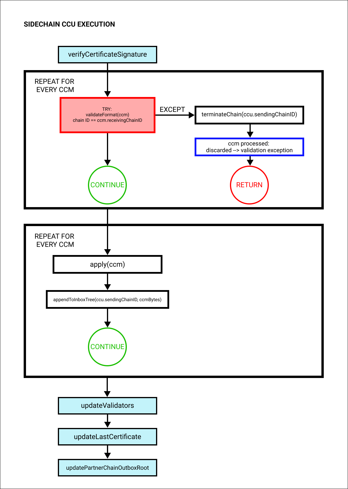

```
LIP: 0053
Title: Introduce cross-chain update mechanism
Author: Maxime Gagnebin <maxime.gagnebin@lightcurve.io>
        Alessandro Ricottone <alessandro.ricottone@lightcurve.io>
Discussions-To: https://research.lisk.com/t/introduce-cross-chain-update-mechanism/298
Status: Draft
Type: Standards Track
Created: 2021-05-22
Updated: 2023-07-19
Requires: 0045, 0049, 0058, 0061
```

## Abstract

This LIP introduces _cross-chain update transactions_ which are used to post certified information and cross-chain messages in Lisk ecosystem chains.

Cross-chain update transactions are the carriers of the information transmitted between chains. By posting a cross-chain update, the receiving chain gets the information required about the advancement of the sending chain. The transaction can also include cross-chain messages and thus serves as an envelope for messages from one chain to another.

## Copyright

This LIP is licensed under the [Creative Commons Zero 1.0 Universal](https://creativecommons.org/publicdomain/zero/1.0/).

## Motivation

Motivation for the Lisk Interoperability module and the cross-chain update transaction can be found in [LIP 0045][lip-0045].

## Rationale

### Cross-chain Update Transaction Properties

#### sendingChainID

Identifies the chain sending the cross-chain update. Only cross-chain update transactions coming from [registered][lip-0043] chains are valid, registered chains are the ones with an entry in the interoperability store corresponding to their `chainID`.

#### certificate

Used to update the cross-chain account. It must be a certificate with an adequate [BLS signature][lip-0038]. The signature is always validated against the BLS keys and the BFT weights stored in the sending chain validators account.

It is important to note here that the validation of this signature is done with respect to the chain identifier of the sending chain. This chain identifier is included in the sending chain account in the interoperability store.

#### activeValidatorsUpdate

The `activeValidatorsUpdate` property contains the update to the active validators of the chain sending the certificate. It is used to calculate the new `validatorsHash`. It contains the following properties.

##### blsKeysUpdate

The chain account stores an array containing the BLS keys and BFT weights required to validate the certificate signature. This array has to be updated if the validator set changes in the chain sending the certificate. The `blsKeysUpdate` property contains the BLS keys of new validators.

##### bftWeightsUpdate

The `bftWeightsUpdate` property contains the update to the BFT weights of the chain validators, possibly including the BFT weights of the new validators with BLS keys given in `blsKeysUpdate`.

##### bftWeightsUpdateBitmap

This property is used to indicate the validators for which the BFT weight has been updated.

#### certificateThreshold

The chain account stores the threshold required to validate the certificate signature. The `certificateThreshold` property of the CCU contains the value currently used in the chain sending the certificate (which may update the value stored in the chain account).

#### inboxUpdate

The `inboxUpdate` contains the information relative to the messages to be included in the sending chain inbox. As specified in [LIP 0045][lip-0045], cross-chain messages are appended to a Merkle tree whose root, append path, and size are stored in the chain outbox on the sending chain and in the corresponding inbox on the receiving chain. The `inboxUpdate` contains three elements: the cross-chain messages themselves, an inclusion witness with respect to the outbox root, and an inclusion witness of this outbox root with respect to the state root.

##### crossChainMessages

An array of cross-chain messages. See [LIP 0049][lip-0049] for the general properties and processing of cross-chain messages. The `crossChainMessages` property must contain consecutive messages from the outbox.

##### messageWitnessHashes

In the sending chain, all cross-chain messages are added to a regular Merkle tree attested by the outbox root. The `messageWitnessHashes` are the sibling hashes necessary for the Merkle proof.

This Merkle proof is required if not all messages necessary to recompute the outbox root were given in `crossChainMessages`. If all messages required to compute the outbox root are included in `crossChainMessages` then `messageWitnessHashes` can be left empty.

##### outboxRootWitness

The outbox root of the sending chain is part of a sparse Merkle tree attested by the state root (provided in the certificate). The `outboxRootWitness` property is an inclusion proof with respect to the state root of the outbox root computed from the receiving chain inbox, `crossChainMessages` and `messageWitnessHashes`. If the cross-chain update transaction contains an empty certificate, this property can also be left empty, as the required root was already attested in a previous cross-chain update.

### Posting Cross-chain Updates on Mainchain and on Sidechains

As the roles of both mainchain and sidechain are quite different, so are the transactions used to post cross-chain updates. The most notable differences are:

- On the mainchain, all CCMs included in the `inboxUpdate` must have their `sendingChainID` equal to the chainID sending the cross-chain update.
- On sidechains, all CCMs included in the `inboxUpdate` must have their `receivingChainID` equal to the chainID of the sidechain receiving the cross-chain update, except for CCMs that have been bounced on the mainchain (for which the status is set to 'channel unavailable' and the `receivingChainID` is set to the sidechain ID).
- As the mainchain accepts CCMs with `receivingChainID` corresponding to another sidechain, the cross-chain update processing on the mainchain is responsible for the inclusion of those CCMs in the corresponding outbox.

These points guarantee that the CCMs are always forwarded to the correct chains and that the receiving chain can be confident that the chain specified in `ccm.sendingChainID` was truly the chain issuing the CCM.

### Cross-chain Command Processing Stages

The [execution of cross-chain messages][lip-0049#apply] as part of the processing of a cross-chain update is done in several stages, in a way analogous to the execution of a transaction as part of the [processing of a block][lip-0055#block-processing-stages]:

1. **Cross-chain message verification**: Each module can define protocol logic that verifies a CCM, possibly by accessing the state store. If an error occurs, the channel with the CCU sending chain is terminated and the CCU execution stops.
2. **Cross-chain command verification**: Before verifying the cross-chain command, the parameters are decoded using `decode` function and validated against the schema using `validateObjectSchema`. Then, the cross-chain command corresponding to the CCM `module`-`crossChainCommand` combination is verified. If an error occurs either during parameter validation or cross-chain command verification, the channel with the CCM sending chain is terminated and the CCM execution stops.
3. **Before cross-chain command execution**: Each module can define protocol logic that is processed _before_ the cross-chain command has been executed. If an error occurs, the channel with the CCM sending chain is terminated and the CCM execution stops.
4. **Cross-chain command execution**: The cross-chain command corresponding to the CCM `module`-`crossChainCommand` combination is executed. If an error occurs, the cross-chain message is failed. State transitions that happened in this stage are reverted. If the fee is sufficient, the messaged is sent back to the sending chain. In any case, the processing continues in the next stage.
5. **After cross-chain command execution**: Each module can define protocol logic that is processed _after_ the cross-chain command has been executed. If an error occurs, the channel with the CCM sending chain is terminated and the CCM execution stops.

If an error occurs in stages 2,3, and 5, the CCM is invalid and discarded. All state transitions are reverted and the state is restored to the snapshot before the cross-chain message was processed.

## Specification

The Interoperability module supports two commands used to certify the state of another chain. Those commands have `module = MODULE_NAME_INTEROPERABILITY`. The mainchain cross-chain update, meant to be posted on the mainchain, has `command = COMMAND_SUBMIT_MAINCHAIN_CCU`, while the sidechain cross-chain update, meant to be posted on sidechains, has `command = COMMAND_SUBMIT_SIDECHAIN_CCU`.

### Notation and Constants

All interoperability constants are defined in [LIP 0045][lip-0045#constants].

### Auxiliary Functions

The following auxiliary functions are used internally by the Interoperability module to verify and execute cross-chain updates.
The certificate schema `certificateSchema` is defined in [LIP 0061][lip-0061#certificate-schema].

#### verifyLivenessConditionForRegisteredChains

```python
def verifyLivenessConditionForRegisteredChains(ccu: CCU) -> None:
     certificate = decode(certificateSchema, ccu.params.certificate)
     timestamp = timestamp of the block including ccu
     if timestamp - certificate.timestamp > LIVENESS_LIMIT / 2:
         raise Exception(f"The first CCU with a non-empty inbox update cannot contain a certificate older than {LIVENESS_LIMIT / 2} seconds.")
```

#### verifyCertificate

```python
def verifyCertificate(ccu: CCU) -> None:
    certificateBytes = ccu.params.certificate
    certificate = decode(certificateSchema, certificateBytes)
    validateObjectSchema(certificateSchema, certificate)
    partnerchainID = ccu.params.sendingChainID
    partnerchainAccount = chainAccount(partnerchainID)
    # Certificate height must be greater than last certificate height.
    if certificate.height <= partnerchainAccount.lastCertificate.height:
        raise Exception("Certificate height is not greater than last certificate height.")
    # Certificate timestamp must be smaller than timestamp of the block including the CCU.
    timestamp = timestamp of the block including ccu
    if certificate.timestamp >= timestamp:
        raise Exception("Certificate timestamp is not smaller than timestamp of the block including the CCU.")

    # If the certified validators hash differs from the one stored in the chain account,
    # the CCU must contain a validators update (which is verified in verifyValidatorsUpdate).
    if certificate.validatorsHash != chainAccount(ccu.params.sendingChainID).lastCertificate.validatorsHash:
        validatorsUpdate = ccu.params.activeValidatorsUpdate
        if len(validatorsUpdate.blsKeysUpdate) == 0 and len(validatorsUpdate.bftWeightsUpdate) == 0 and validatorsUpdate.bftWeightsUpdateBitmap == EMPTY_BYTES and ccu.params.certificateThreshold == validators(ccu.params.sendingChainID).certificateThreshold:
            raise Exception("Certifying an update to the validators hash requires an active validators update.")
```

#### verifyCertificateSignature

```python
def verifyCertificateSignature(ccu: CCU) -> None:
    # Certificate signature must be a valid aggregate signature for the sdechain validators.
    certificate = decode(certificateSchema, ccu.params.certificate)
    partnerchainID = ccu.params.sendingChainID
    if not verifyAggregateCertificateSignature(
        validators(partnerchainID).activeValidators,
        validators(partnerchainID).certificateThreshold,
        partnerchainID,
        certificate
    ):
        emitPersistentEvent(
            module = MODULE_NAME_INTEROPERABILITY,
            name = EVENT_NAME_INVALID_CERTIFICATE_SIGNATURE,
            data = {},
            topics = [partnerchainID]
        )
        raise Exception("Certificate signature is not a valid aggregate signature.")
```

`verifyAggregateCertificateSignature` is defined in [LIP 0061][lip-0061#verifyaggregatecertificatesignature].

#### verifyValidatorsUpdate

```python
def verifyValidatorsUpdate(ccu: CCU) -> None:
    if len(ccu.params.certificate) == 0:
        raise Exception("Certificate must be non-empty if validators have been updated.")

    partnerchainID = ccu.params.sendingChainID
    blsKeysUpdate = ccu.params.activeValidatorsUpdate.blsKeysUpdate
    # Validator keys must be in lexicographic order.
    if not all(blsKeysUpdate[i] < blsKeysUpdate[i + 1] for i in range(len(blsKeysUpdate) - 1)):
        raise Exception("New validator keys are not in lexicographic order.")

    currentBLSKeys = [v.blsKey for v in validators(partnerchainID).activeValidators]
    allBLSKeys = sorted(currentBLSKeys + blsKeysUpdate)
    # All validator keys must be distinct.
    if len(allBLSKeys) != len(set(allBLSKeys)):
        raise Exception("Duplicate BLS keys.")

    bftWeightsUpdateBitmap = ccu.params.activeValidatorsUpdate.bftWeightsUpdateBitmap
    # The length of the BFT update bitmap should equal the ceiling of the length of the keys list divided by 8.
    if len(bftWeightsUpdateBitmap) != (len(allBLSKeys) + 7) // 8:
        raise Exception("BFT update bitmap length is not equal to the ceiling of the length of the keys list divided by 8.")

    # The number of 1s in the bitmap must equal the number of new BFT weights.
    bftWeightsUpdate = ccu.params.activeValidatorsUpdate.bftWeightsUpdate
    if bin(int.from_bytes(bftWeightsUpdateBitmap, 'big')).count("1") != len(bftWeightsUpdate):
        raise Exception("The number of 1s in the bitmap is not equal to the number of new BFT weights.")

    # All new keys must have a positive BFT weight.
    for idx, blsKey in enumerate(allBLSKeys):
        if blsKey in blsKeysUpdate:
            # Get digit of bitmap at index idx (starting from the right).
            digit = (int.from_bytes(bftWeightsUpdateBitmap, 'big') >> idx) & 1
            if digit != 1:
                raise Exception("New validators must have a BFT weight update.")
            if bftWeightsUpdate[idx] == 0:
                raise Exception("New validators must have a positive BFT weight.")

    # Update validator list.
    newActiveValidators = calculateNewActiveValidators(validators(partnerchainID).activeValidators, blsKeysUpdate, bftWeightsUpdate, bftWeightsUpdateBitmap)
    # newActiveValidators must have at least 1 element and at most MAX_NUM_VALIDATORS elements.
    if len(newActiveValidators) < 1 or len(newActiveValidators) > MAX_NUM_VALIDATORS:
        raise Exception(f"Invalid validators array. It must have at least 1 element and at most {MAX_NUM_VALIDATORS} elements.")

    certificateThreshold = ccu.params.certificateThreshold
    # computeValidatorsHash is defined in LIP 0058.
    certificate = decode(certificateSchema, ccu.params.certificate)
    if certificate.validatorsHash != computeValidatorsHash(newActiveValidators, certificateThreshold):
        raise Exception("Validators hash does not match.")
```

#### calculateNewActiveValidators

```python
def calculateNewActiveValidators(activeValidators: list[ActiveValidator], blsKeysUpdate: list[PublicKeyBLS], bftWeightsUpdate: list[uint64], bftWeightsUpdateBitmap: bytes) -> list[ActiveValidator]:
    newValidators = [{"blsKey": blsKey, "bftWeight": 0} for blsKey in blsKeysUpdate]
    newActiveValidators = sorted(activeValidators + newValidators, key = lambda v: v.blsKey)

    # Update BFT weights.
    intBitmap = int.from_bytes(bftWeightsUpdateBitmap, 'big')
    # Revert bftWeightsUpdate to be able to pop from the end.
    bftWeightsUpdate = bftWeightsUpdate.reverse()
    for idx, val in enumerate(newActiveValidators):
        # Get digit of bitmap at index idx (starting from the right) and check if it is 1.
        if (intBitmap >> idx) & 1 == 1:
            # Get BFT weight by consuming the list of new BFT weights.
            val.bftWeight = bftWeightsUpdate.pop()

    # No BFT weights should be left.
    assert len(bftWeightsUpdate) == 0
    # Remove all validators with 0 BFT weight
    return [v for v in newActiveValidators if v.bftWeight > 0]
```

#### verifyOutboxRootWitness

```python
def verifyOutboxRootWitness(ccu: CCU) -> None:
    outboxRootWitness = ccu.params.inboxUpdate.outboxRootWitness
    # The outbox root witness properties must be set either both to their default values
    # or both to a non-default value.
    if outboxRootWitness.bitmap == EMPTY_BYTES and len(outboxRootWitness.siblingHashes) > 0:
        raise Exception("The bitmap in the outbox root witness must be non-mepty if the sibling hashes are non-empty.")
    if outboxRootWitness.bitmap != EMPTY_BYTES and len(outboxRootWitness.siblingHashes) == 0:
        raise Exception("The sibling hashes in the outbox root witness must be non-mepty if the bitmap is non-empty.")

    # The outbox root witness is empty if and only if the certificate is empty
    if outboxRootWitness.bitmap == EMPTY_BYTES and len(ccu.params.certificate) > 0:
        raise Exception("The outbox root witness must be non-empty to authenticate the new partnerChainOutboxRoot.")
    if outboxRootWitness.bitmap != EMPTY_BYTES  and len(ccu.params.certificate) == 0:
        raise Exception("The outbox root witness can be non-empty only if the certificate is non-empty.")
```

#### verifyPartnerChainOutboxRoot

```python
def verifyPartnerChainOutboxRoot(ccu: CCU) -> None:
    partnerchainID = ccu.params.sendingChainID
    inboxTree = Merkle tree of channel(partnerchainID).inbox
    # Update inbox by appending all cross-chain messages.
    # crossChainMessages can be empty.
    for ccmBytes in ccu.params.inboxUpdate.crossChainMessages:
        inboxTree.append(sha256(ccmBytes))

    # calculateRootFromRightWitness is specified in LIP 0031.
    # Notice that if len(ccu.params.inboxUpdate.messageWitnessHashes) == 0, this function returns the same value as inboxTree.root,
    # because all messages have been included in the CCU.
    newInboxRoot = calculateRootFromRightWitness(inboxTree.size, inboxTree.appendPath, ccu.params.inboxUpdate.messageWitnessHashes)

    # Verification for non-empty certificates.
    if len(ccu.params.certificate) > 0:
        outboxRootWitness = ccu.params.inboxUpdate.outboxRootWitness
        outboxKey = STORE_PREFIX_INTEROPERABILITY + SUBSTORE_PREFIX_OUTBOX_ROOT + sha256(OWN_CHAIN_ID)
        proof = {
            siblingHashes: outboxRootWitness.siblingHashes,
            queries: [{
                key: outboxKey,
                value: sha256(encode(outboxRootSchema, newInboxRoot)),
                bitmap: outboxRootWitness.bitmap
            }],
        }

        # verify is specified in LIP 0039.
        certificate = decode(certificateSchema, ccu.params.certificate)
        if verify([outboxKey], proof, certificate.stateRoot) == False:
            raise Exception("Invalid inclusion proof for inbox update.")

    # Verification for empty certificates.
    else:
        if newInboxRoot != channel(partnerchainID).partnerChainOutboxRoot:
            raise Exception("Inbox root does not match partner chain outbox root.")
```

#### verifyCommon

```python
def verifyCommon(ccu: CCU) -> None:
    if ccu.params.sendingChainID == OWN_CHAIN_ID:
        raise Exception("The sending chain cannot be the same as the receiving chain.")

    certificateBytes = ccu.params.certificate
    # An empty object has all properties set to their default values.
    if len(certificateBytes) == 0 and ccu.params.inboxUpdate is empty:
        raise Exception("A cross-chain update must contain a non-empty certificate and/or a non-empty inbox update.")

    # The sending chain account must exist.
    if chainAccount(ccu.params.sendingChainID) does not exist:
        raise Exception("The sending chain is not registered.")

    if not isLive(ccu.params.sendingChainID):
        raise Exception("The sending chain is not live.")

    if chainAccount(ccu.params.sendingChainID).status == CHAIN_STATUS_REGISTERED and len(certificateBytes) == 0:
        raise Exception("Cross-chain updates from chains with status CHAIN_STATUS_REGISTERED must contain a non-empty certificate.")

    if len(certificateBytes) > 0:
        verifyCertificate(ccu)

    validatorsUpdate = ccu.params.activeValidatorsUpdate
    if len(validatorsUpdate.blsKeysUpdate) > 0 or len(validatorsUpdate.bftWeightsUpdate) > 0 or validatorsUpdate.bftWeightsUpdateBitmap != EMPTY_BYTES or ccu.params.certificateThreshold != validators(ccu.params.sendingChainID).certificateThreshold:
        verifyValidatorsUpdate(ccu)

    if ccu.params.inboxUpdate is not empty:
        verifyOutboxRootWitness(ccu)
```

#### updateValidators

```python
def updateValidators(ccu: CCU) -> None:
    validators(ccu.params.sendingChainID).certificateThreshold = ccu.params.certificateThreshold

    validators(ccu.params.sendingChainID).activeValidators = calculateNewActiveValidators(
        validators(ccu.params.sendingChainID).activeValidators,
        ccu.params.activeValidatorsUpdate.blsKeysUpdate,
        ccu.params.activeValidatorsUpdate.bftWeightsUpdate,
        ccu.params.activeValidatorsUpdate.bftWeightsUpdateBitmap
    )
```

#### updateCertificate

```python
def updateCertificate(ccu: CCU) -> None:
    certificate = decode(certificateSchema, ccu.params.certificate)
    chainAccount(ccu.params.sendingChainID).lastCertificate = {
        "height": certificate.height,
        "timestamp": certificate.timestamp,
        "stateRoot": certificate.stateRoot,
        "validatorsHash": certificate.validatorsHash
    }
    # Emit chain account updated event.
    emitEvent(
        module = MODULE_NAME_INTEROPERABILITY,
        name = EVENT_NAME_CHAIN_ACCOUNT_UPDATED,
        data = chainAccount(ccu.params.sendingChainID),
        topics = [ccu.params.sendingChainID]
    )
```

#### updatePartnerChainOutboxRoot

```python
def updatePartnerChainOutboxRoot(ccu: CCU) -> None:
    messageWitnessHashes = ccu.params.inboxUpdate.messageWitnessHashes
    inbox = channel(ccu.params.sendingChainID).inbox
    # calculateRootFromRightWitness is specified in LIP 0031.
    # Notice that if len(messageWitnessHashes) == 0, this function returns the same value as inbox.root,
    # because all messages have been included in the CCU.
    channel(ccu.params.sendingChainID).partnerChainOutboxRoot = calculateRootFromRightWitness(inbox.size, inbox.appendPath, messageWitnessHashes)
```

#### verifyRoutingRules

```python
def verifyRoutingRules(ccu: CCU, ccm: CCM) -> None:
    # Sending and receiving chains must differ.
   if ccm.receivingChainID == ccm.sendingChainID:
       raise Exception("Sending and receiving chains must differ.")

    # Processing on the mainchain.
    if ownChainAccount.chainID == getMainchainID():
        # The CCM must come from the sending chain.
        if ccu.params.sendingChainID != ccm.sendingChainID:
            raise Exception("CCM is not from the sending chain.")
        if ccm.status == CCM_STATUS_CODE_CHANNEL_UNAVAILABLE:
            raise Exception("CCM status channel unavailable can only be set on the mainchain.")
    # Processing on a sidechain.
    else:
        # The CCM must be directed to the sidechain.
        if ownChainAccount.chainID != ccm.receivingChainID:
            raise Exception("CCM is not directed to the sidechain.")
```

#### beforeCrossChainMessagesExecution

Here, we make use of the [`emitCCMEvent` function][lip-0045#emitccmevent] defined in LIP 0045.

```python
def beforeCrossChainMessagesExecution(ccu: CCU) -> None:
    # Verify certificate signature. We do it here because if it fails, the transaction fails rather than being invalid.
    verifyCertificateSignature(ccu)

    if ccu.params.inboxUpdate is not empty:
        # This check is expensive. Therefore, it is done in the execute step instead of the verify
        # step. Otherwise, a malicious relayer could spam the transaction pool with computationally
        # costly CCU verifications without paying fees.
        verifyPartnerChainOutboxRoot(ccu)
        # Initialize the relayer account for the message fee token.
        # This is necessary to ensure that the relayer can receive the CCM fees
        # If the account already exists, nothing is done.
        relayerAddress = sha256(ccu.senderPublicKey)[:ADDRESS_LENGTH]
        messageFeeTokenID = getMessageFeeTokenID(ccu.params.sendingChainID)
        Token.initializeUserAccount(relayerAddress, messageFeeTokenID)

    # Process cross-chain messages in inbox update.
    crossChainMessages = ccu.params.inboxUpdate.crossChainMessages

    # First process basic checks for all CCMs.
    for ccmBytes in crossChainMessages:
        ccmID = sha256(ccmBytes)
        # Set ccmID (instead of the transaction ID) as default topic of this event.
        # The default topic is added automatically by emitEvent.
        eventsDefaultTopic = ccmID
        # Verify general format. Past this point, we can access ccm root properties.
        try:
            ccm = decode(crossChainMessageSchema, ccmBytes)
        except:
            terminateChain(ccu.params.sendingChainID)
            emitEvent(
                module = MODULE_NAME_INTEROPERABILITY,
                name = EVENT_NAME_CCM_PROCESSED,
                data = {"ccm": EMPTY_CCM, "result": CCM_PROCESSED_RESULT_DISCARDED, "code": CCM_PROCESSED_CODE_INVALID_CCM_DECODING_EXCEPTION},
                topics = [ccu.params.sendingChainID, OWN_CHAIN_ID]
            )
            raise Exception("Cross-chain message decoding error.")

        try:
            validateFormat(ccm)
        except:
            terminateChain(ccu.params.sendingChainID)
            ccm.params = EMPTY_BYTES
            emitCCMEvent(ccm, CCM_PROCESSED_RESULT_DISCARDED, CCM_PROCESSED_CODE_INVALID_CCM_VALIDATION_EXCEPTION)
            raise Exception("Cross-chain message validation error.")
        try:
            # Verify whether the CCM respects the routing rules,
            # which differ on mainchain and sidechains.
            verifyRoutingRules(ccu, ccm)
        except:
            terminateChain(ccu.params.sendingChainID)
            emitCCMEvent(ccm, CCM_PROCESSED_RESULT_DISCARDED, CCM_PROCESSED_CODE_INVALID_CCM_ROUTING_EXCEPTION)
            raise Exception("Cross-chain message routing error.")
```

#### afterCrossChainMessagesExecution

```python
def afterCrossChainMessagesExecution(ccu: CCU) -> None:
    # Set the transaction ID back as default topic.
    # The default topic is added automatically by emitEvent.
    eventsDefaultTopic = transaction ID

    # Update partner chain validators.
    validatorsUpdate = ccu.params.activeValidatorsUpdate
    if len(validatorsUpdate.blsKeysUpdate) > 0
        or len(validatorsUpdate.bftWeightsUpdate) > 0
        or validatorsUpdate.bftWeightsUpdateBitmap != EMPTY_BYTES
        or ccu.params.certificateThreshold != validators(ccu.params.sendingChainID).certificateThreshold:
        updateValidators(ccu)

    # Update last certificate.
    if len(ccu.params.certificate) > 0:
        updateCertificate(ccu)

    # Update partner chain outbox root.
    # If no certificate is present, the partner chain outbox root would not change.
    # An empty object has all properties set to their default values.
    if ccu.params.inboxUpdate is not empty and len(ccu.params.certificate) > 0:
        updatePartnerChainOutboxRoot(ccu)
```

### Commands

#### MainchainCrossChainUpdate

This command is used to submit a cross-chain update on the mainchain.

Transactions executing this command have:

- `module = MODULE_NAME_INTEROPERABILITY`,
- `command = COMMAND_SUBMIT_MAINCHAIN_CCU`.

##### Parameters

```java
crossChainUpdateTransactionParams = {
    "type": "object",
    "required": [
        "sendingChainID",
        "certificate",
        "activeValidatorsUpdate",
        "certificateThreshold",
        "inboxUpdate"
    ],
    "properties": {
        "sendingChainID": {
            "dataType": "bytes",
            "length": CHAIN_ID_LENGTH,
            "fieldNumber": 1
        },
        "certificate": {
            "dataType": "bytes",
            "fieldNumber": 2
        },
        "activeValidatorsUpdate": {
            "type": "object",
            "fieldNumber": 3,
            "required": [
                "blsKeysUpdate",
                "bftWeightsUpdate",
                "bftWeightsUpdateBitmap"
            ],
            "properties": {
                "blsKeysUpdate": {
                    "type": "array",
                    "fieldNumber": 1,
                    "items": {
                        "dataType": "bytes",
                        "length": BLS_PUBLIC_KEY_LENGTH
                    }
                },
                "bftWeightsUpdate": {
                    "type": "array",
                    "fieldNumber": 2,
                    "items": {
                        "dataType": "uint64",
                    }
                },
                "bftWeightsUpdateBitmap": {
                    "dataType": "bytes",
                    "fieldNumber": 3
                }
            }
        },
        "certificateThreshold": {
            "dataType": "uint64",
            "fieldNumber": 4
        },
        "inboxUpdate": {
            "type": "object",
            "fieldNumber": 5,
            "required": [
                "crossChainMessages",
                "messageWitnessHashes",
                "outboxRootWitness"
            ],
            "properties": {
                "crossChainMessages": {
                    "type": "array",
                    "fieldNumber": 1,
                    "items": {"dataType": "bytes"}
                },
                "messageWitnessHashes": {
                    "type": "array",
                    "fieldNumber": 2,
                    "items": {
                        "dataType": "bytes",
                        "length": HASH_LENGTH
                    }
                },
                "outboxRootWitness": {
                    "type": "object",
                    "fieldNumber": 3,
                    "required": ["bitmap", "siblingHashes"],
                    "properties": {
                        "bitmap": {
                            "dataType": "bytes",
                            "fieldNumber": 1
                        },
                        "siblingHashes": {
                            "type": "array",
                            "fieldNumber": 2,
                            "items": {
                                "dataType": "bytes",
                                "length": HASH_LENGTH
                            }
                        }
                    }
                }
            }
        }
    }
}
```

##### Verification

```python
def verify(trs: Transaction) -> None:
    ccu = trs
    ccu.params = decode(crossChainUpdateTransactionParams, trs.params)
    verifyCommon(ccu)

    # Liveness condition is only checked on the mainchain for the first CCU with a non-empty inbox update.
    if chainAccount(ccu.params.sendingChainID).status == CHAIN_STATUS_REGISTERED and ccu.params.inboxUpdate is not empty:
        verifyLivenessConditionForRegisteredChains(ccu)
```

##### Execution


_Figure 1: A schematic of the steps of a mainchain CCU execution. Some details are omitted for clarity. Blue bordered boxes indicate the emission of an event._

```python
def execute(trs: Transaction) -> None:
    ccu = trs
    ccu.params = decode(crossChainUpdateTransactionParams, trs.params)

    try:
        beforeCrossChainMessagesExecution(ccu)
    except:
        # In case of errors, we stop the CCU execution and do not update the chain account with the new certificate.
        return

    # Update the context to indicate that now we start the CCM processing.
    ctx.ccmProcessing = True
    for ccmBytes in crossChainMessages:
        ccmID = sha256(ccmBytes)
        # Set ccmID (instead of the transaction ID) as default topic to all events emitted in apply and forward.
        # The default topic is added automatically by emitEvent.
        eventsDefaultTopic = ccmID
        ccm = decode(crossChainMessageSchema, ccmBytes)
        # If the receiving chain is the mainchain, apply the CCM.
        # This function never raises an error.
        if ccm.receivingChainID == getMainchainID():
            apply(trs, ccm)
        # If the receiving chain is not the mainchain, forward the CCM.
        # This function never raises an error.
        elif ccm.receivingChainID != getMainchainID():
            forward(trs, ccm)
        # We append at the very end. This implies that if the message leads to a chain termination,
        # it is still possible to recover it (because the channel terminated message
        # would refer to an inbox where the message has not been appended yet).
        appendToInboxTree(ccu.params.sendingChainID, ccmBytes)
    # Update the context to indicate that now we stop the CCM processing.
    ctx.ccmProcessing = False

    afterCrossChainMessagesExecution(ccu)
```

#### SidechainCrossChainUpdate

This command is used to submit a cross-chain update on a sidechain.

Transactions executing this command have:

- `module = MODULE_NAME_INTEROPERABILITY`,
- `command = COMMAND_SUBMIT_SIDECHAIN_CCU`.

##### Parameters

This command uses the same `crossChainUpdateTransactionParams` schema as the `MainchainCrossChainUpdate` command.

##### Verification

This command uses the same `verify` function as the `MainchainCrossChainUpdate` command, except that the liveness condition is not checked (the function `verifyLivenessConditionForRegisteredChains` is never called).

```python
def verify(trs: Transaction) -> None:
    ccu = trs
    ccu.params = decode(crossChainUpdateTransactionParams, trs.params)
    verifyCommon(ccu)
```

##### Execution



_Figure 2: A schematic of the steps of a sidechain CCU execution. Some details are omitted for clarity. Blue bordered boxes indicate the emission of an event._

```python
def execute(trs: Transaction) -> None:
    ccu = trs
    ccu.params = decode(crossChainUpdateTransactionParams, trs.params)

    try:
        beforeCrossChainMessagesExecution(ccu)
    except:
        # In case of errors, we stop the CCU execution and do not update the chain account with the new certificate.
        return

    # Update the context to indicate that now we start the CCM processing.
    ctx.ccmProcessing = True
    for ccmBytes in crossChainMessages:
        ccmID = sha256(ccmBytes)
        # Set ccmID (instead of the transaction ID) as default topic to all events emitted in apply.
        # The default topic is added automatically by emitEvent.
        eventsDefaultTopic = ccmID
        ccm = decode(crossChainMessageSchema, ccmBytes)
        apply(trs, ccm)
        # We append at the very end. This implies that if the message leads to a chain termination,
        # it is still possible to recover it (because the channel terminated message
        # would refer to an inbox where the message has not been appended yet).
        appendToInboxTree(ccu.params.sendingChainID, ccmBytes)
    # Update the context to indicate that now we stop the CCM processing.
    ctx.ccmProcessing = False

    afterCrossChainMessagesExecution(ccu)
```

## Backwards Compatibility

This proposal, together with [LIP 0043][lip-0043], [LIP 0049][lip-0049], and [LIP 0054][lip-0054], is part of the Interoperability module. Chains adding this module will need to do so with a hard fork.

## Reference Implementation

TBA

## Appendix

### Creating and Posting Cross-chain Update Transactions

The Lisk consensus mechanism is designed to create and publish certificates regularly. In that regard, obtaining the information required to post a cross-chain update transaction is easy and straightforward. The following is an example workflow that a relayer for a given sidechain could follow.

Setup to gather the required mainchain information:

- Have access to the Interoperability module endpoints exposed by a mainchain node.
- Maintain a list of all CCMs included in the sidechain outbox. For each height where a CCM was included in the outbox, also save the inclusion witness of the outbox root with respect to the state root. CCMs can be discarded once they are included via a CCU in a final block of the sidechain. All witnesses corresponding to outbox root values older than the latest `partnerChainOutboxRoot` in the final part of the sidechain can be discarded as well.
- Maintain a history of all validator changes on the mainchain for rounds that have not yet been certified by a certificate that is included in the final part of the sidechain.

Create a cross-chain update transaction for a given height `h1`:

- Find a [signed certificate][lip-0061#select-certificate] in the mainchain block headers for a height (say `h2`) higher or equal to `h1`. This will be used as the `certificate` property of the transaction.
- The property `inboxUpdate.crossChainMessages` lists a subset of the CCMs that have been included in the sidechain outbox up to `h2` (and which have not been included on the sidechain yet). If all CCMs are included, the `messageWitnessHashes` will be empty.
- Select from the list of stored inclusion proofs the one for height `h2`. This proof is then used to compute `inboxUpdate.outboxRootWitness`.
- Compute the required update to the active validators stored in the chain account and the validators that were used to create `certificate.validatorsHash`. This update can be obtained by following the logic of `getActiveValidatorsUpdate` as detailed in section ["Computing the Validators Update"](#computing-the-validators-update).
- Set the value of the `certificateThreshold` property to the `certificateThreshold` used to create `certificate.validatorsHash`.
- Post the cross-chain update transaction on the sidechain.

Relayers should post cross-chain update transactions on the sidechain when the need for it arises. This can be either because some CCMs have been included in the outbox and need to be relayed, or when the mainchain validators changes require the channel to be updated on the sidechain.

The role of relayer is totally symmetric for relaying information from a sidechain to the mainchain.

#### Posting Partial Cross-chain Updates

The Lisk protocol allows relayers to post cross-chain update transactions which do not contain all CCMs, as opposed to the mechanism explained in the previous section. This can be useful for example when the list of CCMs is too large to be included in a single block.

The cross-chain update transaction can contain an `inboxUpdate` which does not contain all CCMs required to recompute the outbox root corresponding to the given state root. In that case, the relayer has to make sure that an appropriate `messageWitnessHashes` is provided. This witness is constructed as a right witness as defined in [LIP 0031](https://github.com/LiskHQ/lips/blob/main/proposals/lip-0031.md).

If a cross-chain update was submitted without all the CCMs (as explained in the previous paragraph), then it is possible to provide those missing CCMs without the need to provide another `certificate` or `outboxRootWitness` (technically an empty `certificate` and `outboxRootWitness` are provided). The cross-chain update transaction contains only the missing CCMs and the potential `messageWitnessHashes`.

Those options for partial cross-chain update transactions are not expected to be used regularly. It is however a good option in corner case events where the sidechain outbox suddenly becomes very large.

#### Invalid Cross-Chain Messages

A cross-chain update transaction may have been created with validly signed information according to the validity rules and hence be included in the blockchain. However, the transaction could include invalid CCMs. Those will be detected when trying to process the `inboxUpdate`.

If a CCM is invalid, then the sending chain is [terminated][lip-0045#termination]. The CCU processing then continues and CCMs from other chains are applied. All CCMs from terminated chains have no effect, they are neither applied nor forwarded.

#### First Cross-chain Message from a Sidechain

The first cross-chain update containing messages from a given chain has a special function. It will change the sending chain status from `CHAIN_STATUS_REGISTERED` to `CHAIN_STATUS_ACTIVE`. This change means that the receiving chain is now available to receive cross-chain messages and can interact with the sending chain. Additionally, once active, sidechains must follow the liveness condition and regularly post cross-chain updates with non-empty certificates on the mainchain (at least once every 28 days). If the sidechain fails to follow the liveness condition, it is terminated on the mainchain.

When a sidechain is started and registered, the sidechain developers might decide to not activate the sidechain straight away (maybe to do further testing). It could happen then (intentionally or not) that an old block header (almost 28 days old) is submitted to the mainchain to activate the sidechain. This could result in the sidechain being terminated for liveness failure very soon after the activation (maybe only a few minutes later). To prevent this issue (and without any significant drawbacks) the first cross-chain update to be submitted on mainchain must contain a certificate less than 14 days old. The sidechain has therefore at least 14 days to submit the next cross-chain update to the mainchain and start the regular posting of cross-chain updates.

### Computing the Validators Update

When posting a CCU transaction, the validators hash given in the certificate certifies the new set of validators of the sending chain. The CCU must therefore include the difference between the validators currently stored in the chain account and the validator set authenticated by the certificate. The BLS keys of new validators are contained in the `blsKeysUpdate` property, while the new BFT weights are contained in the `bftWeightsUpdate` property. These properties can be obtained applying the function given below.

```python
def getActiveValidatorsUpdate(currentValidators: list[ActiveValidator], newValidators: list[ActiveValidator]) -> ActiveValidatorsUpdate:
    # Get the blsKeysUpdate.
    currentBLSKeys = [v.blsKey for v in currentValidators]
    newBLSKeys = [v.blsKey for v in newValidators]
    blsKeysUpdate = sorted([blsKey for blsKey in newBLSKeys if blsKey not in currentBLSKeys])

    validatorsUpdate: list[ActiveValidator] = []
    for validator in newValidators:
        # We add the validator to the validatorsUpdate unless an entry with the same BLS key and BFT weight already exists in currentValidators.
        # In particular:
        #  - if a current validator changes BFT weight, it gets added to the list;
        #  - new validators which were not in currentValidators are added to the list.
        if validator not in currentValidators:
            validatorsUpdate.append(validator)

    for validator in currentValidators:
        # We add the validator to the validatorsUpdate (with 0 BFT weight) if the BLS key is not in the newValidators.
        if validator.blsKey not in newBLSKeys:
            validatorsUpdate.append({'blsKey': validator.blsKey, 'bftWeight': 0})

    validatorsUpdate = sorted(validatorsUpdate, key=lambda v: v.blsKey)

    # Get the bftWeightsUpdate.
    bftWeightsUpdate = [v.bftWeight for v in validatorsUpdate]

    # Get bftWeightsUpdateBitmap
    allBLSKeys = sorted([blsKey for blsKey in set(currentBLSKeys + newBLSKeys)])
    bitmap = 0
    bitmapSize = (len(allBLSKeys) + 7) // 8
    for validator in validatorsUpdate:
        idx = allBLSKeys.index(validator.blsKey)
        bitmap |= 1 << idx

    bftWeightsUpdateBitmap = bitmap.to_bytes(bitmapSize, "big")

    return {
        "blsKeysUpdate": blsKeysUpdate,
        "bftWeightsUpdate": bftWeightsUpdate,
        "bftWeightsUpdateBitmap": bftWeightsUpdateBitmap
    }
```

[lip-0031#rightWitness]: https://github.com/LiskHQ/lips/blob/main/proposals/lip-0031.md#appendix-d-right-witness-implementation
[lip-0038]: https://github.com/LiskHQ/lips/blob/main/proposals/lip-0038.md
[lip-0039]: https://github.com/LiskHQ/lips/blob/main/proposals/lip-0039.md
[lip-0043]: https://github.com/LiskHQ/lips/blob/main/proposals/lip-0043.md
[lip-0045]: https://github.com/LiskHQ/lips/blob/main/proposals/lip-0045.md
[lip-0045#appendToInboxTree]: https://github.com/LiskHQ/lips/blob/main/proposals/lip-0045.md#appendtoinboxtree
[lip-0045#livenessCondition]: https://github.com/LiskHQ/lips/blob/main/proposals/lip-0045.md#liveness-condition
[lip-0045#terminateChain]: https://github.com/LiskHQ/lips/blob/main/proposals/lip-0045.md#terminateChain
[lip-0045#termination]: https://github.com/LiskHQ/lips/blob/main/proposals/lip-0045.md#terminatechain
[lip-0045#constants]: https://github.com/LiskHQ/lips/blob/main/proposals/lip-0045.md#notation-and-constants
[lip-0045#emitccmevent]: https://github.com/LiskHQ/lips/blob/main/proposals/lip-0045.md#emitccmevent
[lip-0049]: https://github.com/LiskHQ/lips/blob/main/proposals/lip-0049.md
[lip-0049#apply]: https://github.com/LiskHQ/lips/blob/main/proposals/lip-0049.md#apply
[lip-0049#ccmSchema]: https://github.com/LiskHQ/lips/blob/main/proposals/lip-0049.md#cross-chain-message-schema
[lip-0049#forward]: https://github.com/LiskHQ/lips/blob/main/proposals/lip-0049.md#forward
[lip-0049#registrationMessage]: https://github.com/LiskHQ/lips/blob/main/proposals/lip-0049.md#registration-message
[lip-0049#validateFormat]: https://github.com/LiskHQ/lips/blob/main/proposals/lip-0049.md#validateformat
[lip-0051]: https://github.com/LiskHQ/lips/blob/main/proposals/lip-0051.md
[lip-0054]: https://github.com/LiskHQ/lips/blob/main/proposals/lip-0054.md
[lip-0055]: https://github.com/LiskHQ/lips/blob/main/proposals/lip-0055.md
[lip-0055#block-processing-stages]: https://github.com/LiskHQ/lips/blob/main/proposals/lip-0055.md#block-processing-stages
[lip-0061]: https://github.com/LiskHQ/lips/blob/main/proposals/lip-0061.md
[lip-0061#certificate-schema]: https://github.com/LiskHQ/lips/blob/main/proposals/lip-0061.md#schema
[lip-0061#verifyaggregatecertificatesignature]: https://github.com/LiskHQ/lips/blob/main/proposals/lip-0061.md#verifyaggregatecertificatesignature
[lip-0061#select-certificate]: https://github.com/LiskHQ/lips/blob/main/proposals/lip-0061.md#selecting-optimal-certificates-for-cross-chain-certification
