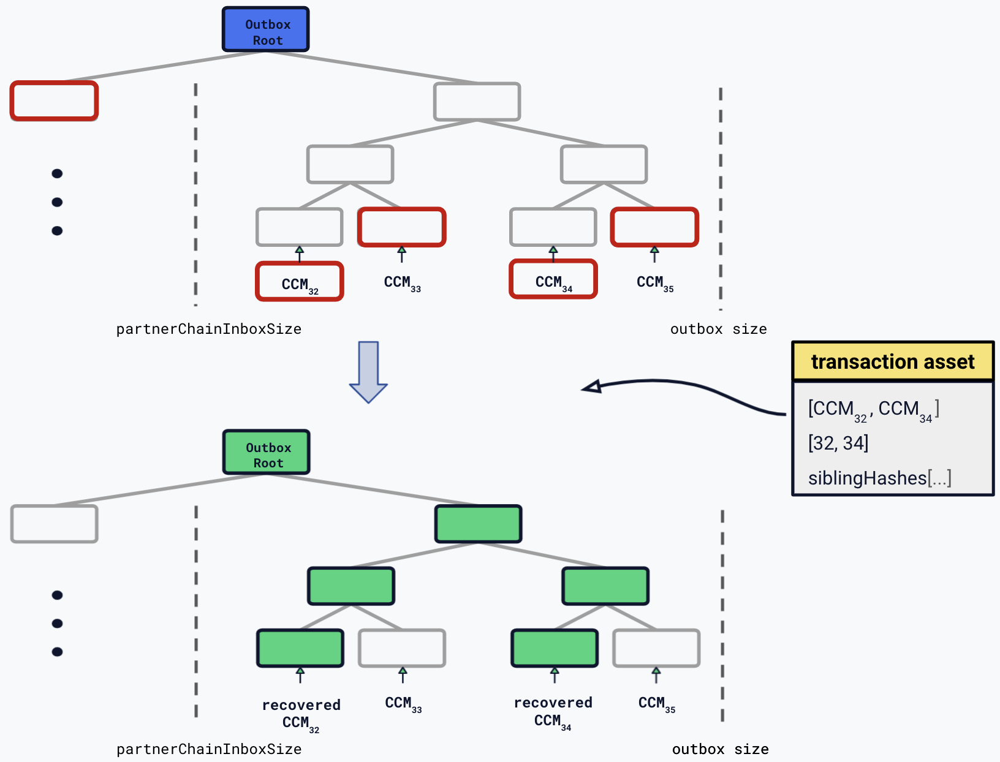

```
LIP: 0054
Title: Introduce sidechain recovery mechanism
Author: Iker Alustiza <iker@lightcurve.io>
        Alessandro Ricottone <alessandro.ricottone@lightcurve.io>
Discussions-To: https://research.lisk.com/t/introduce-sidechain-recovery-mechanism/292
Status: Draft
Type: Standards Track
Created: 2021-05-22
Updated: 2023-06-22
Requires: 0040, 0045, 0049, 0051
```

## Abstract

This LIP introduces five new commands to the Lisk ecosystem: the state recovery command, the message recovery command, the liveness termination command, the state recovery initialization command, and the message recovery initialization command. The state recovery command is used to recover entries from the module store of a terminated sidechain. The message recovery command allows users to recover cross-chain messages that are pending in the outbox of an inactive or terminated sidechain. The liveness termination command terminates a sidechain that violated the liveness condition. The state and message recovery initialization commands are used to initialize the state and message recovery process, respectively.

## Copyright

This LIP is licensed under the [Creative Commons Zero 1.0 Universal][creative].

## Motivation

In the Lisk ecosystem, the ability of a sidechain to interoperate with other chains can be revoked, i.e., terminated, permanently. Specifically, this occurs when the sidechain has been inactive for too long, i.e., not posting a transaction with a [cross-chain update (CCU)][lip-0053] command with non-empty certificate for more than 30 days, or if it posted one with a malicious CCU command on the mainchain. Once a sidechain is terminated in the ecosystem, the users of said chain cannot have any cross-chain interaction with it. This means they will no longer be able to send or receive any (fungible or non-fungible) token, message or custom information from or to the sidechain. Therefore, it is useful to provide a trustless on-chain mechanism to recover tokens, messages and information from terminated sidechains. This mechanism will noticeably improve the user experience of the Lisk ecosystem without affecting the security guarantees of the general interoperability solution.

## Rationale

This LIP introduces new commands to the Lisk ecosystem to provide a recovery mechanism for sidechain users in the scenario stated in the previous section. These commands are part of the Lisk [Interoperability module][lip-0045], thus they make use of the information provided in the interoperability store of the terminated sidechain. The main use cases provided by this recovery mechanism are:

* On the Lisk mainchain:
  * Users can recover the balance of LSK they had on a terminated sidechain by submitting a transaction with a **state recovery command**.
  * Users can recover [pending cross-chain messages (CCMs)][lip-0049] from the terminated sidechain channel outbox by submitting a transaction with a **message recovery command**.

* On sidechains:
  * Users can recover the balance of any custom token they had on a terminated sidechain by submitting a transaction with a **state recovery command**.
  * Users can recover any NFT they had on a terminated sidechain by submitting a transaction with a **state recovery command**.
  * The stored data of certain custom modules can be recovered from a terminated sidechain by submitting a transaction with a **state recovery command**.

In the next subsections, these mechanisms are explained together with their conditions, sidechain data availability requirements, effects, and their potential usage by certain network participants.

### State Recovery from the Sidechain State Root

This mechanism allows to recover a specific entry from a substore (i.e. the collection of key-value pairs with a common store prefix) of a module store of a terminated sidechain. Here "recover" means triggering a specific state transition defined as part of the relevant module protocol logic. In particular, it is based on the sidechain state root, `stateRoot`, set in the last certificate before sidechain termination. In the context of the mainchain, a valid state recovery command can recover the LSK token balance that users had in the terminated sidechain. In the context of a sidechain, it can recover an entry in a recoverable module store from a terminated sidechain. A recoverable module is any module that exposes a recover function. This includes the [Token module][lip-0051] (for any custom token) and the [NFT module][lip-0052].

This recovery mechanism requires these conditions to be valid:

* The state of the sidechain has to be consistent with respect to the value of the `stateRoot` property in the interoperability account of the sidechain in the mainchain.
* The specific entry of the substore of the recoverable module store to be recovered has to be available.
* The proof of inclusion for the specific entry to be recovered into the current `stateRoot` has to be available.
* When one of these commands is processed, the `stateRoot` property of the terminated sidechain is updated to account for the recovered tokens.
  * This implies that the future potential state recovery commands on a specific chain have to include a proof of inclusion into the updated sparse Merkle tree against the new `stateRoot`.

There is an extra requirement in the case of recoveries in the sidechain context: The sidechain in which the recovery will happen needs to be aware of the `stateRoot` of the terminated sidechain. In general, this information is only available on mainchain (in the terminated state account of the terminated sidechain). A way to make sidechains aware of this specific information for state recoveries is needed. This recovery initialization process on sidechains can happen in two ways:

* **State recovery initialization command**: This command is used to prove on a sidechain the value that the `stateRoot` of the terminated sidechain has on mainchain. Any user on the corresponding sidechain can send a transaction with this command and initiate the state recoveries with respect to the terminated sidechain. A sidechain account can be terminated on a sidechain using the `terminateChain` function exposed by the Interoperability module. In this case, the state root is generally not available and the terminated state account is created without setting the sidechain state root. Instead, the account stores the mainchain state root at the time of termination. A state recovery initialization command will in the future set the sidechain state root by giving an inclusion proof against this mainchain state root.
* **Sidechain terminated message**: As specified in [LIP 0049][lip-0049#terminatedMessage], when a CCM tries to reach a receiving chain that has been terminated, the mainchain creates a sidechain terminated message and sends it back to the sending chain. This CCM carries the `stateRoot` of the terminated sidechain and its execution on the sending sidechain will effectively initiate the recovery process.

Assuming these conditions are fulfilled, the entries of substores of any recoverable module in a terminated sidechain can be recovered back to the chain in which the transaction with this command was submitted. In particular, users can recover their LSK tokens back to their user account on mainchain. What is more, sidechain developers may implement any custom logic for the `recover` function in their custom modules, so that recoveries may have different functionalities depending on the module and the sidechain where the process happens.

Similar to the case for message recovery commands, it is not guaranteed to recover from the expected state in every situation. Certain state information of the terminated sidechain might have been modified and certified to the mainchain before termination.

In summary, the functionality provided by these recovery commands applies for sidechains that were terminated for inactivity or [other violations of the interoperability protocol][lip-0053#violations]. If the validators of the terminated sidechain were byzantine in the past, i.e., the security guarantees of the sidechain were broken, it is likely that these recovery mechanisms would not work.

### Liveness termination command

This command is used to terminate a sidechain that violated the liveness condition on the mainchain, effectively allowing users to start the recovery process. If a sidechain does not submit a certificate, it is considered to be non-live and cannot exchange cross-chain messages with the rest of the network anymore. This command can be used to terminate such sidechain so that users can recover their funds.

### Message Recovery from the Sidechain Channel Outbox

This mechanism allows to recover any CCM pending in the sidechain channel outbox. That is, those CCMs sent from the sending chain that have not been included in the (terminated) receiving chain yet. Specifically, this includes all the CCMs whose indices (the position of these CCMs in the outbox tree) are larger than the index of the last message that the receiving sidechain reported to have included in its inbox. 

Notice that the message recovery mechanism requires that the channel outbox is stored in the chain where the commands are processed. In the SDK 6, sidechain channels can only be stored on the mainchain. This means that the message recovery mechanism would only work on the mainchain.

The message recovery mechanism requires the following conditions:

* There exists an entry in the terminated outbox substore with store key equal to the terminated sidechain chain ID. This entry is created by the [message recovery initialization command](#message-recovery-initialization-command), which can be submitted after the chain account has been terminated.
* The pending CCMs to be recovered have to be available to the sender of the recovery command.
* The indices of the pending CCMs to be recovered have to be larger than the value of the `partnerChainInboxSize` property of the terminated outbox account. This implies that these CCMs are still pending or that their processing has not been certified to the mainchain.
* The proof of inclusion for the pending CCMs into the  `outboxRoot` property of the terminated outbox account has to be available. When a message recovery command is processed, the `outboxRoot` property is updated to account for the recovered CCMs (see Figure 1). This implies that the future potential message recovery commands have to include a proof of inclusion into the updated Merkle tree against the new `outboxRoot`.



_Figure 1: (top) The message recovery command recovers CCM<sub>32</sub> and CCM<sub>34</sub> by providing their indices and the sibling hashes to compute the outbox root (the proof of inclusion for these CCMs in the tree). The data provided by the command is highlighted in red in the tree. (bottom) The outbox root is then updated by recomputing the Merkle tree root with the recovered CCMs. In the second Merkle tree the updated nodes are highlighted in green. A new recovery command will need to provide a proof of inclusion for this updated Merkle tree._

Assuming these conditions are fulfilled, any user can submit a message recovery command to recover several CCMs at the same time. When the command is processed, the corresponding CCMs are recovered differently depending on their sending chain:

* If the sending chain of the pending CCM is the Lisk mainchain ( in this case it must be a cross-chain LSK token transfer CCM) the message is recovered directly. The amount of LSK transferred in the CCM will be added back to the sender of the original transaction.
* If the sending chain of the pending CCM is any other sidechain, the CCM will be sent back to this chain. The sending sidechain will act on the CCM as usual, i,e., with respect to the specific logic associated with the cross-chain command.

Bearing in mind that users are not guaranteed to recover their CCMs in every situation. Certain state information of the terminated sidechain might have been modified before termination and this would make the recovered CCM application fail. For example, the escrowed LSK in the sidechain account on the mainchain could have been subtracted by prior malicious behavior in the terminated sidechain.

### Recovery Commands as an Off-chain Service

As explained in the previous subsections, these recovery commands require specific information from the terminated sidechain to be available. For the message recovery mechanism, the mainchain chain account on the sidechain, all the pending CCMs, their position in the sidechain outbox root, and the state of the sidechain outbox (root, size, and append path) up to the last non-pending CCM have to be available. For the state recovery mechanism, the sidechain state up to the last valid cross-chain update has to be available. Moreover, this information has to be updated for future recovery commands every time a recovery command is successfully processed.

Message recovery commands are better suited to be submitted by accounts with access to a Lisk mainchain full node. The complete Merkle tree with root equal to the last value of the `outboxRoot` property of the terminated outbox account can be computed from the history of the Lisk mainchain. On the other hand, to submit a state recovery command or the message recovery initialization command, it is necessary to have access to a full node of the sidechain. In particular, this node should keep a snapshot of the sidechain state tree corresponding to the last certified `stateRoot` on mainchain. As explained above, these commands require the state of the sidechain to be consistent with the last value of `stateRoot`. However, the state of the sidechain may have evolved since the last CCU. That is why if a sidechain node intends to be ready to eventually submit these commands, they need to store this extra state information.

Since these technical requirements are not straightforward, the recovery commands are better suited to be offered as an off-chain service to sidechain users. When a sidechain is terminated, these recovery-service providers can recover the CCMs, tokens, NFTs or in general, any cross-chain information for the interested users.

## Specification

### Notation and Constants

All interoperability constants are defined in [LIP 0045][lip-0045#constants].

Furthermore, for the rest of this section:

* Let `RMTVerify` be the `verifyDataBlock` function specified in [the appendix C of LIP 0031][lip-0031#appendixC].
* Let `RMTCalculateRoot` be the `calculateRootFromUpdateData` function specified in [the appendix E of LIP 0031][lip-0031#appendixE].
* Let `SMTVerify` be the `verify` function specified in [LIP 0039][lip-0039].
* Let `SMTCalculateRoot` be the `calculateRoot` function specified in [LIP 0039][lip-0039].

We also define the following auxiliary functions to make the specifications more readable.

```python
def emitCCMEvent(ccm: CCM, result: uint32, code: uint32) -> None:
    emitEvent(
        module = MODULE_NAME_INTEROPERABILITY,
        name = EVENT_NAME_CCM_PROCESSED,
        data = {"ccm": ccm, "result": result, "code": code},
        topics = [ccm.sendingChainID, ccm.receivingChainID]
    )

def emitInvalidSMTVerificationEvent() -> None:
    emitPersistentEvent(
        module = MODULE_NAME_INTEROPERABILITY,
        name = EVENT_NAME_INVALID_SMT_VERIFICATION,
        data = {},
        topic = []
    )

def emitInvalidRMTVerificationEvent() -> None:
    emitPersistentEvent(
        module = MODULE_NAME_INTEROPERABILITY,
        name = EVENT_NAME_INVALID_RMT_VERIFICATION,
        data = {},
        topic = []
    )
```

### State Recovery Command

This command is used to recover the state from a terminated chain.

Transactions executing this command have:

* `module = MODULE_NAME_INTEROPERABILITY`,
* `command = COMMAND_RECOVER_STATE`.

#### Parameters

```java
stateRecoveryParams = {
    "type": "object",
    "required": ["chainID", "module", "storeEntries", "siblingHashes"],
    "properties": {
        "chainID": {
            "dataType": "bytes",
            "length": CHAIN_ID_LENGTH,
            "fieldNumber": 1
        },
        "module": {
            "dataType": "string",
            "minLength": MIN_MODULE_NAME_LENGTH,
            "maxLength": MAX_MODULE_NAME_LENGTH,
            "fieldNumber": 2
        },
        "storeEntries": {
            "type": "array",
            "fieldNumber": 3,
            "items": {
                "type": "object",
                "properties": {
                    "substorePrefix": {
                        "dataType": "bytes",
                        "minLength": SUBSTORE_PREFIX_LENGTH,
                        "maxLength": SUBSTORE_PREFIX_LENGTH,
                        "fieldNumber": 1
                    },
                    "storeKey": {
                        "dataType": "bytes",
                        "fieldNumber": 2
                    },
                    "storeValue": {
                        "dataType": "bytes",
                        "fieldNumber": 3
                    },
                    "bitmap": {
                        "dataType": "bytes",
                        "fieldNumber": 4
                    }
                },
                "required": ["substorePrefix", "storeKey", "storeValue", "bitmap"]
            }
        },
        "siblingHashes": {
            "type": "array",
            "items": {
                "dataType": "bytes",
                "length": HASH_LENGTH
            },
            "fieldNumber": 4
        }
    }
}
```

* `chainID`: The ID of the terminated sidechain identifying the terminated state account from which assets will be recovered.
* `module`: The name of the module store to recover.
* `storeEntries`: An array of store entries to recover. Each store entry is an object with the following properties:
  * `substorePrefix`: The substore prefix of the substore to recover.
  * `storeKey`: The store key of the entry to recover.
  * `storeValue`: The value of the entry to recover.
  * `bitmap`: The bitmap of inclusion proof.
* `siblingHashes`: The sibling hashes of the inclusion proof of the store entries in the terminated sidechain state account.

#### Verification

```python
def verify(trs: Transaction) -> None:
    trsParams = decode(stateRecoveryParams, trs.params)
    validateObjectSchema(stateRecoveryParams, trsParams)

    # The terminated account has to exist for this sidechain.
    if terminatedStateAccount(trsParams.chainID) does not exist:
        raise Exception("Terminated state account does not exist.")
    if terminatedStateAccount(trsParams.chainID).initialized == False:
        raise Exception("Terminated state account is not initialized.")

    if trsParams.module is not associated with a module registered on the chain:
        raise Exception("Module is not registered on the chain.")

    # The module indicated in the transaction params must have a recover function.
    # For example, this means that modules such as Interoperability or Auth
    # cannot be recovered.
    recoveryModule = module associated with trsParams.module
    if recoveryModule does not have a recover function:
        raise Exception("Module is not recoverable.")

    keys = set()

    for entry in trsParams.storeEntries:
        if entry.storeValue is EMPTY_BYTES:
            raise Exception("Recovered store value cannot be empty.")

        key = entry.substorePrefix + entry.storeKey
        keys.add(key)
    
    # Check that all keys are pariwise distinct, 
    # meaning that we are not trying to recover the same entry twice.
    if len(keys) != len(trsParams.storeEntries):
        raise Exception("Recovered store keys are not pairwise distinct.")
```

The function `module_name_to_store_prefix` is defined in [LIP 0040][lip-0040#module-store-prefix].

#### Execution

```python
def execute(trs: Transaction) -> None:
    trsParams = decode(stateRecoveryParams, trs.params)

    terminatedStateRoot = terminatedStateAccount(trsParams.chainID).stateRoot

    queryKeys = []
    storeQueriesVerify = []

    # Calculate store prefix from the module name according to LIP 0040.
    storePrefix = module_name_to_store_prefix(trsParams.module)

    for entry in trsParams.storeEntries:
        queryKey = storePrefix + entry.substorePrefix + sha256(entry.storeKey)
        queryKeys.append(queryKey)
        query = {
            "key": queryKey,
            "value": sha256(entry.storeValue),
            "bitmap": entry.bitmap
        }
        storeQueriesVerify.append(query)

    proofOfInclusionStores = { siblingHashes: trsParams.siblingHashes, queries : storeQueriesVerify }

    # The SMT verification step is computationally expensive. Therefore, it is done in the
    # execution step such that the transaction fee must be paid.
    if SMTVerify(queryKeys, proofOfInclusionStores, terminatedStateRoot) == False:
        emitInvalidSMTVerificationEvent()
        raise Exception("State recovery proof of inclusion is not valid.")

    storeQueriesUpdate = []

    recoveryModule = module associated with trsParams.module
    for entry in trsParams.storeEntries:
        # The recover function corresponding to trsParams.module applies the recovery logic.
        recoveryModule.recover(trsParams.chainID, entry.substorePrefix, entry.storeKey, entry.storeValue)

        emptyStore = EMPTY_BYTES
        query = {
            "key": storePrefix + entry.substorePrefix + sha256(entry.storeKey),
            "value": sha256(emptyStore),
            "bitmap": entry.bitmap
        }
        storeQueriesUpdate.append(query)

    terminatedStateAccount(trsParams.chainID).stateRoot = SMTCalculateRoot(trsParams.siblingHashes, storeQueriesUpdate)
```

#### Recover Function

For the execution of this command, the module given by `trsParams.module` must expose a `recover` function with the following interface:

```python
def recover(terminatedChainID: ChainID, substorePrefix: bytes, storeKey: bytes, storeValue: bytes) -> None:
    ...
```

where:

* `terminatedChainID`: The ID of the terminated chain.
* `substorePrefix`: The substore prefix of the store entry in the recoverable module state.
* `storeKey`: The store key of the store entry in the recoverable module state.
* `storeValue`: The store value of the store entry in the recoverable module state.

The `recover` function is specified for the [Token module][lip-0051#recover] and in the [NFT module][lip-0052#recover].

### Message Recovery Command

This command is used to recover cross-chain messages from a terminated outbox.

Transactions executing this command have:

* `module = MODULE_NAME_INTEROPERABILITY`,
* `command = COMMAND_RECOVER_MESSAGE`.

#### Parameters

```java
messageRecoveryParams = {
    "type": "object",
    "required": ["chainID", "crossChainMessages", "idxs", "siblingHashes"],
    "properties": {
        "chainID": {
            "dataType": "bytes",
            "length": CHAIN_ID_LENGTH,
            "fieldNumber": 1
        },
        "crossChainMessages": {
            "type": "array",
            "items": {
                "dataType": "bytes"
            },
            "fieldNumber": 2
        },
        "idxs": {
            "type": "array",
            "items": {
                "dataType": "uint32"
            },
            "fieldNumber": 3
        },
        "siblingHashes": {
            "type": "array",
            "items": {
                "dataType": "bytes",
                "length": HASH_LENGTH
            },
            "fieldNumber": 4
        }
    }
}
```

* `chainID`: The ID of the terminated sidechain identifying the terminated outbox from which messages will be recovered.
* `crossChainMessages`: The cross-chain messages to be recovered.
* `idxs`: The indices of the messages to be recovered.
* `siblingHashes`: The sibling hashes of the inclusion proof of the cross-shain messages in the sidechain outbox.

#### Verification

```python
def verify(trs: Transaction) -> None:
    trsParams = decode(messageRecoveryParams, trs.params)
    validateObjectSchema(messageRecoveryParams, trsParams)

    if terminatedOutboxAccount(trsParams.chainID) does not exist:
        raise Exception("Terminated outbox account does not exist.")
    
    # Check that there is at least one cross-chain message to recover.
    if len(trsParams.crossChainMessages) == 0:
        raise Exception("No cross-chain messages to recover.")
    
    # Check that there is exactly one index per cross-chain message.
    if len(trsParams.idxs) != len(trsParams.crossChainMessages):
        raise Exception("Inclusion proof indices and cross-chain messages do not have the same length.")

    # Check that the idxs are strictly increasing
    for i in range(len(trsParams.idxs)-1):
        if not (trsParams.idxs[i] < trsParams.idxs[i+1]):
            raise Exception("Cross-chain message indexes are not strictly increasing.")
    
    # Check that the CCMs are still pending. We check only the first one,
    # as the idxs are sorted in ascending order.
    if trsParams.idxs[0] < terminatedOutboxAccount(trsParams.chainID).partnerChainInboxSize:
        raise Exception("Cross-chain message is not pending.")

    # Check that the CCM indices do not exceed the outbox size. We check only the last one,
    # as the idxs are sorted in ascending order.
    if terminatedOutboxAccount(trsParams.chainID).outboxSize <= trsParams.idxs[-1]:
        raise Exception("Cross-chain message was never in the outbox.")

    # Process basic checks for all CCMs.
    for ccmBytes in trsParams.crossChainMessages:
        # Verify general format. Past this point, we can access ccm root properties.
        ccm = decode(crossChainMessageSchema, ccmBytes)
        validateFormat(ccm)

        if ccm.status != CCM_STATUS_CODE_OK:
            raise Exception("Cross-chain message status is not valid.")
        # The receiving chain must be the terminated chain.
        if ccm.receivingChainID != trsParams.chainID:
            raise Exception("Cross-chain message receiving chain ID is not valid.")
        # The sending chain must be live.
        if not isLive(ccm.sendingChainID):
            raise Exception("Cross-chain message sending chain is not live.")
```

The function `validateFormat` is defined in [LIP 0049][lip-0049#validateFormat].

#### Execution

```python
def execute(trs: Transaction) -> None:
    trsParams = decode(messageRecoveryParams, trs.params)

    # Check the inclusion proof against the sidechain outbox root.
    proof = {
        size: terminatedOutboxAccount(trsParams.chainID).outboxSize,
        idxs: trsParams.idxs,
        siblingHashes: trsParams.siblingHashes
    }

    if RMTVerify(
        [sha256(ccmBytes) for ccmBytes in trsParams.crossChainMessages],
        proof,
        terminatedOutboxAccount(trsParams.chainID).outboxRoot
        ) == False:
        emitInvalidRMTVerificationEvent()
        raise Exception("Message recovery proof of inclusion is not valid.")

    recoveredCCMs = []
    for ccmBytes in trsParams.crossChainMessages:
        ccmID = sha256(ccmBytes)
        # Set ccmID as default topic to all events emitted in applyRecovery and forwardRecovery
        # (instead of the transaction ID). The default topic is added automatically by emitEvent.
        eventsDefaultTopic = ccmID

        ccm = decode(crossChainMessageSchema, ccmBytes)
        # If the sending chain is the mainchain, recover the CCM.
        # This function never raises an error.
        if ccm.sendingChainID == getMainchainID():
            applyRecovery(trs, ccm)
        # If the sending chain is not the mainchain, forward the CCM.
        # This function never raises an error.
        elif ccm.sendingChainID != getMainchainID():
            forwardRecovery(trs, ccm)

        # Append the recovered CCM to the list of recovered CCMs.
        # Notice that the ccm has been mutated in the applyRecovery and forwardRecovery functions
        # as the status is set to CCM_STATUS_CODE_RECOVERED (so that it cannot be recovered again).
        recoveredCCMs.append(encode(crossChainMessageSchema, ccm))

    # Update sidechain outbox root.
    proof = {
        "size": terminatedOutboxAccount(trsParams.chainID).outboxSize,
        "idxs": trsParams.idxs,
        "siblingHashes": trsParams.siblingHashes
    }

    terminatedOutboxAccount(trsParams.chainID).outboxRoot = RMTCalculateRoot([sha256(ccmBytes) for ccmBytes in recoveredCCMs], proof)
```

```python
def applyRecovery(trs: Transaction, ccm: CCM) -> None:
    ccm.status = CCM_STATUS_CODE_RECOVERED
    ccm.sendingChainID, ccm.receivingChainID = ccm.receivingChainID, ccm.sendingChainID

    try:
        # Modules can verify the CCM.
        # The Token module verifies the escrowed balance in the CCM sending chain for the message fee.
        for each module mdl for which verifyCrossChainMessage exists:
            mdl.verifyCrossChainMessage(trs, ccm)
    except:
        emitCCMEvent(ccm, CCM_PROCESSED_RESULT_DISCARDED, CCM_PROCESSED_CODE_INVALID_CCM_VERIFY_CCM_EXCEPTION)
        return

    if ccm.module is not supported:
        emitCCMEvent(ccm, CCM_PROCESSED_RESULT_DISCARDED, CCM_PROCESSED_CODE_MODULE_NOT_SUPPORTED)
        return
    elif ccm.crossChainCommand is not supported:
        emitCCMEvent(ccm, CCM_PROCESSED_RESULT_DISCARDED, CCM_PROCESSED_CODE_CROSS_CHAIN_COMMAND_NOT_SUPPORTED)
        return

    crossChainCommand = cross-chain command associated with (ccm.module, ccm.crossChainCommand)
    try:
        crossChainCommand.verify(trs, ccm)
    except:
        emitCCMEvent(ccm, CCM_PROCESSED_RESULT_DISCARDED, CCM_PROCESSED_CODE_INVALID_CCM_VERIFY_EXCEPTION)
        return

    # Create a state snapshot.
    baseSnapshot = snapshot of the current state
    try:
        # Call the beforeCrossChainCommandExecution functions from other modules.
        # For example, the Token module assigns the message fee to the transaction sender.
        for each module mdl for which beforeCrossChainCommandExecution exists:
            mdl.beforeCrossChainCommandExecution(trs, ccm)
    except:
        revert state to baseSnapshot
        emitCCMEvent(ccm, CCM_PROCESSED_RESULT_DISCARDED, CCM_PROCESSED_CODE_INVALID_CCM_BEFORE_CCC_EXECUTION_EXCEPTION)
        return
    # Create a state snapshot.
    executionSnapshot = snapshot of the current state
    try:
        # Execute the cross-chain command.
        crossChainCommand.execute(trs, ccm)
        emitCCMEvent(ccm, CCM_PROCESSED_RESULT_APPLIED, CCM_PROCESSED_CODE_SUCCESS)
    except:
        revert state to executionSnapshot
        emitCCMEvent(ccm, CCM_PROCESSED_RESULT_DISCARDED, CCM_PROCESSED_CODE_FAILED_CCM)

    try:
        # Call the afterCrossChainCommandExecution functions from other modules.
        for each module mdl for which afterCrossChainCommandExecution exists:
            mdl.afterCrossChainCommandExecution(trs, ccm)
    except:
        revert state to baseSnapshot
        emitCCMEvent(ccm, CCM_PROCESSED_RESULT_DISCARDED, CCM_PROCESSED_CODE_INVALID_CCM_AFTER_CCC_EXECUTION_EXCEPTION)
```

```python
def forwardRecovery(trs: Transaction, ccm: CCM) -> None:
    ccm.status = CCM_STATUS_CODE_RECOVERED
    ccm.sendingChainID, ccm.receivingChainID = ccm.receivingChainID, ccm.sendingChainID

    try:
        # Modules can verify the CCM.
        # The Token module verifies the escrowed balance in the CCM sending chain for the message fee.
        for each module mdl for which verifyCrossChainMessage exists:
            mdl.verifyCrossChainMessage(trs, ccm)
    except:
        emitCCMEvent(ccm, CCM_PROCESSED_RESULT_DISCARDED, CCM_PROCESSED_CODE_INVALID_CCM_VERIFY_CCM_EXCEPTION)
        return

    # Create a state snapshot.
    baseSnapshot = snapshot of the current state
    try:
        # Call the beforeCrossChainMessageForwarding functions from other modules.
        # For example, the Token module transfers the fee from escrow to escrow.
        for each module mdl for which beforeCrossChainMessageForwarding exists:
            mdl.beforeCrossChainMessageForwarding(trs, ccm)
    except:
        revert state to baseSnapshot
        emitCCMEvent(ccm, CCM_PROCESSED_RESULT_DISCARDED, CCM_PROCESSED_CODE_INVALID_CCM_BEFORE_CCC_FORWARDING_EXCEPTION)
        return

    addToOutbox(ccm.receivingChainID, ccm)
    # Emit CCM forwarded event.
    emitCCMEvent(ccm, CCM_PROCESSED_RESULT_FORWARDED, CCM_PROCESSED_CODE_SUCCESS)
```

### Liveness Termination Command

This command is used to terminate a sidechain that violated the liveness condition. As such, it can only be submitted on the mainchain.

Transactions executing this command have:

* `module = MODULE_NAME_INTEROPERABILITY`,
* `command = COMMAND_TERMINATE_LIVENESS`.

#### Parameters

```java
livenessTerminationParams = {
    "type": "object",
    "required": ["chainID"],
    "properties": {
        "chainID": {
            "dataType": "bytes",
            "length": CHAIN_ID_LENGTH,
            "fieldNumber": 1
        }
}
```

* `chainID`: The ID of the sidechain to be terminated.

#### Verification

```python
def verify(trs: Transaction) -> None:
    trsParams = decode(livenessTerminationParams, trs.params)
    validateObjectSchema(livenessTerminationParams, trsParams)

    if chainAccount(trsParams.chainID) does not exist:
        raise Exception("Chain account does not exist.")

    # The command fails if the sidechain is already terminated.
    if chainAccount(trsParams.chainID).status == CHAIN_STATUS_TERMINATED:
        raise Exception("Sidechain is already terminated.")

    # Or if the sidechain did not violate the liveness condition.
    if isLive(trsParams.chainID):
        raise Exception("Sidechain did not violate the liveness condition.")
```

#### Execution

```python
def execute(trs: Transaction) -> None:
    trsParams = decode(livenessTerminationParams, trs.params)
    terminateChain(trsParams.chainID)
```

The `terminateChain` function is defined in [LIP 0045][lip-0045].

### State Recovery Initialization Command

This command is used to initialize a terminated state account or update the state root stored in it if it was not set yet. It can only be submitted on a sidechain.

Transactions executing this command have:

* `module = MODULE_NAME_INTEROPERABILITY`,
* `command = COMMAND_INITIALIZE_STATE_RECOVERY`.

#### Parameters

```java
stateRecoveryInitializationParams = {
    "type": "object",
    "required": [
        "chainID",
        "sidechainAccount",
        "bitmap",
        "siblingHashes"
    ],
    "properties": {
        "chainID": {
            "dataType": "bytes",
            "length": CHAIN_ID_LENGTH,
            "fieldNumber": 1
        },
        "sidechainAccount": {
            "dataType": "bytes",
            "fieldNumber": 2
        },
        "bitmap": {
            "dataType": "bytes",
            "fieldNumber": 3
        },
        "siblingHashes": {
            "type": "array",
            "items": {
                "dataType": "bytes",
                "length": HASH_LENGTH
            },
            "fieldNumber": 4
        }
    }
}
```

* `chainID`: The ID of the sidechain whose terminated state account is to be initialized or updated.
* `sidechainAccount`: The sidechain chain account stored on the mainchain.
* `bitmap`: The bitmap of the inclusion proof of the sidechain account in the mainchain state tree.
* `siblingHashes`: The sibling hashes of the inclusion proof of the sidechain account in the mainchain state tree.

#### Verification

```python
def verify(trs: Transaction) -> None:
    trsParams = decode(stateRecoveryInitializationParams, trs.params)
    validateObjectSchema(stateRecoveryInitializationParams, trsParams)

    if trsParams.chainID == getMainchainID() or trsParams.chainID == ownChainAccount.chainID:
        raise Exception("Chain ID is not valid.")

    # The command fails if the sidechain is already terminated on this chain.
    if terminatedStateAccount(trsParams.chainID) exists and terminatedStateAccount(trsParams.chainID).initialized == True:
        raise Exception("Sidechain is already terminated.")

    sidechainAccount = decode(chainDataSchema, trsParams.sidechainAccount)
    validateObjectSchema(chainDataSchema, sidechainAccount)
    # The sidechain must either be terminated or must have violated the liveness limit while being active.
    if sidechainAccount.status == CHAIN_STATUS_REGISTERED:
        raise Exception("Sidechain has status registered.")
    if sidechainAccount.status == CHAIN_STATUS_ACTIVE
        and chainAccount(getMainchainID()).lastCertificate.timestamp - sidechainAccount.lastCertificate.timestamp <= LIVENESS_LIMIT:
        raise Exception("Sidechain is still active and obeys the liveness requirment.")
```

#### Execution

```python
def execute(trs: Transaction) -> None:
    trsParams = decode(stateRecoveryInitializationParams, trs.params)

    queryKey = STORE_PREFIX_INTEROPERABILITY + SUBSTORE_PREFIX_CHAIN_DATA + sha256(trsParams.chainID)

    query = {
        "key": queryKey,
        "value": sha256(trsParams.sidechainAccount),
        "bitmap": trsParams.bitmap
    }

    proofOfInclusion = { "siblingHashes": trsParams.siblingHashes, "queries" : [query] }

    # The SMT verification step is computationally expensive. Therefore, it is done in the
    # execution step such that the transaction fee must be paid.
    if terminatedStateAccount(trsParams.chainID) exists:
        if SMTVerify([queryKey], proofOfInclusion, terminatedStateAccount(trsParams.chainID).mainchainStateRoot) == False:
            emitInvalidSMTVerificationEvent()
            raise Exception("State recovery initialization proof of inclusion is not valid.")
    else:
        if SMTVerify([queryKey], proofOfInclusion, chainAccount(getMainchainID()).lastCertificate.stateRoot) == False:
            emitInvalidSMTVerificationEvent()
            raise Exception("State recovery initialization proof of inclusion is not valid.")

    sidechainAccount = decode(chainDataSchema, trsParams.sidechainAccount)
    if terminatedStateAccount(trsParams.chainID) exists:
        terminatedStateAccount(trsParams.chainID).stateRoot = sidechainAccount.lastCertificate.stateRoot
        terminatedStateAccount(trsParams.chainID).mainchainStateRoot = EMPTY_HASH
        terminatedStateAccount(trsParams.chainID).initialized = True
    else:
        createTerminatedStateAccount(trsParams.chainID, sidechainAccount.lastCertificate.stateRoot)
```

The `createTerminatedStateAccount` function is defined in [LIP 0045][lip-0045].

### Message Recovery Initialization Command

This command is used to initialize a terminated outbox account.

Transactions executing this command have:

* `module = MODULE_NAME_INTEROPERABILITY`,
* `command = COMMAND_INITIALIZE_MESSAGE_RECOVERY`.

#### Parameters

```java
messageRecoveryInitializationParams = {
    "type": "object",
    "required": [
        "chainID",
        "channel",
        "bitmap",
        "siblingHashes"
    ],
    "properties": {
        "chainID": {
            "dataType": "bytes",
            "length": CHAIN_ID_LENGTH,
            "fieldNumber": 1
        },
        "channel": {
            "dataType": "bytes",
            "fieldNumber": 2
        },
        "bitmap": {
            "dataType": "bytes",
            "fieldNumber": 3
        },
        "siblingHashes": {
            "type": "array",
            "items": {
                "dataType": "bytes",
                "length": HASH_LENGTH
            },
            "fieldNumber": 4
        }
    }
}
```

* `chainID`: The ID of the sidechain whose terminated outbox account is to be initialized.
* `channel`: The channel of this chain stored on the terminated sidechain.
* `bitmap`: The bitmap of the inclusion proof of the channel in the sidechain state tree.
* `siblingHashes`: The sibling hashes of the inclusion proof of the channel in the sidechain state tree.

#### Verification

```python
def verify(trs: Transaction) -> None:
    trsParams = decode(messageRecoveryInitializationParams, trs.params)
    validateObjectSchema(messageRecoveryInitializationParams, trsParams)

    if trsParams.chainID == getMainchainID() or trsParams.chainID == ownChainAccount.chainID:
        raise Exception("Chain ID is not valid.")

    # The command fails if the chain is not registered.
    if chainAccount(trsParams.chainID) does not exist:
        raise Exception("Chain is not registered.")

    # The command fails if the chain is not terminated.
    if terminatedStateAccount(trsParams.chainID) does not exist:
        raise Exception("Terminated state account not present.")

    # The command fails if there exist already a terminated outbox account.
    if terminatedOutboxAccount(trsParams.chainID) exists:
        raise Exception("Terminated outbox account already exists.")

    # The command fails if the channel parameter is not a valid serialized channel.
    partnerChannel = decode(channelDataSchema, trsParams.channel)
    validateObjectSchema(channelDataSchema, partnerChannel)
```

#### Execution

```python
def execute(trs: Transaction) -> None:
    trsParams = decode(messageRecoveryInitializationParams, trs.params)
    
    queryKey = STORE_PREFIX_INTEROPERABILITY + SUBSTORE_PREFIX_CHANNEL_DATA + sha256(OWN_CHAIN_ID)

    query = {
        key: queryKey,
        value: sha256(trsParams.channel),
        bitmap: trsParams.bitmap
    }

    proofOfInclusion = { siblingHashes: trsParams.siblingHashes, queries : [query] }

    # The SMT verification step is computationally expensive. Therefore, it is done in the
    # execution step such that the transaction fee must be paid.
    if SMTVerify([queryKey], proofOfInclusion, terminatedStateAccount(trsParams.chainID).stateRoot) == False:
        emitInvalidSMTVerificationEvent()
        raise Exception("Message recovery initialization proof of inclusion is not valid.")
    
    partnerChannel = decode(channelDataSchema, trsParams.channel)
    createTerminatedOutboxAccount(
        trsParams.chainID,
        channel(trsParams.chainID).outbox.root,
        channel(trsParams.chainID).outbox.size,
        partnerChannel.inbox.size
    )
```

## Backwards Compatibility

This LIP introduces new commands with new effects to the Lisk mainchain state, thus it will imply a hardfork. It also implies that sidechains implement the Interoperability module, recoverable modules and follow the standard state model structure.

## Reference Implementation

TBA

[creative]: https://creativecommons.org/publicdomain/zero/1.0/
[lip-0031#appendixC]: https://github.com/LiskHQ/lips/blob/main/proposals/lip-0031.md#appendix-c-proof-of-inclusion-protocol-for-leaf-nodes
[lip-0031#appendixE]: https://github.com/LiskHQ/lips/blob/main/proposals/lip-0031.md#appendix-e-update-of-leaf-nodes
[lip-0031#proof-of-inclusion]: https://github.com/LiskHQ/lips/blob/main/proposals/lip-0031.md#proof-of-inclusion
[lip-0039]: https://github.com/LiskHQ/lips/blob/main/proposals/lip-0039.md
[lip-0039#proof-construction]: https://github.com/LiskHQ/lips/blob/main/proposals/lip-0039.md#proof-construction
[lip-0040#module-store-prefix]: https://github.com/LiskHQ/lips/blob/main/proposals/lip-0040.md#module-store-prefix-1
[lip-0045]: https://github.com/LiskHQ/lips/blob/main/proposals/lip-0045.md
[lip-0045#specs]: https://github.com/LiskHQ/lips/blob/main/proposals/lip-0045.md#specification
[lip-0045#constants]: https://github.com/LiskHQ/lips/blob/main/proposals/lip-0045.md#notation-and-constants
[lip-0049]: https://github.com/LiskHQ/lips/blob/main/proposals/lip-0049.md
[lip-0049#schema]: https://github.com/LiskHQ/lips/blob/main/proposals/lip-0049.md#cross-chain-message-schema
[lip-0049#terminatedMessage]: https://github.com/LiskHQ/lips/blob/main/proposals/lip-0049.md#sidechain-terminated-message
[lip-0049#validateFormat]: https://github.com/LiskHQ/lips/blob/main/proposals/lip-0049.md#validateFormat
[lip-0051]: https://github.com/LiskHQ/lips/blob/main/proposals/lip-0051.md
[lip-0051#recover]: https://github.com/LiskHQ/lips/blob/main/proposals/lip-0051.md#recover
[lip-0052]: https://github.com/LiskHQ/lips/blob/main/proposals/lip-0052.md
[lip-0052#recover]: https://github.com/LiskHQ/lips/blob/main/proposals/lip-0052.md#recover
[lip-0053]: https://github.com/LiskHQ/lips/blob/main/proposals/lip-0053.md
[lip-0053#violations]: https://github.com/LiskHQ/lips/blob/main/proposals/lip-0053.md#cross-chain-updates-posted-on-mainchain
