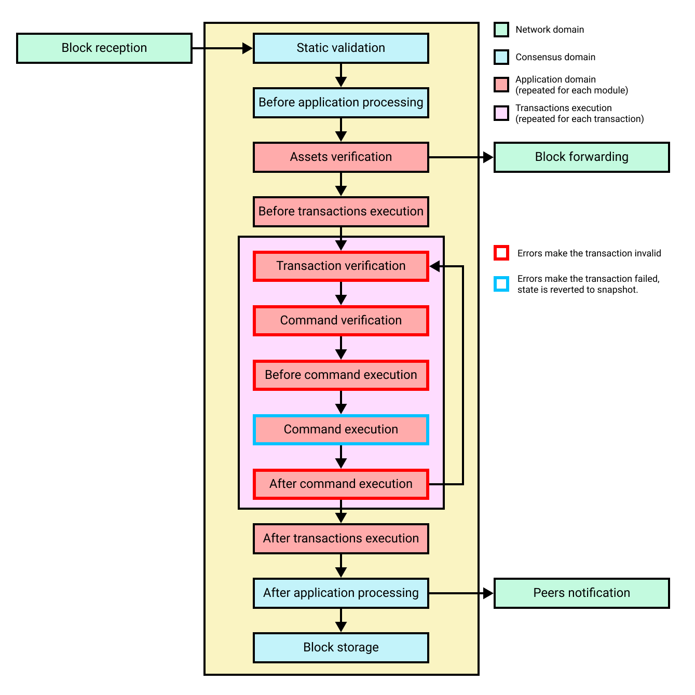

```
LIP: 0055
Title: Update block schema and block processing
Author: Andreas Kendziorra <andreas.kendziorra@lightcurve.io>
        Alessandro Ricottone <alessandro.ricottone@lightcurve.io>
        Rishi Mittal <rishi.mittal@lightcurve.io>
Discussions-To: https://research.lisk.com/t/update-block-schema-and-block-processing/293
Status: Draft
Type: Standards Track
Created: 2021-05-22
Updated: 2022-11-11
Requires: 0040, 0061, 0065
```

## Abstract

This LIP changes the structure of a block, introducing the assets property alongside the block header and transactions. The block header schema is updated to add new properties introduced by several other LIPs. We clarify the mechanism by which modules can include data in the block assets and specify the validation of each block header property. Furthermore, we list the stages that are part of the block processing and generation, and we introduce the concept of failing transactions to the Lisk protocol.

## Copyright

This LIP is licensed under the [Creative Commons Zero 1.0 Universal](https://creativecommons.org/publicdomain/zero/1.0/).

## Motivation

The first change proposed by this LIP is to introduce a new block property, the assets. This property is an array of objects containing data injected by the modules registered in the chain during the block creation. This change clarifies the general procedure by which modules insert extra data in a block. The block assets, together with the transactions, form the block payload. The block schema is updated accordingly.

The second change is to update the block header schema. In general, it is desirable to have one fixed block header schema that:

- does not need to be changed when modules are added or removed to a running blockchain,
- is used by every blockchain in the Lisk ecosystem regardless of the modules implemented in the individual chains.

Furthermore, we update the block header schema to include new properties introduced by [LIP 0040][lip-0040], [LIP 0058][lip-0058], [LIP 0061][lip-0061], and [LIP 0065][lip-0065].

Finally, this LIP specifies the validation of all block header properties in one place.

## Rationale

### New Block Header Properties

This LIP introduces the following new block header properties:

- `generatorAddress`: The address of the block generator. It replaces the `generatorPublicKey` property. See [below](#change-generator-public-key-to-generator-address) for more details.
- `assetRoot`: The root of the Merkle tree computed from the block assets array. See [below](#separation-between-block-header-and-block-assets) for more details.
- `eventRoot`: The root of the sparse Merkle tree that is computed from the events emitted during the block processing. See [LIP 0065][lip-0065] LIP for the reason why it needs to be included in a block header.
- `stateRoot`: The root of the sparse Merkle tree that is computed from the state of the blockchain. See [LIP 0040][lip-0040] for the reason why it needs to be included in a block header.
- `maxHeightPrevoted`: This property is related to the [Lisk-BFT protocol][lip-0056] and is used for the fork choice rule.
- `maxHeightGenerated`: This property is related to the [Lisk-BFT protocol][lip-0056] and is used to check for contradicting block headers.
- `impliesMaxPrevotes`: This property is related to the function [impliesMaximalPrevotes][lip-0058#impliesMaximalPrevotes] which checks whether the block generator is constructively contributing to the Lisk-BFT protocol. This property can be used to adjust block rewards depending on this constructive contribution to the Lisk-BFT protocol, see [LIP 0042][lip-0042#getblockreward] for instance.
- `validatorsHash`: This property authenticates the set of validators active from the next block onward. It is important for cross-chain certification and included in certificates.
- `aggregateCommit`: This property contains the aggregate signature for a certificate and the height of the certified block. Based on this, any node can create a certificate for the given height. See [LIP 0061][lip-0061] for more details.

### Change Generator Public Key to Generator Address

Before this proposal, the `generatorPublicKey` property of a block header was fulfilling two purposes: 1) The validator account was deduced by deriving the address from it, and 2) the block signature could be validated without any on-chain data.

Both the generator address or a public key yielding this address fulfill the first purpose. On the other hand, the second point is not possible anymore without on-chain data, as the generator key is now part of the Validators module store and can be updated. Hence, there is no further drawback in replacing the generatorPublicKey property by the generatorAddress property, while it has the advantages of reducing the size of the block header by a few bytes and skipping the address derivation step during block validation.

### Separation Between Block Header and Block Assets

The separation between properties in the block header and properties in the block assets is done according to the following rules:

- Properties handled by the consensus domain are added to the block header.
- Properties created by individual modules are added to the block assets.
- It should be possible to follow the fork choice consensus rule just with the block header. This implies that the `maxHeightPrevoted` property is part of the block header.
- Similarly, it should be possible to generate a certificate just with the block header. This implies that the `validatorsHash` property is part of the block header. Moreover, the `validatorsHash` property can only be obtained after the state transitions by the modules have been processed. The reason is that the DPoS or PoA modules only set the validators for the next round after the asset of the last block of a round is processed. Therefore, this property needs to be added to the block by the consensus domain after the state transitions by the modules are processed.

As an example, blockchains created with the Lisk SDK that implement the [Random module][lip-0046], will insert the seed reveal property in the block assets, not in the block header.

The schema for the block assets allows each module to include its serialized data individually, which makes the inclusion of module data very flexible. Each module can insert a single entry in the assets. This entry is an object containing a `module` property, indicating the module handling it, and a generic `data` property that can contain arbitrary serialized data.

Each entry of the block assets is then inserted in a Merkle tree, whose root is included in the block header as the `assetRoot` property. Inserting the assets root rather than the full assets allows to bound the size of the block header while still authenticating the content of the block assets.

### Failing and Invalid Transactions

In the current protocol, a transaction that is included in a block always implies that it was processed successfully without any error. In particular, if an error occurs during the block generation, the transaction is simply invalid and it is not included in the block payload.

In this LIP, we introduce the concept of failing transactions and clearly specify when a transaction is considered invalid. A transaction is *valid*, if the "transaction verification", "command verification", "before command execution", and "after command execution" stages associated to the transaction are executed successfully without errors (see the ["Block processing stages"](#block-processing-stages) section below). Otherwise, a transaction is *invalid*. Only valid transactions should be added to a block during the block generation, as an invalid transaction makes the whole block invalid meaning that it would be discarded by any node in the network.

A valid transaction is executed successfully if additionally the "command execution" stage is executed successfully without errors. A valid transaction *fails* if  on the other hand an error occurs during the command execution. In this case, all state transitions of the "command execution" stage are reverted. This means that the transaction has no effect except for those defined in "before command execution" and "after command execution". The result of the transaction execution is logged using an event emitted at the end of the "after transaction execution" stage, indicating whether the transaction was processed successfully or an error occurred.

Allowing for failing transactions has the advantage that transactions that require a complex and expensive "command execution" stage would still pay the fee in case of errors, as the fee is processed in the "before command execution" stage. In this sense, block generators are still rewarded for their processing time rather than not receiving anything (as it is the case for an invalid transaction).

The transaction pool only runs the "transaction verification" and "command verification" stages, which should not require expensive computations.

## Specification

### Notation and Constants

For the rest of this proposal we define the following constants.

| Name | Type | Value | Description |
|------|------|-------|-------------|
| `MAX_TRANSACTIONS_SIZE_BYTES` | integer | configurable per chain | The max size of a block transactions in bytes. |
| `MAX_ASSET_DATA_SIZE_BYTES` | integer | configurable per chain | The max size of an assets entry in bytes. |
| `SIGNATURE_LENGTH_EDDSA_BYTES` | integer | 64 | The length of a Ed25519 signature. |
| `MIN_MODULE_NAME_LENGTH` | integer | 1 | The minimum length of a string specifying the name of a module. |
| `MAX_MODULE_NAME_LENGTH` | integer | 32 | The maximum length of a string specifying the name of a module. |
| `CHAIN_ID` | bytes | configurable per chain | The chain ID of the chain where the block is included. |

Furthermore, in the following we indicate with `block` be the block under consideration and with `previousBlock` the previous block of the chain. Calling a function `fct` from another module `module` is represented by `module.fct`.

### Block Processing Stages



*Figure 1: A schematic depiction of the various stages of a block processing. The stages performed in the consensus domain are indicated by blue boxes, while the stages performed in the application domain are indicated by red boxes. Within the application domain, the transactions processing is indicated by purple boxes. The network domain is indicated by green boxes.*

In this section, we describe the various processing stages of a block. Note that a genesis block follows different rules specified in [LIP 0060][lip-0060].

The block processing is split between the network, consensus, and application domains (see figure 1):

- The network domain is responsible for exchanging blocks with other peers in the [P2P network][lip-0004].
- The consensus domain applies the [fork choice rule][lip-0014#fork-choice-rule] and checks the properties contained in the block header.
- The application domain checks and applies the module-level logic. All the stages that are part of the application domain (except "command verification" and "command execution") are repeated for each module registered in the chain. The "command verification" and "command execution" stages are called only for the module to which the command belongs (i.e. with module matching the `module` property). The transactions processing is performed on the transactions contained in the block as part of the application domain processing. The four stages in the transactions processing are repeated for each transaction.

The full processing of a block is organized as follows.

1. **Block reception**: A new block is received from the P2P network.
2. **Static validation**: Some initial static checks are done to ensure that the serialized object follows the general structure of a block. Then the [fork choice rule][lip-0014#fork-choice-rule] determines whether the block will be discarded or if the processing continues. These checks are performed immediately because they do not require access to the state store and can therefore be done very quickly.
3. **Before application processing**: Block header properties that require access to the state store *before* any state transitions implied by the block are executed are verified in this stage. Moreover, further logic of the consensus domain can be executed in this step.
4. **Assets verification**: Each module verifies the respective entry in the block assets. If any check fails, the block is discarded and has no further effect.
5. **Block forwarding**: After the initial checks, the full block is forwarded to a subset of peers.
6. **Before transactions execution**: Each module can define protocol logic that is executed *before* the transactions contained in the block are processed.
7. **Transaction verification**: Each module can define protocol logic that verifies a transaction, possibly by accessing the state store. If an error occurs, the transaction is invalid and the whole block is discarded.
8. **Command verification**: The command corresponding to the `module`/`command` combination is verified. If an error occurs, the transaction is invalid and the whole block is discarded.
9. **Before command execution**: Each module can define protocol logic that is processed *before* the command has been executed. If an error occurs, the transaction is invalid and the whole block is discarded.
10. **Command execution**: The command corresponding to the `module`/`command` combination is executed. If an error occurs, the transaction is failed and all state transitions performed in this stage are reverted. In any case, afterwards the processing continues with the next stage.
11. **After command execution**: Each module can define protocol logic that is processed *after* the command has been executed. If an error occurs, the transaction is invalid and the whole block is discarded.
12. **After transactions execution**: Each module can define protocol logic that is executed *after* all the transactions contained in the block have been processed.
13. **After application processing**: Block header properties, which require accessing the state store *after* all state transitions implied by the block have been executed, are verified. Moreover, further logic of the consensus domain can be executed in this step.
14. **Block storage**: The block is persisted into the database.
15. **Peers notification**: Other peers in the P2P network are notified of the new block.

### Block Generation Stages


*Figure 2: A schematic depiction of the various stages of a block generation. The stages performed in the generator domain are indicated by grey boxes, while the stages performed in the application domain are indicated by red boxes. Within the application domain, the transactions processing is indicated by purple boxes. At the end of the generation, the block goes through the block processing stages (yellow box).*

In this section, we describe the various stages of a block generation.

The block generation is split between the network, generator, and application domains (see figure 2).
The generator domain is responsible for setting block header properties as well as inserting entries in the block assets.

The full generation of a block is organized as follows.

1. **Header initialization**: Block header properties that require access to the state store *before* any state transitions implied by the block are executed are inserted in this stage.
2. **Before application processing**: Block header properties that require access to the state store *before* any state transitions implied by the block are executed are verified in this stage. Moreover, further logic of the consensus domain can be executed in this step.
3. **Assets insertion**: Each module can insert information in the block assets.
4. **Before transactions execution**: Each module can define protocol logic that is executed *before* the transactions contained in the block are processed.
After this stage has been completed, transactions are selected one-by-one from a transaction pool. The transaction processing stages (stages 4 to 8) are repeated for each transaction selected. If stages 4, 5, 6, and 8 are executed successfully, the transaction is valid and it is included in the block, otherwise it is invalid and therefore discarded.
5. **Transaction verification**: Each module can define protocol logic that verifies a transaction, possibly by accessing the state store. If an error occurs, the transaction is invalid and it is not included in the block.
6. **Command verification**: The command corresponding to the `module`/`command` combination is verified. If an error occurs, the transaction is invalid and it is not included in the block.
7. **Before command execution**: Each module can define protocol logic that is processed *before* the command has been executed. If an error occurs, the transaction is invalid, it is not included in the block, all state transitions induced by the transaction are reverted. In that case, the block generation continues with stage 4 for another transaction from the transaction pool or stage 9.
8. **Command execution**: The command corresponding to the `module`/`command` combination is executed. If an error occurs, the transaction is failed and all state transitions performed in this stage are reverted. In any case, afterwards the processing continues with the next stage.
9. **After command execution**: Each module can define protocol logic that is processed *after* the command has been executed. If an error occurs, the transaction is invalid, it is not included in the block and all state transitions induced by the transaction performed up to this stage are reverted. In that case, the block generation continues with stage 4 for another transaction from the transaction pool or stage 9.
10. **After transactions execution**: Each module can define protocol logic that is executed *after* all the transactions contained in the block have been processed.
11. **Header finalization**: Block header properties, which require accessing the state store *after* all state transitions implied by the block have been executed, are inserted.
12. **After application processing**: Block header properties, which require accessing the state store *after* all state transitions implied by the block have been executed, are verified. Moreover, further logic of the consensus domain can be executed in this step.
13. **Block processing**: The block goes through the [block processing stages](#block-processing-stages).

### Block

#### JSON Schema

Blocks are serialized and deserialized accordingly to the following JSON schema.

```java
blockSchema = {
  "type": "object",
  "required": ["header", "transactions", "assets"],
  "properties": {
    "header": {
      "dataType": "bytes",
      "fieldNumber": 1
    },
    "transactions": {
      "type": "array",
      "fieldNumber": 2,
      "items": {
        "dataType": "bytes"
      }
    },
    "assets": {
      "type": "array",
      "fieldNumber": 3,
      "items": {
        "dataType": "bytes"
      }
    }
  }
}
```

#### Validation

The block is validated in the [static validation stage](#block-processing-stages) as follows:

- **Static validation**:
  - Check that the block follows the block schema.
  - Check that the total size of the serialized transactions contained in the block is at most `MAX_TRANSACTIONS_SIZE_BYTES`.

#### Block ID

The block ID is calculated using the `blockID` function. This function returns a 32 bytes value or an error if the block header has an invalid signature format.

```python
def blockID():
  # Check that the signature length is 64 bytes to ensure
  # that we do not compute the block ID of an unsigned block.
  if length(block.header.signature) != SIGNATURE_LENGTH_EDDSA_BYTES:
    return error

  serializedBlockHeader = encode(blockHeaderSchema, block.header)
  return SHA-256(serializedBlockHeader)
```

### Block Assets

This LIP introduces a new block property, the block assets, which in addition with the header and the transactions forms the complete block.

#### JSON Schema

The block assets contains data created by individual modules. It is an array of bytes, where each value corresponds to an object serialized according to the following schema.

```java
assetSchema = {
  "type": "object",
  "required": ["module", "data"],
  "properties": {
    "module": {
      "dataType": "string",
      "minLength": MIN_MODULE_NAME_LENGTH,
      "maxLength": MAX_MODULE_NAME_LENGTH,
      "fieldNumber": 1
    },
    "data": {
      "dataType": "bytes",
      "fieldNumber": 2
    }
  }
}
```

#### Validation

The block assets is checked in the "static validation" and the "assets verification" [stage](#block-processing-stages) as follows:

- **Static validation**:
  - Check that for each entry in the assets array the `data` property has size at most equal to `MAX_ASSET_DATA_SIZE_BYTES`.
  - Each module can insert at most one entry in the block assets. Hence, check that each entry has a distinct `module` property.
  - Check that the entries are sorted by lexicographical order of `module`.
- **Assets verification**:
  - Check that each entry in the assets array has `module` corresponding to a module registered in the chain.
  - The individual entries are checked by the respective modules.

The checks in the static validation stage are performed before the block is processed and without accessing the state.

### Block Transactions

The block transactions is an array of transaction objects. The JSON schema and validation rules for transactions are defined in [LIP 0068][lip-0068].

### Block Header

#### Block Header JSON Schema

Block headers are serialized and deserialized accordingly to the following JSON schema.

```java
blockHeaderSchema = {
  "type": "object",
  "required": [
    "version",
    "timestamp",
    "height",
    "previousBlockID",
    "generatorAddress",
    "transactionRoot",
    "assetRoot",
    "eventRoot",
    "stateRoot",
    "maxHeightPrevoted",
    "maxHeightGenerated",
    "impliesMaxPrevotes",
    "validatorsHash",
    "aggregateCommit",
    "signature"
  ],
  "properties": {
    "version": {
      "dataType": "uint32",
      "fieldNumber": 1
    },
    "timestamp": {
      "dataType": "uint32",
      "fieldNumber": 2
    },
    "height": {
      "dataType": "uint32",
      "fieldNumber": 3
    },
    "previousBlockID": {
      "dataType": "bytes",
      "fieldNumber": 4
    },
    "generatorAddress": {
      "dataType": "bytes",
      "fieldNumber": 5
    },
    "transactionRoot": {
      "dataType": "bytes",
      "fieldNumber": 6
    },
    "assetRoot": {
      "dataType": "bytes",
      "fieldNumber": 7
    },
    "eventRoot": {
      "dataType": "bytes",
      "fieldNumber": 8
    },
    "stateRoot": {
      "dataType": "bytes",
      "fieldNumber": 9
    },
    "maxHeightPrevoted": {
      "dataType": "uint32",
      "fieldNumber": 10
    },
    "maxHeightGenerated": {
      "dataType": "uint32",
      "fieldNumber": 11
    },
    "impliesMaxPrevotes": {
      "dataType": "boolean",
      "fieldNumber": 12
    },
    "validatorsHash": {
      "dataType": "bytes",
      "fieldNumber": 13
    },
    "aggregateCommit": {
      "type": "object",
      "fieldNumber": 14,
      "required": [
        "height",
        "aggregationBits",
        "certificateSignature"
      ],
      "properties": {
        "height": {
          "dataType": "uint32",
          "fieldNumber": 1
        },
        "aggregationBits": {
          "dataType": "bytes",
          "fieldNumber": 2
        },
        "certificateSignature": {
          "dataType": "bytes",
          "fieldNumber": 3
        }
      }
    },
    "signature": {
      "dataType": "bytes",
      "fieldNumber": 15
    }
  }
}
```

#### Unsigned Block Header JSON Schema

Unsigned block headers are serialized and deserialized accordingly to the following JSON schema (notice the missing `signature` property).

```java
unsignedBlockHeaderSchema = {
  "type": "object",
  "required": [
    "version",
    "timestamp",
    "height",
    "previousBlockID",
    "generatorAddress",
    "transactionRoot",
    "assetRoot",
    "eventRoot",
    "stateRoot",
    "maxHeightPrevoted",
    "maxHeightGenerated",
    "impliesMaxPrevotes",
    "validatorsHash",
    "aggregateCommit"
  ],
  "properties": {
    "version": {
      "dataType": "uint32",
      "fieldNumber": 1
    },
    "timestamp": {
      "dataType": "uint32",
      "fieldNumber": 2
    },
    "height": {
      "dataType": "uint32",
      "fieldNumber": 3
    },
    "previousBlockID": {
      "dataType": "bytes",
      "fieldNumber": 4
    },
    "generatorAddress": {
      "dataType": "bytes",
      "fieldNumber": 5
    },
    "transactionRoot": {
      "dataType": "bytes",
      "fieldNumber": 6
    },
    "assetRoot": {
      "dataType": "bytes",
      "fieldNumber": 7
    },
    "eventRoot": {
      "dataType": "bytes",
      "fieldNumber": 8
    },
    "stateRoot": {
      "dataType": "bytes",
      "fieldNumber": 9
    },
    "maxHeightPrevoted": {
      "dataType": "uint32",
      "fieldNumber": 10
    },
    "maxHeightGenerated": {
      "dataType": "uint32",
      "fieldNumber": 11
    },
    "impliesMaxPrevotes": {
      "dataType": "boolean",
      "fieldNumber": 12
    },
    "validatorsHash": {
      "dataType": "bytes",
      "fieldNumber": 13
    },
    "aggregateCommit": {
      "type": "object",
      "fieldNumber": 14,
      "required": [
        "height",
        "aggregationBits",
        "certificateSignature"
      ],
      "properties": {
        "height": {
          "dataType": "uint32",
          "fieldNumber": 1
        },
        "aggregationBits": {
          "dataType": "bytes",
          "fieldNumber": 2
        },
        "certificateSignature": {
          "dataType": "bytes",
          "fieldNumber": 3
        }
      }
    }
  }
}
```

#### Block Signature Calculation

The block header signature is calculated using the `calculateBlockSignature` function. This function returns a bytes value with length `SIGNATURE_LENGTH_EDDSA_BYTES`.

```python
def calculateBlockSignature():
  secretKey = secret generator key of the block generator
  # Serialize the block header without signature.
  serializedUnsignedBlockHeader = encode(unsignedBlockHeaderSchema, block.header)

  return signEd25519(secretKey, "LSK_BH_", CHAIN_ID, serializedUnsignedBlockHeader)
```

Here, the function `signEd25519` calculates the signature of a message as specified in [LIP 0062][lip-0062#specification].

#### Block Header Generation

During block generation, the block header properties are set in the following stages.

- **Header initialization**:
  - Set the `version`, `timestamp`, `height`, `previousBlockID`, `generatorAddress`, `maxHeightPrevoted`, `maxHeightGenerated`, `impliesMaxPrevotes`, and `aggregateCommit` properties.
- **Header finalization**:
  - Set the `transactionRoot`, `assetRoot`, `eventRoot`, `stateRoot`, `validatorsHash`, and `signature` properties.

#### Block Header Processing

In this section, we specify the validation for each property of the block header.

The block header is checked in three [stages of the block processing](#block-processing-stages).

- **Static validation**:
  - Check that the block header follows the block header schema.
  - Validate the `version`, `transactionRoot`, and `assetRoot` properties.
- **Before application processing**:
  - Verify the `timestamp`, `height`, `previousBlockID`, `generatorAddress`, `maxHeightPrevoted`, `maxHeightGenerated`, `aggregateCommit`, `impliesMaxPrevotes`, and `signature` properties.
- **After application processing**:
  - Verify the `stateRoot`, `eventRoot`, and `validatorsHash` properties.

##### Version

With this LIP, the version value is incremented. That means that `block.header.version` must be equal the value of a block of the previous protocol plus one.

##### Timestamp

The timestamp is verified by calling the `verifyTimestamp`. This function returns a boolean, indicating the success of the check.

```python
def verifyTimestamp():
  blockSlotNumber = getSlotNumber(block.header.timestamp)

  # Check that block is not from the future.
  currentTimestamp = current system time
  if blockSlotNumber > getSlotNumber(currentTimestamp):
    return False

  # Check that block slot is strictly larger than the block slot of previousBlock.
  previousBlockSlotNumber = getSlotNumber(previousBlock.header.timestamp)
  if blockSlotNumber <= previousBlockSlotNumber:
      return False

  return True
```

The function `getSlotNumber` is specified in [LIP 0058][lip-0058#getSlotNumber].

##### Height

The height is verified by calling the `verifyHeight` function. This function returns a boolean, indicating the success of the check.

```python
def verifyHeight():
  return block.header.height == previousBlock.header.height + 1
```

##### Previous Block ID

The previous block ID is verified by calling the `verifyPreviousBlockID` function. This function returns a boolean, indicating the success of the check.

```python
def verifyPreviousBlockID():
  return block.header.previousBlockID == blockID(previousBlock)
```

Here, the function `blockID` calculates the ID of an input block as specified in [LIP 0020][lip-0020#specs].

##### Generator Address

The generator address is verified by calling the `verifyGeneratorAddress` function. This function returns a boolean, indicating the success of the check.

```python
def verifyGeneratorAddress():
  # Check that the generatorAddress has the correct length of 20 bytes.
  if length(block.header.generatorAddress) != 20:
    return False

  currentHeight = height of the block at the current tip of the chain
  # Check that the block generator is eligible to generate in this block slot.
  return block.header.generatorAddress == getGeneratorAtTimestamp(block.header.timestamp, currentHeight)
```

The function `getGeneratorAtTimestamp` is specified in [LIP 0058][lip-0058#getGeneratorAtTimestamp].

##### Transaction Root

The [transaction root][lip-0032] is the root of the Merkle tree built from the ID of the transactions contained in the block. It is validated by calling the `validateTransactionRoot` function. This function returns a boolean, indicating the success of the check.

```python
def validateTransactionRoot():
  transactionIDs = [transactionID(trs) for trs in block.transactions]
  return block.header.transactionRoot == merkleRoot(transactionIDs)
```

Here, the function `transactionID` calculates the ID of an input transaction as specified in [LIP 0019][lip-0019#specs] and the function `merkleRoot` calculates the Merkle root starting from an input array of bytes values as defined in [LIP 0031][lip-0031#merkle-root].

##### Asset Root

The asset root is the root of the Merkle tree built from the block assets array. It is validated by calling the `validateAssetRoot` function. This function returns a boolean, indicating the success of the check.

```python
def validateAssetRoot():
  assetHashes = [SHA-256(asset) for asset in block.assets]
  return block.header.assetRoot == merkleRoot(assetHashes)
```

##### State Root

The state root is the root of the sparse Merkle tree built from the state of the chain after the block has been processed. It is verified by calling the `verifyStateRoot` function. This function returns a boolean, indicating the success of the check.

```python
def verifyStateRoot():
  return block.header.stateRoot == stateRoot(block.header.height)
```

Here, the function `stateRoot` calculates the state root of the chain at the input height as specified in [LIP 0040][lip-0040#specs].

##### Event Root

The event root is the root of the sparse Merkle tree built from the events emitted during the block processing. It is verified by calling the `verifyEventRoot` function. This function returns a boolean, indicating the success of the check.

```python
def verifyEventRoot():
  return block.header.eventRoot == eventRoot(block.header.height)
```

Here, the function `eventRoot` calculates the events root of the block with the input height as specified in [LIP 0065][lip-0065].

##### Max Height Prevoted, Max Height Generated and Implies Max Prevotes

The properties `maxHeightPrevoted`, `maxHeightGenerated` and `impliesMaxPrevotes` are related to the [Lisk-BFT protocol][lip-0058]. They are verified by calling the `verifyBFTProperties` function. This function returns a boolean, indicating the success of the check.

```python
def verifyBFTProperties():
  if block.header.maxHeightPrevoted != getBFTHeights().maxHeightPrevoted:
    return False

  if isHeaderContradictingChain(block.header):
    return False

  if block.header.impliesMaxPrevotes != impliesMaximalPrevotes(block.header)
    return False

  return True
```

The functions [getBFTHeights][lip-0058#getBFTHeights], [isHeaderContradictingChain][lip-0058#isHeaderContradictingChain], and [impliesMaximalPrevotes][lip-0058#impliesMaximalPrevotes] are all specified in [LIP 0058][lip-0058].

##### Validators Hash

The validators hash authenticates the set of validators participating to Lisk-BFT from height `block.header.height + 1` onward. They are verified by calling the `verifyValidatorsHash` function. The function returns a boolean, indicating the success of the check.

```python
def verifyValidatorsHash():
  return block.header.validatorsHash == bft.getBFTParameters(block.header.height + 1).validatorsHash
```

##### Aggregate Commit

The aggregate commit contains an aggregate BLS signature of a certificate corresponding to the block at the given height. It attests that all signing validators consider the corresponding block final. It is verified by calling the `verifyAggregateCommit` function, defined in [LIP 0061][lip-0061]. This function takes the aggregate commit `block.header.aggregateCommit` as input and returns a boolean, indicating the success of the check.

##### Signature

The signature is verified by calling the `verifyBlockSignature` function. This function returns a boolean, indicating the success of the check.

```python
def verifyBlockSignature():
  generatorKey = validators.getValidatorKeys(block.header.generatorAddress).generatorKey
  signature = block.header.signature

  # Remove the signature from the block header.
  delete block.header.signature
  # Serialize the block header without signature.
  serializedUnsignedBlockHeader = encode(unsignedBlockHeaderSchema, block.header)

  return verifyEd25519(generatorKey, "LSK_BH_", CHAIN_ID, serializedUnsignedBlockHeader, signature)
```

Here, the function `verifyEd25519` verifies the validity of a signature as specified in [LIP 0062][lip-0062#specification].

## Backwards Compatibility

This LIP results in a hard fork as nodes following the proposed protocol will reject blocks according to the previous protocol, and nodes following the previous protocol will reject blocks according to the proposed protocol.

## Reference Implementation

TBA

[lip-0004]: https://github.com/LiskHQ/lips/blob/main/proposals/lip-0004.md
[lip-0014#block-header-properties]: https://github.com/LiskHQ/lips/blob/main/proposals/lip-0014.md#additional-block-header-properties
[lip-0014#fork-choice-rule]: https://github.com/LiskHQ/lips/blob/main/proposals/lip-0014.md#applying-blocks-according-to-fork-choice-rule
[lip-0019#specs]: https://github.com/LiskHQ/lips/blob/main/proposals/lip-0019.md#specification
[lip-0020#specs]: https://github.com/LiskHQ/lips/blob/main/proposals/lip-0020.md#specification
[lip-0031#merkle-root]: https://github.com/LiskHQ/lips/blob/main/proposals/lip-0031.md#merkle-root
[lip-0032]: https://github.com/LiskHQ/lips/blob/main/proposals/lip-0032.md
[lip-0040]: https://github.com/LiskHQ/lips/blob/main/proposals/lip-0040.md
[lip-0040#specs]: https://github.com/LiskHQ/lips/blob/main/proposals/lip-0040.md#specification
[lip-0042#getblockreward]: https://github.com/LiskHQ/lips/blob/main/proposals/lip-0042.md#getblockreward
[lip-0046]: https://github.com/LiskHQ/lips/blob/main/proposals/lip-0046.md
[lip-0056]: https://github.com/LiskHQ/lips/blob/main/proposals/lip-0056.md
[lip-0058]: https://github.com/LiskHQ/lips/blob/main/proposals/lip-0058.md
[lip-0058#getSlotNumber]: https://github.com/LiskHQ/lips/blob/main/proposals/lip-0058.md#getSlotNumber
[lip-0058#getGeneratorAtTimestamp]: https://github.com/LiskHQ/lips/blob/main/proposals/lip-0058.md#getGeneratorAtTimestamp
[lip-0058#getBFTHeights]: https://github.com/LiskHQ/lips/blob/main/proposals/lip-0058.md#getBFTHeights
[lip-0058#isHeaderContradictingChain]: https://github.com/LiskHQ/lips/blob/main/proposals/lip-0058.md#isHeaderContradictingChain
[lip-0058#impliesMaximalPrevotes]: https://github.com/LiskHQ/lips/blob/main/proposals/lip-0058.md#impliesMaximalPrevotes
[lip-0060]: https://github.com/LiskHQ/lips/blob/main/proposals/lip-0060.md
[lip-0061]: https://github.com/LiskHQ/lips/blob/main/proposals/lip-0061.md
[lip-0062#specification]: https://github.com/LiskHQ/lips/blob/main/proposals/lip-0062.md#specification
[lip-0065]: https://github.com/LiskHQ/lips/blob/main/proposals/lip-0065.md
[lip-0068]: https://github.com/LiskHQ/lips/blob/main/proposals/lip-0068.md
