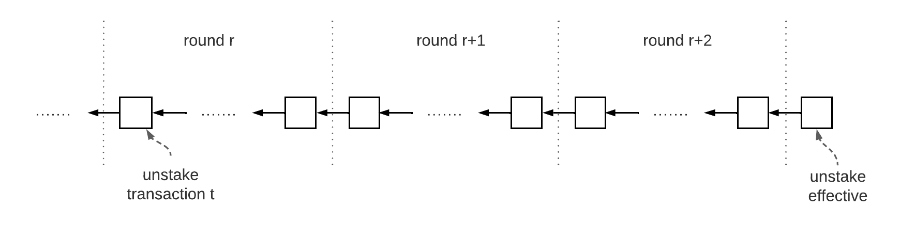

```
LIP: 0059
Title: Introduce unlocking condition for incentivizing certificate generation
Author: Jan Hackfeld <jan.hackfeld@lightcurve.io>
Discussions-To: https://research.lisk.com/t/introduce-unlocking-condition-for-incentivizing-certificate-generation/300
Status: Draft
Type: Standards Track
Created: 2021-05-21
Updated: 2022-11-11
Requires: 0057, 0058, 0061
```

## Abstract

This LIP introduces an additional incentive for validators and stakers in PoS for generating certificates by requiring the generation of a certificate for a certain height before tokens previously used for staking can be unlocked.

## Copyright

This LIP is licensed under the [Creative Commons Zero 1.0 Universal](https://creativecommons.org/publicdomain/zero/1.0/).

## Motivation

[LIP 0061][lip-0061] specifies a mechanism for blockchains in the Lisk ecosystem to generate certificates. Certificates are the key object facilitating interoperability and every blockchain in the Lisk ecosystem has to regularly generate certificates so that new outgoing cross-chain messages can be submitted to other chains via cross-chain updates, see [LIP 0053][lip-0053] for details. In particular, the minimum requirement for any sidechain is to submit at least one certificate to the Lisk mainchain in any 30 day period. Otherwise, the connection of the sidechain to the mainchain is terminated and the submission of further cross-chain updates from that sidechain is no longer possible. Similarly, at least one certificate from the Lisk mainchain has to be submitted to a sidechain in every 30 day period as otherwise the connection of the Lisk mainchain on the sidechain is terminated.

It is therefore crucial for the usability of cross-chain messaging and maintaining interoperability that every chain in the Lisk ecosystem continuously generates certificates. In order to ensure the certificate generation for blockchains utilizing PoS, this LIP introduces the requirement of generating a certificate for a certain height before tokens previously used for staking can be unlocked.

## Rationale

In the PoS system introduced in [LIP 0023](https://github.com/LiskHQ/lips/blob/main/proposals/lip-0023.md) any tokens used for staking are locked. After unstaking an amount of tokens, the account holder has to wait a certain number of blocks before being able to unlock this amount. The purpose of the locking period is to disincentivize malicious behavior by validators or stakers as they have a certain amount of tokens at stake that cannot be quickly transferred and sold.

Using a similar approach we want to ensure that validators constructively participate in the certificate generation, i.e., they generate and share certificate signatures for heights where they are active. In particular, we want to prevent a group of validators from leaving the set of active validators, but refusing to sign a certificate that attests this change. We want to achieve this by only letting a validator and its stakers unlock, after the validator was excluded from the active set, if a certificate is generated for the last height where the validator was active. This certificate will attest that the respective validator is no longer part of the active set of validators of the chain.



*Figure 1: The result of an unstake transaction `t` included in round `r` only comes into effect in round `r+3` as the stake snapshots for validator selection are taken from two rounds ago.*

More concretely, consider one unstake transaction `t` included at height `h` in round `r` that results in a validator `d` leaving the set of active validators, see also the figure above as illustration. The stake snapshots used for selecting the active validators at the beginning of a round are taken from two rounds ago. This means that the last block `b` of round `r+2` is the last block when validator `d` is active. In particular, the `validatorsHash` property in block `b` attests a validator set not including `d`. As certificates are generated for all end-of-round blocks, we require that the certificate signature for the certificate derived from block `b` is included in the chain, before the account submitting the unstake transaction can unlock. This means that the following inequality has to hold for the unlock included at height `h` to be valid:

```
lastHeightOfRound(h + 2 * ROUND_LENGTH) <= maxHeightCertified.
```

Here
- `ROUND_LENGTH` is the round length in blockchains using the [PoS module LIP][lip-0057],
- `lastHeightRound()` returns the last height of the round containing the given height,
- `maxHeightCertified` is the maximum height of a block for which the chain contains a certificate.

## Specification

### Notation

We use the constant `ROUND_LENGTH` defined in [LIP 0057][lip-0057] to denote the round length in the PoS chain, i.e., the number of active plus randomly selected standby validators.

### Internal Functions

#### lastHeightOfRound

 For a height `h` of round `r` as input, this function returns the height of the last block of round `r`. In particular, if `h` is the last height of a round, we have `h = lastHeightOfRound(h)`.

```python
lastHeightOfRound(h):
    r = roundNumber(h)
    return r * ROUND_LENGTH + genesisDataStore.height
```

Here `roundNumber` is a function defined in [LIP 0057][lip-0057#roundnumber] and `genesisDataStore.height` denotes the height of the genesis block as stored in the [PoS module][lip-0057].

### New Unlocking Condition

In this section, we define a new additional condition for unlocking an amount previously used for staking. This condition is checked during the execution of the unlock command as defined in [LIP 0057][lip-0057]. A locked amount from an unstake is identified by an unlock object `unlockObject` that contains the relevant properties about the unstake that happened before, in particular, the amount and unstake height. The new additional condition is that the function `isCertificateGenerated` defined below has to return `True` for unlocking the locked amount identified by the unlock object given as input.

```python
isCertificateGenerated(unlockObject):
    b = current block header
    maxHeightCertified = b.header.aggregateCommit.height

    if lastHeightOfRound(unlockObject.unstakeHeight + 2 * ROUND_LENGTH) <= maxHeightCertified:
        return True
      else:
        return False
```

## Backwards Compatibility

This LIP introduces a soft fork as the validity condition for the unlocking transaction becomes more strict.

[lip-0053]: https://github.com/LiskHQ/lips/blob/main/proposals/lip-0053.md
[lip-0057]: https://github.com/LiskHQ/lips/blob/main/proposals/lip-0057.md
[lip-0057#roundnumber]: https://github.com/LiskHQ/lips/blob/main/proposals/lip-0057.md#roundnumber
[lip-0058]: https://github.com/LiskHQ/lips/blob/main/proposals/lip-0058.md
[lip-0061]: https://github.com/LiskHQ/lips/blob/main/proposals/lip-0061.md
