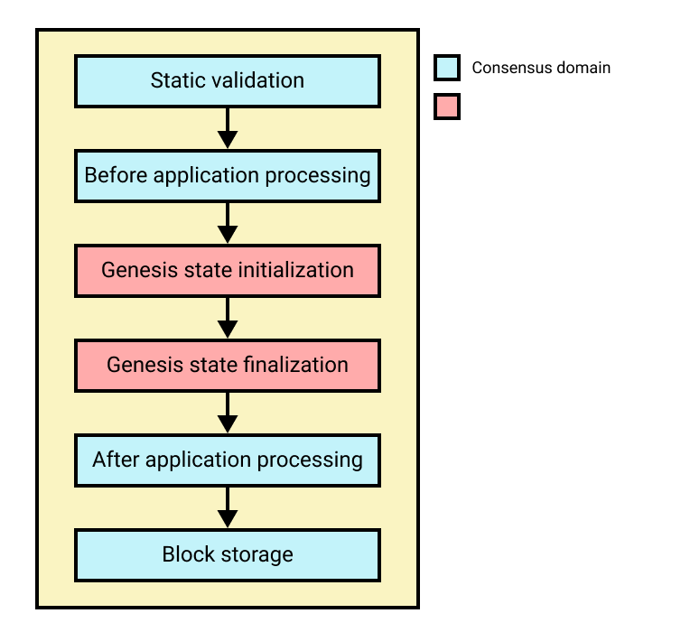

```
LIP: 0060
Title: Update genesis block schema and processing
Author: Iker Alustiza <iker@lightcurve.io>
        Rishi Mittal <rishi.mittal@lightcurve.io >
Discussions-To: https://research.lisk.com/t/update-genesis-block-schema-and-processing/325
Status: Draft
Type: Standards Track
Created: 2021-10-08
Updated: 2022-09-02
Requires: 0040, 0058, 0055
```

## Abstract

This LIP adapts the specifications of the genesis block for blockchains created with Lisk SDK introduced in [LIP 0034][lip-0034] to the requirements and characteristics of the new state model introduced in [LIP 0040][lip-0040]. It does so by following the general block format and processing introduced in [LIP 0055][lip-0055].

## Copyright

This LIP is licensed under the [Creative Commons Zero 1.0 Universal](https://creativecommons.org/publicdomain/zero/1.0/).

## Motivation

[LIP 0034][lip-0034] introduced a block asset schema that allows to directly specify an initial state for blockchains created with Lisk SDK. However, with the specification of the Lisk interoperability solution and [the new state model][lip-0040] it introduces, it is necessary to redefine and update the format and processing of a genesis block for blockchains created with Lisk SDK.

## Rationale

### Usage of `assets` property of the block

The new genesis block format and processing is specified with the rationale of having a compact and self-contained way of initializing a blockchain in the Lisk ecosystem. With this in mind, this LIP defines a genesis block format and processing based on the specifications given in [LIP 0055][lip-0055]. In particular, the `assets` property contains the necessary information to initialize the state of the blockchain. Each element in the `assets` array contains the information necessary to set the state store for a given module. Hence, each module should define the format and processing logic for this information in the genesis block.

### Processing of the genesis block

Another distinctive specification of the genesis block is its processing. The blockchain starts with an empty key-value store and in particular, all module stores are initially empty. As part of the genesis block processing modules can add key-value entries to their module store to initialize their state. They should also check the consistency of their state independently and against information provided by other modules. Also, before this is done, the framework layer has to validate the block header and the block format itself. Hence, this LIP defines steps specific to the processing of the genesis block: a step to initialize the state store per each module and the second step to verify this initial state. In particular the processing of the genesis block happens in four steps described in the sections below.



*Figure 1: A schematic depiction of the steps of the processing of the genesis block.*

#### Static validation of the genesis block

The genesis block has to go through initial static checks to ensure that the serialized object follows the general structure of a block. Also, certain properties of the block header are checked at this stage. All of these checks are stateless since the state of the blockchain is yet to be initialized. The key differences as compared to [the validation for the rest of the blocks][lip-0055#validation] in a blockchain are that there is no specific size limit for the genesis block object and that the genesis block should not contain any transaction.

#### Before application processing

In this stage the consensus domain can initialize its store.

#### Genesis state initialization

At this stage, the genesis state initialization logic for all registered modules is executed. For this purpose, registered modules can specify processing logic considering the information in their corresponding entry of the `assets` property. Typically, modules will perform format and data consistency checks on their corresponding entry in `assets` and then initialize their state according to the data provided in it. However, modules should not call protocol logic of other modules as the state of the respective module may not be initialized.

#### Genesis state finalization

At this stage, the genesis state finalization logic for all registered modules is executed. As part of the genesis state finalization logic modules may call exposed functions from other modules to cross-check the state information integrity and/or complete their own state information. Once this step is completed, there should be a valid initial state ready for a blockchain to process state transitions implied by the next block.

#### After application processing

Block header properties, which require accessing the state store *after* all state transitions implied by the genesis block have been executed, are verified. Moreover, the consensus domain can define further logic that is executed in this step.

## Specification

In this section, we specify the schema for the genesis block and its validity and execution rules.

### Constant

| Name          | Type    | Value       | Description          |
| ------------- |---------| ------------| ---------------------|
| `EMPTY_HASH`  | bytes   | SHA-256("") | Hash of empty bytes. |

### Processing stages of the genesis block, block assets, and block header

As introduced in [the Rationale section](#processing-of-the-genesis-block), the processing of the genesis block is performed in four different stages:

* _Static validation of the genesis block_: The stateless checks that ensure the structure of the genesis block are performed. Also, the properties in the block header that do not require access to the state store are checked. These checks are defined in the sections below.
* _Genesis state initialization_: The genesis state initialization logic for the registered modules is executed.
* _Genesis state finalization_: The genesis state finalization logic for the registered modules is executed.  
* _After application processing_: The block header properties that require access to the state store are verified as specified below.

### Genesis block

#### JSON schema

The genesis block schema is the same as the one defined in [LIP 0055][lip-0055#block-schema].

#### Validation

The genesis block is validated in the static validation stage as follows:

* _Static validation of the genesis block_:
  * Check that the `transactions` property is set to its default value, i.e., empty array.

#### Block ID

The genesis block ID is computed in the same way as for [any other block][lip-0055#block-id].

### Assets property of the genesis block

#### JSON schema

The asset schema is the same as defined in [LIP 0055][lip-0055#asset-schema].

#### Validation

The block assets property is validated as follows:

* _Static validation of the genesis block_:
  * The same validity rules as defined in [LIP 0055][lip-0055#asset-validation] apply except for the fact that there is no limitation on the size of the `data` property of every entry.

### Header of the genesis block

#### JSON schema

The genesis block header schema is the same as the one defined in [LIP 0055][lip-0055#header-schema] for an unsigned block header.

#### Validation

The block header is processed as follows:

* _Static validation of the genesis block_:
  * Check that the block header follows the block header schema.
  * The value `b.header.version` can be any `uint32` integer.
  * The value of `b.header.transactionRoot` is equal to `EMPTY_HASH`.
  * The value `b.header.assetRoot` is validated as specified in [LIP 0055][lip-0055#assets-root].
  * The value `b.header.timestamp` is Unix time in seconds and can be any value in the `uint32` range.
  * The value `b.header.height` can be any value in the `uint32` range.
  * The value `b.header.previousBlockID` can be any 32-byte value.
  * The value of `b.header.generatorAddress` is equal to the constant zero address `EMPTY_ADDRESS = 0x0000000000000000000000000000000000000000`.
  * The value of `b.header.maxHeightPrevoted` is equal to `b.header.height`.
  * The value of `b.header.impliesMaxPrevotes` is equal to `True`.
  * The value `b.header.maxHeightGenerated`  is equal to 0.
  * The value of `b.header.aggregateCommit.height` is 0.
  * The value of `b.header.aggregateCommit.signature` is empty bytes.
  * The value of `b.header.aggregateCommit.aggregationBits` is empty bytes.
* _After application processing_:
  * Verify the `stateRoot`, `eventRoot` and `validatorsHash` properties as specified in [LIP 0055][lip-0055#state-root].

## Backwards Compatibility

This LIP defines a new block schema and processing, but does not imply a hardfork of Lisk Mainnet.

[lip-0034]: https://github.com/LiskHQ/lips/blob/main/proposals/lip-0034.md
[lip-0040]: https://github.com/LiskHQ/lips/blob/main/proposals/lip-0040.md
[lip-0055]: https://github.com/LiskHQ/lips/blob/main/proposals/lip-0055.md
[lip-0055#asset-schema]: https://github.com/LiskHQ/lips/blob/main/proposals/lip-0055.md#json-schema-1
[lip-0055#asset-validation]: https://github.com/LiskHQ/lips/blob/main/proposals/lip-0055.md#validation-1
[lip-0055#assets-root]: https://github.com/LiskHQ/lips/blob/main/proposals/lip-0055.md#asset-root
[lip-0055#block-id]: https://github.com/LiskHQ/lips/blob/main/proposals/lip-0055.md#block-id
[lip-0055#block-schema]: https://github.com/LiskHQ/lips/blob/main/proposals/lip-0055.md#json-schema
[lip-0055#header-schema]:https://github.com/LiskHQ/lips/blob/main/proposals/lip-0055.md#unsigned-block-header-json-schema
[lip-0055#state-root]: https://github.com/LiskHQ/lips/blob/main/proposals/lip-0055.md#state-root
[lip-0055#validation]: https://github.com/LiskHQ/lips/blob/main/proposals/lip-0055.md#validation
