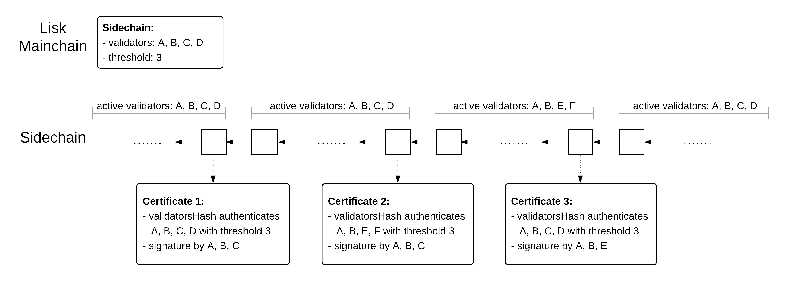

```
LIP: 0061
Title: Introduce certificate generation mechanism
Author: Jan Hackfeld <jan.hackfeld@lightcurve.io>
Discussions-To: https://research.lisk.com/t/introduce-certificate-generation-mechanism/296
Status: Draft
Type: Standards Track
Created: 2021-05-22
Updated: 2023-03-20
Requires: 0044, 0055, 0058
```

## Abstract

This LIP defines the schema for certificates, how unsigned certificates can be computed from blocks and how they are signed using BLS signatures. We further specify commit messages, which are messages containing BLS signatures of certificates. We describe how validators create unsigned certificates for blocks they consider final and share the signatures of such certificates by gossiping commit messages via the P2P network. The certificate signatures shared via commit messages are subsequently aggregated and included in blocks. From the aggregate certificate signatures included in blocks, any node in the blockchain network can create signed certificates which can be used in cross-chain update transactions to facilitate interoperability.

## Copyright

This LIP is licensed under the [Creative Commons Zero 1.0 Universal](https://creativecommons.org/publicdomain/zero/1.0/).

## Motivation

The interoperability solution for the Lisk ecosystem, which is based on the paradigm of cross-chain certification, requires the consensus algorithm to generate certificates which can be used in cross-chain update transactions. The certificates should attest all information required for the cross-chain update, including the state root, which allows authenticating cross-chain messages, and the validators hash, which authenticates changes of the validators and therefore signers of future certificates.

## Rationale

In this section, we explain the main aspects and design choices for the specifications.

### Terminology and Notation

In this section, we define the main terms used throughout this LIP.

* **active validator:** A validator that can propose blocks and contribute to block finality by casting consensus votes for blocks. Active validators are defined per round and may change from round to round.
* **BFT weight**: The weight with which a validator contributes to finalizing blocks and signing certificates.
* **single commit**: A message containing a BLS signature of a certificate, which corresponds to a block in the current chain. The single commit message signals that the signing validator considers the corresponding block final.
* **aggregate commit**: A message containing an aggregate BLS signature of a certificate, which corresponds to a block in the current chain. It attests that all signing validators consider the corresponding block final.
* **certificate**: An object that authenticates the relevant information for cross-chain communication. It uniquely corresponds to a block header of a chain and contains a subset of properties of that block header. The aggregate BLS signature provided in a certificate attests the finality of the block. Single commits and aggregate commits are messages for communicating certificate signatures.

### Certificates

Certificates are the key object for transferring information about the state of one chain to another chain. Every certificate is derived from a finalized block and contains the minimal subset of the block header properties required for interoperability. In this section, we explain why each of the certificate properties is required. For context, see [LIP 0053][lip-0053] on how the properties are used in the validation and processing of cross-chain update transactions.

* `blockID`: This property uniquely identifies which block a certificate is derived from.
* `height`: This property is used to check that certificates are submitted sequentially, i.e., in increasing order of height, when included in cross-chain updates.
* `timestamp`: This property is used to check the liveness requirement as part of the cross-chain update validation. The liveness check prevents that certificates that are older than 30 days can be submitted. For this, the timestamp of the certificate is compared with the timestamp of the current block and cross-chain updates with certificates older than 30 days are rejected.
* `stateRoot`: The state root is used to authenticate cross-chain messages.
* `validatorsHash`: The validators hash is used to authenticate changes of the validators and the threshold required for certificate signatures.
* `aggregationBits` and `signature`: The value of `aggregationBits` is a bitmap defining which validators signed the certificate and the signature property contains the corresponding aggregate BLS signature. These properties are used to validate that indeed the required threshold of validators signed the certificate.

### Single Commits

Single commits are objects used to share BLS signatures of certificates via the P2P layer. Instead of including single commits on-chain as part of a block, we propose to share them off-chain via the P2P layer for the following main reasons:

* Including non-aggregated BLS signatures by every validator for every block would significantly increase the block size.
* Validating additional BLS signatures included in blocks slows down the block processing.
* The single commits can be broadcast directly as soon as a block is considered final, allowing for faster sharing of certificate signatures as they do not first have to be included in a block.

Note that it is always possible to generate certificates only from on-chain data (block headers) and the BLS signatures shared as part of the single commit messages are not required for it. This means that data availability is not an issue for this solution.

It further is important that the protocol provides enough incentives for validators to create single commits and to share them via the P2P layer. To ensure such incentives for a PoS blockchain, we propose to add an additional condition for unlocking stakes in [LIP 0059][lip-0059]. For validators and users to be able to unlock their tokens used for staking, this LIP will require that certificates are regularly created and therefore a sufficient threshold of active validators has to regularly create single commits so these can be aggregated for the certificate. For a blockchain using Proof-of-Authority, the validators have their reputation at stake and we believe that this is sufficient incentive for them to participate in the certificate creation, which is required for interoperability.

The goal of the P2P gossip mechanism for single commits is to  ensure that the validators have the necessary data to generate aggregate commits which satisfy the chain of trust (see section below) as quickly and reliably as possible. In particular, we want to share single commits as fast as possible while being robust in case of adverse network conditions, such as a temporary network split, a longer time without finalized blocks or a significant number of validators not sharing single commits. The design decisions and choice of parameters explained in the list below are based on this overarching goal.

- For the `COMMIT_RANGE_STORED+1` most recent blocks of height at most `getBFTHeights().maxHeightPrecommitted` ([`getBFTHeights`][lip-0058#getbftheights] is defined in LIP 0058) we store and gossip all single commits, while for older blocks we only store single commits for blocks for which the `validatorsHash` property is different from that of its parent block. The reason is that certificates or aggregate commits are only required to be generated for blocks that authenticate a change of [BFT parameters][lip-0058], see Section "Chain of Trust" for details. For more recent blocks we want to create and gossip single commits as soon as possible so we store and gossip them for all blocks.
- For blocks of height at most `getBFTHeights().maxHeightCertified` we do not need to store any single commits, as an aggregate commit has been already generated for the height `getBFTHeights().maxHeightCertified`.
- We gossip single commits every `BLOCK_TIME/2` seconds. This means single commits are shared at a higher frequency than blocks so that ideally after a block is finalized, an aggregate commit for that block is included in the chain only one or two blocks later.
- An aggregate commit requires single commits by a certain subset of the active validators, depending on the value of the certificate threshold described in the next section. One P2P message can contain up to `2*numActiveValidators` single commits, where `numActiveValidators` is the number of active validators at that height. Such a message can therefore contain enough single commits to create two aggregate commits. Together with the gossiping frequency of `BLOCK_TIME/2` seconds this allows to share single commits four times faster than blocks are created, allowing for a significant buffer.
- In normal operation, aggregate commits for a block will be generated and included in the chain shortly after that block is finalized.
This implies that the value of `getBFTHeights().maxHeightCertified` will be only a bit smaller than `getBFTHeights().maxHeightPrecommitted`. In particular, the difference between the two values will be at most `COMMIT_RANGE_STORED`. In that case, single commits are only gossiped once and those of largest height are gossiped first so that aggregate commits for the last finalized block can be created as soon as possible. On the other hand, if the difference between `getBFTHeights().maxHeightCertified` and `getBFTHeights().maxHeightPrecommitted` is larger than `COMMIT_RANGE_STORED`, aggregate commits have not been generated for a significant number of blocks. In this case, single commits of smaller height are prioritized so that the aggregate commits can catch up to the current finalized height.

### Certificate Threshold

The commit messages can be viewed as a third round of BFT consensus votes for blocks, after prevotes and precommits. For proceeding from the prevote to the precommit phase for a block, the sum of BFT weights of validators prevoting for the block has to be at least a certain value called **prevote threshold**. Similarly, for proceeding to the **commit phase** for a block, the phase introduced by this LIP where validators generate commit messages, the sum of BFT weights of validators precommitting for the block or a descendant of it has to be at least a certain value called **precommit threshold**, see the [LIP 0056][lip-0056] for details. Note that if the sum of BFT weights is at least the precommit threshold, then the respective block is considered **final** and will not be reverted.

During the commit phase an additional threshold is used, called **certificate threshold**. It is used in the following parts of the protocol:

* Commit messages are aggregated to aggregate commits, which are then included in blocks. The sum of BFT weights of the validators signing an aggregate commit has to be at least the certificate threshold value. Here the validators are those that are active at the height of the certificate and the BFT weights are the corresponding weights at that height.
* When submitting a certificate via a cross-chain update transaction, the weights of all signers have to be above the certificate threshold value that is currently known to the other chain, see [LIP 0053][lip-0053] for details.

The certificate threshold is stored as part of the BFT store in the consensus domain, see [LIP 0058][lip-0058] for details. The value of this parameter is set by the PoS or PoA module via the [`setValidatorParams`][lip-0044#setValidatorParams] function of the Validators module and then forwarded to the consensus domain. Both for [Lisk PoS][lip-0057] and [Lisk PoA][lip-0047], we propose to use the same values for the certificate threshold as for the precommit threshold. This means that the same threshold is required for finality as for cross-chain certification.

In general, for a height `h`, the certificate threshold could be chosen within the following range:

```
floor(1/3*aggregateBFTWeight(h))+1 <= certificateThreshold(h) <= aggregateBFTWeight(h),
```

where `aggregateBFTWeight(h)` is the sum of BFT weights at height `h` and `certificateThreshold(h)` is the certificate threshold at height `h`. This allows for a sidechain to choose different trade-offs between satisfying certification liveness (generating certificates with enough signatures) and state transition validity (certificates attest a valid sidechain history):

* A sidechain prioritizing certification liveness can choose a certificate threshold of `floor(1/3* aggregateBFTWeight(h))+1`. This ensures that as long as `floor(2/3*aggregateBFTWeight(h))+1` of the sidechain validators in terms of BFT weight are always honest, no invalid state transition will be certified. On the other hand, more than half of the sidechain validators could go permanently offline (and be replaced by other validators in a Lisk PoS chain, for instance) without endangering certification liveness.
* A sidechain prioritizing state transition validity may even choose a threshold higher than the precommit threshold if they view the danger of invalid state transitions being certified as higher than contradicting blocks to be finalized. Such a chain may accept that the connection to the Lisk Mainchain is terminated in case of a certification liveness failure and would have to be re-established afterwards.

### Aggregate Commits

Aggregate commits are created from single commits by aggregating the BLS signatures. The aggregate commits are then added to blocks in order to ensure that certificates can be obtained from on-chain data and they also enable adding the additional unlocking condition for PoS blockchains. Aggregate commits are basically the same as certificates with the properties `blockID`, `timestamp`, `stateRoot` and `validatorsHash` removed as these properties are already included in previous blocks and are thus redundant.

### Chain of Trust

We say that the chain of trust property is satisfied for a sequence of certificates *c<sub>1</sub>*, ..., *c<sub>k</sub>* with *c<sub>1</sub>.height* < *c<sub>2</sub>.height* < ... < *c<sub>k</sub>.height*, if the following holds for any two consecutive certificates *c<sub>i</sub>* and *c<sub>i+1</sub>* for *i* in *{1, …, k-1}*: If *v<sub>1</sub>*,...,*v<sub>n</sub>* are the validators authenticated by *c<sub>i</sub>*, *w<sub>1</sub>*,...,*w<sub>n</sub>* are the associated BFT weights and *t* is the threshold authenticated by *c<sub>i</sub>*, then the aggregate signature of *c<sub>i+1</sub>* must be valid with respect to the validators *v<sub>1</sub>*,...,*v<sub>n</sub>* with BFT weights *w<sub>1</sub>*,...,*w<sub>n</sub>* and threshold *t*.

Let *a<sub>1</sub>*, ..., *a<sub>k</sub>* be the sequence of all aggregate commits included in a blockchain. Every aggregate commit *a<sub>i</sub>* uniquely corresponds to one certificate *c<sub>i</sub>*. We then call *c<sub>1</sub>*, ..., *c<sub>k</sub>* the certificates generated by the blockchain. We further say that the blockchain satisfies the chain of trust property, if the sequence of certificates *c<sub>1</sub>*, ..., *c<sub>k</sub>* satisfies the chain of trust property.

Intuitively, the chain of trust property means that for any validator change a subset of the previous validators with total BFT weights above the given threshold value has to sign a certificate. For example, the chain of trust would be broken if all validators could change without signing a certificate authenticating this change, as certificates by the new validators would then not be accepted by other chains as these are not aware of the change. An example of a sequence of three certificates satisfying the chain of trust is shown in Figure 1. If in that example Certificate 3, which authenticates the transition from the validator set A, B, E, F back to A, B, C, D, is never generated, then the chain of trust property does not hold. In particular, if Certificate 2 is submitted to the Lisk Mainchain, then no further certificates could be submitted to the Lisk Mainchain.



_Figure 1: Example of a sequence of three certificates satisfying the chain of trust._

For maintaining interoperability via certification, it is therefore crucial that the chain of trust is always maintained. Every block and also any certificate derived from a block has a `validatorsHash` property. This property is computed from the BLS keys of the active validators, their BFT weights and the certificate threshold after the block is applied, see the function [`computeValidatorsHash`][lip-0058#computevalidatorshash] in LIP 0058 for details. As the active validators are the same within one round, only blocks which are the last block of a round may have a different `validatorsHash` property than their parent block. This means that the chain of trust property is satisfied if the certificate generation mechanism ensures that a certificate is generated for all blocks for which the `validatorsHash` property is distinct from the `validatorsHash` property of the parent block. This way there is a certificate authenticating any validator transition that happened in the chain.

The certificate generation specified in this LIP therefore generates an aggregate commit for any block at height `h` for which  `existBFTParameters(h+1)` returns `True`, where [`existBFTParameters`][lip-0058#existbftparameters] is defined in LIP 0058. This means that at height `h+1` the [BFT store][lip-0058#bft-parameters] contains new and possibly different BFT parameters that need to be authenticated by the block at height `h`. As already mentioned, from the on-chain data, i.e., the aggregate commit and referenced block header, the corresponding certificates can be computed. Hence, the mechanism specified in this LIP guarantees that the generated certificates satisfy the chain of trust property.

Note that if possible, also aggregate commits for blocks that are not at the end of the round are created and added to blocks so that a certificate is created as soon as a block is finalized and it is not required to wait for a change of BFT parameters.

## Specification

### Notation

In this LIP, we will frequently use the following functions specified in LIP 0058 without reference to the function definition:

- [`existBFTParameters`][lip-0058#existbftparameters]
- [`getBFTHeights`][lip-0058#getbftheights]
- [`getBFTParameters`][lip-0058#getbftparameters]
- [`getNextHeightBFTParameters`][lip-0058#getnextheightbftparameters]

### Constants

| Name | Value | Description |
|------|-------|-------------|
| `BLOCK_TIME` | configurable per chain, <br> default: 10 seconds | Length of a block slot. |
| `MESSAGE_TAG_CERTIFICATE` | `"LSK_CE_"` | Message tag prepended when signing a certificate object, see [LIP 0037](https://github.com/LiskHQ/lips/blob/main/proposals/lip-0037.md). |
| `COMMIT_RANGE_STORED` | 100 | The commit messages at heights `{getBFTHeights().maxHeightPrecommitted - COMMIT_RANGE_STORED, ..., getBFTHeights().maxHeightPrecommitted}` are always stored. For smaller heights only the single commits for blocks authenticating a change of BFT parameters are stored. |
| `EMPTY_BYTES` | "" | The empty byte string. |
| `ADDRESS_LENGTH` | 20 | Length in bytes of a Lisk address. |
| `BLS_SIGNATURE_LENGTH` | 96 | Length in bytes of the BLS signatures used according to [LIP 0038][lip-0038].|
| `HASH_LENGTH` | 32 | Length in bytes of outputs of the SHA-256 hash function. |

### Type Definition

| Name | Type | Validation | Description |
|------|------|------------|-------------|
| `AggregateCommit` | object | Must follow `aggregateCommitSchema` schema. | An object representing an aggregate commit. |
| `BlockHeader` | object | Must follow `blockHeaderSchema` schema defined in [LIP 0055][lip-0055]. | An object representing a block header. |
| `Certificate` | object | Must follow `certificateSchema` schema. | An object representing a certificate. |
| `UnsignedCertificate`| object | Must follow `unsignedCertificateSchema` schema. | An object representing a certificate without `aggregationBits` and `signature` property. |
| `SingleCommit` | object | Must follow `singleCommitSchema` schema. | An object representing a single commit. |
| `Validator` | object | Must follow `validatorSchema` schema defined in [LIP 0058][lip-0058]. | An object representing a validator with properties `address`, `bftWeight`, `generatorKey` and `blsKey`. |

### Certificate

Certificates are the key object for transferring information about the state of one chain to another chain. Every certificate references a finalized block via the `blockID` property and contains a subset of the properties of that block, namely those properties important for interoperability.

#### Schema

As all [schema properties need to be required][lip-0064], we distinguish between signed and unsigned certificates.

```java
unsignedCertificateSchema = {
    "type": "object",
    "required": [
        "blockID",
        "height",
        "timestamp",
        "stateRoot",
        "validatorsHash"
    ],
    "properties": {
        "blockID": {
            "dataType": "bytes",
            "length": HASH_LENGTH,
            "fieldNumber": 1
        },
        "height": {
            "dataType": "uint32",
            "fieldNumber": 2
        },
        "timestamp": {
            "dataType": "uint32",
            "fieldNumber": 3
        },
        "stateRoot": {
            "dataType": "bytes",
            "length": HASH_LENGTH,
            "fieldNumber": 4
        },
        "validatorsHash": {
            "dataType": "bytes",
            "length": HASH_LENGTH,
            "fieldNumber": 5
        }
    }
}
```

```java
certificateSchema = {
    "type": "object",
    "required": [...unsignedCertificateSchema.required, "aggregationBits", "signature"],
    "properties": {
        ...unsignedCertificateSchema.properties,
        "aggregationBits": {
            "dataType": "bytes",
            "fieldNumber": 6
        },
        "signature": {
            "dataType": "bytes",
            "length": BLS_SIGNATURE_LENGTH,
            "fieldNumber": 7
        }
    }
}
```

Here, the `...` notation, borrowed from [JavaScript ES6 data destructuring](https://developer.mozilla.org/en-US/docs/Web/JavaScript/Reference/Operators/Destructuring_assignment#Object_destructuring), indicates that the corresponding part of the schema should be inserted in place, and it is just used for notational convenience.

#### Creation

A certificate is always created from a finalized block in the current chain. An unsigned certificate is computed from a block header `blockHeader` in the following canonical way:

```python
def computeUnsignedCertificateFromBlockHeader(blockHeader: BlockHeader) -> UnsignedCertificate:
    unsignedCertificate = object following unsignedCertificateSchema
    unsignedCertificate.blockID = block ID of blockHeader
    unsignedCertificate.height = blockHeader.height
    unsignedCertificate.timestamp = blockHeader.timestamp
    unsignedCertificate.stateRoot = blockHeader.stateRoot
    unsignedCertificate.validatorsHash = blockHeader.validatorsHash
    return unsignedCertificate
```

#### Signature Computation and Validation

In this section we describe how a signature of a certificate is computed and how single and aggregate signatures of certificates are validated. The functions `signBLS()`, `verifyBLS()` and `verifyWeightedAggSig()` are as defined in the [LIP 0062][lip-0062].

##### signCertificate

The following function computes a certificate signature.

###### Parameters

* `sk` is the BLS secret key for signing,
* `chainID` is the chain ID of the chain that the certificate corresponds to,
* `unsignedCertificate` is an unsigned certificate object.

###### Returns

The certificate signature as byte array.

###### Execution

```python
def signCertificate(sk: bytes, chainID: bytes, unsignedCertificate: UnsignedCertificate) -> bytes:
    message = encode(unsignedCertificateSchema, unsignedCertificate)
    tag = MESSAGE_TAG_CERTIFICATE
    return signBLS(sk, tag, chainID, message)
```

##### verifySingleCertificateSignature

The following function verifies that the BLS signature provided as input is a valid signature of the certificate with respect to the given public key.

###### Parameters

* `pk` is the BLS public key used for validating the signature,
* `sig` is the BLS signature,
* `chainID` is the chain ID of the chain that the certificate corresponds to,
* `unsignedCertificate` is an unsigned certificate object.

###### Returns

The functions returns `True` if and only if the certificate signature is valid with respect to the provided BLS public key, signature and chain identifier.

###### Execution

```python
def verifySingleCertificateSignature(pk: bytes, sig: bytes, chainID: bytes, unsignedCertificate: UnsignedCertificate) -> bool:
    message = encode(unsignedCertificateSchema, unsignedCertificate)
    tag = MESSAGE_TAG_CERTIFICATE
    return verifyBLS(pk, tag, chainID, message, sig)
```

##### verifyAggregateCertificateSignature

The following function verifies the aggregate BLS signature which is provided as part of the certificate object.

###### Parameters

* `validatorList` is an array of objects of type `Validator` corresponding to the validators eligible to sign the certificate,
* `threshold` is the required threshold value for the signatures,
* `chainID` is the chain ID of the chain that the certificate corresponds to,
* `certificate` is a certificate object.

###### Returns

The functions returns `True` if and only if the aggregate certificate signature is valid with respect to the provided BLS public keys, weights, threshold and chain identifier.

###### Execution

```python
def verifyAggregateCertificateSignature(validatorList: list[Validator], threshold: uint64, chainID: bytes, certificate: Certificate) -> bool:
    sort validatorList lexicographically by blsKey property
    keysList = [validator.blsKey for validator in validatorList]
    bftWeights = [validator.bftWeight for validator in validatorList]
    unsignedCertificate = UnsignedCertificate object derived from certificate
    message = encode(unsignedCertificateSchema, unsignedCertificate)
    tag = MESSAGE_TAG_CERTIFICATE
    return verifyWeightedAggSig(keysList, certificate.aggregationBits, certificate.signature, tag, chainID, bftWeights, threshold, message)
```

### Single Commits

If for validator `v` a block `b` or a descendant of it obtains precommits of at least the precommit threshold value, then validator `v` creates and gossips a commit message if the validator is active at height `b.header.height`. This commit message contains a certificate signature by validator `v` of the certificate computed from the block `b`. These commit messages are collected by all nodes, aggregated and then can be added to a block by any block proposer as part of an aggregate commit defined below. In this section, we define the schema, creation and validity for single commit messages and the peer-to-peer gossip mechanism.

#### Schema

```java
singleCommitSchema = {
    "type": "object",
    "required": [
        "blockID",
        "height",
        "validatorAddress",
        "certificateSignature"
    ],
    "properties": {
        "blockID": {
            "dataType": "bytes",
            "length": HASH_LENGTH,
            "fieldNumber": 1
        },
        "height": {
            "dataType": "uint32",
            "fieldNumber": 2
        },
        "validatorAddress": {
            "dataType": "bytes",
            "length": ADDRESS_LENGTH,
            "fieldNumber": 3
        },
        "certificateSignature": {
            "dataType": "bytes",
            "length": BLS_SIGNATURE_LENGTH,
            "fieldNumber": 4
        }
    }
}
```

#### Single Commit Computation

The following function creates a single commit by a validator for a block.

##### Parameters

* `blockHeader`: is a block header object,
* `validatorAddress`: address of the validator,
* `sk` is the BLS secret key of the validator for signing,
* `chainID` is the chain ID of the chain that the block corresponds to.

##### Returns

A single commit object of the block corresponding to `blockHeader` signed by the validator with the given BLS secret key `sk` and address `validatorAddress`.

##### Execution

```python
def createSingleCommit(blockHeader: BlockHeader, validatorAddress: bytes, sk: bytes, chainID: bytes) -> SingleCommit:
    m = single commit object following singleCommitSchema
    m.blockID = block ID of blockHeader
    m.height = b.header.height
    m.validatorAddress = validatorAddress
    unsignedCertificate = computeUnsignedCertificateFromBlockHeader(blockHeader)
    m.certificateSignature = signCertificate(sk, chainID, unsignedCertificate)
    return m
```

#### Single Commit Removal

To reduce the storage requirements, single commits that are no longer needed are removed. This section provides a function that computes the height up to which single commits can be removed.

##### Returns

The height up to which single commits can be removed.

##### Execution

```python
def getMaxRemovalHeight() -> uint32:
    b = block at height maxHeightFinalized
    return b.header.aggregateCommit.height
```

In the function above, `maxHeightFinalized` is the maximum height up to which the current chain is considered final, as introduced in [LIP 0056](https://github.com/LiskHQ/lips/blob/main/proposals/lip-0056.md#finalized-height).

#### Initial Single Commit Creation

If a validator node starts for the first time or loses all previously created single commits due to a restart, the node should automatically re-create all recent single commits, which may be essential for the network to create aggregate commits. Let `h1 = getMaxRemovalHeight()` and `h2 = getBFTHeights().maxHeightPrecommitted`. Then the single commits are created as described in the next section [Creation After Block Processing](#creation-after-block-processing) for these values of `h1` and `h2`.

#### Creation After Block Processing

If for a validator `v`, after applying a block the value returned by the function `getBFTHeights().maxHeightPrecommitted` increases from `h1` to `h2`, then the following commit messages are created by the validator `v` and gossiped as described further below:

* For every height `h` in `{h1+1, h1+2, ..., h2}` such that `existBFTParameters(h+1)` returns `True` (i.e., `h` is the height of a block authenticating a change of BFT parameters), validator `v` creates a commit message for the block `b` at height `h` in its chain if validator `v` was active at height `h`.
* If `existBFTParameters(h2+1)` returns `False` (i.e., `h2` is not the height of a block authenticating a change of BFT parameters), `v` creates a commit message for the block `b` at height `h2` in its chain if validator `v` was active at height `h`.

#### Single Commit P2P Gossip

Every node needs to store single commit messages for the P2P gossip mechanism and to allow for the creation of aggregate commits from single commits. The data structures storing single commits are not part of the blockchain state and can be cleared when restarting the node. For the gossip mechanism it is further important to know which commit messages have been gossiped already. The specifications below therefore assume that single commits are stored in two separate data structures, but in general a different mechanism for classification such as an additional flag can also be used.

We assume that single commits are stored in the following two data structures:

* `nonGossipedCommits:` This data structure stores newly received or newly created single commit messages until they are gossiped. The commit messages are organized by height.
* `gossipedCommits:` This data structure contains commit messages that have been gossiped already. The commit messages are also organized by height.

Every new incoming single commit message `m` is validated as follows:

1. Discard `m` if it is already contained in `nonGossipedCommits` or `gossipedCommits`, i.e., if there is a message `m2` in `nonGossipedCommits` or `gossipedCommits` with `m2.validatorAddress = m.validatorAddress` and `m2.blockID = m.blockID`.
2. Discard `m` if `m.height <= getMaxRemovalHeight()`.
3. Discard `m` if `m.height` is not in `{getBFTHeights().maxHeightPrecommitted - COMMIT_RANGE_STORED, ..., currentHeight}` and `existBFTParameters(m.height+1)` returns `False` (i.e., `m.height` is not the height of a block authenticating a change of BFT parameters). Here `currentHeight` is the height of the latest block added to the blockchain.
4. Discard `m` if `m.blockID` is not the ID of the block `b` in the current chain at height `m.height`.
5. Discard `m` if the validator given by `m.validatorAddress` is not active at height `m.height`. The active validators at height `m.height` can be obtained via `getBFTParameters(m.height).validators`.
6. Let `b` be the block in the current chain at height `m.height`, `unsignedCertificate = computeUnsignedCertificateFromBlockHeader(b)`, `pk` be the BLS public key of the validator given by `m.validatorAddress` (obtained using `getBFTParameters(m.height).validators` and checking for BLS key in the array entry with the corresponding address) and `chainID` be the chain ID of the current chain. Check that `verifySingleCertificateSignature(pk, m.certificateSignature, chainID, unsignedCertificate)` returns `True`.
7. If all validations above pass, `m` is added to `nonGossipedCommits`. If steps 1 through 4 above pass, but step 5 or 6 fail, the corresponding peer receives a ban score of 100 (see [LIP 0004](https://github.com/LiskHQ/lips/blob/main/proposals/lip-0004.md)).

Let `currentHeight` be the height of the current tip of the chain. Commit messages in `nonGossipedCommits` are gossiped every `BLOCK_TIME/2` seconds as follows:

1. Cleanup the data structures `nonGossipedCommits` and `gossipedCommits`:
   1. Remove any single commit message `m` from `nonGossipedCommits` and `gossipedCommits` with `m.height <=  getMaxRemovalHeight()`.
   2. For every commit message `m` in `nonGossipedCommits` or `gossipedCommits` one of the following two conditions has to hold, otherwise it is discarded.
      * The value of `m.height` is in `{getBFTHeights().maxHeightPrecommitted - COMMIT_RANGE_STORED, …, currentHeight}`.
      * The function `existBFTParameters(m.height+1)` returns `True`, which means that `m.height` is the height of a block authenticating a change of BFT parameters.
2. Let `numActiveValidators` be the length of the array returned by `getBFTParameters(h).validators`. Choose up to `2*numActiveValidators` commit messages as follows:
   1. Select any message in `nonGossipedCommits` or `gossipedCommits` with `m.height < getBFTHeights().maxHeightPrecommitted - COMMIT_RANGE_STORED` choosing messages with smaller height first.
   2. Select all newly created commit messages in `nonGossipedCommits` (created by a block generator node itself) choosing the ones with the largest height first.
   3. Select among the received commit messages in `nonGossipedCommits` (created by other nodes) the ones with the largest height first.
3. Gossip an array of up to `2*numActiveValidators` commit messages to 16 randomly chosen connected peers with at least 8 of them being outgoing peers (same parameters as block propagation).
4. Move any gossiped commit message included in `nonGossipedCommits` to `gossipedCommits`.

### Aggregate Commits

From multiple single commit messages an aggregate commit message can be computed by aggregating the BLS signatures. Subsequently, an aggregate commit can be included in a block header. In this section, we describe the schema of an aggregate commit, how it is computed from single commits, how a block generator chooses an aggregate commit to include in a block and how an aggregate commit is processed as part of the block processing.

#### Schema

```java
aggregateCommitSchema = {
    "type": "object",
    "required": ["height", "aggregationBits", "certificateSignature"],
    "properties": {
        "height": {
            "dataType": "uint32",
            "fieldNumber": 1
        },
        "aggregationBits": {
            "dataType": "bytes",
            "fieldNumber": 2
        },
        "certificateSignature": {
            "dataType": "bytes",
            "length": BLS_SIGNATURE_LENGTH,
            "fieldNumber": 3
        }
    }
}
```

### Block Creation

In this section, we define two functions that help validators compute an appropriate aggregate commit that can be added to the block. The function `selectAggregateCommit` defined below is used in the header initialization phase of the block creation as described in [LIP 0058][lip-0058#header-initialization].

#### aggregateSingleCommits

The function `aggregateSingleCommits` creates an aggregate commit from the provided single commits.

##### Parameters

* `singleCommits`: This is a list of single commit messages, all for the same block. We assume that each single commit passed the validation steps 1 - 7 in the section [Single Commit P2P Gossip](#single-commit-p2p-gossip).

##### Returns

The function then returns an object following the schema `aggregateCommitSchema`.

##### Execution

```python
def aggregateSingleCommits(singleCommits: list[SingleCommit]) -> AggregateCommit:
    h = m.height for first single commit in singleCommits
    validatorList = getBFTParameters(h).validators
    addressToBlsKey = {}
    for validator in validatorList:
        addressToBlsKey[validator.address] = validator.blsKey
    validatorKeys = addressToBlsKey.values() sorted lexicographically
    pubKeySignaturePairs = []
    for m in singleCommits:
        pk = addressToBlsKey(m.validatorAddress)
        add (pk, m.certificateSignature) to pubKeySignaturePairs
    (bitmap, aggSig) = createAggSig(validatorKeys, pubKeySignaturePairs)
    aggregateCommit = object following aggregateCommitSchema
    aggregateCommit.height = h
    aggregateCommit.aggregationBits = bitmap
    aggregateCommit.certificateSignature = aggSig
    return aggregateCommit
```

#### selectAggregateCommit

When creating a block, the validator node creating it uses the following function to select an aggregate commit to add to the block.

##### Returns

An object following the schema `aggregateCommitSchema`, which can be added the next block.

##### Execution

```python
def selectAggregateCommit() -> AggregateCommit:
    # Note that the BFT parameters at height maxHeightCertified+1 are already authenticated by the previous certificate.
    heightNextBFTParameters = getNextHeightBFTParameters(getBFTHeights().maxHeightCertified + 1)
    if previous function call returns valid height:
        nextHeight = min(heightNextBFTParameters-1, getBFTHeights().maxHeightPrecommitted)
    elif previous function call returns Not Found error:
        nextHeight = getBFTHeights().maxHeightPrecommitted

    while nextHeight > getBFTHeights().maxHeightCertified:
        singleCommits = commits in nonGossipedCommits or gossipedCommits with height equal to nextHeight
        nextValidators = set of validator addresses appearing in the single commit messages in singleCommits
        bftParams = getBFTParameters(nextHeight)
        aggregateBFTWeight = 0
        for v in nextValidators:
            aggregateBFTWeight += BFT weight of object in bftParams.validators with address equal to v
        if aggregateBFTWeight >= bftParams.certificationThreshold:
            return aggregateSingleCommits(singleCommits)
        else:
            nextHeight -= 1
    # Return default aggregate commit object.
    aggregateCommit = object following aggregateCommitSchema
    aggregateCommit.height =  getBFTHeights().maxHeightCertified
    aggregateCommit.aggregationBits =  EMPTY_BYTES
    aggregateCommit.certificateSignature =  EMPTY_BYTES
    return aggregateCommit
```

### Block Processing

As described in the ["before application processing" stage of the block processing in LIP 0055][lip-0055#aggregate-commit], the property block header property `aggregateCommit` is verified using the function `verifyAggregateCommit` defined below. Note that it is important that the validation defined below is performed before the BFT store is updated, i.e., before the "before application processing" logic defined in [LIP 0058][lip-0058#before-application-processing-1] is executed.

```python
def verifyAggregateCommit(blockHeader: BlockHeader)-> bool:
    aggregateCommit = blockHeader.aggregateCommit
    # Check if the aggregate commit object is the default object with empty signature.
    if aggregateCommit.aggregationBits == EMPTY_BYTES
       and aggregateCommit.certificateSignature == EMPTY_BYTES
       and aggregateCommit.height == getBFTHeights().maxHeightCertified:
        return True
    if aggregateCommit.aggregationBits == EMPTY_BYTES or aggregateCommit.certificateSignature == EMPTY_BYTES:
        return False
    # The heights of aggregate commits must be strictly increasing.
    if aggregateCommit.height <= getBFTHeights().maxHeightCertified:
        return False
    # Check that the height of the aggregate commit is at most the value of
    # maxHeightPrecommitted before processing blockHeader and updating the BFT store.
    if aggregateCommit.height > getBFTHeights().maxHeightPrecommitted:
        return False
    # If there are new BFT parameters for a height h, then the chain needs to include
    # an aggregate commit for the block at height h-1. This block and the corresponding
    # certificate authenticate the BFT parameters via the validators hash property.
    # Note that the BFT parameters at height maxHeightCertified+1 are already authenticated
    # by the previous certificate.
    heightNextBFTParameters = getNextHeightBFTParameters(getBFTHeights().maxHeightCertified+1)
    if previous function call returns valid height and aggregateCommit.height > heightNextBFTParameters-1:
        return False

    # Check the aggregate signature with respect to the BFT weights
    # and certificate threshold.
    blockHeader1 = block header of block at height aggregateCommit.height
    unsignedCertificate = computeUnsignedCertificateFromBlockHeader(blockHeader1)
    certificate = Certificate object with properties set to corresponding property of unsignedCertificate
                  and aggregationBits, signature set to empty bytes
    certificate.aggregationBits = aggregateCommit.aggregationBits
    certificate.signature = aggregateCommit.certificateSignature
    chainID = chain ID of the current chain
    bftParams = getBFTParameters(aggregateCommit.height)
    return verifyAggregateCertificateSignature(bftParams.validators, bftParams.certificationThreshold, chainID, certificate)
```

If the validation above fails, the block is discarded and the peer sending the respective block receives a ban score of 100, see [LIP 0004](https://github.com/LiskHQ/lips/blob/main/proposals/lip-0004.md).

## Backwards Compatibility

This LIP implies a hard fork of the protocol because of the following changes:

* The block processing includes the validation and processing of aggregate commits included in a block.
* An endpoint for gossiping single commit messages is added to the P2P layer.

## Reference Implementation

TBD

## Appendix

### Selecting Optimal Certificates for Cross-Chain Certification

For the interoperability solution in Lisk, it is crucial that a node running a blockchain *A* can provide certificates that can be used in cross-chain updates transactions, which are then submitted to another blockchain *B*. In particular, given the height `lastCertifiedHeight` of the last certificate submitted to blockchain *B* as input, a node for blockchain *A* should be able to provide a valid certificate of height larger than `lastCertifiedHeight` that will be accepted by blockchain *B* (if such a certificate exists). In order to minimize the fees paid for submitting cross-chain updates, the new certificate should have the maximum possible height while still maintaining the chain of trust. This means that it should not be necessary to submit intermediate certificates authenticating only minor validator changes, but skip over as many intermediate certificates as possible. This is, in particular, important if the previously submitted certificate at height `lastCertifiedHeight` was created days or even weeks ago. Note that due to the liveness requirement, there has to be at least one certificate submitted in any 30 day period, see  [LIP 0053][lip-0053] for details.

In this section, we describe the following two approaches for nodes to provide certificates:

- **Approach 1**: This approach computes a suitable certificate (if it exists) from on-chain data from blockchain *A* , namely the block header data of blockchain *A* (including the aggregate commits) and historic sets of active validators and certificate threshold (inputs of the validators hash computation). Any node can store the block header data and the historic active validators and certificate threshold when processing the blocks of blockchain *A* .
- **Approach 2**: This approach computes a suitable certificates (if it exists) from the on-chain data used in Approach 1 and the single commit messages shared via the P2P network. For this approach, the node should have been participating in the P2P network of blockchain *A* from the time of the creation of the last certificate submitted to blockchain *B* onwards and collected all single commits shared via the P2P network. Single commits are off-chain data, not required to be stored and cannot be requested from other nodes via the P2P protocol.

#### Auxiliary Functions

##### getCertificateFromAggregateCommit

The function computes a certificate object from the aggregate commit given as input and block header data.

###### Parameters

* `aggregateCommit`: An object following `aggregateCommitSchema` with non-empty `aggregationBits` and `certificateSignature` property.

###### Returns

The certificate object corresponding to the aggregate commit object given as input.

###### Execution

```python
def getCertificateFromAggregateCommit(aggregateCommit: AggregateCommit) -> Certificate:
    blockHeader = block header at height aggregateCommit.height
    unsignedCertificate = computeUnsignedCertificateFromBlockHeader(blockHeader)
    certificate = Certificate object with properties set to corresponding property of unsignedCertificate
                  and aggregationBits, signature set to empty bytes
    certificate.aggregationBits = aggregateCommit.aggregationBits
    certificate.signature = aggregateCommit.certificateSignature
    return certificate
```

#### Approach 1: Certificate computation from aggregate commits

In this section, we describe how to compute the certificate of largest height that can be submitted to a blockchain *B* given the data from a node running blockchain *A*. We let `lastCertifiedHeight` be the height of the last certificate from blockchain *A* that has been submitted to blockchain *B*. For the computation, we require the following data from blockchain *A*:

- All block headers of blockchain *A* with height at least `lastCertifiedHeight`.
- All aggregate commits included in blockchain *A* with height at least `lastCertifiedHeight`. For the specifications here, we assume that there is a key-value map `aggregateCommits` storing the aggregate commits included in blockchain *A*. That is `aggregateCommits[h]` for a height `h` is an aggregate commit object with height property equal to `h` that was included in blockchain *A*. There is no key-value entry in `aggregateCommits` if the aggregate commit has empty `aggregationBits` and `certificateSignature` property.
- The validators with BFT weight and BLS key and the certificate thresholds used for the computation of the `validatorsHash` property of the blocks from height `lastCertifiedHeight` onwards. For the specifications, we assume that there is a key-value store `validatorsHashPreimage` such that for a validators hash `validatorsHash`, `validatorsHashPreimage[validatorsHash]` is an object following `validatorsHashInputSchema` which yields the value of `validatorsHash` given as input.

The function `getNextCertificateFromAggregateCommits` which computes the certificate from the data described above is specified in the next section.

##### getNextCertificateFromAggregateCommits

Using the aggregate commits included in blockchain *A*, the following function computes the certificate of largest height (if it exits) that can be submitted to another blockchain *B*.

###### Parameters

* `lastCertifiedHeight`: The height of the last certificate from blockchain *A* that was submitted to blockchain *B*.

###### Returns

The function returns a valid certificate object that can be submitted to blockchain *B* or `None` if no certificate of height larger than `lastCertifiedHeight` can be obtained from the aggregate commits.

###### Execution

For readability, we describe the logic using two functions, the main function `getNextCertificateFromAggregateCommits` and the auxiliary function `checkChainOfTrust`.

```python
def getNextCertificateFromAggregateCommits(lastCertifiedHeight: uint32) -> Certificate:
    lastValidatorsHash  = validatorsHash property of block header at height lastCertifiedHeight
    lastCertifiedValidators = validatorsHashPreimage[lastValidatorsHash].validators
    lastCertificateThreshold = validatorsHashPreimage[lastValidatorsHash].certificateThreshold

    blsKeyToBFTWeight = {}
    for validator in lastCertifiedValidators:
        blsKeyToBFTWeight[validator.blsKey] = validator.bftWeight

    h = getBFTHeights().maxHeightCertified
    while h > lastCertifiedHeight:
        if h in aggregateCommits:
            # Verify whether the chain of trust is maintained, i.e., the certificate corresponding to
            # aggregateCommits[h] would be accepted by blockchain B.
            if checkChainOfTrust(lastValidatorsHash, blsKeyToBFTWeight, lastCertificateThreshold, aggregateCommits[h]):
                return getCertificateFromAggregateCommit(aggregateCommits[h])
        h -= 1
    return None
```

```python
def checkChainOfTrust(lastValidatorsHash: bytes, blsKeyToBFTWeight: dict[bytes, uint64], lastCertificateThreshold: uint64, aggregateCommit: AggregateCommit) -> bool:
    blockHeader = block header at height aggregateCommit.height - 1
    # Certificate signers and certificate threshold for aggregateCommit are those authenticated by the last certificate
    if lastValidatorsHash == blockHeader.validatorsHash:
        return True

    aggregateBFTWeight = 0
    validators = validatorsHashPreimage[blockHeader.validatorsHash].validators
    for i in range(length(validators)):
        if bit i of aggregateCommit.aggregationsBits is 1:
            # Aggregate commit must only be signed by BLS keys known to the other chain
            if not validators[i].blsKey in blsKeyToBFTWeight:
                return False
            aggregateBFTWeight += blsKeyToBFTWeight[validators[i].blsKey]
    if aggregateBFTWeight >= lastCertificateThreshold:
        return True
    else:
        return False
```

#### Approach 2: Certificate computation from single commits

In this section, we describe how to compute the certificate of largest height that can be submitted to a blockchain *B* given the single commits collected from a node running blockchain *A*. We let `lastCertifiedHeight` be the height of the last certificate from blockchain *A* that has been submitted to blockchain *B*. For the computation, we require the following data from blockchain *A*:

- All block headers of blockchain *A* with height at least `lastCertifiedHeight`.
- The single commits collected by the node running blockchain *A* with height at least `lastCertifiedHeight`. For the specifications here, we assume that there is a key-value map `singleCommits` storing the single commits shared via the P2P network of blockchain *A* and collected by the node. That is `singleCommits[h]` for a height `h` is an array of valid single commit object, i.e., single commit objects that passed the validation steps 1 - 7 described in the section [Single Commit P2P Gossip](#single-commit-p2p-gossip), each with height property equal to `h` and with distinct `validatorAddress` properties. There is no key-value entry in `singleCommits` if no single commits for that height were collected.
- In Step 7 of the ["before application processing" stage][lip-0058#before-application-processing-1] defined in LIP 0058, no longer needed entries in the [BFT Parameters substore][lip-0058#bft-parameters] are deleted. However, for the approach described here, we may need BFT parameters that would be deleted in this stage. Hence, the implementation should be able to provide past BFT parameters such that it is always possible to obtain them via `getBFTParameters(lastCertifiedHeight + 1)`. For this it is sufficient if from a height `h` onwards, where `h` is the largest integer such that `h <= lastCertifiedHeight + 1`, all BFT parameters in the BFT parameters substore are maintained. In particular, the implementation could allow to maintain all past BFT parameters for nodes that allow to obtain certificates with the approach described here.

The function `getNextCertificateFromSingleCommits` which computes the certificate from the data described above is specified in the next section.

##### getNextCertificateFromSingleCommits

Using the single commits collected by a node running blockchain *A*, the following function computes the certificate of largest height that can be submitted to another blockchain *B*.

###### Parameters

* `lastCertifiedHeight`: The height of the last certificate from blockchain *A* that was submitted to blockchain *B*.

###### Returns

The function returns a valid certificate object that can be submitted to blockchain *B* or `None` if no certificate of height larger than `lastCertifiedHeight` can be obtained from the single commits.

###### Execution

For readability, we describe the logic using two functions, the main function `getNextCertificateFromSingleCommits` and the auxiliary function `computeEligibleSingleCommits`.

```python
def getNextCertificateFromSingleCommits(lastCertifiedHeight: uint32) -> Certificate:
    # Obtain the BFT Parameters that were certified by the last certificate.
    bftParams = getBFTParameters(lastCertifiedHeight + 1)

    addressToBFTWeight = {}
    for validator in bftParams.validators:
        addressToBFTWeight[validator.address] = validator.bftWeight

    h = getBFTHeights().maxHeightCertified
    while h > lastCertifiedHeight:
        if h in singleCommits:
            # Obtain the subset of single commits from singleCommits[h] that are signed by a validator known to blockchain B.
            # Note that the following function returns [] if the sum of BFT weights of these single commits does not reach
            # the certificate threshold.
            eligibleSingleCommits = computeEligibleSingleCommits(addressToBFTWeight, bftParams.certificateThreshold, singleCommits[h])
            if eligibleSingleCommits != []:
                aggregateCommit = aggregateSingleCommits(eligibleSingleCommits)
                return getCertificateFromAggregateCommit(aggregateCommit)
        h -= 1
    return None
```

```python
def computeEligibleSingleCommits(addressToBFTWeight: dict[bytes, uint64], lastCertificateThreshold: uint64, singleCommitsArray: list[SingleCommit]) -> list[SingleCommit]:
    eligibleSingleCommits = []
    aggregateBFTWeight = 0
    for singleCommit in singleCommitsArray:
        # Certificate must only be signed by BLS keys known to the other chain.
        if singleCommit.validatorAddress in addressToBFTWeight:
            append singleCommit to eligibleSingleCommits
            aggregateBFTWeight += addressToBFTWeight[singleCommit.validatorAddress]
    if aggregateBFTWeight >= lastCertificateThreshold:
        return eligibleSingleCommits
    else:
        return []
```

[lip-0038]: https://github.com/LiskHQ/lips/blob/main/proposals/lip-0038.md
[lip-0044#setValidatorParams]: https://github.com/LiskHQ/lips/blob/main/proposals/lip-0044.md#setValidatorParams
[lip-0047]: https://github.com/LiskHQ/lips/blob/main/proposals/lip-0047.md
[lip-0053]: https://github.com/LiskHQ/lips/blob/main/proposals/lip-0053.md
[lip-0055]: https://github.com/LiskHQ/lips/blob/main/proposals/lip-0055.md
[lip-0055#aggregate-commit]: https://github.com/LiskHQ/lips/blob/main/proposals/lip-0055.md#aggregate-commit
[lip-0056]: https://github.com/LiskHQ/lips/blob/main/proposals/lip-0056.md
[lip-0056#finalized-height]: https://github.com/LiskHQ/lips/blob/main/proposals/lip-0056.md#finalized-height
[lip-0057]: https://github.com/LiskHQ/lips/blob/main/proposals/lip-0057.md
[lip-0058]: https://github.com/LiskHQ/lips/blob/main/proposals/lip-0058.md
[lip-0058#before-application-processing-1]: https://github.com/LiskHQ/lips/blob/main/proposals/lip-0058.md#before-application-processing-1
[lip-0058#bft-parameters]: https://github.com/LiskHQ/lips/blob/main/proposals/lip-0058.md#bft-parameters
[lip-0058#computevalidatorshash]: https://github.com/LiskHQ/lips/blob/main/proposals/lip-0058.md#computevalidatorshash
[lip-0058#existbftparameters]: https://github.com/LiskHQ/lips/blob/main/proposals/lip-0058.md#existbftparameters
[lip-0058#getbftheights]: https://github.com/LiskHQ/lips/blob/main/proposals/lip-0058.md#getbftheights
[lip-0058#getbftparameters]: https://github.com/LiskHQ/lips/blob/main/proposals/lip-0058.md#getbftparameters
[lip-0058#getnextheightbftparameters]: https://github.com/LiskHQ/lips/blob/main/proposals/lip-0058.md#getnextheightbftparameters
[lip-0058#header-initialization]: https://github.com/LiskHQ/lips/blob/main/proposals/lip-0058.md#header-initialization
[lip-0059]: https://github.com/LiskHQ/lips/blob/main/proposals/lip-0059.md
[lip-0062]: https://github.com/LiskHQ/lips/blob/main/proposals/lip-0062.md
[lip-0064]: https://github.com/LiskHQ/lips/blob/main/proposals/lip-0064.md
