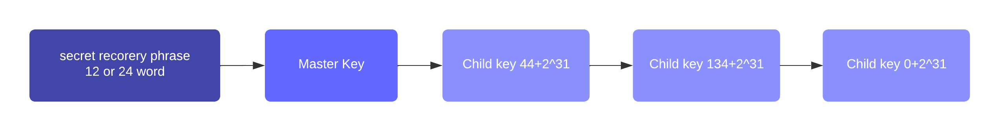

```
LIP: 0066
Title: Introduce tree based key derivation and account recovery
Author: Maxime Gagnebin <maxime.gagnebin@lightcurve.io>
Discussions-To: https://research.lisk.com/t/introduce-tree-based-key-derivation-and-account-recovery/349
Status: Active
Type: Informational
Created: 2022-06-02
Updated: 2023-12-15
```

## Abstract

This LIP proposes methods for deriving private keys from a single source of entropy. Two methods are proposed, one for Ed25519 key derivation and the other for BLS key derivation. Both methods follow a tree based derivation approach similar to the one used for HD wallets.

We also describe a procedure to discover accounts from a given secret recovery phrase.

## Copyright

This LIP is licensed under the [Creative Commons Zero 1.0 Universal](https://creativecommons.org/publicdomain/zero/1.0/).

## Motivation

The current key-derivation method extracts an Ed25519 private key from a secret recovery phrase by hashing the phrase. This use of SHA-256, though not problematic at the moment, is not recommended as SHA-256 is not a provably secure [key derivation function](https://en.wikipedia.org/wiki/Key_derivation_function). Following industry best practices, we introduce a key derivation method based on [BIP 32](https://github.com/bitcoin/bips/blob/master/bip-0032.mediawiki) and already in use in several hardware wallets.

BLS keys will be used by validators to sign, among other things, commits in Lisk chains. It is therefore also desirable to introduce a key-derivation method that allows validators to generate multiple BLS key pairs from the same secret recovery phrase. Following a common standard will ease the adoption of Lisk and its integration into third-party products. The most commonly used protocol for deriving a tree-hierarchy of BLS keys is [EIP 2333](https://eips.ethereum.org/EIPS/eip-2333), which we propose to follow in this LIP.

## Specification

### Constants

We define the following constants:

| Name                         | Type   | Value | Description                                  |
|------------------------------|--------|-------| ---------------------------------------------|
| `ED25519_PRIVATE_KEY_LENGTH` | uint32 | 32    | Length in bytes of type `PrivateKeyEd25519`. |
| `BLS_PRIVATE_KEY_LENGTH`     | uint32 | 32    | Length in bytes of type `PrivateKeyBLS`.     |

### Type Definition

| Name                | Type   | Validation | Description |
|---------------------|--------|------------|-------------|
| `BIP39Mnemonic`     | string | Must follow the mnemonic specifications of [BIP 39](https://github.com/bitcoin/bips/blob/master/bip-0039.mediawiki#Generating_the_mnemonic). | Used as the secret recovery key. |
| `ExtendedKey`       | object | Object with 2 properties, `key` and `chainCode`. Both associated values must be byte sequences of length 32. | Used as an intermediary object during key derivation. |
| `PrivateKeyEd25519` | bytes  | Byte sequences of length `ED25519_PRIVATE_KEY_LENGTH`. | An Ed25519 private key. |
| `PrivateKeyBLS`     | bytes  | Byte sequences of length `BLS_PRIVATE_KEY_LENGTH`. | An BLS private key. |

#### bytesToUint Function
We define the function `bytesToUint` to convert bytes to unsigned integer values.

```python
def bytesToUint(chainID: bytes) -> uint32:
    return int.from_bytes(chainID, byteorder='big')
```

### Ed25519 Key Derivation

This key-derivation method is used in hardware wallets and is implemented in the [Lisk desktop Wallet](https://lisk.com/wallet) since version 2.1.0.

In the proposed key-derivation, a private key is generated from a BIP 39 mnemonic (also called secret recovery phrase) and a derivation path. The derivation path is an array of non-negative integers smaller than 2^32. To make it easier to read a derivation path, they are often written in a form that omits a large constant. For example, the path `44'/134'/0'` (notice the apostrophe after each number) represents the array `[44+2^31, 134+2^31, 2^31]`. The whole derivation path is then written `m/44'/134'/0'`, indicating that we start by deriving a master key before deriving successive child keys.



Any of the child keys could be used to create an Ed25519 private key, but in practice, only the child key at the end of the path is used to create the Ed25519 private key.

#### getPrivateKeyFromPhraseAndPath

This function derives an Ed25519 private key, as defined in [RFC 8032](https://datatracker.ietf.org/doc/html/rfc8032#section-5.1.5), from an input phrase and a derivation path.

```python
def getPrivateKeyFromPhraseAndPath(phrase: BIP39Mnemonic, path: list[uint32]) -> PrivateKeyEd25519:
    masterSeed = bip39.toSeed(phrase)
    node = getMasterKeyFromSeed(masterSeed)

    for index in path:
        node = childKeyDerivation(node, index)

    return node.key
```

Where the function `bip39.toSeed` is the procedure defined in [BIP 39](https://github.com/bitcoin/bips/blob/master/bip-0039.mediawiki#from-mnemonic-to-seed) in the section "From mnemonic to seed".

The corresponding public key can then be obtained following the [key generation section of RFC 8032](https://datatracker.ietf.org/doc/html/rfc8032#section-5.1.5). It is noteworthy that several implementations of the RFC 8032 standard provide functions that can be seeded with the return value of the above function to generate a signing key object. For example, `nacl.sign.keyPair.fromSeed(seed)` from the [tweetnacl library](https://github.com/dchest/tweetnacl-js/blob/master/README.md#naclsignkeypairfromseedseed).

#### getMasterKeyFromSeed

This function derives the master node from a given random seed. All further nodes in the tree are then derived from this node.

##### Parameters

* `seed`: a byte sequence of length 64.

##### Execution

```python
def getMasterKeyFromSeed(seed: bytes) -> ExtendedKey:
    hmac = PRF-HMAC-SHA-512(
        key=0x656432353531392073656564 #utf8 encoding of 'ed25519 seed'
        data=seed
    )
    return {
        key: hmac[:32],
        chainCode: hmac[32:]
    }
```

Specifications for `PRF-HMAC-SHA-512 `can be found in [RFC4868](https://datatracker.ietf.org/doc/html/rfc4868).

#### childKeyDerivation

This function derives a child node from a parent node and the given child node index.

```python
def childKeyDerivation(node: ExtendedKey, index: uint32) -> ExtendedKey:
    indexBuffer = index.to_bytes(4, byteorder='big')
    hmac = PRF-HMAC-SHA-512(
        key=node.chainCode,
        data = 0x00 + node.key + indexBuffer
    )
    return {
        key: hmac[:32],
        chainCode: hmac[32:]
    }
```

#### Derivation Path for Ed25519 Keys

The path for deriving the n-th private key from that phrase is `m/44'/134'/n'`. This follows the specifications of [BIP 44](https://github.com/bitcoin/bips/blob/master/bip-0044.mediawiki#Registered_coin_types) and [SLIP 44](https://github.com/satoshilabs/slips/blob/master/slip-0044.md), assigning 134 to the LSK token.

The path for deriving the private key of the n-th [generator key](https://github.com/LiskHQ/lips/blob/main/proposals/lip-0044.md#generator-key) pair, for the chain with [ID](https://github.com/LiskHQ/lips/blob/main/proposals/lip-0043.md#chain-id) `chainID` is `m/25519'/134'/chainIDConverted'/n'`, where `chainIDConverted = bytesToUint(chainID)`. The hardened value `chainIDConverted'` will always be within the range of a `uint32` because [the first bit of a chain ID must be 0](https://github.com/LiskHQ/lips/blob/main/proposals/lip-0037.md#chain-identifiers-1).

### BLS Key Derivation

We follow the BLS key derivation described in [EIP 2333](https://eips.ethereum.org/EIPS/eip-2333). Additional test cases can be found in the appendix. Deriving the private key is done similarly as in the Ed25519 case with a function following the logic:

#### getBLSPrivateKeyFromPhraseAndPath

This function derives a BLS private key, as defined in [draft-irtf-cfrg-bls-signature-04](https://datatracker.ietf.org/doc/html/draft-irtf-cfrg-bls-signature-04), from an input phrase and a derivation path.

```python
def getBLSPrivateKeyFromPhraseAndPath(phrase: BIP39Mnemonic, path: list[uint32]) -> PrivateKeyBLS:
    masterSeed = bip39.toSeed(phrase)
    key = derive_master_SK(masterSeed)

    for index in path:
        key = derive_child_SK(key, index)
    return key
```

The logic of the functions `derive_master_SK` and `derive_child_SK` are specified in [EIP 2333](https://github.com/ethereum/EIPs/blob/master/EIPS/eip-2333.md).

#### Derivation Path for BLS Keys

Similarly to the specifications of [EIP 2334](https://eips.ethereum.org/EIPS/eip-2334), we use the path `m/12381/134/chainIDConverted/0` for the BLS key derived for the chain with ID `chainID` where `chainIDConverted = bytesToUint(chainID)`.

In particular, the path used to derive the BLS private key for the Lisk mainchain in the Lisk mainnet is `m/12381/134/0/0`.

### Secret Recovery Phrase

The basic entropy required to generate the various keys used in the Lisk ecosystem is stored in a 12 or 24 word phrase, as described by [BIP 39](https://github.com/bitcoin/bips/blob/master/bip-0039.mediawiki).

For users wanting to run a validator node, we recommend using a 24 word secret recovery phrase. This would be closer to specifications from [draft-irtf-cfrg-bls-signature-04](https://datatracker.ietf.org/doc/html/draft-irtf-cfrg-bls-signature-04#section-2.3), even though the BLS key derivation specified here is different from the one specified in the IETF draft.

### Account Recovery

When inputting a secret recovery phrase into the Lisk wallet, the wallet will try to assess if this phrase has been used in the past and if it corresponds to any account which at one point received tokens.

Given a secret recovery phrase `phrase`, the potential keys previously used by users are discovered by the following method, setting `GAP_LIMIT = 20`, as in [BIP 44](https://github.com/bitcoin/bips/blob/master/bip-0044.mediawiki#address-gap-limit).

```python
def getKeysFromPhrase(phrase: BIP39Mnemonic) -> list[str]:
    usedDerivationPath = []
    privateEd25519Key = sha256(phrase)
    if Address corresponding to privateEd25519Key has at least 1 incoming transaction:
        usedDerivationPath.append('legacy')
    n = 0
    gap = 0
    while gap < GAP_LIMIT:
        path = [44 + 2**31, 134 + 2**31, n + 2**31]
        privateEd25519Key = getPrivateKeyFromPhraseAndPath(phrase, path)
        if Address corresponding to privateEd25519Key has at least 1 incoming transaction:
            stringPath = f"m/44'/134'/{n}'"
            usedDerivationPath.append(stringPath)
            gap = 0
        else:
            gap += 1
        n += 1
    return usedDerivationPath
```

Additionally, UI products should allow users to input a custom derivation path that might have been used to derive the user's key.

## Rationale

### Ed25519 Key Derivation

Using a tree-hierarchical key derivation allows to derive multiple key pairs from the same secret recovery phrase. This is especially useful when using the same secret recovery phrase for multiple ecosystems or multiple tokens. The proposed method repeatedly applies an [HMAC](https://en.wikipedia.org/wiki/HMAC) function to the randomness derived from the secret recovery phrase. This method is based on  BIP 32 and is already in use in several hardware wallets. Using an industry-adopted key derivation method offers several benefits. Firstly, it gives us strong confidence that this method is secure and has been thoroughly analyzed and tested. Secondly, it makes the integration of Lisk into other products much easier.

### Ed25519 Derivation Path

The derivation path for account keys is chosen to follow the [BIP 44](https://github.com/bitcoin/bips/blob/master/bip-0044.mediawiki) standard. This is now a widely used industry standard and is currently the path used by hardware wallets to derive Lisk accounts.

### BLS Key derivation

The use of BLS keys for the Lisk ecosystem was introduced in [LIP 0038](https://github.com/LiskHQ/lips/blob/main/proposals/lip-0038.md) and one of the deciding factors to assess its security was the adoption of BLS keys by the Ethereum consensus layer. Ethereum is the main project using BLS keys and as such already has several clients implementing BLS key generation and signatures. Most of those clients follow the key-derivation method described in [EIP 2333](https://eips.ethereum.org/EIPS/eip-2333). This key derivation follows industry standards in terms of security and deviating from it would only limit the adoption of Lisk by potential third parties.

### BLS Derivation Path

Similarly to the key derivation for BLS, the Ethereum community is following [EIP 2334](https://eips.ethereum.org/EIPS/eip-2334) to choose its BLS key derivation path. The path proposed in this LIP follows the base pattern described in EIP 2334. This is done in order to facilitate potential future integration of Lisk into third party tools.

## Backwards Compatibility

This proposal is backwards compatible since the protocol is not changed.

## Reference Implementation

[Introduce new passphrase encryption algorithm](https://github.com/LiskHQ/lisk-sdk/issues/6952)

## Appendix

### Test cases for Ed25519 key derivation

#### Test case 1

secret recovery phrase: `target cancel solution recipe vague faint bomb convince pink vendor fresh patrol`

path: `m/44'/134'/0'`

Ed25519 private key: `c465dfb15018d3aef0d94d411df048e240e87a3ec9cd6d422cea903bfc101f61`

Ed25519 public key: `c6bae83af23540096ac58d5121b00f33be6f02f05df785766725acdd5d48be9d`

#### Test case 2

secret recovery phrase: `abandon abandon abandon abandon abandon abandon abandon abandon abandon abandon abandon abandon abandon abandon abandon abandon abandon abandon abandon abandon abandon abandon abandon art`

path: `m/44'/134'/0'`

Ed25519 private key: `111b6146ec9fbfd7631c75bf42de7c020837d905323a1c161352efed680e86a9`

Ed25519 public key: `4815aaeb2da9e7485bfd4f43a5a57431d78fd9e2a3545f9aa6f131ff35ee57b0`

#### Test case 3

secret recovery phrase: `abandon abandon abandon abandon abandon abandon abandon abandon abandon abandon abandon abandon abandon abandon abandon abandon abandon abandon abandon abandon abandon abandon abandon art`

path: `m/44'/134'/1'`

Ed25519 private key: `544a796e02833f9b6fe90512a8fe48360924a9a5462a5e263a3a40092dae99f5`

Ed25519 public key: `0ad5733ff582886700791aed326ff226e1c04ab5b683facb082b36594b7eddb1`

### Test cases for BLS key derivation

#### Test case 1

secret recovery phrase: `abandon abandon abandon abandon abandon abandon abandon abandon abandon abandon abandon about`

path: `m/12381`

BLS private key: `27531519788986738912817629815232258573173656766051821145387425994698573826996`

The further test cases starting with a given seed rather than with the initial secret recovery phrase can be found in [EIP 2333](https://eips.ethereum.org/EIPS/eip-2333#test-cases).
