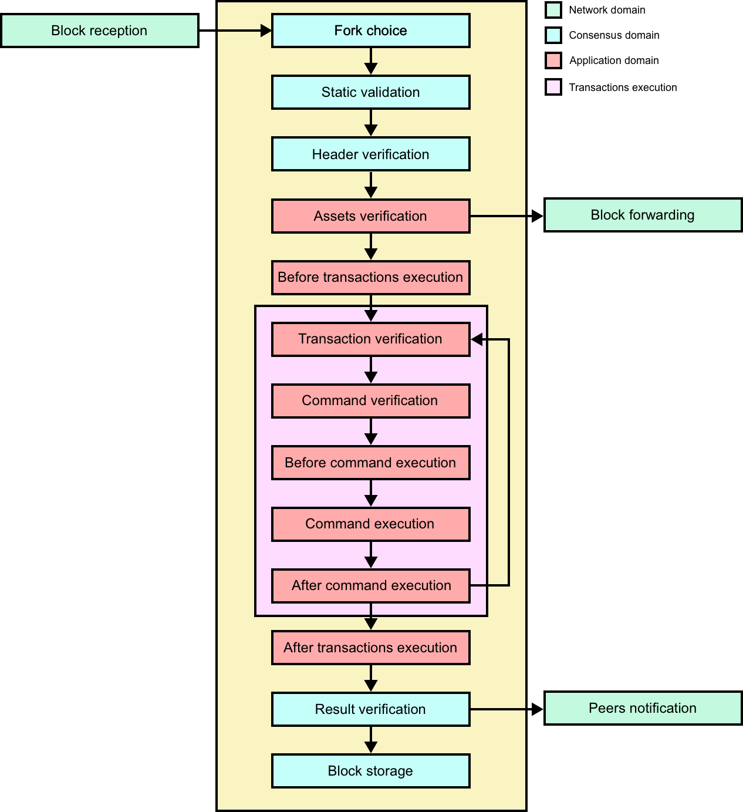
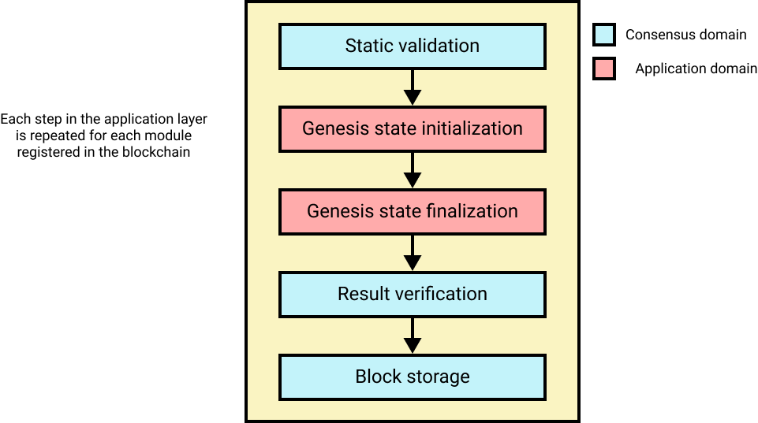
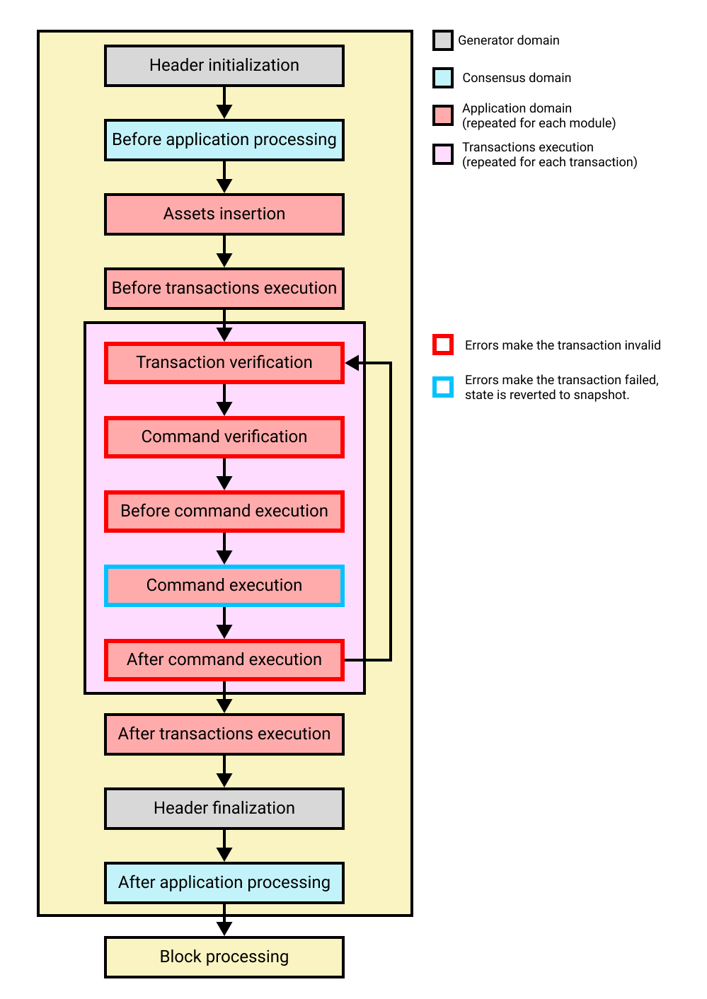

```
LIP: 0069
Title: Update Lisk SDK modular blockchain architecture
Author: Shusetsu Toda <shusetsu@lightcurve.io>
Discussions-To: https://research.lisk.com/t/update-lisk-sdk-modular-blockchain-architecture/343
Status: Draft
Type: Informational
Created: 2022-05-09
Updated: 2022-09-01
```

## Abstract

The purpose of this LIP is to describe the updated Lisk SDK architecture including the block lifecycle and hooks with related new terminologies.

## Copyright

This LIP is licensed under the [Creative Commons Zero 1.0 Universal](https://creativecommons.org/publicdomain/zero/1.0/).

## Rationale

### Overview

The theoretical model for a blockchain is a replicated state-machine. In this model, a state-machine that transitions from one state to another based on its inputs (blocks in the context of blockchain) is replicated among all nodes of the respective blockchain network. Taking this model as a basis, in the Lisk SDK we distinguish between the following three domains:

* Networking domain: Responsible for the communication of the peer-to-peer network.
* Application domain: Responsible for transitioning the blockchain state with deterministic logic.
* Consensus domain: Responsible for the replication of the same sequence of states among all nodes in the network. This is achieved by nodes in the network following a consensus protocol and utilizing the application and network domains.

In general, when executing a block B, the state-machine changes its state from a state S to a state S'. This one state transition can further be broken down into smaller intermediate state transitions, for instance, by considering that executing a block means executing all transactions in that block sequentially. In the Lisk SDK, we want to allow developers to define the whole state machine in a modular way by allowing them to easily define one part of the state and state transitions. This is achieved by implementing modules which can:

* Define their own state as specified in the [LIP 0040 - Define state model and state root](https://github.com/LiskHQ/lips/blob/main/proposals/lip-0040.md).
* Define arbitrary block asset data that is added to every block by block generators as defined in [LIP 0055 - Update block schema and block processing](https://github.com/LiskHQ/lips/blob/main/proposals/lip-0055.md).
* Define specific logic that is executed with every block, before or after executing the transactions in the block (see [LIP 0055](https://github.com/LiskHQ/lips/blob/main/proposals/lip-0055.md)). This is in particular helpful to process the module-specific block asset.
* Define specific logic that is executed with every transaction, before or after executing the command referenced in the transaction (see [LIP 0055](https://github.com/LiskHQ/lips/blob/main/proposals/lip-0055.md)). This is helpful to define logic that is executed for all commands in the blockchain, independent of the respective module.
* Define commands that can be triggered by sending a transaction.

The state-machine in the Lisk SDK provides a certain interface to the consensus domain which is called during the block execution, and each module can define hooks which will be called from the state-machine during the execution.

### New Terminologies

#### Command

A command is a group of state-transition logics triggered by a transaction identified by the module and command name of the transaction, previously known as _asset_. Historically, the names “custom transaction” and “custom asset” were used. However, this was conceptually misleading because the parameters property of a transaction accepts any binary data, which is used as input to the state transition logic defined in a module, and it is not customizing the transaction nor the logic.

#### Cross-chain Command

With the introduction of cross-chain messages (CCMs), we introduce the concept of _cross-chain commands_. CCMs trigger the logic defined by the cross-chain command identified by module name and cross-chain command name.

#### Parameters

Parameters is a property of a transaction which is passed as an input to the command being triggered by the transaction, previously known as _transaction asset_. Because it is used as input parameters for the above _command_, calling it parameters is more suited than the transaction asset.

#### Method

Method is the interface for the module-to-module communication. Previously, the term _reducer_ was used to describe this interface. However, the term reducer generally refers to functions that change the state or derive the new state from the input. For the interface, there are functions which just return a calculated value or information from the state without any mutation. Also, the concept of the interface was desired to be more generic.

#### Endpoint

_Endpoint_ is the interface for a module to an external system through an RPC endpoint. _Action_ was the term used to define the RPC endpoint handlers for the plugins or external system to call. Similar to the change from _reducer_ to _method_, action was also not only mutating the state. Therefore, a more generic name was desired.

#### Application hooks

Application hooks are module methods which are called during the block execution. These hooks cannot mutate the block, but they can introduce state changes.

#### Block Generation hooks

Block generation hooks are module methods which are called only during the block generation. These hooks cannot introduce state changes, but they can add information to the block assets.

#### Execute

The terms _apply_, _process_, _execute_ were used interchangeably to describe the execution of a block or a transaction. The term is unified to _execute_. A block is executed and hooks apply the state changes through the state machine.

#### Events

_Events_ are on-chain data emitted during the processing of a block which add extra information about the execution of state transitions. The protocol for events is defined in [LIP 0065][lip-0065].

## Specifications

### Module

Lisk SDK modules can define block generation hooks, state machine hooks and commands to add logic to the state machine. Each hook of the module will be called as described in the life cycle below (also described in [LIP 0055](https://github.com/LiskHQ/lips/blob/main/proposals/lip-0055.md)).

#### Block executions

Block execution happens when the consensus receives a new block from a peer, and it follows the below life cycle.

#####



##### Assets verification

The hook _verifyAssets_ is only called before executing a block. If this stage fails, the block is considered invalid and will be rejected. In particular, the following hooks will not get executed. This hook is used for verification before any state changes. For example, at this stage, each module checks if the expected assets exist in the block.

In this hook, the state cannot be mutated and events cannot be emitted.

##### Before transactions execution

The hook _beforeTransactionsExecute_ is the first hook that is triggered by the block.

In this hook, the state can be mutated and events can be emitted.

##### Transaction verification

The hook _verifyTransaction_ is called for all the transactions within a block regardless of the command they trigger. This ensures that all transactions included in a block  satisfy the verifications defined in this hook.

This hook is used also for transaction verification in the transaction pool to reject invalid transactions early before transmitting them to the network. For example, signature verification is done in this hook.

In this hook, the state cannot be mutated and events cannot be emitted.

##### Command verification

The hook _Command.verify_ is called only for the command that is referenced by the module name and the command name in the transaction. Similar to the _verifyTransaction_ above, Command.verify will be called also in the transaction pool, and it is to ensure the verification defined in this hook is respected when the transactions are included in a block.

In this hook, the state cannot be mutated and events cannot be emitted.

##### Before command execution

The hook _beforeCommandExecute_ is called for all the transactions within a block regardless of the command they trigger, similar to _verifyTransaction_. If the hook fails during the execution, the transaction becomes invalid and the block containing this transaction will be invalid.

In this hook, the state can be mutated and events can be emitted.

##### Command execution

The hook _Command.execute_ is triggered by a transaction identified by the module name and the command name. If the hook execution fails, the transaction that triggered this command is still valid, but the state changes applied during this hook are reverted. Additionally, an event will be emitted that provides the information whether a command is executed successfully or failed.

In this hook, the state can be mutated and events can be emitted.

##### After command execution

The hook _afterCommandExecute_ is called for all the transactions within a block regardless of the command they trigger. If the hook fails during the execution, the transaction becomes invalid and the block containing this transaction will be invalid.

In this hook, the state can be mutated and events can be emitted.

##### After transaction execution

The hook _afterTransactionsExecute_ is the last hook allowed to define state changes that are triggered by the block. Additionally, when defining the afterTransactionsExecute logic for a module, the transactions included in the block are available in that context and can be used in this logic. For example, this hook can be used to sum the fees of the transactions included in a block and transfer them to the block generator.

In this hook, the state can be mutated and events can be emitted.

#### Genesis block execution

Genesis block execution happens only once when starting the blockchain without any data, and all hooks for genesis block execution can mutate the state.



##### Genesis state initialization

The hook _initGenesisState_ is called at the beginning of the genesis block execution. Each module must initialize their state using an associated block asset. It is recommended not to use methods from other modules because their state might not be initialized yet depending on the order of the hook execution.

##### Genesis state finalization

The hook _finalizeGenesisState_ is called at the end of genesis block execution. In this hook, it can be assumed that the state initialization via initGenesisState of every module is completed and therefore methods from other modules can be used.

#### Block generation

Block generation hooks are only called during the block generation, and not during the block executions. The main purpose of the hooks is to add additional information into the block by block generators.

Header creation and result verification in the diagram below are not hooks and they are handled by the framework.

Also, state change cannot be applied in these hooks.



##### Assets insertion

The hook _insertAssets_ is called at the very beginning of the block generation. The assets added during the execution of this hook can be used in all the execution hooks afterwards.

For example, the `seedReveal` property is added to the block asset in this hook by the [Random module](https://github.com/LiskHQ/lips/blob/main/proposals/lip-0046.md).

## Backwards Compatibility

This LIP is informational. It does not introduce any protocol change.

[lip-0065]: https://github.com/LiskHQ/lips/blob/main/proposals/lip-0065.md
