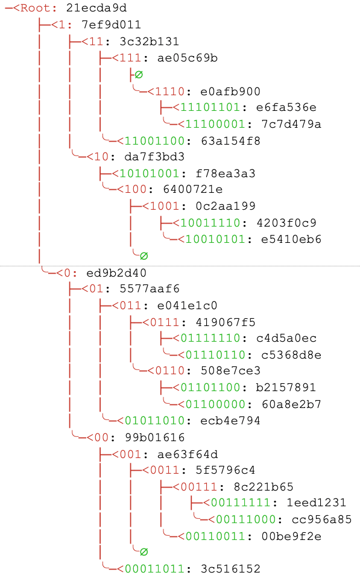
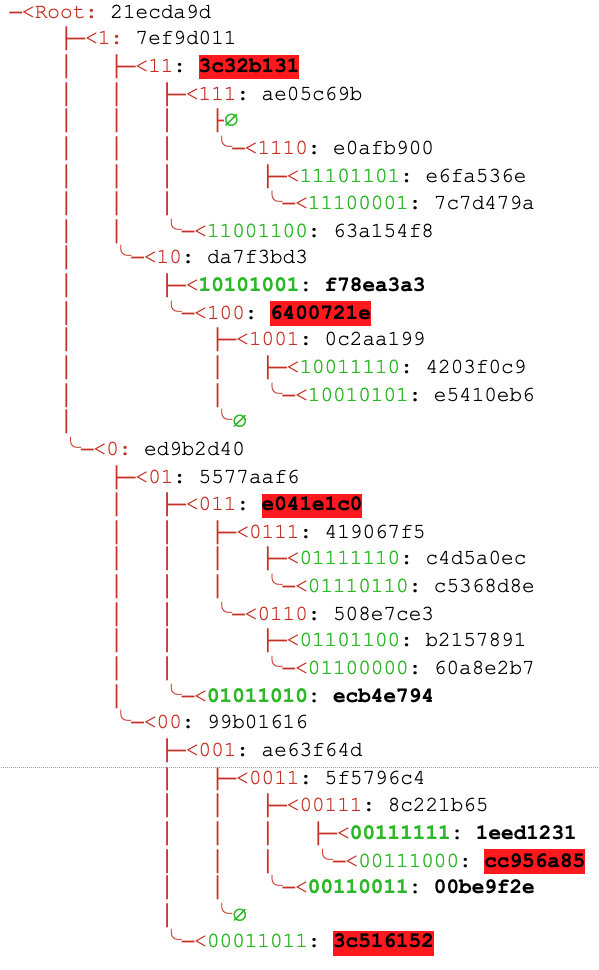

```
LIP: <LIP number>
Title: Introduce sparse Merkle trees
Author: Alessandro Ricottone
Type: Informational
Created: <YYYY-MM-DD>
Updated: <YYYY-MM-DD>
```

## Abstract

In this LIP, we specify the sparse Merkle tree implementation for the Lisk protocol and the format for inclusion proofs. A sparse Merkle tree is an authenticated data structure that allows to validate a key-value dataset with a single hash value, the Merkle root. It differs from a regular Merkle tree in that every element of the dataset occupies a fixed position in the tree, given by its key, and the resulting Merkle root depends only on the final dataset and not on the order of insertion.

## Copyright

This LIP is licensed under the [Creative Commons Zero 1.0 Universal](https://creativecommons.org/publicdomain/zero/1.0/).

## Motivation

A sparse Merkle tree (SMT) is a data structure used to accumulate a key-value dataset into a single root [1].  The main differences between SMTs and regular Merkle trees are that in a SMT the final Merkle root does not depend on the order of insertion of the data, since all elements occupy a fixed position in the tree structure (given by the key). SMTs allow for efficient proofs-of-non-inclusion, where the Prover can convince the Verifier that a certain key-value pair is not part of the underlying dataset.

In this LIP, we specify the SMT data structure for the Lisk protocol. We do not describe specific use-cases, which will be presented in other LIPs. We describe the format for inclusion proofs, the verification protocol, and the proof serialization.

## Rationale

### General Description and Properties

For the rest of the LIP, we indicate with N the number of elements present in the tree, with L the binary length of a key, with Log the base 2 logarithm, and with the symbol `|` the bytes-concatenation operation.

A sparse Merkle tree is an authenticated data structure organized as a tree. Unlike regular Merkle trees (specified in [LIP 0031](https://github.com/LiskHQ/lips/blob/master/proposals/lip-0031.md) for the Lisk protocol), a SMT contains a distinct leaf node for every possible key. Therefore, the size of the tree is exponential in the length of the keys. For example, for 32-byte keys, a SMT contains 2<sup>256</sup> leaves and 256 layers. Such an enormous number of nodes cannot actually be generated and stored, hence the tree is only ''simulated''.

The defining property of a SMT is:

1. **History independence**: the Merkle root is independent of the insertion history and depends only on the final dataset. 

The goal of our specification of a SMT is to have the following properties:

2. **Dynamic**: the tree can be updated efficiently, i.e. with O(Log(N)) operations.
3. **Universal**: the implementation supports efficient inclusion and non-inclusion proofs. 
4. **Efficient storage**: only O(N) elements are stored explicitly.

It is sufficient that these properties hold when the keys are randomly distributed, but not necessarily attained in general (for example when the keys are chosen adversarially).

We apply the following optimizations, similar to the one defined in the Diem protocol [2]:

1. Each subtree with exactly one non-empty leaf is replaced by the leaf itself.
2. Each subtree containing only empty nodes is replaced by a constant node with hash value equal to `EMPTY_HASH`.

Here, an empty node is a node storing no value (or value=0). A new tree is initialized with all empty nodes. An example of a tree resulting from these optimizations is given in Figure 1.



*Figure 1: a tree consisting of 11 non-empty leaves. Leaf keys (indicated in green) have a length of 1 byte. We show only the first 4 bytes of the node hashes for convenience and we display the keys in their binary representation. ∅ denotes default empty nodes. Branch nodes do not have a key, but here we indicate in red the common prefix of the leaf nodes below the branch.*

As mentioned, the tree height is O(Log(N)) if the keys are randomly distributed. It is easy to fulfill this condition by hashing the keys prior to insertion in the tree. The average number of operations needed to update the tree after inserting a node approaches Log(N), while it equals L (256 for 32-byte keys) in the worst case (two consecutive leaf nodes differing only on their last key digit). The additional introduction of extension nodes could eliminate empty nodes and therefore bring the number of operations down to O(Log(N)) also for the worst case. However, this optimization introduces extra complexity in the non-inclusion proof protocol, and as explained, this drawback is not relevant for randomly distributed keys.

We use proof compression to guarantee that the proof size also scales as O(Log(N)). 
We only pass non-empty hashes as part of the proof, and include an extra bitmap to indicate which nodes in the proof path are non default empty nodes.
In summary, this construction supports update, proof generation, and verification in O(Log(N)) operations, with height, number of nodes, and proof length also scaling as O(Log(N)).

### Inclusion Proof Protocols

In this section, we introduce some terminology and explain two general protocols for inclusion proofs. The Verifier holds `merkleRoot`, the Merkle root of the tree built from the dataset, and a set of keys, `queryKeys`, for which they wish to obtain an inclusion proof.

An inclusion proof is characterized by the following properties:

*   `queryKeys`: An array of keys whose presence in the dataset has to be verified. 
*   `proof`: The proof itself, consisting of 2 parts: `siblingHashes`, `queries`:
    *   `siblingHashes`: An array of bytes necessary to compute the Merkle root. 
    *   `queries`: An array of objects, one per key in `queryKeys`. Each object describes the inclusion proof of the corresponding key and contains the following properties:
        *   `key`: A byte value indicating the presence or not of the corresponding key in the tree. 
        *   `bitmap`: A byte value whose binary expansion indicates the presence of a branch or leaf node (digit 1) or an empty node (digit 0) in the path from the leaf node to the root (see Figure 2). 
        *   `value`: A byte value giving the value of the node associated with `key.`

The protocol for an inclusion proof is similar to the [one specified for regular Merkle trees](https://github.com/LiskHQ/lips/blob/master/proposals/lip-0031.md#proof-of-inclusion-protocol):

*   Verifier: The Verifier knows `merkleRoot` and sends the Prover an array of keys, `queryKeys`, for which they wish to obtain a proof-of-inclusion;
*   Prover:
    *   The Prover finds the leaf node corresponding to each key `k` in `queryKeys` and assigns to each a `query` object with a key, a bitmap, and a value. The bitmap indicates the presence of default empty nodes along the path to the Merkle root. If the node exists, `query.key` is set to `k` and `query.value` to the node value; if the node does not exist, the Verifier returns an inclusion proof for another leaf or a default empty node in the path of the `k`. In this case, `query.key` and `query.value` are set to the leaf key and leaf value or to `k` and empty value, respectively.  
    *   The Prover generates `siblingHashes` by merging together the sibling hashes of the single paths in the correct order of application, and transmits the complete proof to the Verifier. The complete proof contains a common array `siblingHashes` and an array `queries`, containing a query object for each key in `queryKeys`, respecting the same order.
*   Verifier: The Verifier uses `siblingHashes` to recalculate the Merkle root starting from the leaf nodes derived from `queryKeys` and `queries`, and checks that it equals `merkleRoot`.

As shown, a non-inclusion proof is generated by providing a proof of inclusion for another leaf or a default empty node in the path of the target leaf node, indicating that there are no other leaves in the subtree (see Figure 2). 

## Specification

For the rest of this proposal, we define the following constants:

| Name          | Type    | Value       |
| ------------- |---------| ------------|
| EMPTY_HASH    | bytes   | SHA-256("") |
| LEAF_PREFIX   | bytes   | 0x00        |
| BRANCH_PREFIX | bytes   | 0x01        |
| KEY_LENGTH    | integer | Set when initializing the data structure |


Each node in the tree has a `data` and a `hash` property. Leaf nodes store the key and value in their data property, while branch nodes store the hashes of the child nodes. Default empty nodes have a constant hash `EMPTY_HASH`.  In summary, we define 3 different nodes:

```
leafNode(key, value) = {
	data: key|value,
	hash: leafHash(data)
},

branchNode(child1, child2) = {
	data: child1.hash|child2.hash,
	hash: branchHash(data)
},

defaultEmptyNode() = {
	hash: EMPTY_HASH
}.
```

Similar to what we do for regular Merkle trees, we use a different hash function for leaf and branch nodes to protect against second preimage attacks:

```
leafHash(msg) = hash(LEAF_PREFIX | msg)
branchHash(msg) = hash(BRANCH_PREFIX | msg),
```

where `LEAF_PREFIX` and `BRANCH_PREFIX` are two constants set to:

```
LEAF_PREFIX = 0x00
BRANCH_PREFIX = 0x01.
```

Here the function `hash` returns the SHA-256 hash of the input. Leaf nodes are ''hardened'' by hashing their keys together with their values. Otherwise, in a subtree with only one non-empty node several keys would correspond to the same leaf node.   

The Merkle tree is built on top of an underlying dataset consisting of a set of (key, value) tuples. The key fixes the position of each dataset element in the tree: starting from the root, each digit in the binary expansion indicates whether we should follow the left child (next digit is 0) or the right child (next digit is 1), see Figure 1. The length of the key (in bytes) is a fixed constant of the tree, `KEY_LENGTH`, larger than 0. The value property must be non-empty.

As explained in the rationale, rather than explicitly creating a full tree, we simulate it by inserting only non-zero leaves into the tree whenever a new data block (a key-value pair) is added to the dataset, using the two optimizations:

1. Each subtree with exactly one non-empty leaf is replaced by the leaf itself.
2. Each subtree containing only empty nodes is replaced by a constant node with hash value equal to `EMPTY_HASH`.

We define the utility function:

```
function binaryExpansion(k):
    return the binary expansion of k. Enough leading 0s are prepended until the binary expansion has length=8*KEY_LENGTH  
```

The functions defined in the following sections are methods of the tree, i.e. we assume that the tree is a global data structure that can be modified by these functions.

### Root Hash Calculation

The Merkle root of a dataset is computed as follows:

1. The Merkle root of an empty dataset is set to the constant value `EMPTY_HASH`.
2. The Merkle root of a dataset with a single element is set to the leaf hash of that element.
3. Otherwise, the Merkle root is the root of the tree resulting from inserting each key-value pair in the dataset using the update protocol outlined here. 

```
function update(k, v):
    if v is empty:
        throw error
    if length of k != KEY_LENGTH:
        throw error
    let newLeaf=leafNode(k,v)
    let ancestorNodes be an empty array
    let currentNode be the tree root node 
    let binaryKey=binaryExpansion(k)
    let h = 0

    while currentNode is branchNode:
        append currentNode to ancestorNodes
        let d be the digit at position h of binaryKey
        if d == 0:
            set currentNode to the left child of currentNode
        else if d == 1:
            set currentNode to the right child of currentNode
        set h to h+1
    //currentNode is an empty default node or a leaf node

    //currentNode is an empty node
    if currentNode is defaultEmptyNode:  
        //newLeaf will replace the default empty node
        set bottomNode=newLeaf 
    //node has the same key, we need to update the value
    else if currentNode.key==k: 
        //currentNode will be updated to newLeal
        set bottomNode=newLeaf
    //currentNode has a different key, we insert the new leaf
    else:
        //we need to create new branches in the tree to fulfill the 
        //condition of one leaf per empty subtree 
        //note: h is set to the last value from the previous loop
        let d be the digit at position h of binaryKey
        let currentNodeBinaryKey=binaryExpansion(currentNode.key)
        let t be the digit at position h of currentNodeBinaryKey
        while d == t:
            //create branch node with empty value
            let defaultBranch=branchNode(defaultEmptyNode, defaultEmptyNode) 
            append defaultBranch to ancestorNodes
            set h to h+1
            set d to the next digit of binaryKey
            set t to the next digit of currentNodeBinaryKey

        //create last branch node, parent of node and newLeaf
        if d == 0:
            set bottomNode=branchNode(newLeaf,currentNode)
        else if d == 1:
            set bottomNode=branchNode(currentNode,newLeaf)

    //finally update all branch nodes in ancestorNodes, 
    //starting from the last
    while h>0:
        let d be the digit at position h-1 of binaryKey
        let p be the element of ancestorNodes at position h-1
        if d == 0:
            let siblingNode be the right child node of p
            update p.data to bottomNode.hash|siblingNode.hash 
            update p.hash to branchHash(p.data)
        else if d == 1:
            let siblingNode be the left child node of p
            update p.data to siblingNode.hash|bottomNode.hash
            update p.hash to branchHash(p.data)
        set bottomNode to p
        set h to h-1

    //the final value of bottomNode is the root node of the tree
    return bottomNode.hash
```

### Removing a Leaf Node

A certain key-value pair can be removed from the tree by deleting the corresponding leaf node and rearranging the affected nodes in the tree. The following protocol can be used to remove a key `k` from the tree.

```
function remove(k):
    if length of k != KEY_LENGTH:
        throw error
    let ancestorNodes be an empty array
    let currentNode be the tree root node 
    let binaryKey=binaryExpansion(k)
    let h = 0

    while currentNode is branchNode:
        append currentNode to ancestorNodes
        let d be the digit at position h of binaryKey
        if d == 0:
            set currentNodeSibling to the right child of currentNode
            set currentNode to the left child of currentNode
        else if d == 1:
            set currentNodeSibling to the left child of currentNode
            set currentNode to the right child of currentNode
        set h to h+1
    //currentNode is an empty default node or a leaf node

    //currentNode is empty, nothing to do here
    if currentNode is defaultEmptyNode:
        return root hash
    //key not in the tree, nothing to do here
    else if currentNode.key != key:
        return root hash
    //currentNode has a branch sibling, delete currentNode
    else if currentNodeSibling is branchNode:
        delete currentNode
        let bottomNode=defaultEmptyNode
    //currentNode has a leaf sibling, move sibling up the tree
    else if currentNodeSibling is leafNode:
        delete currentNode
        let bottomNode=currentNodeSibling
        set h to h-1
        while h > 0:
           let p be the element of ancestorNodes at position h-1
           if neither of the children of p is defaultEmptyNode:
               break 
           delete p
           set h to h-1

    //finally update all branch nodes in ancestorNodes. 
    //note that h now is set to the correct height from which
    //nodes have to be updated
    while h > 0:
        let d be the digit at position h-1 of binaryKey
        let p be the element of ancestorNodes at position h-1

        if d == 0:
            let siblingNode be the right child node of p
            update p.data to bottomNode.hash|siblingNode.hash 
            update p.hash to branchHash(p.data)
        else if d == 1:
            let siblingNode be the left child node of p
            update p.data to siblingNode.hash|bottomNode.hash
            update p.hash to branchHash(p.data)
        set bottomNode to p
        set h to h-1

    //the final value of bottomNode is the root node of the tree
    return bottomNode.hash
```

### Inclusion Proof Construction and Serialization



*Figure 2: the inclusion proof for <code>queryKeys=[00110101, 00111111, 01011010, 10111000]</code>. Elements of <code>proof.queries</code> are indicated in bold, while elements of <code>proof.siblingHashes</code> are highlighted in red. The complete proof is given by (hash values are shortened to the first 4 bytes and key and bitmap values are hex-encoded):*
```
proof={siblingHashes:[cc956a85, 3c516152, e041e1c0, 6400721e, 3c32b131],
       queries: [
           {key:33, value:4e074085, bitmap:17},
           {key:3f, value:8a8de823, bitmap:37},
           {key:5a, value:bbeebd87, bitmap:07},
           {key:a9, value:9e8e8c37, bitmap:07}]}.
```
*Given these keys and values, the hash of the node can be recomputed. For example, to the leaf node with <code>key=00110011</code> corresponds the hash  <code>leafHash(33|4e07408562bedb8b60ce05c1decfe3ad16b72230967de01f640b7e4729b49fce) = 00be9f2ec46f47e14965f0cb9903f09bc6fe30244109c7c5310180a2251c75cc</code>.*


#### Proof Construction

The properties and protocol for an inclusion proof have been introduced in the Rationale section, above. In this section, we specify how these properties are calculated. We assume that the queried keys have a fixed length `KEY_LENGTH`.

The following function generates the query response to a single key, including the sibling hashes and the hash of the visited nodes.

```
function generateQueryProof(queryKey):
    let ancestorHashes be an empty array
    let siblingHashes be an empty array
    let queryBitmap be an empty string
    let currentNode be the tree root node 
    if currentNode is defaultEmptyNode:
        let response be a data structure with:
            {key=queryKey, 
             value=empty buffer,
             binaryBitmap=empty string,
             siblingHashes=siblingHashes,
             ancestorHashes=ancestorHashes}
    return response

    let binaryKey=binaryExpansion(queryKey)
    let h = 0

    while currentNode is branch:
        append currentNode.hash to ancestorHashes
        let d be the digit at position h of binaryKey
        if d == 0:
            set currentNode to the left child of currentNode
            set currentNodeSibling to the right child of currentNode
        else if d == 1:
            set currentNode to the right child of currentNode
            set currentNodeSibling to the left child of currentNode
        if currentNodeSibling is defaultEmptyNode: 
            prepend 0 to queryBitmap
        else:
            prepend 1 to queryBitmap
            append currentNodeSibling.hash to siblingHashes
        set h to h+1

    //currentNode is an empty default node or a leaf node
    if currentNode is defaultEmptyNode:
        //queryKey is not part of the tree
        let response be a data structure with:
            {key=queryKey, 
            value=empty buffer,
            binaryBitmap=queryBitmap,
            siblingHashes=siblingHashes,
            ancestorHashes=ancestorHashes}
    else: 
        let response be a data structure with:
            {key=currentNode.key, 
            value=currentNode.value,
            binaryBitmap=queryBitmap,
            siblingHashes=siblingHashes,
            ancestorHashes=ancestorHashes}
    return response
```

Note that the first digit of `queryBitmap` is always a 1, else the tree would have been invalidly constructed. As a consequence, the hex encoded value of `queryBitmap` corresponds to a unique series of digits.
To generate a complete inclusion proof, several query responses are combined together, and their sibling hashes are merged in a single array. We first define the utility function `sortByBitmapAndKey`.

```
function sortByBitmapAndKey(queries):
    sort queries by the longest binaryBitmap, breaking ties by smaller key. 
    //This corresponds to a bottom-up left-right ordering of the corresponding leaf nodes.
```

Given an array of keys `queryKeys`, the inclusion proof is obtained from the function `generateProof(queryKeys)`. 

```
function generateProof(queryKeys):
    //queries hold the individual responses, respecting
    //the same order of queryKeys
    let queries be an empty array
    //sortedQueries is used to merge together the siblingHashes
    let sortedQueries be an empty array
    let ancestorHashes be an empty array
    for each key k in queryKeys:
        let r=generateQueryProof(k)
        append r to sortedQueries
        let q be a data structure with:
            {key=r.key,
            value=r.value,
            bitmap=r.binaryBitmap encoded as byte array}
        append q to queries
        append r.ancestorHashes to ancestorHashes

    let siblingHashes be an empty array
    while sortedQueries is non-empty:
        sortedQueries = sortByBitmapAndKey(sortedQueries)
        let q be the first element of sortedQueries
        if q.binaryBitmap is empty string: 
            remove p from sortedQueries
            continue

        let b to the first digit of q.binaryBitmap
        remove the first digit of q.binaryBitmap 
        if b == 1: 
            let siblingHash be the last element of q.siblingHashes
            remove the last element from q.siblingHashes
            //only append to siblingHashes if it cannot be computed
            if siblingHash not in union(siblingHashes, ancestorHashes):
                append siblingHash to siblingHashes

    let proof be a data structure with:
        {siblingHashes=siblingHashes,
        queries=queries}
    return proof
```

#### Proof Verification

To check the proof, the Verifier calls the `verify(queryKeys, proof, merkleRoot)` function. This function is not a method of the tree, and can be run just by holding the Merkle root. Here, `queryKeys` is the same array of keys used to generate `proof`, while `merkleRoot` is the root of the SMT, known to the Verifier. 

We define the utility functions `filterQueries`, `areSiblingQueries`, and `calculateRoot`. The general strategy is to recompute the Merkle root using `proof` and `queryKeys` in `calculateRoot`. The `verify` function then checks if the provided proof is valid against `queryKeys` and that the calculated root equals `merkleRoot`.

```
//This function filters the array of queries by keeping only those
//with a different key prefix, i.e., by removing queries that have
//merged together
function filterQueries(queries):
    for each query q in queries:
        let h=length of q.binaryBitmap
        let binaryKey=binaryExpansion(q.key)
        let q.keyPrefix be the first h digits of binaryKey

        if there exists another p in queries s.t. p.keyPrefix == q.keyPrefix:
            if p.hash != q.hash:
                //the two merging queries have mismatching hashes
                throw error
            //filter queries by keeping only unique values of q.keyPrefix
            remove p from queries

    return queries
```

```
//This function checks whether two queries correspond to nodes that are
//children of the same branch node, with q1 and q2 the left and right 
//child respectively 
function areSiblingQueries(q1, q2):
    if length of q1.binaryBitmap != length of q2.binaryBitmap:
        return false
    let h=length of q1.binaryBitmap
    let binaryKey1=binaryExpansion(q1.key)
    let binaryKey2=binaryExpansion(q2.key)
    let keyPrefix1 be the first (h-1) digits of binaryKey1
    let keyPrefix2 be the first (h-1) digits of binaryKey2
    if keyPrefix1 != keyPrefix2:
        return false
    let d1 be the digit at position h of binaryKey1
    let d2 be the digit at position h of binaryKey2
    return d1==0 and d2==1
```

```
function calculateRoot(siblingHashes, queries):
    //we add the hash property to each query, used to recompute the tree root
    for each query q in queries:
        set q.binaryBitmap to binaryExpansion(q.bitmap) without leading zeros
        //if value is empty, it is a defaultEmptyNode
        if q.value is empty bytes:
            set q.hash to EMPTY_HASH
        else:
            let qLeaf=leafNode(q.key,q.value)
            set q.hash to qLeaf.hash

    let sortedQueries=sortByBitmapAndKey(queries)
    sortedQueries=filterQueries(sortedQueries)
    while sortedQueries is non-empty:
        let q be the first element of sortedQueries
        //if the binaryBitmap is empty string, we reached the top of the tree
        if q.binaryBitmap is empty string: 
            return q.hash

        let b to the first digit of q.binaryBitmap
        //h equals the height of the node; e.g., the root has h=0      
        let h=length of q.binaryBitmap
        let binaryKey=binaryExpansion(q.key)

        //we distinguish three cases for the sibling hash:
        //1. sibling is next element of sortedQueries
        let nextQuery = next element of sortedQueries
        if nextQuery exists and areSiblingQueries(q, nextQuery): 
            set siblingHash to nextQuery.hash
            remove nextQuery from sortedQueries
        //2. sibling is default empty node
        else if b == 0: 
            set siblingHash to EMPTY_HASH
        //3. sibling hash comes from siblingHashes
        else if b == 1:
            set siblingHash to the first element of siblingHashes
            remove the first element of siblingHashes

        let d be the digit at position (h-1) of binaryKey    
        if d == 0:
            update q.hash to branchHash(q.hash, siblingHash)
        else if d == 1:
            update q.hash to branchHash(siblingHash, q.hash)

        remove the first digit of q.binaryBitmap
        sortedQueries=sortByBitmapAndKey(sortedQueries)
        sortedQueries=filterQueries(sortedQueries)
    
    throw error
```

```
function verify(queryKeys, proof, merkleRoot):
    //check that the proof is valid with respect to queryKeys
    if length of queryKeys != length of proof.queries:
        return false
    for each query q in proof.queries:
        let k be the corresponding key in queryKeys (the element of queryKeys with same index)
        //q is an inclusion proof for k or a default empty node 
        if q.key == k:
            continue
        //q is an inclusion proof for another leaf node
        let binaryQueryBitmap = binaryExpansion(q.bitmap) without leading zeros
        let binaryQueryKey=binaryExpansion(q.key)
        let binaryKey=binaryExpansion(k)
        let sharedPrefix = the common prefix of binaryQueryKey and binaryKey
        if length of binaryQueryBitmap > length of sharedPrefix:
            //q does not give an non-inclusion proof for k
            return false 

    //calculate the new Merkle root from the proof
    let calculatedRoot = calculateRoot(proof.siblingHashes, proof.queries)
    return calculatedRoot == merkleRoot
```
#### Proof Serialization

The inclusion proof is serialized according to the specifications defined in [LIP 0027](https://github.com/LiskHQ/lips/blob/master/proposals/lip-0027.md) using the following JSON schema:

```
proof = {
  "type": "object",
  "properties": {
    "siblingHashes": {
      "type": "array",
      "items": {"dataType": "bytes"},
      "fieldNumber": 1 },
    "queries": {
      "type": "array",
      "items": {
        "type": "object",
        "fieldNumber": 2,
        "properties": {
          "key": {
            "dataType": "bytes",
            "fieldNumber": 1 },
          "value": {
            "dataType": "bytes",
            "fieldNumber": 2 },
          "bitmap": {
            "dataType": "bytes",
            "fieldNumber": 3 },
        },
        "required": ["key", "value", "bitmap"]
      }  
    }
  },
  "required": ["siblingHashes", "queries"]
}
```

## Backwards Compatibility

This proposal does not introduce any fork(s) in the network, as it only defines the specification of sparse Merkle trees in the Lisk protocol. 

## References

[1] Rasmus Dahlberg, Tobias Pulls, and Roel Peeters, [Efficient Sparse Merkle Trees](https://eprint.iacr.org/2016/683.pdf)

[2] Jellyfish Merkle tree, github.com/diem/diem/tree/master/storage/jellyfish-merkle/src
