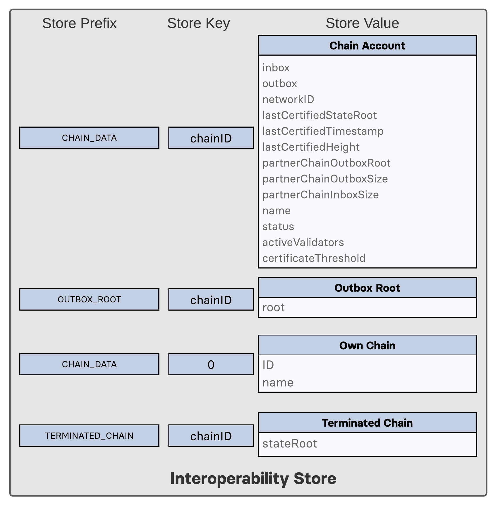

```
LIP: <LIP number>
Title: Introduce Interoperability module
Author: Alessandro Ricottone <alessandro.ricottone@lightcurve.io>
        Mitsuaki Uchimoto <mitsuaki.uchimoto@lightcurve.io>
Discussions-To: https://research.lisk.com/t/introduce-interoperability-module/290
Type: Standards Track
Created: <YYYY-MM-DD>
Updated: <YYYY-MM-DD>
```

## Abstract

The Interoperability module provides basic functionalities to transmit information between interoperable chains in the Lisk ecosystem using cross-chain messages. In this LIP the properties, serialization, and initial values of this module are specified. Additionally, this LIP also provides a broad overview of the Lisk interoperability solution, motivating several design choices and presenting the new commands that are part of the Interoperability module.

## Copyright

This LIP is licensed under the [Creative Commons Zero 1.0 Universal](https://creativecommons.org/publicdomain/zero/1.0/).

## Motivation

Interoperability has the potential to solve the scaling issue of blockchains: Instead of deploying applications and their corresponding commands onto a single blockchain, these are implemented into separate blockchains which then communicate with each other using an interoperability protocol.

To achieve interoperability, chains in the Lisk ecosystem (the mainchain and the sidechains participating in interoperability) exchange information via _cross-chain transactions_. As an example, a user can issue a cross-chain transaction to transfer part of its mainchain LSK balance to a sidechain, and subsequently use it to issue one of the sidechain custom commands.

In the Lisk protocol, cross-chain transactions are special in that, after being included in their origin ledger, some new data structures, the _cross-chain messages_ (CCMs), are created, which are transmitted to other chains via special commands called _cross-chain update_ (CCU) commands. CCUs also contain information about the chain, in the form of a _certificate_.

One of the main motivations for proposing a [certificate-based communication](https://lisk.com/blog/research/introduction-blockchain-interoperability) between chains is the ability for all chains in the ecosystem to remain state machines. This means that all information needed to validate and advance a chain to the next block is present on the chain itself.  In the Lisk interoperability solution, the only information that needs social consensus is information about the initial validators of the other chain. On the mainchain, this information is received via the sidechain registration command; on sidechains, in a similar way, via the mainchain registration command.

The Interoperability module provides the data structures and functionalities necessary for interoperability between chains of the Lisk ecosystem. In this LIP, we specify the properties, serialization, and initial values of the Interoperability module.

## Rationale

### Interoperability Commands

The Interoperability module stores the properties necessary to validate and process the following new commands.

#### [Sidechain Registration Command][registration-LIP]

The sidechain registration command is used to register a sidechain on the Lisk mainchain. When this command is processed, a new account for the sidechain is created in the mainchain state under the interoperability store. The properties of the account are specified [below](#Initialization-of-the-Interoperability-Account). In particular, the account is initialized with an empty inbox and outbox, while the sidechain name and the initial validators set are given in the command parameters. The network ID is calculated from the address of the command sender and the genesis block ID, also given in the command parameters.

#### [Mainchain Registration Command][registration-LIP]

The mainchain registration command is used to register the Lisk mainchain on a sidechain. When this command is processed, a new account for the mainchain is created in the sidechain state under the interoperability store. The properties of the account are specified [below](#Initialization-of-the-Interoperability-Account). In particular, the account is initialized with an empty inbox and outbox, while the initial validators set is given in the command parameters. The name and network ID of the mainchain are global protocol constants in the whole ecosystem.

This command also initializes another data structure in the interoperability store, containing some information about the sidechain itself. In particular, it sets the sidechain name and chain ID to the ones that have been previously registered on the mainchain via the sidechain registration command.

#### [Cross-Chain Update Commands][CCU-LIP]


_Figure 1: A sketch of an interoperability interaction between the Lisk mainchain and a sidechain. Information (cross-chain messages and updated state) from mainchain blocks (light blue) is collected into a cross-chain update command by the relayer, which then posts it on the sidechain._

CCUs are used to post the updated state of the sending chain on the receiving chain. Furthermore, they transmit the cross-chain messages that need to be sent to the receiving chain (see Figure 1). We introduce two different CCUs, one for posting on the Lisk mainchain, and the other for posting on sidechains. They differ in the way the included messages are handled: on the mainchain, messages targeting another sidechain are forwarded to that sidechain outbox, while messages targeting the mainchain are simply processed. On the other hand, a CCU posted on a sidechain can only contain CCMs targeting that sidechain, being invalid otherwise.

#### [Recovery Initialization Command][recovery-LIP]

This command is used to initialize a terminated chain account on a sidechain. The user proves with an inclusion proof that the target chain state on the mainchain implies that that chain is terminated (either the status is set to 'terminated' or the liveness condition is violated). Once the terminated chain account has been initialized, the state recovery command can be issued in the sidechain.

#### [State Recovery Command][recovery-LIP]

This command is used to recover a certain state (for example fungible and non-fungible tokens) from a sidechain that has been terminated. The user proves the existence of an entry in the terminated chain state with an inclusion proof. The proof is validated against the current state root stored in the terminated chain account. The recovery of the state is then handled by the relevant module (for example the token module would refund the user).

#### [Message Recovery Command][recovery-LIP]

This command is used to recover a pending message in the outbox of a terminated chain. The user proves with an inclusion proof that the message is in the terminated sidechain outbox. The proof is validated against the outbox root stored in the sidechain account on the mainchain. The recovered message is then bounced back to the original sending chain (which could be the mainchain).

### Liveness Condition

Active sidechains are required to prove their liveness to the mainchain at least once every 30 days. This is done by including a CCU on the mainchain. If a sidechain does not post a CCU within 30 days, the sidechain account is terminated. This rule guarantees that users do not send funds to inactive sidechains and that users who have tokens in a sidechain which stops communicating with the ecosystem can recover their tokens.

### Life Cycle of a Sidechain

The life cycle of a sidechain can be split into 3 parts, corresponding to the 3 values of the account status property: ''registered'', ''active'', and ''terminated''.

A sidechain registers on the mainchain with a [sidechain registration command][registration-LIP]. This command creates the sidechain account on the mainchain, with initial status set to ''registered''. Thereafter, the mainchain account is created on a sidechain with a [mainchain registration command][registration-LIP], with initial status set to ''registered''.

After a sidechain has been registered on the mainchain, it cannot receive any cross-chain message and does not need to follow the liveness rule, until the first sidechain CCU has been included in the mainchain. At this point, the status of the sidechain account on the mainchain is updated to ''active'' and the liveness requirement is enforced.

If no CCU is received within 30 days, the [chain account is terminated](#terminateChain) and no more CCMs can be sent to or received from the sidechain. A sidechain account can also be terminated if the sidechain posts a CCU containing a CCM with an invalid schema or with an invalid sending chain ID. A message targeting a terminated chain is bounced on the mainchain instead of being forwarded. When this happens, a ''terminated sidechain'' message is emitted by the mainchain, targeting the original sending chain. When this message is processed, the chain is also terminated in the sending chain, blocking future messages.

When a chain is terminated, a ''terminated chain'' account is created, storing the last certified state root of the terminated chain. Then, users can recover messages and tokens from the terminated sidechain with a recovery command.

### Properties of the Interoperability Module

Each interoperable sidechain maintains a chain account for the mainchain, while the mainchain maintains an account for each registered sidechain. Correspondingly, on a sidechain we denote with ''partner chain'' the mainchain, while on the mainchain we denote with ''partner chain'' the relevant sidechain.

Each chain also includes an account storing the chain name and ID in the ecosystem as well as the current chain nonce. This ''own chain'' account is present by default in the mainchain, while on a sidechain is created by the mainchain registration command.



_Figure 2: A summary of the Interoperability module store. The Interoperability module defines 4 stores: the outbox store for outbox roots, the account store for partner chain accounts and the own chain account, and the terminated chains to allow for recovery commands. The name and network ID stores, keeping track of the names and network IDs of registered sidechains, are present only on the mainchain._

### Message Forwarding and the Role of the Lisk Mainchain

In the Lisk ecosystem, the Lisk mainchain plays a central role, distinct from any other chain. It acts as an intermediary chain, [relaying cross-chain messages between sidechains][CCU-LIP]. This has a few notable advantages:

1. Relayers only need to follow the chosen sidechain and the mainchain. All CCMs sent to a given chain will go through the sidechain outbox on the mainchain.
2. The mainchain guarantees that messages are available and can be delivered to active sidechains. In the case in which the receiving sidechain is not active, the messages are returned to their sending chain. This allows the sidechain protocol to remain simple and agnostic to the state of other sidechains. In particular, transaction handling does not require knowledge of all potential receiving chains.

### Inbox and Outbox

As explained above, inbox and outbox are organized as regular Merkle trees. Since the root of the tree depends on the order of insertion, all cross-chain messages have to be inserted in the receiving chain in the same order in which they were included in the sending chain, guaranteeing that they are processed in the correct order.

Using a Merkle tree also guarantees that the number of sibling hashes that are part of inclusion proofs grows only logarithmically with the number of elements in the tree. In particular, this means that the number of sibling hashes required to validate the cross-chain messages in a CCU against the partner chain `lastCertifiedStateRoot` grows logarithmically with the number of processed messages.

#### Storage of the Outbox Root

The outbox root property is duplicated and additionally stored separately from all other properties of the chain account. The store prefix of the outbox root is the constant `STORE_PREFIX_OUTBOX_ROOT` and the store key is the hash of the chain ID of the partner chain. Storing the outbox root with a different store prefix allows to separate the subtree corresponding to the outbox roots from the rest of the data in the interoperability store. This choice allows for shorter inclusion proofs for the outbox root, as the other properties of the Interoperability module are not needed to recalculate the state root if the outbox root is known. In particular, the inclusion proof contained in a CCU from a sidechain posted on the mainchain will contain only one hash.

### Storage of Auxiliary Data

In order to process sidechain registration commands more efficiently, it is convenient to store on the mainchain auxiliary data that can be used to check the uniqueness of the sidechain name and network ID. For instance, if an entry is already present in the name auxiliary data, it means that a chain with that name is already registered in the ecosystem.  

## Specification

In this section, we specify the substores that are part of the Interoperability module store and the functions exposed to other modules. The Interoperability module has module ID `MODULE_ID_INTEROPERABILITY` (see the [table below](#Notation-and-Constants)).

### Notation and Constants

We define the following constants:

| Name                                          | Type   | Value            | Description                                           |
|-----------------------------------------------|--------|------------------|-------------------------------------------------------|
| **Interoperability Constants**                |        |                  |                                                       |
| `MODULE_ID_INTEROPERABILITY`                  | uint32 | 64               | ID of the Interoperability module.                    |
| `MAINCHAIN_ID`                                | uint32 | 1                | Chain ID of the Lisk mainchain.                       |
| `MAINCHAIN_NAME`                              | string | "lisk-mainchain" | Name of the Lisk mainchain.                           |
| `MAINCHAIN_NETWORK_ID`                        | bytes  | TBD              | Network identifier of the Lisk mainchain.             |
| **Interoperability Store**                    |        |                  |                                                       |
| `STORE_PREFIX_OUTBOX_ROOT`                    | bytes  | 0x0000           | Store prefix of the outbox root substore.             |
| `STORE_PREFIX_CHAIN_DATA`                     | bytes  | 0x8000           | Store prefix of the chain data substore.              |
| `STORE_PREFIX_TERMINATED_CHAIN`               | bytes  | 0xc000           | Store prefix of the terminated chains substore.       |
| `STORE_PREFIX_REGISTERED_NAMES`               | bytes  | 0xe000           | Store prefix of the chain names substore.             |
| `STORE_PREFIX_REGISTERED_NETWORK_IDS`         | bytes  | 0xf000           | Store prefix of the chain network IDs substore.       |
| **Interoperability Command IDs**              |        |                  |                                                       |
| `COMMAND_ID_SIDECHAIN_REG`                    | uint32 | 0                | Command ID of sidechain registration command.         |
| `COMMAND_ID_MAINCHAIN_REG`                    | uint32 | 1                | Command ID of mainchain registration command.         |
| `COMMAND_ID_SIDECHAIN_CCU`                    | uint32 | 2                | Command ID of sidechain cross-chain update command.   |
| `COMMAND_ID_MAINCHAIN_CCU`                    | uint32 | 3                | Command ID of mainchain cross-chain update command.   |
| `COMMAND_ID_MESSAGE_RECOVERY`                 | uint32 | 4                | Command ID of message recovery command.               |
| `COMMAND_ID_STATE_RECOVERY`                   | uint32 | 5                | Command ID of state recovery command.                 |
| `COMMAND_ID_INITIATE_RECOVERY`                | uint32 | 6                | Command ID of initiate recovery command.              |
| `CROSS_CHAIN_COMMAND_ID_REGISTRATION`         | uint32 | 0                | Cross-chain command ID of chain registration CCM.     |
| `CROSS_CHAIN_COMMAND_ID_CCU_RECEIPT`          | uint32 | 1                | Cross-chain command ID of receipt CCM.                |
| `CROSS_CHAIN_COMMAND_ID_CHANNEL_TERMINATED`   | uint32 | 2                | Cross-chain command ID of channel terminated CCM.     |
| `CROSS_CHAIN_COMMAND_ID_SIDECHAIN_TERMINATED` | uint32 | 3                | Cross-chain command ID of sidechain terminated CCM.   |
| **Chain Status**                              |        |                  |                                                       |
| `CHAIN_REGISTERED`                            | uint32 | 0                | Chain registered status.                              |
| `CHAIN_ACTIVE`                                | uint32 | 1                | Chain active status.                                  |
| `CHAIN_TERMINATED`                            | uint32 | 2                | Chain terminated status.                              |
| **General Constants**                         |        |                  |                                                       |
| `EMPTY_HASH`                                  | bytes  | SHA-256("")      | Hash of empty bytes.                                  |
| `LIVENESS_LIMIT`                              | uint32 | 30x24x3600       | The maximum time interval for the liveness condition. |

#### uint32be

The function `uint32be(x)` returns the big endian uint32 serialization of an integer x, with 0<=x<2^32. This serialization is always 4 bytes long.

### Interoperability Module Store

The key-value pairs in the module store are organized in the following substores.

#### Outbox Root Substore

The outbox root substore holds the root of the outbox of each partner chain.

##### Store Prefix, Store Key, and Store Value

* The store prefix is set to `STORE_PREFIX_OUTBOX_ROOT`.
* Each store key is set to `uint32be(chainID)`, where `chainID` is the ID of the partner chain.
* Each store value is the serialization of an object following the JSON schema `outboxRootSchema` presented below.
* Notation: For the rest of this proposal let `outboxRoot(chainID)` be the outbox root identified by the store key `chainID`.

##### JSON Schema

```java
outboxRootSchema = {
    "type": "object",
    "required": ["root"],
    "properties": {
        "root": {
            "dataType": "bytes",
            "fieldNumber": 1
        }
    }
}
```

##### Properties and Default values

* `root`: The root of the underlying Merkle tree of the partner chain outbox. This value is initialized to `EMPTY_HASH`.

#### Chain Data Substore

The chain data substore holds information about other partner chains.

##### Store Prefix, Store Key, and Store Value

* The store prefix is set to `STORE_PREFIX_CHAIN_DATA`.
* Each store key is set to `uint32be(chainID)`, where `chainID` is the ID of the partner chain.
* Each store value is the serialization of an object following the JSON schema `chainAccountSchema` presented below.
* Notation: For the rest of this proposal let `chainAccount(chainID)` be the chain account identified by the store key `chainID`.

##### JSON Schema

```java
chainAccountSchema = {
    "type": "object",
    "required": [
        "inbox",
        "outbox",
        "networkID",
        "lastCertifiedStateRoot",
        "lastCertifiedTimestamp",
        "lastCertifiedHeight",
        "partnerChainOutboxRoot",
        "partnerChainOutboxSize",
        "partnerChainInboxSize",
        "name",
        "status",
        "activeValidators",
        "certificateThreshold"
    ],
    "properties": {
        "inbox": {
            "type": "object",
            "fieldNumber": 1,
            "required": ["appendPath", "size", "root"],
            "properties": {
                "appendPath": {
                    "type": "array",
                    "items": {
                        "dataType": "bytes"
                    },
                    "fieldNumber": 1
                },
                "size": {
                    "dataType": "uint64",
                    "fieldNumber": 2
                },
                "root": {
                    "dataType": "bytes",
                    "fieldNumber": 3
                }
            }
        },
        "outbox": {
            "type": "object",
            "fieldNumber": 2,
            "required": ["appendPath", "size", "root"],
            "properties": {
                "appendPath": {
                    "type": "array",
                    "items": {
                        "dataType": "bytes"
                    },
                    "fieldNumber": 1
                },
                "size": {
                    "dataType": "uint64",
                    "fieldNumber": 2
                },
                "root": {
                    "dataType": "bytes",
                    "fieldNumber": 3
                }
            }
        },
        "networkID": {
            "dataType": "bytes",
            "fieldNumber": 3
        },
        "lastCertifiedStateRoot": {
            "dataType": "bytes",
            "fieldNumber": 4
        },
            "lastCertifiedTimestamp": {
            "dataType": "uint32",
            "fieldNumber": 5
        },
        "lastCertifiedHeight": {
            "dataType": "uint32",
            "fieldNumber": 6
        },
        "partnerChainOutboxRoot": {
            "dataType": "bytes",
            "fieldNumber": 7
        },
        "partnerChainOutboxSize": {
            "dataType": "uint64",
            "fieldNumber": 8
        },
        "partnerChainInboxSize": {
            "dataType": "uint64",
            "fieldNumber": 9
        },
        "name": {
            "dataType": "string",
            "fieldNumber": 10
        },
        "status": {
            "dataType": "uint32",
            "fieldNumber": 11
        },
        "activeValidators": {
            "type": "array",
            "fieldNumber": 12,
            "items": {
                "type": "object",
                "required": ["blsKey", "bftWeight"],
                "properties": {
                    "blsKey": {
                        "dataType": "bytes",
                        "fieldNumber": 1
                    },
                    "bftWeight": {
                        "dataType": "uint64",
                        "fieldNumber": 2
                    }
                }
            }
        },
        "certificateThreshold": {
            "dataType": "uint64",
            "fieldNumber": 13
        }
    }
}
```

##### Properties and Default values

In this section, we describe the properties of a chain account and specify their default values.

* `inbox`: The data structure containing information about the cross-chain messages received from the partner chain, organized in a regular Merkle tree (specified for the Lisk protocol in [LIP 0031](https://github.com/LiskHQ/lips/blob/master/proposals/lip-0031.md#regular-merkle-trees)). The underlying Merkle tree of the inbox is initialized as an empty tree, as defined in [LIP 0031](https://github.com/LiskHQ/lips/blob/master/proposals/lip-0031.md). It contains the following properties:
  * `root`:  The root of the Merkle tree. The default value of this property is `EMPTY_HASH`.
  * `appendPath`: An array of hashes necessary to append new data to the tree efficiently. The default value of this property is an empty array.
  * `size`: The current size of the tree, i.e. the number of cross-chain messages received from the partner chain and processed. The default value of this property is 0.
* `outbox`: The data structure containing information about the cross-chain messages sent to the partner chain, organized in a regular Merkle tree. The underlying Merkle tree of the outbox is initialized as an empty tree, as defined in [LIP 0031](https://github.com/LiskHQ/lips/blob/master/proposals/lip-0031.md). It contains the following properties:
  * `root`:  The root of the Merkle tree. The default value of this property is `EMPTY_HASH`.
  * `appendPath`: An array of hashes necessary to append new data to the tree efficiently. The default value of this property is an empty array.
  * `size`: The current size of the tree, i.e. the number of cross-chain messages sent to the partner chain. The default value of this property is 0.
* `networkID`: This property corresponds to the network identifier, or network ID, of the partner chain. For a sidechain account on the mainchain, it is set by the [sidechain registration command][registration-LIP]. For the mainchain account on sidechains, it is a protocol constant, set to `MAINCHAIN_NETWORK_ID`.
* `lastCertifiedStateRoot`: The value of this property is set to the state root contained in the last CCU from the partner chain. It is used to validate the inclusion proof of the cross-chain messages contained in a CCU and to verify the validity of the token recovery command. The default value of this property is the constant `EMPTY_HASH`.
* `lastCertifiedTimestamp`: The value of this property is set to the timestamp contained in the last CCU from the partner chain. On the mainchain, it is used to check that the sidechain chain fulfills the liveness requirement (see [above](#Liveness-Condition)). The default value of this property is 0.
* `lastCertifiedHeight`: The value of this property is set to the height contained in the last certificate from the partner chain. It is used to [validate a certificate][CCU-LIP] (certificates must contain block headers with increasing heights). The default value of this property is 0.
* `partnerChainOutboxRoot`: The value of this property is set to the outbox root computed from the last CCU from the partner chain. It is used to validate the cross-chain messages contained in a future CCU when the CCU does not certify a new outbox root. The default value of this property is the constant `EMPTY_HASH`.
* `partnerChainOutboxSize`: This property corresponds to the size of the outbox tree of the partner chain, i.e. the number of cross-chain messages sent from the partner chain. This property is updated by the [`inboxUpdate property`][CCU-LIP] contained in CCUs from the partner chain. The default value of this property is 0.
* `partnerChainInboxSize`: This property corresponds to the size of the inbox tree of the partner chain, i.e. the number of cross-chain messages received and processed by the partner chain. This property is used to verify the validity of the message recovery command and it is updated by a [cross-chain update receipt message][CCM-LIP] from the partner chain. The default value of this property is 0.
* `name`: This property corresponds to the name of the sidechain as a string of characters. It has to be unique in the ecosystem. For the mainchain account on a sidechain, this property is initialized to the string `MAINCHAIN_NAME`. For a sidechain account on the mainchain, this property is set by the sidechain registration command.
* `status`: This property stores the current status of the partner chain account. As explained [above](#Life-Cycle-of-a-Sidechain), there are 3 possible statuses: ''active'', ''registered'', and ''terminated''. The default value of this property is `CHAIN_REGISTERED`, corresponding to the "registered" status.
* `activeValidators`: An array of objects corresponding to the set of validators eligible to sign the certificates from the partner chain. Each entry contains the following properties:
  * `blsKey`: The BLS public key used to sign certificates.
  * `bftWeight`: An integer indicating the weight of the corresponding BLS public key for signing a certificate. For DPoS chains, this value is usually 1, as every active validator has the same consensus weight for the signing of the next certificate.
* `certificateThreshold`: An integer setting the required cumulative weight needed for the certificate signature to be valid.
For the mainchain account on a sidechain, the `activeValidators` and `certificateThreshold` properties are initialized by the mainchain registration command. For a sidechain account on the mainchain, they are set by the sidechain registration command.

#### Own Chain Account Data

The name and ID of the chain are stored in the chain data substore as a regular chain account, but with a different store value.

##### Store Prefix, Store Key, and Store Value

* The store prefix is set to `STORE_PREFIX_CHAIN_DATA`.
* The store key is set to `uint32be(0)`.
* The store value is the serialization of an object following the JSON schema `ownChainAccountSchema` presented below.
* Notation: For the rest of this proposal let `ownChainAccount` be the own chain account.

##### JSON Schema

```java
ownChainAccountSchema = {
    "type": "object",
    "required": ["name", "ID", "nonce"],
    "properties": {
        "name": {
            "dataType": "string",
            "fieldNumber": 1
        },
        "ID": {
            "dataType": "uint32",
            "fieldNumber": 2
        },
        "nonce": {
            "dataType": "uint64",
            "fieldNumber": 3
        }
    }
}
```

##### Properties and Default values

* `name`: The name of the sidechain registered on the mainchain with the sidechain registration command.
* `chainID`: The chain ID assigned to the sidechain on the mainchain after processing the sidechain registration command.
* `nonce`: The chain nonce, an incremental integer indicating the total number of CCMs sent from the chain.

On the manchain, the own chain account is present by default, set to an object with properties:

* `name=MAINCHAIN_NAME`,
* `ID=MAINCHAIN_ID`,
* `nonce=0`,

serialized with the JSON schema `ownChainAccountSchema`.

On a sidechain, the own chain account is initialized as part of the mainchain registration command processing.

#### Terminated Chain Substore

##### Store Prefix, Store Key, and Store Value

* The store prefix is set to `STORE_PREFIX_TERMINATED_CHAIN`.
* The store key is set to `uint32be(chainID)`, where `chainID` is the ID of the terminated chain.
* The store value is the serialization of an object following the JSON schema `terminatedChainSchema` presented below.
* Notation: For the rest of this proposal let `terminatedChainAccount(chainID)` be the terminated chain account corresponding to the store key `chainID`.

##### JSON Schema

```java
terminatedChain = {
    "type": "object",
    "required": ["stateRoot"],
    "properties": {
        "stateRoot": {
            "dataType": "bytes",
            "fieldNumber": 1
        }
    }
}
```
##### Properties and Default values

* `stateRoot`: The state root of the terminated chain, initialized to `chainAccount(chainID).lastCertifiedStateRoot`, where `chainID` is the chain ID of the terminated chain.

A terminated chain account is created as part of the `terminateChain` internal function or as part of the processing of a sidechain terminated CCM.

#### Registered Names Substore

This substore contains the names of all chains in the ecosystem. It is present only on the mainchain. Entries are created as part of the processing of the sidechain registration command.

##### Store Prefix, Store Key, and Store Value

* The store prefix is set to `STORE_PREFIX_REGISTERED_NAMES`.
* The store key is set to `name`, serialized as a utf-8 encoded string, where `name` is the name of the registered chain.
* The store value is the serialization of an object following the JSON schema `chainIDSchema` presented below.

##### JSON Schema

```java
chainIDSchema = {
    "type": "object",
    "required": ["ID"],
    "properties": {
        "ID": {
            "dataType": "uint32",
            "fieldNumber": 1
        }
    }
}
```

##### Properties and Default values

* `ID`: The ID of the chain.

An entry for the mainchain is present by default, where:

* The store key is set to `MAINCHAIN_NAME`.
* The store value is an object with `chainID=MAINCHAIN_ID`, serialized using the JSON schema `chainIDSchema`.

#### Registered Network IDs Substore

This substore contains the network IDs of all chains in the ecosystem. It is present only on the mainchain. Entries are created as part of the processing of the sidechain registration command.

##### Store Prefix, Store Key, and Store Value

* The store prefix is set to `STORE_PREFIX_REGISTERED_NETWORK_IDS`.
* The store key is set to `networkID`, serialized as bytes, where `networkID` is the network ID of the registered chain.
* The store value is the serialization of an object following the JSON schema `chainIDSchema` presented below.

##### JSON Schema

```java
chainIDSchema = {
    "type": "object",
    "required": ["ID"],
    "properties": {
        "ID": {
            "dataType": "uint32",
            "fieldNumber": 1
        }
    }
}
```

##### Properties and Default values

* `ID`: The ID of the chain.

An entry for the mainchain is present by default, where:

* The store key is set to `MAINCHAIN_NETWORK_ID`.
* The store value is an object with `chainID=MAINCHAIN_ID`, serialized using the JSON schema `chainIDSchema`.

### Internal Functions

#### appendToInboxTree

The `appendToInboxTree` function appends a new element to the underlying Merkle tree of the inbox of a chain account.

##### Parameters

This function has the following input parameters in the order given below:

* `chainID`: The partner chain ID.
* `appendData`: A 32 bytes hash value.

##### Returns

A boolean indicating the success of the function execution.

##### Execution

```python
appendToInboxTree(chainID, appendData):
    account(chainID).inbox.size += 1
    # Update appendPath and root
    let inboxTree be the underlying Merkle tree of account(chainID).inbox
    inboxTree.append(appendData)
    inbox.root = inboxTree.root
    inbox.appendPath = inboxTree.appendPath
    inbox.size = inboxTree.size

    return True
```

#### appendToOutboxTree

The `appendToOutboxTree` function appends a new element to the underlying Merkle tree of the outbox of a chain account.

##### Parameters

This function has the following input parameters in the order given below:

* `chainID`: The partner chain ID.
* `appendData`: A 32 bytes hash value.

##### Returns

A boolean indicating the success of the function execution.

##### Execution

```python
appendToOutboxTree(chainID, appendData):
    account(chainID).outbox.size += 1
    # Update appendPath and root
    let outboxTree be the underlying Merkle tree of account(chainID).outbox
    outboxTree.append(appenData)
    outbox.root = outboxTree.root
    outbox.appendPath = outboxTree.appendPath
    outbox.size = outboxTree.size

    return True
```

#### addToOutbox

The `addToOutbox` function adds a new CCM to the outbox of a chain account.

##### Parameters

This function has the following input parameters in the order given below:

* `chainID`: The partner chain ID.
* `ccm`: The cross-chain message to be added.

##### Returns

A boolean indicating the success of the function execution.

##### Execution

```python
addToOutbox(chainID, ccm)
    # Set nonce in CCM only if sending from the chain (not if routing)
    if ccm.sendingChainID == ownChainAccount.ID:
        ccm.nonce = ownChainAccount.nonce
        ownChainAccount.nonce += 1

    serializedMessage = byte array corresponding to the serialized ccm according to the schema in "Cross-chain Messages" LIP
    appendToOutboxTree(chainID, SHA-256(serializedMessage))
    outboxRoot(chainID) = account(chainID).outbox.root

    return True
```

#### isLive

The `isLive` function checks the liveness requirement for the partner chain.

##### Parameters

This function has the following input parameters in the order given below:

* `chainID`: The partner chain ID.
* `timestamp`: A timestamp used to check the liveness of the partner chain.

##### Returns

A boolean indicating whether the partner chain respects the liveness condition.

##### Execution

```python
isLive(chainID, timestamp):
   # Mainchain can not be terminated for liveness
   if chainID == MAINCHAIN_ID:
        return True
   # Check if chain has been already terminated
   if the terminated chain substore contains an entry with store key equal to chainID:
      return False
   # Check liveness condition
   if timestamp - chainAccount(chainID).lastCertifiedTimestamp > LIVENESS_LIMIT:
      return False

   return True
```

#### getPartnerChainID

The `getPartnerChainID` function returns the chain ID of the partner chain. On the mainchain, this is always the given chain ID, while on a sidechain this is always the mainchain ID.

##### Parameters

* `chainID`: The tentative partner chain ID.

##### Returns

The chain ID of the partner chain.

##### Execution

```python
getPartnerChainID(chainID):
   if ownChainAccount.ID == MAINCHAIN_ID:
      return chainID
   else:
      return MAINCHAIN_ID
```

#### createCrossChainMessage

The `createCrossChainMessage` function creates and returns a new CCM. It is specified in the ["Cross-chain Messages" LIP][CCM-LIP].

#### validateFormat

The `validateFormat` function checks that a CCM follows the correct schema and does not exceed a size limit of 10KB. It is specified in the ["Cross-chain Messages" LIP][CCM-LIP].

#### process

The `process` function applies or forwards CCMs, including the handling of the different error cases. It is specified in the ["Cross-chain Messages" LIP][CCM-LIP].

#### terminateChain

The `terminateChain` function terminates a chain account.

##### Parameters

* `chainID`: The ID of the chain to be terminated.

##### Returns

A boolean indicating the success of the function execution.

##### Execution

```python
terminateChain(chainID):
    chainAccount(chainID).status = CHAIN_TERMINATED
    # Spawn a channel terminated cross-chain message
    ctm = createCrossChainMessage(
        MODULE_ID_INTEROPERABILITY,
        COMMAND_ID_CHANNEL_TERMINATED,
        chainID,
        0,
        {partnerChainInboxSize:account(chainID).inbox.size})
    addToOutbox(chainID, ctm)

    chainAccount(chainID).outbox.appendPath = []

    # Remove outbox root from state tree
    remove the entry with store key equal to chainID from the outbox root substore

    # Create terminated chain account
    terminatedChain = {stateRoot: chainAccount(chainID).lastCertifiedStateRoot}
    create an entry in the terminated chain substore with store key equal to chainID and store value equal to the serialization of terminatedChain

    return True
```

### Commands

The the Interoperability module has the following commands:

* [Sidechain registration command][registration-LIP]
* [Mainchain registration command][registration-LIP]
* [Cross-Chain update command][CCU-LIP]
* [Recovery initialization command][recovery-LIP]
* [State recovery command][recovery-LIP]
* [Message recovery command][recovery-LIP]

### Protocol Logic for Other Modules

#### send

The `send` function is used to create and add a message to the outbox of a partner chain.

##### Parameters

This function has the following input parameters in the order given below:

* `timestamp`: A timestamp used to check the liveness of the receiving chain.
* `moduleID`: The ID of the module calling this function.
* `crossChainCommandID`: The ID of the command calling this function.
* `receivingChainID`: The ID of the receiving chain.
* `fee`: The message fee.
* `feeAddress`: The address of the account paying the fee.
* `parameters`: The message parameters.

##### Returns

A boolean indicating the success of the function execution.

##### Execution

```python
send(timestamp, moduleID, crossChainCommandID, receivingChainID, fee, feeAddress, parameters):
    partnerChainID = getPartnerChainID(receivingChainID)

    if not isLive(partnerChainID, timestamp):
        return False

    if not account(partnerChainID).status == CHAIN_ACTIVE:
        return False

    # Create cross-chain message
    ccm = createCrossChainMessage(
        moduleID,
        crossChainCommandID,
        receivingChainID,
        fee,
        parameters)

    for each interoperable module mdl:
        mdl.beforeSendCCM(feeAddress, ccm)
        if the previous call fails:
            return False

    addToOutbox(partnerChainID, ccm)

    return True
```

#### error

The `error` function is used to add an error code to a CCM and then add it to the outbox of a partner chain.

##### Parameters

This function has the following input parameters in the order given below:

* `ccm`: The cross-chain message.
* `errorCode`: The error code to be added.

##### Returns

A boolean indicating the success of the function execution.

##### Execution

```python
error(ccm, errorCode):
    # Error codes from 0 to 63 (included) are reserved to the Interoperability module
    if 0 <= errorCode < 64:
        return False

    ccm.status = errorCode
    ccm.fee = 0
    swap ccm.sendingChainID and ccm.receivingChainID

    partnerChainID = getPartnerChainID(ccm.receivingChainID)
    addToOutbox(partnerChainID, ccm)

    return True
```

#### getOwnChainAccount

The `getOwnChainAccount` function returns the object stored in the own chain account substore.

##### Parameters

This function takes no input.

##### Returns

The own chain account.

## Backwards Compatibility

This proposal, together with [LIP "Chain registration"][registration-LIP], [LIP "Cross-chain messages"][CCM-LIP], [LIP "Introduce cross-chain update transactions"][CCU-LIP], and [LIP "Sidechain recovery transactions"][recovery-LIP], is part of the Interoperability module. Chains adding this module will need to do so with a hard fork.

[registration-LIP]: https://research.lisk.com/t/chain-registration/291/2
[recovery-LIP]: https://research.lisk.com/t/sidechain-recovery-transactions/292
[CCU-LIP]: https://research.lisk.com/t/introduce-cross-chain-update-transactions/298
[CCM-LIP]: https://research.lisk.com/t/cross-chain-messages/299
