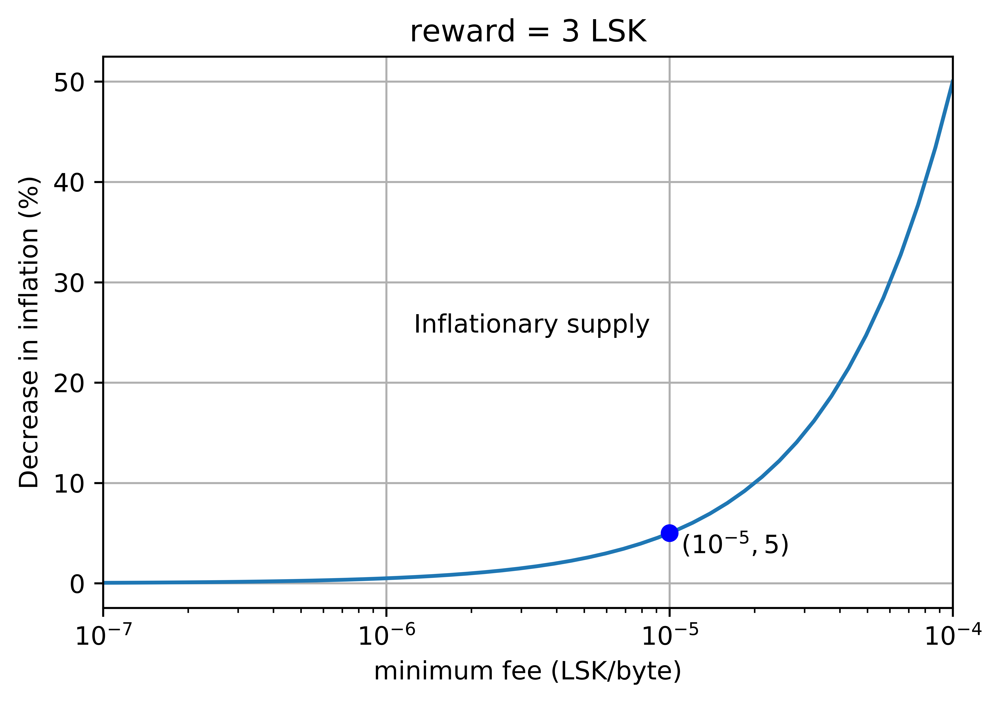

```
LIP: <LIP number>
Title: Replace static fee system by dynamic fee system
Author: Iker Alustiza, iker@lightcurve.io
Discussions-To: https://research.lisk.io/t/replace-static-fee-system-by-dynamic-fee-system/
Status: Draft
Type: Standards Track
Created: -
Updated: -
Requires: 0009
```

## Abstract

This LIP proposes a dynamic fee system as a _free fee market_ where the fixed fee for all transaction types will be removed and a minimum fee will be defined for every transaction. Any transactions received with a fee below that minimum fee will be rejected. For each transaction, it will be up to the issuer to choose an appropriate transaction fee depending on the network load, which has to be at least the minimum transaction fee.

## Copyright

This LIP is licensed under the [Creative Commons Zero 1.0 Universal](https://creativecommons.org/publicdomain/zero/1.0/).

## Motivation

Currently, the fee system in the Lisk protocol consists of a fixed fee for each transaction type:

```js
fees: {
  send: 10000000,
  vote: 100000000,
  secondsignature: 500000000,
  delegate: 2500000000,
  multisignature: 500000000,
  dapp: 2500000000
}
```

With the huge increase in price of the Lisk token (LSK) in 2017, these fixed fees have become too expensive to allow a healthy usage of the network (as of August 2018, a vote transaction has been averaging at around 8$, 2nd passphrase transactions around 40$ each and registering an account as a delegate at around 200$).

With this in mind, one of the main priorities of the Lisk community has been to make fees cheaper. Indeed, we believe that in order to have a scalable and usable network, this issue needs to be addressed and a fee system has to be implemented able to adapt to the market and network circumstances.  

This new fee system must stimulate the Lisk network usage (voting, balance transfers, new delegates registrations, etc...) with reasonable prices per transaction, encouraging people to participate in the network, without putting at stake the security and performance of it (spam attacks).

## Rationale

With the objective of solving the issue of an expensive to use and stagnant network, we propose a dynamic fee system as a _free fee market_. The protocol will define a minimum fee for every transaction. It will be up to each user to set the fee for each transaction, but any transaction received with a fee below that minimum fee will be considered invalid by the protocol.

### Details of current proposal

Each time a transaction is broadcast into the network and eventually included into a block, resources are consumed. In the case of the Lisk network, there are two types of resources being used depending on the type of transaction:

1. Bandwidth in the network, dynamic memory and disk storage in the nodes : **all transaction types**.

2. Namespace: **delegate registration and dapp registration transactions**.

The new fee system takes into account the usage of these resources to give a minimum required fee for a certain transaction to be valid. We define this minimum fee per transaction as:

`trs.minFee = trs.nameFee + minFeePerByte * sizeof(trs)`

`trs.minFee` is given in LSK, `minFeePerByte` stands for the minimum fee per byte, given in LSK/byte, `sizeof(trs)` is the size of the transaction object in bytes and `trs.nameFee` is a parameter, given in LSK, that takes different values depending on the transaction type:

1. For transaction types 0, 1, 3 and 4 (balance transfer, second passphrase registration, voting and multisignature registration transactions), `trs.nameFee` = 0.

2. For transaction types 2 and 5 (delegate registration and dapp registration transactions), `trs.nameFee` > 0.

#### Minimum fee per byte: `minFeePerByte`

The right choice of the minimum fee per byte, `minFeePerByte`, will have a great impact in the network. If the minimum required fee were too high, users would be discouraged from using the network. If the value were too low, attackers would be able to broadcast many valid transactions at a very low cost and congest the network. Regarding the last issue, in this proposal, it is assumed that adequate measures are in place to prevent this from occurring. These measures are mostly implemented in the peer-to-peer (P2P) layer and in the transaction pool. Later in this section, the impact on these modules will be commented more in detail.  

With the assumption of having these “anti-spam” measures in the previously mentioned modules, it would be interesting to consider how these resources mentioned above are used by all the transaction types and the cost implied. Unfortunately, the calculation of the exact cost of these resources is very complex and depends on several unrelated points as, hardware specifications, connection bandwidth, software platform, cost of electricity, Lisk token volatility, etc. An accurate research about this would be extremely complex and it is out of the scope of this proposal. However, it is still important to study the price of the different transactions and the price of broadcasting several of them depending on the value of `minFeePerByte`:  

- [Appendix A](#a-minimum-fee-implications) has an overview of minimum transaction fees depending on different values of `minFeePerByte` and the estimated direct implications for the network.

- [This spreadsheet](lip-replace_static_fee_system_by_dynamic_fee_system/Spam-Attack-Cost-Sheet.pdf) studies the cost of broadcasting a number of balance transactions depending on `minFeePerByte` and the price of LSK in USD.

In view of the computations referenced before, and with the mentioned considerations, a minimum fee in the range of 5 * 10<sup>-6</sup> to 5 * 10<sup>-5</sup> LSK/byte is reasonable. Therefore, we propose to set **`minFeePerByte` = 1*10<sup>-5</sup> LSK/byte**. With this minimum fee per byte, keeping the nodes busy for a brief period of time and having full blocks for 2 minutes (around 1500 basic balance transactions with 15 KB blocks every 10 seconds) will cost at least 1.8 LSK.

#### Namespace fee: `trs.nameFee`

Regarding the namespace fee, `trs.nameFee`, for transaction types 2 and 5, there are different issues to consider: If the minimum fee for these transaction types were not sufficiently high, theoretically, someone could perform a _namespace_ attack and try to exhaust the namespace by registering huge number of names. Also, these transaction types give special attributes to the issuing account.  Thus, the value of the `trs.nameFee` has to be chosen with these criteria in mind. In [Appendix B](#b-namespace-fee-implications),  one can find an overview of the minimum transaction fee for different values of this constant.

In this regard, it is worth noting the important differences between transaction types 2 and 5 for the choice of the `trs.nameFee` value. First, type 2 and type 5 transactions have different namespace constraints (the longest possible name for a delegate is 20 characters while the longest name for a dapp is 32 characters), being both of them large enough to make the mentioned exhausting attack infeasible. Therefore, we consider other factors to play a more important role in the decision: For type 2 transactions, registering a delegate implies a commit to become an active delegate and to secure the network. Also, there are only 101 possible active delegates, which makes name squatting attacks (registering a significant amount of popular names) not attractive for amounts much greater than 101. For type 5 transactions, users can register as many dapps as they wish from their accounts. In this case, every dapp registered in the Lisk platform implies a potential development and release of a future sidechain with the consequent consumption of resources. In other words, a type 5 transaction has a potential future impact in the Lisk blockchain that should be reflected in the price of the registration transaction. Thus, it is reasonable to have different constants for the two considered transaction types:  `trs.nameFee = delegateFee` for transaction type 2, and  `trs.nameFee = dappFee` for transaction type 5. In particular, and considering the aforementioned differences, we propose:

- `delegateFee` = 10 LSK
- `dappFee`= 25 LSK

### Other considered but discarded possibilities

1. **Remove name uniqueness**: If the _name uniqueness_ for delegate and dapp registrations is removed, then the `trs.nameFee` constant can be removed. Users will be able to register exactly the same string as delegates or for their dapp from different Lisk addresses.
- Advantage: Code simplicity and easier parametrization.
- Drawback:  Delegates and dapps get dispersed and difficult to tell apart in a sea of spamming copies. Name registrations become a simple flag to signify a property of the account.

2. **Fixed fee for delegate/dapp transaction**: Delegate and dapp registration transactions will have a unique fixed fee in the same way they have it now (adjusted to the cheaper fees situation).
- Advantage: Simplicity in the parametrization. This will follow a rationale of setting a fixed fee for transactions which can only be issued once per account.
- Drawback: This breaks the main point of a dynamic fee system based on a free market. Fixed fees can become inadequate in certain market/network situations.

3. **Unique global minimum fee** (`trs.nameFee` = 0): Even though this will equate all transactions regardless the resources they use, it can be suitable for certain `minFeePerByte` values. For example, if the chosen `minFeePerByte` is already _high_ (e.g. imposed by network limitations), we may not need an extra parameter `trs.nameFee` to account for the _namespace_ usage.
- Advantage: Code simplicity and easier parametrization.
- Drawback: This depends on specific values of `minFeePerByte`. It will not follow the rule of _minimum fee depending on the resources_.

4. **No minimum fee** given by the protocol: The protocol will not set any rules for a minimum fee for transactions. In principle, a transaction can be included in the blockchain with `trs.fee` = 0 as long as there is space in the next block.
- Advantage: Code simplicity and easier parametrization.  Attractive feature from the user point of view.
- Drawback: This allows the _pollution_ of the blockchain with meaningless transactions. There would not be any cost in filling blocks continuously resulting in a bigger blockchain with transactions that provide little utility.

### Broader impact of the fee system

In order to implement a useful and _fair_ fee system based on free market of fees, the main protocol changes should be accompanied with other important changes and improvements:

#### Transaction pool

The **transaction pool** logic needs to be adapted to the new fee system: It needs to take into account the different fees of the incoming transactions. First, transactions with a fee lower than the minimum fee have to be automatically rejected as soon as they reach the pool. Secondly, a sorting algorithm is beneficial to prioritize transactions depending on the fees. Thirdly, a set of constraints regarding received transactions should be implemented in order to prevent (or mitigate) spam attacks in the network. In the next section, there is a general specification of the proposed changes  in the transaction pool. However, it is worth noting that the transaction pool is not a part of the Lisk protocol and node maintainers  are free to implement it as they prefer.

#### P2P layer

The **P2P layer** plays a critical role in the security and stability of the Lisk network, as in any decentralized network. With the new fee system, sending valid transactions will be, on average, much cheaper than now. Hence, a malicious user may have an incentive of creating and broadcasting thousands of low fee but valid transactions to the network for a long period of time, such that it would be overloaded and other users would experience artificially inflated fees and/or unwanted delays. In this proposal, we assume that the P2P layer enforces a limit on the number of transactions that a node accepts and broadcasts in a given time window. Nodes not following these limits are banned and therefore other nodes cannot be overloaded with too many transactions. However, covering the details of this mechanism is out of the scope of this proposal.

#### Assignment of transaction fees

In the current protocol, the fees collected from all transactions confirmed in a round are added up together and then splitted equally among all the forging delegates (delegates that forged at least one block in the considered round) at the end of this round. We propose to change this mechanism as per the following rationales:

1. Assign transaction fees to block forger:

The mentioned mechanism of **sharing fees** among all forging delegates after every round needs to be changed to avoid the incentive of side channel (or off-chain) payments to delegates. The authors of [1] prove for the auction model defined in the paper that the first-price auction is the unique mechanism which is _incentive-compatible_ for the auctioneer to follow the rules. In a free fee market, one can make the assumption for Lisk that the fees _collected_ in a block are given by the transactions chosen by the auctioneer (the delegates) following a certain auction scheme. In order to have a behaviour close to the first-price auction scheme as defined in the reference, these _collected_ fees will be assigned to the delegate who forged that block, in the same way block rewards are assigned currently. Otherwise, the most profitable strategy for delegates will not be to include transactions with the highest fees per byte, which is against the foundations of a dynamic fee system as a free fee market.

2. Burn the minimum fee per transaction:

With the change in the fees sharing mechanism commented above comes an issue which is not to be ignored: If delegates get the fees of the corresponding blocks they generate, they can include their transactions for free. This is not a new problem, since it is present in other networks with free fee markets as Bitcoin or Ethereum (refer to [Other considerations](#Other-considerations:-Artificial-inflation-of-the-fees) subsection below). In fact, sometimes in Bitcoin, it is used as a feature for a service [2]. However, this issue is exacerbated for the Lisk protocol due to specific transaction types like dapp registration transaction. In Lisk, an active delegate could **register as many dapps as they wanted for free** by including the corresponding transactions in their forged block. This would not only go against the minimum fee rationale exposed before but would incentive behaviours as buying voting power in exchange of discounted dapp registrations.  

To solve this situation, we propose to burn the minimum fee of each transaction, `trs.minFee`, included in the blockchain. This implies that these _collected_ fees per block mentioned above will not be the sum of all the fees of the transactions included. It will actually be the difference between this sum and the sum of the minimum fees of all the transactions included. Hence, the incentives for delegates to include transactions with higher fees per byte and for users to spend a higher fee for priority are maintained. Moreover, every transaction included in the blockchain will reduce the total supply of the token. This implies that a higher network usage will benefit every stakeholder including the delegates.  [Appendix C](#c-impact-of-burning-the-minimum-fee-in-the-supply) presents a brief study about the impact, in terms of inflation decrease, in the token supply of burning the minimum fee.

#### Transaction invalidation mechanism

With the implementation of the free fee market, users may experience the undesired situation of having **stuck transactions** waiting in the transaction pool to be included in the blockchain: For example, if a transaction is sent with a fee too low to get into a block when the network is busy (full blocks), it will be stuck in the transaction pool until this situation changes. This would be especially problematic if the transaction had high priority for the sender. With this in mind, it is reasonable to have a method to invalidate or replace pending transactions. There are several ways to approach this issue. Examples of this are the use of an ordered nonce for the transaction (used in Ethereum and Stellar), a non-ordered nonce for the transaction or a time-out parameter in the transaction (used in NXT and NEM). In this proposal, we are not going to cover the specification of such a feature and it will be assumed that a proper _transaction invalidating_ feature is available in the protocol.

#### Fee estimation algorithm

The user needs to be aware of the current suitable fee for transactions, which is related to the immediate past situation of the network. Hence, it is reasonable to develop a **fee estimation algorithm** to recommend the fee that the users should include in their transaction for it to be included in a block after a certain period of time.

#### Wallets

Wallets, including **Lisk Hub** and **Lisk Mobile**, need to include the functionality for the user to choose the transaction fee. The wallet should not allow a fee below the minimum fee when creating a transaction, and it should suggest the different estimations for the fee depending on the priority of the transaction to the user (using the output of the mentioned fee estimation algorithm). It has to be clear to the users that the estimated fee is just a suggestion or a guidance and they can spend any fee they want (as long as it is equal or above the minimum fee).

Moreover, in order to avoid costly mistakes for the user when setting the fee, the wallets should return a warning if the fee chosen for a certain transaction is extremely high. For example, a balance transaction spending a fee over 4 LSK is most likely a mistake by the issuer.

### Other considerations: Artificial inflation of the fees

One of the most discussed issues for blockchains with a free fee market, as Bitcoin or Ethereum, is the ability of block generators to inflate the price of transaction fees artificially for their own benefit. The issue consists of generating low fee transactions to fill blocks such that other users are forced to spend a higher fee to get their transactions accepted. Since the block generators usually get the fees of their generated blocks, theoretically, they can perform this "attack" for free.  Although one can argue that this issue occurred several times in the past in the mentioned blockchains, it seems that it had the origin in third parties with other interests and not in block generators themselves [3, 4]. For Lisk and the proposed fee system, we argue that there are mainly two reasons which make this behaviour not practical:

1. Lisk uses a Delegated Proof of Stake (DPoS) consensus algorithm. This means that being a block generator does not depend on the investment in the mining hardware or the investment in the token stake (only). In DPoS, being a block generator (delegate) depends on the amount of available stake supporting this account (i.e. amount of vote power for the delegate). Therefore, if a group of delegates attempts to inflate fees, they risk to be detected and consequently down-voted out of the 101 active delegates.
2. The proposed mechanism of burning the minimum fee of each transaction will impose a mandatory cost for delegates to inflate the fees, discouraging this kind of behaviour. As it is discussed in [5], this mechanism keeps the desired incentives for block generators without introducing the negative incentives of  a _traditional_ fee model (where the whole transaction fee is assigned to the block generator) exposed before. Refer to [5] for a more detailed study of this issue and the broader topic of transaction fees.

## Specification

Regarding the protocol, the changes involved for the dynamic fee system are the following:

- **Three constants** will define the minimum required fee as explained in the previous section<sup>[1]</sup>:

   ```js
   fees: {
        minFeePerByte: 1000,
        delegateFee: 1000000000,
        dappFee: 2500000000,
       },
       ```

- **Transactions verification**: The fixed fee logic has to be replaced in the transaction verification process to accept a dynamic fee structure:

  - A transaction, `trs`, is valid if it spends a fee equal or higher than `trs.minFee`. Depending on the transaction type, `trs.minFee` is calculated as:

    1. For transaction types 0, 1, 3 and 4:
    ```
    trs.minFee = fees.minFeePerByte * sizeof(trs)
    ```
    2. For transaction type 2:
    ```
    trs.minFee = fees.delegateFee + fees.minFeePerByte * sizeof(trs)
    ```
    3. For transaction type 5:
    ```
    trs.minFee = fees.dappFee + fees.minFeePerByte * sizeof(trs)
    ```

  - The previous point implies to have a method to calculate the size of the specific transaction in bytes: `sizeof()`. In this proposal, we define the size of a transaction, `trs`, as the size in bytes of the byte array used to generate the transaction ID (as for example it is done [here](https://github.com/LiskHQ/lisk/blob/0c633a2f0d74bcb104ae4dafc20b55ca162a0f3e/logic/block.js#L112) in the current implementation).

-  **Include fee property in transaction JSON object**: With the implementation of [LIP-0012](https://github.com/LiskHQ/lips/blob/master/proposals/lip-0012.md), the `trs.fee` property can be removed from the transaction JSON object since it is not needed for the current static fee system. However, this `trs.fee` has to be included in the transaction object, otherwise the nodes would not be able to get and verify the transaction fee. It must be a string matching the [`amount`](https://github.com/LiskHQ/lisk-sdk/blob/c74fb5a96b04e3be83f9e308e47106604c21dbc0/framework/src/controller/helpers/validator/formats.js#L297) format.

- **Include fee property in transaction signature and transaction ID**: To prevent transaction fee forging and manipulation by malicious nodes/delegates, the transaction fee has to be part of the byte array used as input for the transaction signature generation and transaction ID generation (e.g. implemented by [`getBytes`](https://github.com/LiskHQ/lisk/blob/5d5af525eec7f2ee687ca921a6a2d1457c471da9/logic/transaction.js#L154) in Lisk core). The `trs.fee` property, with a size of 8 bytes and encoded in big-endian, has to follow the `trs.senderPublicKey` property during serialisation. Additionally, the [`getTransactionBytes`](https://github.com/LiskHQ/lisk-elements/blob/d5ab830ad65965764d364eb344ce4e3a13bf14c9/packages/lisk-transactions/src/utils/get_transaction_bytes.js#L147) function must be implemented in the same way in Lisk Elements.<sup>[2]</sup>

- **Assignment of transaction fees**: Every transaction included in a block `B` spends a fee equal to `trs.fee` which is subtracted from the sender account balance. From `trs.fee`, `trs.minFee` is _burnt_ whereas `trs.fee - trs.minFee` is assigned to the delegate forging `B`. In terms of `B`, the sum of the minimum fees of all the transactions included in it, i.e., `B.burntFee`, is added to the balance of an account with the address “_BurntFees_”, defined as the auxiliary account containing all the burnt fees in the blockchain. The remaining fees, i.e., `B.totalFee - B.burntFee`, are added to the account balance of the delegate forging `B`.        

<sup>[1]</sup>It is important to point out that the values given in this document for the three constants `fees.minFeePerByte`, `fees.delegateFee` and `fees.dappFee` may vary in the future. It is possible that the rationale given in this proposal is not accurate at some point (e.g. due to a change of the block size) and a new LIP will propose to adjust these constants consequently.

<sup>[2]</sup>Note that, this proposal assumes that [LIP-0009](https://github.com/LiskHQ/lips/blob/master/proposals/lip-0009.md) is already implemented to avoid any kind of transaction replay attack from a previous protocol version.

### Wallets

A function needs to be implemented to calculate the minimum fee required for a given transaction. The output of this function can be used by user interfaces and wallets as a default value and as guidance for the user so they do not issue invalid transactions with a fee below the minimum fee.

### Transaction pool specification

The transaction pool is not per se part of the Lisk protocol, however, it is essential for the correct functioning of the dynamic fee system as explained in the previous section. That is why we include here a general implementation proposal covering the most important changes and rules to be added:

- An initial check for the minimum fee of the transactions arriving at the node should be implemented, i.e.:

  ```
  IF trs.fee < trs.minFee
    discard trs
  ```

- The transactions in the transaction pool should be **sorted from highest to lowest fee in terms of LSK per byte** considering the non-burnt part of the fee, `trs.fee - trs.minFee`. These transactions must go through several format checks and validations before they are ready to be included in the next block. For this task, the transaction pool implements successive queues with different checks and purposes. It is not the object of this proposal to explain this process and it should be noted that the transactions received at the pool can be sorted or prioritized using any adequate selection or sorting algorithm. However, considering this process in the transaction pool, we propose to implement a **priority queue** where each arriving transaction is assigned a _priority_ depending on its non-burnt fee per byte. This transaction priority is maintained along the successive validations (successive queues) until the transaction is ready to be included in the blockchain:

  ```
  feePriority = (trs.fee - trs.minFee) / sizeof(trs)
  ```

- Once the transactions are ready to be included in the next block (i.e., transactions in `ready` queue as per the current implementation), those with higher priority (i.e. with the highest  `feePriority`) are included until the block's available space is not enough for another transaction. To do this, we propose a greedy strategy: The transactions are fetched together to be added to the block starting with the transactions offering the highest fee per byte. Any transaction that does not fit into the current block due to its size is skipped. We continue considering transactions with smaller fees, as these may have smaller size and still fit into the block. More specifically, this can be described as follows:  

  ```
  FOR each trs in queue:
    IF (maxBlockByteSize - newBlock.payloadLength >= sizeof(trs))
         add trs to newBlock.payload
    IF (newBlock.payloadLength + sizeofType0 >= maxBlockByteSize)
         BREAK
  ```

  Where `newBlock.payloadLength` is the size of the unconfirmed (not yet part of the blockchain) payload of the new block and `sizeofType0` is a constant representing the size of a basic type 0 transaction, both in bytes. Then, `maxBlockByteSize` is the maximum allowed size of the block in bytes (a constant given by the protocol) and `nextTrs` is the top transaction in the priority queue to be included in the block. Once the next block has been either created or received at the node, the included transactions are removed from the transaction pool.

- For the sake of simplicity, in this proposal, we assume that the previous process is performed only by the next forging delegate and considering enough transactions in the `ready` queue (when available) to efficiently fill the next block.   

- If the pool has reached its maximum size, a transaction arriving at the node will be compared against the lowest `feePriority`. It will be discarded if it has a fee below that lowest value. It will be applied to the queue otherwise, and hence, the transaction with the lowest priority in the queue will be discarded.

- The maximum size of the transaction pool must be large enough to avoid discarding incoming transactions as much as possible (see previous point). Each node operator should choose this parameter (for example, in a JSON config file) depending on their memory limitations and network situation. By default, we propose to set the maximum number of entries in the transaction pool to 4000 transactions. This will imply an approximate average size of 900 KB when the pool is full (assuming 95% of simple balance transactions) and a maximum size of 9.2 MB (assuming only full vote transactions).  Note that this default value is a recommendation and it should be adapted during implementation.

- We propose to implement a fee threshold, in terms of `feePriority`, for incoming transactions. Transactions with a `feePriority` lower than this threshold are immediately removed from the pool and only new transactions with a `feePriority` high enough are accepted. The value of this threshold will be a parameter to set by the node operator in a JSON config file. By default, this fee threshold is set to 0. This way delegates and node operators can set their required transaction fee if preferred and alleviate the workload in their transaction pool.

- Transactions from multisignature accounts: The size considered for the LSK/byte calculation needs to consider the final multisignature transaction object with all the included signatures (i.e. once the transaction is ready to be included in the blockchain). Hence, the issuer of the transaction should take this into account in order to choose the appropriate fee.

### Fee estimation algorithm

Given the mathematical complexity and nature of this topic, the specification of the fee estimation algorithm proposal is included in another LIP directly dependent on this one.

## Backwards Compatibility

This change will cause a hard fork:
- All transactions with the new fee system would be invalid in the current protocol:
- The transaction signature will differ with respect to the previous version since the field for the fee is included now.
- The fee of each transaction is not a constant parameter given by transaction type anymore, but a parameter chosen by the user. Therefore, all the transaction verification logic in this regard is different.
- Fees are not shared equally among delegates every round anymore. The minimum fee for each transaction will be assigned to an auxiliary account, whereas the remaining fee will be assigned the delegate that forged the block.

## Reference Implementation

TBD

## References

- [1] M. Akbarpour and S. Li, "[Credible Mechanisms](http://web.stanford.edu/~mohamwad/CredibleMechanisms.pdf)", SSRN Electronic Journal: Economics Elsevier (SSRN), 2018.
- [2] [Bitcoin transaction accelerator](https://pool.viabtc.com/tools/txaccelerator/)
- [3] J. Young,  "[Suspicious Bitcoin Mempool Activity, Transaction Fees Spike to $16](https://cointelegraph.com/news/analyst-suspicious-bitcoin-mempool-activity-transaction-fees-spike-to-16)", Cointelegraph, 2017.
- [4] T. Prentiss, "[Ethereum Network Congested, Spam Attack Suspected](https://www.ethnews.com/ethereum-network-congested-spam-attack-suspected)", EthNews, 2018.
- [5] V. Buterin, "[On Inflation, Transaction Fees and Cryptocurrency Monetary Policy](https://blog.ethereum.org/2016/07/27/inflation-transaction-fees-cryptocurrency-monetary-policy/)", Ethereum blog, 2016.
- [6] [Johoe's Bitcoin Mempool Statistics](https://jochen-hoenicke.de/queue/#1,1y)

## Appendix

### A: Minimum fee implications

Different values for the minimum fee per byte, `minFeePerByte`, and the direct implications for the current protocol reference implementation:

1.  **Minimum possible fee per byte** (given by the protocol specification): **1 Beddow per byte (10<sup>-8</sup> LSK/byte)**:
  - Balance transaction: 125 bytes* 10<sup>-8</sup> LSK/byte = 1.25 *10<sup>-6</sup> LSK (1.82 *10<sup>-6</sup> LSK with 2nd passphrase)
  -  Voting transaction (with 2nd passphrase): 2334 bytes* 10<sup>-8</sup> LSK/byte = 2.33 *10<sup>-5</sup> LSK
  - Minimum fee of a full block<sup>[1]</sup>: 15 KB* 10<sup>-8</sup> LSK/byte = 1.5 * 10<sup>-4</sup> LSK     

  With this minimum fee, and with a quiet network, a malicious user can issue **1 million transactions** spending just a bit more than 1 LSK. These transactions will cause around of **150 MB of spam** in the network. Assuming 1 LSK < 40$, the minimum fee for a full vote transaction will be below 0.001$ cost, encouraging this way a dynamic and vivid voting system.

2.  **One order of magnitude greater (10<sup>-7</sup> LSK/byte)**:
  - Balance transaction: 125 bytes* 10<sup>-7</sup> LSK/byte = 1.25 *10<sup>-5</sup> LSK (1.82 *10<sup>-5</sup> LSK with 2nd passphrase)
  - Voting transaction (with 2nd passphrase): 2334 bytes* 10<sup>-7</sup> LSK/byte = 0.0002334 LSK
  - Minimum fee of a full block<sup>[1]</sup>: 15 KB* 10<sup>-7</sup> LSK/byte = 0.0015 LSK

  With this minimum fee, and with a quiet network, a malicious user can issue **100000 transactions** spending just a bit more than 1 LSK. These transactions will cause around of **15 MB of spam** in the network. Assuming 1 LSK < 40$, the minimum fee for a full vote transaction will be below 0.01$ cost, which is cheap enough to encourage a dynamic and vivid voting system.

3.  **Two orders of magnitude greater (10<sup>-6</sup> LSK/byte)**:
  - Balance transaction: 125 bytes* 10<sup>-6</sup> LSK/byte = 1.25 *10<sup>-4</sup> LSK (1.82 * 10<sup>-4</sup> LSK with 2nd passphrase)
  - Voting transaction (with 2nd passphrase): 2334 bytes* 10<sup>-6</sup> LSK/byte = 0.002334 LSK
  - Minimum fee of a full block<sup>[1]</sup>: 15 KB* 10<sup>-6</sup> LSK/byte = 0.015 LSK

  With this minimum fee, and with a quiet network, a malicious user can issue **10000 transactions** spending just a bit more than 1 LSK. These transactions will cause around of **1.5 MB of spam** in the network. Assuming 1 LSK < 40$, the minimum fee for a full vote transaction will be below 0.1$ cost, which is cheap enough to encourage a dynamic and vivid voting system.

4.  **Three Orders of magnitude greater (10<sup>-5</sup> LSK/byte)**:
  - Balance transaction: 125 bytes* 10<sup>-5</sup> LSK/byte = 0.00125 LSK (0.00182 LSK with 2nd passphrase)
  - Voting transaction (with 2nd passphrase): 2334 bytes* 10<sup>-5</sup> LSK/byte = 0.02334 LSK
  - Minimum fee of a full block<sup>[1]</sup>: 15 KB* 10<sup>-5</sup> LSK/byte= 0.15 LSK

  With this minimum fee, and with a quiet network, a malicious user can issue **1000 transactions** spending just a bit more than 1 LSK. These transactions will cause around of **150 KB of spam** in the network.  Assuming 1 LSK < 40$, the minimum fee for a full vote transaction will be below 1$, which will encourage a dynamic voting situation in most of the cases.

<sup>[1]</sup>We are assuming that a full block has a size of 15 KB (15000 bytes).  Also, we are assuming that they do not include any transaction of types 2 or 5. In those cases, the fee per block will be higher due to the `trs.nameFee` constant included in the fee of these transactions.

### B: Namespace fee implications

Minimum fee, `trs.minFee`, for transaction types 2 and 5 for different values of `trs.nameFee` for the current protocol reference implementation:

1. **`trs.nameFee` = 0:**

**Tx type/ Min fee** | **1*10<sup>-7</sup> LSK/byte** | **5*10<sup>-7</sup> LSK/byte** | **1*10<sup>-6</sup> LSK/byte** | **5*10<sup>-6</sup> LSK/byte** | **1*10<sup>-5</sup> LSK/byte**
--- | --- | --- | --- | --- | ---
**Delegate reg (145 bytes)** | 1.45*10<sup>-5</sup> LSK | 7.25*10<sup>-5</sup> LSK | 1.45*10<sup>-4</sup> LSK | 7.25*10<sup>-4</sup> LSK | 0.0015 LSK
**Dapp reg avg size (200 bytes)** | 2*10<sup>-5</sup> LSK | 1*10<sup>-4</sup> LSK| 2*10<sup>-4</sup> LSK | 0.001 LSK | 0.002 LSK
**Dapp reg max size (4.3 KB)** | 4.3*10<sup>-4</sup> LSK | 0.0022 LSK | 0.0043 LSK| 0.0215 LSK | 0.043 LSK

2. **`trs.nameFee` = 0.5:**

**Tx type/ Min fee** | **1*10<sup>-7</sup> LSK/byte** | **5*10<sup>-7</sup> LSK/byte** | **1*10<sup>-6</sup> LSK/byte** | **5*10<sup>-6</sup> LSK/byte** | **1*10<sup>-5</sup> LSK/byte**
--- | --- | --- | --- | --- | ---
**Delegate reg (145 bytes)** | 0.5 LSK | 0.5 LSK  | 0.5001 LSK | 0.5007 LSK | 0.5015 LSK
**Dapp reg avg size (200 bytes)** | 0.5 LSK | 0.5001 LSK | 0.5002 LSK | 0.501 LSK | 0.502 LSK
**Dapp reg max size (4.3 KB)** | 0.5004 LSK | 0.5022 LSK | 0.5043 LSK | 0.5215 LSK | 0.543 LSK

3. **`trs.nameFee` = 1:**

**Tx type/ Min fee** | **1*10<sup>-7</sup> LSK/byte** | **5*10<sup>-7</sup> LSK/byte** | **1*10<sup>-6</sup> LSK/byte** | **5*10<sup>-6</sup> LSK/byte** | **1*10<sup>-5</sup> LSK/byte**
--- | --- | --- | --- | --- | ---
**Delegate reg (145 bytes)** | 1 LSK | 1 LSK  | 1.0001 LSK | 1.0007 LSK | 1.0015 LSK
**Dapp reg avg size (200 bytes)** | 1 LSK | 1.0001 LSK | 1.0002 LSK | 1.001 LSK | 1.002 LSK
**Dapp reg max size (4.3 KB)** | 1.0004 LSK | 1.0022 LSK | 1.0043 LSK | 1.0215 LSK | 1.043 LSK

4. **`trs.nameFee` = 5:**

**Tx type/ Min fee** | **1*10<sup>-7</sup> LSK/byte** | **5*10<sup>-7</sup> LSK/byte** | **1*10<sup>-6</sup> LSK/byte** | **5*10<sup>-6</sup> LSK/byte** | **1*10<sup>-5</sup> LSK/byte**
--- | --- | --- | --- | --- | ---
**Delegate reg (145 bytes)** | 5 LSK | 5 LSK  | 5.0001 LSK | 5.0007 LSK | 5.0015 LSK
**Dapp reg avg size (200 bytes)** | 5 LSK | 5.0001 LSK | 5.0002 LSK | 5.001 LSK | 5.002 LSK
**Dapp reg max size (4.3 KB)** | 5.0004 LSK | 5.0022 LSK | 5.0043 LSK | 5.0215 LSK | 5.043 LSK

5. **`trs.nameFee` = 10:**

**Tx type/ Min fee** | **1*10<sup>-7</sup> LSK/byte** | **5*10<sup>-7</sup> LSK/byte** | **1*10<sup>-6</sup> LSK/byte** | **5*10<sup>-6</sup> LSK/byte** | **1*10<sup>-5</sup> LSK/byte**
--- | --- | --- | --- | --- | ---
**Delegate reg (145 bytes)** | 10 LSK | 10 LSK  | 10.0001 LSK | 10.0007 LSK | 10.0015 LSK
**Dapp reg avg size (200 bytes)** | 10 LSK | 10.0001 LSK | 10.0002 LSK | 10.001 LSK | 10.002 LSK
**Dapp reg max size (4.3 KB)** | 10.0004 LSK | 10.0022 LSK | 10.0043 LSK | 10.0215 LSK | 10.043 LSK

6. **`trs.nameFee` = 20:**

**Tx type/ Min fee** | **1*10<sup>-7</sup> LSK/byte** | **5*10<sup>-7</sup> LSK/byte** | **1*10<sup>-6</sup> LSK/byte** | **5*10<sup>-6</sup> LSK/byte** | **1*10<sup>-5</sup> LSK/byte**
--- | --- | --- | --- | --- | ---
**Delegate reg (145 bytes)** | 20 LSK | 20 LSK  | 20.0001 LSK | 20.0007 LSK | 20.0015 LSK
**Dapp reg avg size (200 bytes)** | 20 LSK | 20.0001 LSK | 20.0002 LSK | 20.001 LSK | 20.002 LSK
**Dapp reg max size (4.3 KB)** | 20.0004 LSK | 20.0022 LSK | 20.0043 LSK | 20.0215 LSK | 20.043 LSK

7. **`trs.nameFee` = 25:**

**Tx type/ Min fee** | **1*10<sup>-7</sup> LSK/byte** | **5*10<sup>-7</sup> LSK/byte** | **1*10<sup>-6</sup> LSK/byte** | **5*10<sup>-6</sup> LSK/byte** | **1*10<sup>-5</sup> LSK/byte**
--- | --- | --- | --- | --- | ---
**Delegate reg (145 bytes)** | 25 LSK | 25 LSK  | 25.0001 LSK | 25.0007 LSK | 25.0015 LSK
**Dapp reg avg size (200 bytes)** | 25 LSK | 25.0001 LSK | 25.0002 LSK | 25.001 LSK | 20.002 LSK
**Dapp reg max size (4.3 KB)** | 25.0004 LSK | 25.0022 LSK | 25.0043 LSK | 25.0215 LSK | 25.043 LSK

### C: Impact of burning the minimum fee in the supply

This appendix covers the impact of burning the minimum fee on the token supply depending on the `minFeePerByte` value. The study assumes the extreme case of having full blocks for a whole reward milestone (approx one year), so that the impact is maximized. It is assumed that only type 0 and type 3 transactions are getting included, since they make the overwhelming majority of the transaction activity, and that the maximum block size is 15 KB. The results are displayed for the current reward (3 LSK) and future rewards (2 LSK and 1 LSK). Note that, for the final reward milestone of 1 LSK, there is a _reasonable_ value for `minFeePerByte` for which the token supply could decrease and be **deflationary** if the network activity is high enough (`minFeePerByte` = 6.66*10<sup>-5</sup> LSK/byte). For the other two reward milestones, a value for `minFeeBerByte` such that the supply is deflationary would need to be higher than any value for `minFeeBerByte` considered in this proposal.




