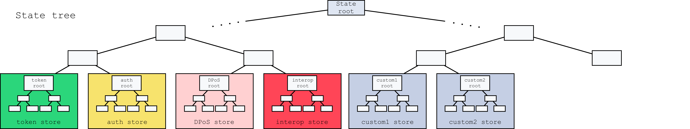

```
LIP: <LIP number>
Title: State model and state root
Author: Alessandro Ricottone <alessandro.ricottone@lightcurve.io>
Type: Informational
Created: <YYYY-MM-DD>
Updated: <YYYY-MM-DD>
Required: 0039
```


## Abstract

The state of an interoperable chain in the Lisk ecosystem is organized as a sparse Merkle tree, the state tree, built on top of a generic key-value map for each module of the chain.
This allows to authenticate the whole state with the tree Merkle root, the state root.
In this LIP, we define the state model of a Lisk blockchain and the construction of the state tree from which the state root is calculated.


## Copyright

This LIP is licensed under the [Creative Commons Zero 1.0 Universal](https://creativecommons.org/publicdomain/zero/1.0/).


## Motivation

A blockchain created with the Lisk SDK is organized in a modular way: each module registered in the chain defines its own state and the possible state transitions, i.e., the transactions defined within the module or the reducers that can be called by other modules.
This is reflected by the state tree: each module maintains its own key-value map and sparse Merkle tree, which are finally merged together to form the complete state tree.
This LIP specifies the general format for the key-value maps and the way in which they are combined together in the state tree. 

Organizing the state of a blockchain as a Merkle tree allows to cryptographically authenticate the whole state with a single hash, the state root.
The state root property is calculated at the end of the block processing and included in the block header. 
Information from the block header is then used to create a certificate and signed by the chain validators.
When a certificate is posted to a chain, the state root is used to authenticate the information contained in it.
For example, a node can verify that the cross-chain messages in the certificate payload have been included in the outbox of the sending chain by recomputing the state root signed in the certificate from the outbox root.
This is done using a "witness", i.e. an array of hashes used to recompute the root starting from the known elements of the tree. 

In the future, the state root could further facilitate the introduction of light clients.
Light clients would only check the validity of block headers, without fully verifying every transaction in a block.
The state root can then be used to verify the correctness of a portion of the state, such as a user balance, requested by the light client to a full node. 

Furthermore, the state root could be used for faster synchronization: a node could download a snapshot of the blockchain at a block close to the tip, therefore synchronizing quickly to the last state, while in the background it downloads and verifies blocks in the past. 
In this case, the state root would be used to verify the validity of the snapshot.

Finally, the state root can be employed to improve the [regenesis protocol](https://github.com/LiskHQ/lips/blob/master/proposals/lip-0035.md). 
A node could download the state root from a trusted party and then check that the genesis block of a chain defines a state that corresponds to the trusted state root.


## Rationale

Each module registered in a chain maintains a separate key-value map. 
These key-value maps are then combined into a single global storage.
In this LIP, we specify how the entries of the key-value map are inserted in a sparse Merkle tree (introduced in [LIP 0039][LIP-SMT]), the state tree. 
The state root is then set to the root of the state tree. 
The key-value entries of the map are specified in the respective modules. 
There is no a-priori separation between user and chain accounts, as they are treated as any generic key-value entry. 
Each entry specifies a storage prefix and a storage key. 
The storage prefix identifies different ''buckets'' within the module map, i.e. group of entries with different scope. 
The storage key identifies different entries within a bucket.

Keys of the leaf nodes of the state tree are obtained by concatenating the module ID, the storage prefix and the hash of the storage key. 
Prepending the module ID allows to separate the state tree in smaller subtrees (one per module), each managed by the respective module (see Figure 1). 
Similarly, the storage prefix ensures that a group of key-value entries within one bucket are in the same subtree. 
Storage keys are hashed in order to randomize them. 
This effectively mitigates spam attacks that aim at creating many key-value entries (e.g., accounts) in a certain key neighborhood (e.g., close to the target account address), in order to increase the length of inclusion proofs for that key (in [our SMT implementation][LIP-SMT]).

Given B buckets in a module store and N entries in the bucket, the module subtree will contain on average Log(B) + Log(N) layers. 
The expected number of operations needed to validate a witness from a leaf to the state root is 32 (for the 4 bytes of the module ID), plus 16 (for the 2 bytes of the storage prefix), plus Log(N) for the module subtree. 
Empty hashes are not included in the witness, and the resulting witness size is therefore Log(M) + Log(B) + Log(N), where M indicates the number of modules registered in the chain.

## Specification



_Figure 1: The general structure of the state sparse Merkle tree for a Lisk blockchain defining two custom modules. 
The state root is the Merkle root. 
Each module defines its own key-value map. 
The keys of the leaf nodes start with the module IDs, so that each module subtree is separated from the others.
Not all modules are depicted in this example._

The state root is the root of a sparse Merkle tree (specified in [LIP 0039][LIP-SMT]), the state tree. 
Each registered module of the chain defines its own key-value map. 
Map values can be arbitrary byte arrays, but they typically correspond to data structures serialized according to [LIP 0027](https://github.com/LiskHQ/lips/blob/master/proposals/lip-0027.md). 
The corresponding leaf nodes have keys given by the concatenation of the module ID, storage prefix, and the SHA-256 hash of the storage key. 
Here, module IDs are serialized as uint32, with a fixed length of 4 bytes, while storage prefixes are serialized as bytes, with a fixed length of 2. 
This implies that a leaf-node key of the state tree has a fixed length of 4+2+32 = 38 bytes.

In summary, for a module identified by `moduleID` and an entry with the storage prefix `storagePrefix`, storage key `storageKey`, and storage value `storageValue`, the corresponding leaf node is added to the state tree using `SMT.update(moduleID || storagePrefix || hash(storageKey), hash(storageValue))`, where `||` indicates the bytes-concatenation operation.
This leaf node will have the following properties:

```
leaf.key = moduleID || storagePrefix || hash(storageKey),
leaf.value = hash(storageValue),
leaf.hash = leafHash(leaf.key, leaf.value),
```

where the `leafHash` function is defined in [LIP 0039][LIP-SMT].

The value of state root at a certain height `h`, `stateRoot(h)`, is the root of the sparse Merkle tree computed from all key-value entries of all modules (as described above), after processing the block at height `h`.


## Backwards Compatibility

This LIP is purely informational, hence it does not imply any incompatibilities per se.

[LIP-SMT]: https://github.com/LiskHQ/lips/blob/master/proposals/lip-0039.md
