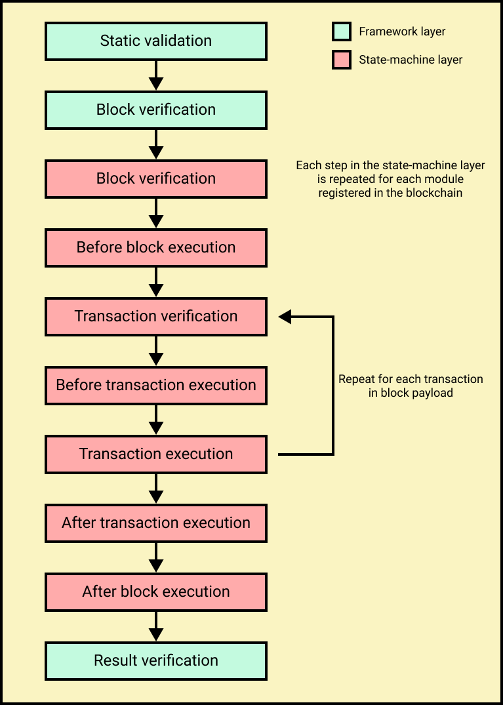

```
LIP: <LIP number>
Title: Update block schema and block processing
Author: Andreas Kendziorra <andreas.kendziorra@lightcurve.io>
        Alessandro Ricottone <alessandro.ricottone@lightcurve.io>
        Rishi Mittal <rishi.mittal@lightcurve.io>
Discussions-To: https://research.lisk.com/t/update-block-schema-and-block-processing/293
Status: Draft
Type: Standards Track
Created: 2021-05-22
Updated: 2021-10-29
Requires: 0040,
          Introduce certificate generation mechanism
```

## Abstract

This LIP changes the structure of a block, introducing the assets property alongside the block header and transactions. The block header schema is updated to add new properties introduced by several other LIPs. We clarify the mechanism by which modules can include data in the block assets and specify the validation of each block header property. Furthermore, we list the steps that are part of the block processing.

## Copyright

This LIP is licensed under the [Creative Commons Zero 1.0 Universal](https://creativecommons.org/publicdomain/zero/1.0/).

## Motivation

The first change proposed by this LIP is to introduce a new block property, the assets. This property is an array of objects containing data injected by the modules registered in the chain during the block creation. This change clarifies the general procedure by which modules insert extra data in a block. The block assets, together with the transactions, form the block payload. The block schema is updated accordingly.

The second change is to update the block header schema. In general, it is desirable to have one fixed block header schema that:

- does not need to be changed when modules are added or removed to a running blockchain,
- is used by every blockchain in the Lisk ecosystem regardless of the modules implemented in the individual chains.

Furthermore, we update the block header schema to include new properties introduced by the ["Define state model and state root"][lip-0040] LIP, the ["Introduce BFT module"][research:bft-module] LIP, and the ["Introduce certificate generation mechanism"][research:certificate-generation] LIP.

Finally, this LIP specifies the validation of all block header properties in one place.

## Rationale

### New Block Header Properties

This LIP introduces the following new block header properties:

- `stateRoot`: The root of the sparse Merkle tree that is computed from the state of the blockchain. See the [Define state model and state root][lip-0040] LIP for the reason why it needs to be included in a block header.
- `assetsRoot`: The root of the Merkle tree computed from the block assets array. See [below](#separation-between-block-header-and-block-assets) for more details.
- `generatorAddress`: The address of the block generator. It replaces the `generatorPublicKey` property. See [below](#change-generator-public-key-to-generator-address) for more details.
- `aggregateCommit`: This property contains the aggregate signature for a certificate for a certain block height. Based on this, any node can create a certificate for the corresponding height. See the [Introduce certificate generation mechanism][research:certificate-generation] LIP for more details.
- `maxHeightPrevoted`: This property is related to the [Lisk-BFT protocol][research:weighted-bft] and is used for the fork choice rule.
- `maxHeightGenerated`: This property is related to the [Lisk-BFT protocol][research:weighted-bft] and is used to check for contradicting block headers.
- `validatorsHash`: This property authenticates the set of validators active from the next block onward. It is important for cross-chain certification and included in certificates.

### Change Generator Public Key to Generator Address

Before this proposal, the `generatorPublicKey` property of a block header was fulfilling two purposes: 1) The validator account was deduced by deriving the address from it, and 2) the block signature could be validated without any on-chain data.

Both the generator address or a public key yielding this address fulfill the first purpose. On the other hand, the second point is not possible anymore without on-chain data, as the generator key is now part of the Validators module store and can be updated. Hence, there is no further drawback in replacing the generatorPublicKey property by the generatorAddress property, while it has the advantages of reducing the size of the block header by a few bytes and skipping the address derivation step during block validation.

### Separation Between Block Header and Block Assets

The separation between properties in the block header and properties in the block assets is done according to the following rules:

- Properties handled by the consensus domain are added to the block header.
- Properties created by individual modules are added to the block assets.
- It should be possible to follow the fork choice consensus rule just with the block header. This implies that the `maxHeightPrevoted` property is part of the block header.
- Similarly, it should be possible to generate a certificate just with the block header. This implies that the `validatorsHash` property is part of the block header. Moreover, the `validatorsHash` property can only be obtained after the state transitions by the modules have been processed. The reason is that the DPoS or PoA modules only set the validators for the next round after the asset of the last block of a round is processed. Therefore, this property needs to be added to the block by the framework layer after the state transitions by the modules are processed.

As an example, blockchains created with the Lisk SDK that implement the [Random module][research:random-module], will insert the seed reveal property in the block assets, not in the block header.

The schema for the block assets allows each module to include its serialized data individually, which makes the inclusion of module data very flexible. Each module can insert a single entry in the assets. This entry is an object containing a `moduleID` property, indicating the ID of the module handling it, and a generic `data` property that can contain arbitrary serialized data.

Each entry of the block assets is then inserted in a Merkle tree, whose root is included in the block header as the `assetsRoot` property. Inserting the assets root rather than the full assets allows to bound the size of the block header while still authenticating the content of the block assets.

## Specification

### Notation and Constants

For the rest of this proposal we define the following constants.

| Name                          | Type    | Value | Description                                    |
|-------------------------------|---------|-------|------------------------------------------------|
| `MAX_TRANSACTIONS_SIZE_BYTES` | integer | TBD   | The max size of a block transactions in bytes. |
| `MAX_ASSET_DATA_SIZE_BYTES`   | integer | TBD   | The max size of an assets entry in bytes.      |
| `SIGNATURE_LENGTH_BYTES`      | integer | 64    | The length of a Ed25519 signature.             |

Furthermore, in the following we indicate with `block` be the block under consideration and with `previousBlock` the previous block of the chain. Calling a function `fct` from another module `module` is represented by `module.fct`.

### Block Processing Stages



*Figure 1: A schematic depiction of the various stages of a block processing. The steps performed in the consensus domain are indicated by blue boxes, while the steps performed in the state-machine domain are indicated by red boxes. Within the state-machine domain, the transactions processing is indicated by purple boxes. The network domain is indicated by green boxes.*

In this section, we describe the various processing stages of a block. Note that a genesis block follows different rules specified in the ["Update genesis block schema and processing" LIP][research:update-genesis-block].

The block processing is split between the network, consensus, and state-machine domains (see figure 1):

- The network domain is responsible for exchanging blocks with other peers in the [P2P network][lip-0004].
- The consensus domain applies the [fork choice rule][lip-0014#fork-choice-rule] and checks the properties contained in the block header.
- The state-machine checks and applies the module-level logic. All the steps that are part of the state-machine domain are repeated for each module registered in the chain. The transactions processing is performed on the transactions contained in the block as part of the state-machine processing. The four steps in the transactions processing are repeated for each transaction.

The full processing of a block is organized as follows.

1. **Block reception**: A new block is received from the P2P network.
2. **Fork choice**: Upon receiving a new block, the [fork choice rule][lip-0014#fork-choice-rule] determines whether the block will be discarded or if the processing continues.
3. **Static validation**: Some initial static checks are done to ensure that the serialized object follows the general structure of a block. These checks are performed immediately because they do not require access to the state store and can therefore be done very quickly.
4. **Header verification**: Block header properties, which require access to the state store *before* any state transitions implied by the block are executed, are verified in this stage.
5. **Assets verification**: Each module verifies the respective entry in the block assets. If any check fails, the block is discarded and has no further effect.
6. **Block forwarding**: After the initial checks, the full block is forwarded to a subset of peers.
7. **Before transactions execution**: Each module can define protocol logic that is executed *before* the transactions contained in the block are processed.
8. **Transaction verification**: The transaction is verified, possibly by accessing the state store. If the verification fails, the transaction is invalid and the whole block is discarded.
9. **Before command execution**: Each module can define protocol logic that is processed *before* the command has been executed.
10. **Command execution**: The command belonging to the module (i.e. with `moduleID` property matching the module ID) is executed.
11. **After command execution**: Each module can define protocol logic that is processed *after* the command has been executed.
12. **After transactions execution**: Each module can define protocol logic that is executed *after* all the transactions contained in the block have been processed.
13. **Result verification**: Block header properties, which require accessing the state store *after* all state transitions implied by the block have been executed, are verified.
14. **Block storage**: The block is persisted into the database.
15. **Peers notification**: Other peers in the P2P network are notified of the new block.

### Block

#### JSON Schema

Blocks are serialized and deserialized accordingly to the following JSON schema.

```java
blockSchema = {
  "type": "object",
  "required": ["header", "transactions", "assets"],
  "properties": {
    "header": {
      "dataType": "bytes",
      "fieldNumber": 1
    },
    "transactions": {
      "type": "array",
      "fieldNumber": 2,
      "items": {
        "dataType": "bytes"
      }
    },
    "assets": {
      "type": "array",
      "fieldNumber": 3,
      "items": {
        "dataType": "bytes"
      }
    }
  }
}
```

#### Validation

The block is validated in the [static validation stage](#block-processing-stages) as follows:

- **Static validation**:
  - Check that the total size of the serialized transactions contained in the block is at most `MAX_TRANSACTIONS_SIZE_BYTES`.

#### Block ID

The block ID is calculated using the `blockID` function. This function returns a 32 bytes value or an error if the block header has an invalid signature format.

```python
blockID():
  # Check that the signature length is 64 bytes to ensure
  # that we do not compute the block ID of an unsigned block
  if length(block.header.signature) != SIGNATURE_LENGTH_BYTES:
    return error

  let serializedBlockHeader be the serialization of block.header following the blockHeaderSchema
  return SHA-256(serializedBlockHeader)
```

### Block Assets

This LIP introduces a new block property, the block assets, which in addition with the header and the transactions forms the complete block.

#### JSON Schema

The block assets contains data created by individual modules. It is an array of bytes, where each value corresponds to an object serialized according to the following schema.

```java
assetSchema = {
  "type": "object",
  "required": ["moduleID", "data"],
  "properties": {
    "moduleID": {
      "dataType": "uint32",
      "fieldNumber": 1
    },
    "data": {
      "dataType": "bytes",
      "fieldNumber": 2
    }
  }
}
```

#### Validation

The general structure of the block assets is checked in the [static validation stage](#block-processing-stages) as follows:

- **Static validation**:
  - Check that each entry in the assets array has `moduleID` set to the ID of a module registered in the chain, while the `data` property has size at most equal to `MAX_ASSET_DATA_SIZE_BYTES`.
  - Each module can insert at most one entry in the block assets. Hence, check that each entry must has a distinct `moduleID` property.
  - Check that the entries are sorted by increasing values of `moduleID`.

These validations are performed before the block is processed and without accessing the state. The individual entries are then checked in the assets verification verification stage.

### Block Header

Block headers are serialized and deserialized accordingly to the following JSON schema.

#### JSON Schema

```java
blockHeaderSchema = {
  "type": "object",
  "required": [
    "version",
    "timestamp",
    "height",
    "previousBlockID",
    "generatorAddress",
    "transactionRoot",
    "assetsRoot",
    "stateRoot",
    "maxHeightPrevoted",
    "maxHeightGenerated",
    "validatorsHash",
    "aggregateCommit"
  ],
  "properties": {
    "version": {
      "dataType": "uint32",
      "fieldNumber": 1
    },
    "timestamp": {
      "dataType": "uint32",
      "fieldNumber": 2
    },
    "height": {
      "dataType": "uint32",
      "fieldNumber": 3
    },
    "previousBlockID": {
      "dataType": "bytes",
      "fieldNumber": 4
    },
    "generatorAddress": {
      "dataType": "bytes",
      "fieldNumber": 5
    },
    "transactionRoot": {
      "dataType": "bytes",
      "fieldNumber": 6
    },
    "assetsRoot": {
      "dataType": "bytes",
      "fieldNumber": 7
    },
    "stateRoot": {
      "dataType": "bytes",
      "fieldNumber": 8
    },
    "maxHeightPrevoted": {
      "dataType": "uint32",
      "fieldNumber": 9
    },
    "maxHeightGenerated": {
      "dataType": "uint32",
      "fieldNumber": 10
    },
    "validatorsHash": {
      "dataType": "bytes",
      "fieldNumber": 11
    },
    "aggregateCommit": {
      "type": "object",
      "fieldNumber": 12,
      "required": [
        "height",
        "aggregationBits",
        "certificateSignature"
      ],
      "properties": {
        "height": {
          "dataType": "uint32",
          "fieldNumber": 1
        },
        "aggregationBits": {
          "dataType": "bytes",
          "fieldNumber": 2
        },
        "certificateSignature": {
          "dataType": "bytes",
          "fieldNumber": 3
        }
      }
    },
    "signature": {
      "dataType": "bytes",
      "fieldNumber": 13
    }
  }
}
```

#### Validation

In this section, we specify the validation for each property of the block header.

The block header is checked in three [stages of the block processing](#block-processing-stages).

- **Static validation**:
  - Check that the block header follows the block header schema.
  - Validate the `version`, `transactionRoot`, and `assetsRoot` properties.
- **Header verification**:
  - Verify the `timestamp`, `height`, `previousBlockID`, `generatorAddress`, `maxHeightPrevoted`, `maxHeightGenerated`, `aggregateCommit`, and `signature` properties.
- **Result verification**:
  - Verify the `stateRoot` and `validatorsHash` properties.

##### Version

With this LIP, the version value is incremented. That means that `block.header.version` must be equal the value of a block of the previous protocol plus one.

##### Timestamp

The timestamp is verified by calling the `verifyTimestamp`. This function returns a boolean, indicating the success of the check.

```python
verifyTimestamp():
  blockSlotNumber = validators.getSlotNumber(block.header.timestamp)

  # Check that block is not from the future
  let currentTimestamp be the current system time
  if blockSlotNumber > validators.getSlotNumber(currentTimestamp):
    return False

  # Check that block slot is strictly larger than the block slot of previousBlock
  previousBlockSlotNumber = validators.getSlotNumber(previousBlock.header.timestamp)
  if blockSlotNumber <= previousBlockSlotNumber:
      return False

  return True
```

##### Height

The height is verified by calling the `verifyHeight` function. This function returns a boolean, indicating the success of the check.

```python
verifyHeight():
  return block.header.height == previousBlock.header.height + 1
```

##### Previous Block ID

The height is verified by calling the `verifyPreviousBlockID` function. This function returns a boolean, indicating the success of the check.

```python
verifyPreviousBlockID():
  return block.header.previousBlockID == blockID(previousBlock)
```

Here, the function `blockID` calculates the ID of an input block as specified in [LIP 0020][lip-0020#specs].

##### Generator Address

The generator address is verified by calling the `verifyGeneratorAddress` function. This function returns a boolean, indicating the success of the check.

```python
verifyGeneratorAddress():
  # Check that the generatorAddress has the correct length of 20 bytes
  if length(block.header.generatorAddress) != 20:
    return False

  # Check that the block generator is eligible to generate in this block slot.
  return block.header.generatorAddress == validators.getGeneratorAtTimestamp(block.header.timestamp)
```

##### Transaction Root

The [transaction root][lip-0032] is the root of the Merkle tree built from the ID of the transactions contained in the block. It is validated by calling the `validateTransactionRoot` function. This function returns a boolean, indicating the success of the check.

```python
validateTransactionRoot():
  transactionIDs = [transactionID(trs) for trs in block.transactions]
  return block.header.transactionRoot == merkleRoot(transactionIDs)
```

Here, the function `transactionID` calculates the ID of an input transaction as specified in [LIP 0019][lip-0019#specs] and the function `merkleRoot` calculates the Merkle root starting from an input array of bytes values as defined in [LIP 0031][lip-0031#merkle-root].

##### Assets Root

The assets root is the root of the Merkle tree built from the block assets array. It is validated by calling the `validateAssetsRoot` function. This function returns a boolean, indicating the success of the check.

```python
validateAssetsRoot():
  assetHashes = [SHA-256(asset) for asset in block.assets]
  return block.header.assetsRoot == merkleRoot(assetHashes)
```

##### State Root

The state root is the root of the sparse Merkle tree built from the state of the chain after the block has been processed. It is verified by calling the `verifyStateRoot` function. This function returns a boolean, indicating the success of the check.

```python
verifyStateRoot():
  return block.header.stateRoot == stateRoot(block.header.height)
```

Here, the function `stateRoot` calculates the state root of the chain at the input height as specified in [LIP 0040][lip-0040#specs].

##### Max Height Prevoted and Max Height Generated

The properties `maxHeightPrevoted` and `maxHeightGenerated` are related to the [Lisk-BFT protocol][lip-0014#block-header-properties]. They are verified by calling the `verifyBFTProperties` function. This function returns a boolean, indicating the success of the check.

```python
verifyBFTProperties():
  if block.header.maxHeightPrevoted != bft.getBFTHeights().maxHeightPrevoted:
    return False

  return not bft.isHeaderContradictingChain(block.header)
```

##### Validators Hash

The validators hash authenticates the set of validators participating to Lisk-BFT from height `block.header.height + 1` onward. They are verified by calling the `verifyValidatorsHash` function. The function returns a boolean, indicating the success of the check.

```python
verifyValidatorsHash():
  return block.header.validatorsHash == bft.getBFTParameters(block.header.height + 1).validatorsHash
```

##### Aggregate Commit

The aggregate commit contains an aggregate BLS signature of a certificate corresponding to the block at the given height. It attests that all signing validators consider the corresponding block final. It is verified by calling the `verifyAggregateCommit` function, defined in the LIP ["Introduce certificate generation mechanism"][research:certificate-generation]. This function takes the aggregate commit `block.header.aggregateCommit` as input and returns a boolean, indicating the success of the check.

##### Signature

The signature is verified by calling the `verifyBlockSignature` function. This function returns a boolean, indicating the success of the check.

```python
verifyBlockSignature():
  generatorKey = validators.getValidatorAccount(block.header.generatorAddress).generatorKey
  signature = block.header.signature

  # Remove the signature from the block header
  delete block.header.signature
  # Serialize the block header without signature
  let serializedUnsignedBlockHeader be the serialization of block.header following the blockHeaderSchema

  let networkIdentifier be the network identifier of the chain

  return verifyMessageSig(generatorKey, "LSK_BH_", networkIdentifier, serializedUnsignedBlockHeader, signature)
```

Here, the function `verifyMessageSig` verifies the validity of a signature as specified in [LIP 0037][lip-0037#signing-and-verifying-with-ed25519].

## Backwards Compatibility

This LIP results in a hard fork as nodes following the proposed protocol will reject blocks according to the previous protocol, and nodes following the previous protocol will reject blocks according to the proposed protocol.

[lip-0004]: https://github.com/LiskHQ/lips/blob/master/proposals/lip-0004.md
[lip-0014#block-header-properties]: https://github.com/LiskHQ/lips/blob/master/proposals/lip-0014.md#additional-block-header-properties
[lip-0014#fork-choice-rule]: https://github.com/LiskHQ/lips/blob/master/proposals/lip-0014.md#applying-blocks-according-to-fork-choice-rule
[lip-0019#specs]: https://github.com/LiskHQ/lips/blob/master/proposals/lip-0019.md#specification
[lip-0020#specs]: https://github.com/LiskHQ/lips/blob/master/proposals/lip-0020.md#specification
[lip-0031#merkle-root]: https://github.com/LiskHQ/lips/blob/master/proposals/lip-0031.md#merkle-root
[lip-0032]: https://github.com/LiskHQ/lips/blob/master/proposals/lip-0032.md
[lip-0037#signing-and-verifying-with-ed25519]: https://github.com/LiskHQ/lips/blob/master/proposals/lip-0037.md#signing-and-verifying-with-ed25519
[lip-0040]: https://github.com/LiskHQ/lips/blob/master/proposals/lip-0040.md
[lip-0040#specs]: https://github.com/LiskHQ/lips/blob/master/proposals/lip-0040.md#specification
[research:bft-module]: https://research.lisk.com/t/introduce-bft-module/321
[research:certificate-generation]: https://research.lisk.com/t/introduce-certificate-generation-mechanism/296
[research:certificate-generation#aggregate-commits]: https://research.lisk.com/t/introduce-certificate-generation-mechanism/296#aggregate-commits-9
[research:certificate-generation#block-verification]: https://research.lisk.com/t/introduce-certificate-generation-mechanism/296#block-verification-48
[research:certificate-generation#certificate-threshold]: https://research.lisk.com/t/introduce-certificate-generation-mechanism/296#certificate-threshold-8
[research:certificate-generation#chain-of-trust]: https://research.lisk.com/t/introduce-certificate-generation-mechanism/296#chain-of-trust-10
[research:update-genesis-block]: https://research.lisk.com/t/update-genesis-block-schema-and-processing/325
[research:random-module]: https://research.lisk.com/t/define-state-and-state-transitions-of-random-module/311
[research:weighted-bft]: https://research.lisk.com/t/add-weights-to-lisk-bft-consensus-protocol/289
